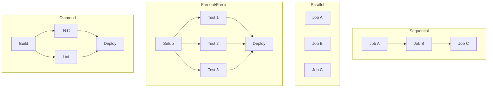

# How to Use Job Dependencies in GitHub Actions

Author: [nawazdhandala](https://www.github.com/nawazdhandala)

Tags: GitHub Actions, CI/CD, Job Dependencies, Workflow Orchestration, DevOps, Automation

Description: Learn how to use job dependencies in GitHub Actions to create sophisticated workflow orchestration with parallel and sequential execution patterns.

> Well-orchestrated workflows run fast through parallelization and stay reliable through proper dependencies.

GitHub Actions workflows often need complex execution patterns - run tests in parallel, but deploy only after all tests pass. Build for multiple platforms simultaneously, then combine artifacts. Job dependencies let you define these relationships precisely. This guide covers everything from basic `needs` chains to sophisticated fan-out/fan-in patterns.

## Job Dependency Patterns



## Basic Job Dependencies

Use `needs` to create sequential execution:

```yaml
name: Basic Dependencies

on: push

jobs:
  build:
    runs-on: ubuntu-latest
    steps:
      - uses: actions/checkout@v4
      - run: npm ci
      - run: npm run build

  test:
    needs: build
    runs-on: ubuntu-latest
    steps:
      - uses: actions/checkout@v4
      - run: npm ci
      - run: npm test

  deploy:
    needs: test
    runs-on: ubuntu-latest
    steps:
      - uses: actions/checkout@v4
      - run: npm run deploy
```

## Multiple Dependencies

Require multiple jobs to complete:

```yaml
name: Multiple Dependencies

on: push

jobs:
  build:
    runs-on: ubuntu-latest
    steps:
      - run: echo "Building..."

  unit-tests:
    needs: build
    runs-on: ubuntu-latest
    steps:
      - run: echo "Running unit tests..."

  integration-tests:
    needs: build
    runs-on: ubuntu-latest
    steps:
      - run: echo "Running integration tests..."

  security-scan:
    needs: build
    runs-on: ubuntu-latest
    steps:
      - run: echo "Running security scan..."

  deploy:
    # Requires all three jobs to succeed
    needs: [unit-tests, integration-tests, security-scan]
    runs-on: ubuntu-latest
    steps:
      - run: echo "Deploying..."
```

## Fan-Out Pattern

Distribute work across parallel jobs:

```yaml
name: Fan-Out Testing

on: push

jobs:
  setup:
    runs-on: ubuntu-latest
    outputs:
      test-groups: ${{ steps.split.outputs.groups }}
    steps:
      - uses: actions/checkout@v4

      - name: Split tests into groups
        id: split
        run: |
          # Split tests into 4 groups
          TESTS=$(find tests -name "*.test.js" | sort)
          GROUPS=$(echo "$TESTS" | jq -R . | jq -s 'to_entries | group_by(.key % 4) | map(map(.value))')
          echo "groups=$GROUPS" >> $GITHUB_OUTPUT

  test:
    needs: setup
    runs-on: ubuntu-latest
    strategy:
      matrix:
        group: [0, 1, 2, 3]
      fail-fast: false

    steps:
      - uses: actions/checkout@v4

      - name: Run test group
        run: |
          TESTS='${{ needs.setup.outputs.test-groups }}'
          GROUP_TESTS=$(echo "$TESTS" | jq -r ".[${{ matrix.group }}][]")
          echo "Running tests: $GROUP_TESTS"
          npm test -- $GROUP_TESTS

  summary:
    needs: test
    if: always()
    runs-on: ubuntu-latest
    steps:
      - name: Check results
        run: |
          echo "All test groups completed"
          echo "Matrix results: ${{ toJson(needs.test.result) }}"
```

## Fan-In Pattern

Collect results from parallel jobs:

```yaml
name: Fan-In Artifact Collection

on: push

jobs:
  build:
    runs-on: ubuntu-latest
    strategy:
      matrix:
        platform: [linux, macos, windows]
        arch: [amd64, arm64]
        exclude:
          - platform: windows
            arch: arm64

    steps:
      - uses: actions/checkout@v4

      - name: Build for ${{ matrix.platform }}-${{ matrix.arch }}
        run: |
          mkdir -p dist
          echo "Binary for ${{ matrix.platform }}-${{ matrix.arch }}" > dist/app-${{ matrix.platform }}-${{ matrix.arch }}

      - uses: actions/upload-artifact@v4
        with:
          name: build-${{ matrix.platform }}-${{ matrix.arch }}
          path: dist/

  release:
    needs: build
    runs-on: ubuntu-latest
    steps:
      - name: Download all artifacts
        uses: actions/download-artifact@v4
        with:
          path: artifacts/
          pattern: build-*
          merge-multiple: true

      - name: List all builds
        run: ls -la artifacts/

      - name: Create release
        run: echo "Creating release with all platform builds..."
```

## Conditional Job Dependencies

Run jobs conditionally based on dependency outcomes:

```yaml
name: Conditional Dependencies

on: push

jobs:
  test:
    runs-on: ubuntu-latest
    steps:
      - run: npm test

  deploy-staging:
    needs: test
    if: github.ref == 'refs/heads/develop'
    runs-on: ubuntu-latest
    steps:
      - run: echo "Deploying to staging..."

  deploy-production:
    needs: test
    if: github.ref == 'refs/heads/main'
    runs-on: ubuntu-latest
    steps:
      - run: echo "Deploying to production..."

  notify-success:
    needs: [deploy-staging, deploy-production]
    if: success()
    runs-on: ubuntu-latest
    steps:
      - run: echo "Deployment succeeded!"

  notify-failure:
    needs: [deploy-staging, deploy-production]
    if: failure()
    runs-on: ubuntu-latest
    steps:
      - run: echo "Deployment failed!"

  cleanup:
    needs: [deploy-staging, deploy-production]
    if: always()
    runs-on: ubuntu-latest
    steps:
      - run: echo "Cleanup runs regardless of outcome"
```

## Passing Data Between Jobs

Share data using outputs and artifacts:

```yaml
name: Passing Data

on: push

jobs:
  prepare:
    runs-on: ubuntu-latest
    outputs:
      version: ${{ steps.version.outputs.version }}
      should_deploy: ${{ steps.check.outputs.should_deploy }}

    steps:
      - uses: actions/checkout@v4

      - name: Determine version
        id: version
        run: |
          VERSION=$(cat package.json | jq -r .version)
          echo "version=$VERSION" >> $GITHUB_OUTPUT

      - name: Check if should deploy
        id: check
        run: |
          if [[ "${{ github.ref }}" == "refs/heads/main" ]]; then
            echo "should_deploy=true" >> $GITHUB_OUTPUT
          else
            echo "should_deploy=false" >> $GITHUB_OUTPUT
          fi

  build:
    needs: prepare
    runs-on: ubuntu-latest
    steps:
      - uses: actions/checkout@v4

      - name: Build with version
        run: |
          echo "Building version ${{ needs.prepare.outputs.version }}"
          npm run build

      - uses: actions/upload-artifact@v4
        with:
          name: build-${{ needs.prepare.outputs.version }}
          path: dist/

  deploy:
    needs: [prepare, build]
    if: needs.prepare.outputs.should_deploy == 'true'
    runs-on: ubuntu-latest
    steps:
      - uses: actions/download-artifact@v4
        with:
          name: build-${{ needs.prepare.outputs.version }}

      - name: Deploy version
        run: echo "Deploying ${{ needs.prepare.outputs.version }}"
```

## Complex Dependency Graphs

Create sophisticated workflow patterns:

```yaml
name: Complex Pipeline

on:
  push:
    branches: [main]

jobs:
  # Stage 1: Parallel validation
  lint:
    runs-on: ubuntu-latest
    steps:
      - uses: actions/checkout@v4
      - run: npm run lint

  typecheck:
    runs-on: ubuntu-latest
    steps:
      - uses: actions/checkout@v4
      - run: npm run typecheck

  audit:
    runs-on: ubuntu-latest
    steps:
      - uses: actions/checkout@v4
      - run: npm audit

  # Stage 2: Build (requires validation)
  build:
    needs: [lint, typecheck, audit]
    runs-on: ubuntu-latest
    steps:
      - uses: actions/checkout@v4
      - run: npm run build
      - uses: actions/upload-artifact@v4
        with:
          name: build
          path: dist/

  # Stage 3: Parallel testing (requires build)
  unit-tests:
    needs: build
    runs-on: ubuntu-latest
    steps:
      - uses: actions/checkout@v4
      - uses: actions/download-artifact@v4
        with:
          name: build
          path: dist/
      - run: npm run test:unit

  integration-tests:
    needs: build
    runs-on: ubuntu-latest
    services:
      postgres:
        image: postgres:16
        ports:
          - 5432:5432
    steps:
      - uses: actions/checkout@v4
      - run: npm run test:integration

  e2e-tests:
    needs: build
    runs-on: ubuntu-latest
    steps:
      - uses: actions/checkout@v4
      - uses: actions/download-artifact@v4
        with:
          name: build
          path: dist/
      - run: npm run test:e2e

  # Stage 4: Deploy to staging (requires all tests)
  deploy-staging:
    needs: [unit-tests, integration-tests, e2e-tests]
    runs-on: ubuntu-latest
    environment: staging
    steps:
      - uses: actions/download-artifact@v4
        with:
          name: build
      - run: ./deploy.sh staging

  # Stage 5: Smoke tests on staging
  smoke-tests:
    needs: deploy-staging
    runs-on: ubuntu-latest
    steps:
      - uses: actions/checkout@v4
      - run: npm run test:smoke -- --env=staging

  # Stage 6: Deploy to production
  deploy-production:
    needs: smoke-tests
    runs-on: ubuntu-latest
    environment: production
    steps:
      - uses: actions/download-artifact@v4
        with:
          name: build
      - run: ./deploy.sh production
```

## Handling Dependency Failures

Gracefully handle failures in dependencies:

```yaml
name: Failure Handling

on: push

jobs:
  test-a:
    runs-on: ubuntu-latest
    steps:
      - run: exit 0  # Succeeds

  test-b:
    runs-on: ubuntu-latest
    steps:
      - run: exit 1  # Fails

  test-c:
    runs-on: ubuntu-latest
    steps:
      - run: exit 0  # Succeeds

  # Only runs if ALL dependencies succeed (default)
  deploy-if-all-pass:
    needs: [test-a, test-b, test-c]
    runs-on: ubuntu-latest
    steps:
      - run: echo "This won't run because test-b failed"

  # Runs if ANY dependency succeeded
  deploy-if-any-pass:
    needs: [test-a, test-b, test-c]
    if: contains(needs.*.result, 'success')
    runs-on: ubuntu-latest
    steps:
      - run: echo "At least one test passed"

  # Runs regardless of dependency status
  report:
    needs: [test-a, test-b, test-c]
    if: always()
    runs-on: ubuntu-latest
    steps:
      - name: Report results
        run: |
          echo "test-a: ${{ needs.test-a.result }}"
          echo "test-b: ${{ needs.test-b.result }}"
          echo "test-c: ${{ needs.test-c.result }}"

  # Runs only if specific job failed
  alert-on-test-b-failure:
    needs: test-b
    if: failure()
    runs-on: ubuntu-latest
    steps:
      - run: echo "Alert! test-b failed"
```

## Reusable Workflow Dependencies

Chain reusable workflows:

```yaml
# .github/workflows/deploy.yml
name: Deploy Pipeline

on:
  push:
    branches: [main]

jobs:
  build:
    uses: ./.github/workflows/build.yml
    with:
      environment: production

  test:
    needs: build
    uses: ./.github/workflows/test.yml
    with:
      artifact-name: build-production

  deploy:
    needs: test
    uses: ./.github/workflows/deploy-reusable.yml
    with:
      environment: production
    secrets: inherit
```

## Best Practices

1. **Minimize dependencies** - Parallel jobs run faster
2. **Use `fail-fast: false`** - For matrix jobs where you want all results
3. **Always handle failures** - Use `if: always()` for cleanup
4. **Pass minimal data** - Use outputs for small data, artifacts for files
5. **Name artifacts clearly** - Include version/job info in names
6. **Use environments** - For deployment approvals and secrets

## Dependency Result Reference

| Condition | When it runs |
|-----------|-------------|
| `success()` | All dependencies succeeded (default) |
| `failure()` | Any dependency failed |
| `cancelled()` | Workflow was cancelled |
| `always()` | Regardless of dependency status |
| `needs.job.result == 'success'` | Specific job succeeded |
| `contains(needs.*.result, 'failure')` | Any job failed |

## Conclusion

Job dependencies are the backbone of sophisticated CI/CD pipelines. Start with simple sequential chains, add parallel execution for speed, and use fan-out/fan-in patterns for complex builds. The key is balancing parallelization for speed with proper dependencies for correctness.

Well-designed job dependencies make workflows both fast and reliable - running as much as possible in parallel while ensuring nothing deploys until all checks pass.
