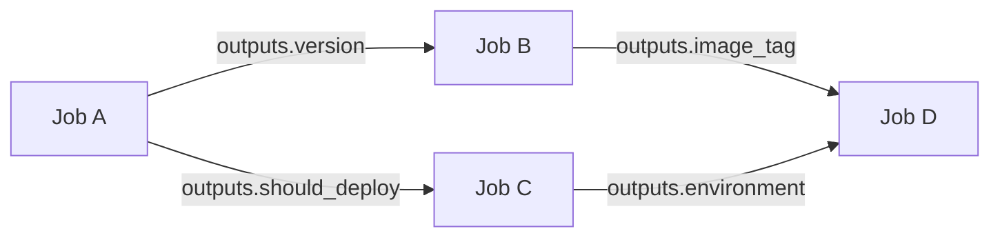

# How to Use Job Outputs in GitHub Actions

Author: [nawazdhandala](https://www.github.com/nawazdhandala)

Tags: GitHub Actions, Job Outputs, CI/CD, Workflow Automation, DevOps

Description: Learn how to pass data between jobs in GitHub Actions using job outputs. This guide covers output syntax, dynamic values, matrix outputs, and complex data structures.

---

Jobs in GitHub Actions run in isolation. To share data between jobs, you need outputs. Job outputs let you pass build artifacts metadata, version numbers, feature flags, and computed values downstream. Understanding outputs is essential for complex multi-job workflows.

## Output Flow



## Basic Output Syntax

Define outputs in a step, expose them at the job level:

```yaml
jobs:
  build:
    runs-on: ubuntu-latest
    outputs:
      version: ${{ steps.version.outputs.version }}
    steps:
      - uses: actions/checkout@v4

      - name: Get version
        id: version
        run: echo "version=$(cat package.json | jq -r .version)" >> $GITHUB_OUTPUT

  deploy:
    needs: build
    runs-on: ubuntu-latest
    steps:
      - name: Deploy version
        run: echo "Deploying version ${{ needs.build.outputs.version }}"
```

## Multiple Outputs

A job can produce multiple outputs:

```yaml
jobs:
  analyze:
    runs-on: ubuntu-latest
    outputs:
      version: ${{ steps.meta.outputs.version }}
      sha: ${{ steps.meta.outputs.sha }}
      branch: ${{ steps.meta.outputs.branch }}
      should_deploy: ${{ steps.check.outputs.should_deploy }}

    steps:
      - uses: actions/checkout@v4

      - name: Extract metadata
        id: meta
        run: |
          echo "version=$(cat package.json | jq -r .version)" >> $GITHUB_OUTPUT
          echo "sha=${{ github.sha }}" >> $GITHUB_OUTPUT
          echo "branch=${{ github.ref_name }}" >> $GITHUB_OUTPUT

      - name: Check deployment
        id: check
        run: |
          if [[ "${{ github.ref }}" == "refs/heads/main" ]]; then
            echo "should_deploy=true" >> $GITHUB_OUTPUT
          else
            echo "should_deploy=false" >> $GITHUB_OUTPUT
          fi

  deploy:
    needs: analyze
    if: needs.analyze.outputs.should_deploy == 'true'
    runs-on: ubuntu-latest
    steps:
      - run: |
          echo "Deploying ${{ needs.analyze.outputs.version }}"
          echo "SHA: ${{ needs.analyze.outputs.sha }}"
          echo "Branch: ${{ needs.analyze.outputs.branch }}"
```

## Conditional Job Execution

Use outputs for conditional logic:

```yaml
jobs:
  changes:
    runs-on: ubuntu-latest
    outputs:
      frontend: ${{ steps.filter.outputs.frontend }}
      backend: ${{ steps.filter.outputs.backend }}
    steps:
      - uses: actions/checkout@v4
      - uses: dorny/paths-filter@v3
        id: filter
        with:
          filters: |
            frontend:
              - 'frontend/**'
            backend:
              - 'backend/**'

  build-frontend:
    needs: changes
    if: needs.changes.outputs.frontend == 'true'
    runs-on: ubuntu-latest
    steps:
      - run: echo "Building frontend"

  build-backend:
    needs: changes
    if: needs.changes.outputs.backend == 'true'
    runs-on: ubuntu-latest
    steps:
      - run: echo "Building backend"
```

## Matrix Job Outputs

Collect outputs from matrix jobs:

```yaml
jobs:
  build:
    runs-on: ubuntu-latest
    strategy:
      matrix:
        component: [api, web, worker]
    outputs:
      api-image: ${{ steps.build.outputs.api-image }}
      web-image: ${{ steps.build.outputs.web-image }}
      worker-image: ${{ steps.build.outputs.worker-image }}
    steps:
      - uses: actions/checkout@v4

      - name: Build image
        id: build
        run: |
          IMAGE="myregistry/${{ matrix.component }}:${{ github.sha }}"
          docker build -t $IMAGE ./${{ matrix.component }}
          echo "${{ matrix.component }}-image=$IMAGE" >> $GITHUB_OUTPUT

  deploy:
    needs: build
    runs-on: ubuntu-latest
    steps:
      - run: |
          echo "API: ${{ needs.build.outputs.api-image }}"
          echo "Web: ${{ needs.build.outputs.web-image }}"
          echo "Worker: ${{ needs.build.outputs.worker-image }}"
```

## JSON Outputs

Pass complex data as JSON:

```yaml
jobs:
  analyze:
    runs-on: ubuntu-latest
    outputs:
      matrix: ${{ steps.set-matrix.outputs.matrix }}
    steps:
      - uses: actions/checkout@v4

      - name: Generate matrix
        id: set-matrix
        run: |
          MATRIX=$(cat << 'EOF'
          {
            "include": [
              {"service": "api", "dockerfile": "api/Dockerfile"},
              {"service": "web", "dockerfile": "web/Dockerfile"},
              {"service": "worker", "dockerfile": "worker/Dockerfile"}
            ]
          }
          EOF
          )
          echo "matrix=$MATRIX" >> $GITHUB_OUTPUT

  build:
    needs: analyze
    strategy:
      matrix: ${{ fromJson(needs.analyze.outputs.matrix) }}
    runs-on: ubuntu-latest
    steps:
      - uses: actions/checkout@v4
      - run: docker build -f ${{ matrix.dockerfile }} -t ${{ matrix.service }}:latest .
```

## Dynamic Matrix from Files

Generate matrix from repository content:

```yaml
jobs:
  discover:
    runs-on: ubuntu-latest
    outputs:
      services: ${{ steps.find.outputs.services }}
    steps:
      - uses: actions/checkout@v4

      - name: Find services
        id: find
        run: |
          SERVICES=$(ls -d services/*/ | xargs -n1 basename | jq -R -s -c 'split("\n")[:-1]')
          echo "services=$SERVICES" >> $GITHUB_OUTPUT

  build:
    needs: discover
    strategy:
      matrix:
        service: ${{ fromJson(needs.discover.outputs.services) }}
    runs-on: ubuntu-latest
    steps:
      - uses: actions/checkout@v4
      - run: echo "Building ${{ matrix.service }}"
```

## Aggregating Results

Collect results from multiple jobs:

```yaml
jobs:
  test:
    strategy:
      matrix:
        shard: [1, 2, 3, 4]
    runs-on: ubuntu-latest
    outputs:
      result-1: ${{ steps.test.outputs.result-1 }}
      result-2: ${{ steps.test.outputs.result-2 }}
      result-3: ${{ steps.test.outputs.result-3 }}
      result-4: ${{ steps.test.outputs.result-4 }}
    steps:
      - uses: actions/checkout@v4

      - name: Run tests
        id: test
        run: |
          RESULT=$(npm test -- --shard=${{ matrix.shard }}/4 2>&1 | tail -1)
          echo "result-${{ matrix.shard }}=$RESULT" >> $GITHUB_OUTPUT

  summary:
    needs: test
    runs-on: ubuntu-latest
    steps:
      - name: Aggregate results
        run: |
          echo "Shard 1: ${{ needs.test.outputs.result-1 }}"
          echo "Shard 2: ${{ needs.test.outputs.result-2 }}"
          echo "Shard 3: ${{ needs.test.outputs.result-3 }}"
          echo "Shard 4: ${{ needs.test.outputs.result-4 }}"
```

## Using Outputs with Actions

Many actions provide outputs:

```yaml
jobs:
  build:
    runs-on: ubuntu-latest
    outputs:
      digest: ${{ steps.build.outputs.digest }}
      metadata: ${{ steps.build.outputs.metadata }}
    steps:
      - uses: actions/checkout@v4

      - uses: docker/setup-buildx-action@v3

      - name: Build and push
        id: build
        uses: docker/build-push-action@v5
        with:
          push: true
          tags: myapp:latest

  deploy:
    needs: build
    runs-on: ubuntu-latest
    steps:
      - run: |
          echo "Image digest: ${{ needs.build.outputs.digest }}"
```

## Error Handling with Outputs

Pass error status between jobs:

```yaml
jobs:
  build:
    runs-on: ubuntu-latest
    outputs:
      status: ${{ steps.build.outputs.status }}
      error: ${{ steps.build.outputs.error }}
    steps:
      - uses: actions/checkout@v4

      - name: Build
        id: build
        run: |
          if npm run build; then
            echo "status=success" >> $GITHUB_OUTPUT
          else
            echo "status=failure" >> $GITHUB_OUTPUT
            echo "error=Build failed" >> $GITHUB_OUTPUT
          fi
        continue-on-error: true

  notify:
    needs: build
    if: always()
    runs-on: ubuntu-latest
    steps:
      - name: Send notification
        run: |
          if [ "${{ needs.build.outputs.status }}" == "failure" ]; then
            echo "Build failed: ${{ needs.build.outputs.error }}"
          else
            echo "Build succeeded"
          fi
```

## Complete Example

```yaml
name: CI/CD Pipeline

on:
  push:
    branches: [main]
  pull_request:

jobs:
  setup:
    runs-on: ubuntu-latest
    outputs:
      version: ${{ steps.version.outputs.version }}
      sha_short: ${{ steps.sha.outputs.sha_short }}
      should_deploy: ${{ steps.check.outputs.should_deploy }}
      environments: ${{ steps.envs.outputs.environments }}
    steps:
      - uses: actions/checkout@v4

      - name: Get version
        id: version
        run: echo "version=$(cat package.json | jq -r .version)" >> $GITHUB_OUTPUT

      - name: Get short SHA
        id: sha
        run: echo "sha_short=$(git rev-parse --short HEAD)" >> $GITHUB_OUTPUT

      - name: Check if should deploy
        id: check
        run: |
          if [[ "${{ github.event_name }}" == "push" && "${{ github.ref }}" == "refs/heads/main" ]]; then
            echo "should_deploy=true" >> $GITHUB_OUTPUT
          else
            echo "should_deploy=false" >> $GITHUB_OUTPUT
          fi

      - name: Set environments
        id: envs
        run: |
          if [[ "${{ github.ref }}" == "refs/heads/main" ]]; then
            echo 'environments=["staging", "production"]' >> $GITHUB_OUTPUT
          else
            echo 'environments=["preview"]' >> $GITHUB_OUTPUT
          fi

  build:
    needs: setup
    runs-on: ubuntu-latest
    outputs:
      image: ${{ steps.build.outputs.image }}
    steps:
      - uses: actions/checkout@v4

      - name: Build image
        id: build
        run: |
          IMAGE="myregistry/app:${{ needs.setup.outputs.version }}-${{ needs.setup.outputs.sha_short }}"
          docker build -t $IMAGE .
          echo "image=$IMAGE" >> $GITHUB_OUTPUT

  test:
    needs: [setup, build]
    runs-on: ubuntu-latest
    outputs:
      passed: ${{ steps.test.outputs.passed }}
    steps:
      - uses: actions/checkout@v4

      - name: Run tests
        id: test
        run: |
          if npm test; then
            echo "passed=true" >> $GITHUB_OUTPUT
          else
            echo "passed=false" >> $GITHUB_OUTPUT
            exit 1
          fi

  deploy:
    needs: [setup, build, test]
    if: needs.setup.outputs.should_deploy == 'true' && needs.test.outputs.passed == 'true'
    strategy:
      matrix:
        environment: ${{ fromJson(needs.setup.outputs.environments) }}
    runs-on: ubuntu-latest
    environment: ${{ matrix.environment }}
    steps:
      - name: Deploy
        run: |
          echo "Deploying ${{ needs.build.outputs.image }} to ${{ matrix.environment }}"

  summary:
    needs: [setup, build, test, deploy]
    if: always()
    runs-on: ubuntu-latest
    steps:
      - name: Pipeline Summary
        run: |
          echo "## Pipeline Summary" >> $GITHUB_STEP_SUMMARY
          echo "- Version: ${{ needs.setup.outputs.version }}" >> $GITHUB_STEP_SUMMARY
          echo "- Image: ${{ needs.build.outputs.image }}" >> $GITHUB_STEP_SUMMARY
          echo "- Tests: ${{ needs.test.outputs.passed && 'Passed' || 'Failed' }}" >> $GITHUB_STEP_SUMMARY
          echo "- Deploy: ${{ needs.deploy.result }}" >> $GITHUB_STEP_SUMMARY
```

---

Job outputs connect isolated jobs into cohesive pipelines. Use them to pass version numbers, image tags, computed matrices, and conditional flags. Remember that outputs are strings - use `fromJson()` for complex data structures and proper quoting for values with special characters.
