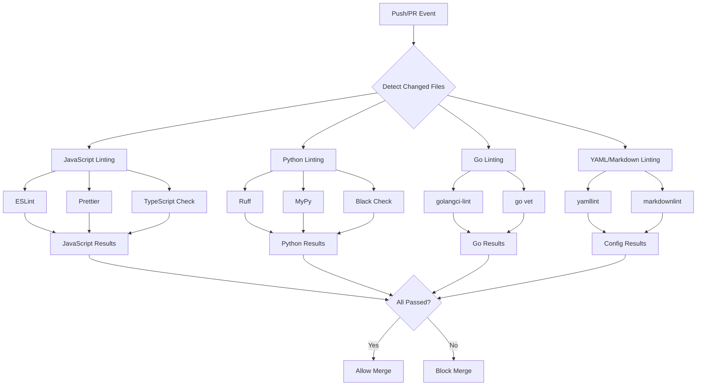

# How to Set Up Linting Pipeline in GitHub Actions

Author: [nawazdhandala](https://www.github.com/nawazdhandala)

Tags: GitHub Actions, CI/CD, Linting, Code Quality, ESLint, Prettier, DevOps

Description: Learn how to set up a comprehensive linting pipeline in GitHub Actions to enforce code quality standards automatically. This guide covers ESLint, Prettier, and multi-language linting configurations.

> Catching code quality issues before they hit main saves hours of code review time and prevents technical debt from accumulating.

Code linting is one of the most impactful automation investments you can make. A well-configured linting pipeline catches formatting issues, potential bugs, and style violations before code reaches human reviewers. This guide walks you through setting up a comprehensive linting pipeline in GitHub Actions that scales from single-language projects to complex multi-language repositories.

## Why Automate Linting in CI/CD

Manual code review for style issues wastes valuable engineering time. Reviewers should focus on logic, architecture, and business requirements - not whether someone used tabs or spaces. Automated linting provides:

- **Consistent code style** across all contributors
- **Faster code reviews** focused on what matters
- **Immediate feedback** on pull requests
- **Historical enforcement** that never forgets the rules

## Basic Linting Workflow

Here is a minimal linting workflow for a JavaScript/TypeScript project:

```yaml
# .github/workflows/lint.yml
name: Lint

on:
  push:
    branches: [main]
  pull_request:
    branches: [main]

jobs:
  lint:
    name: Run Linters
    runs-on: ubuntu-latest

    steps:
      - name: Checkout code
        uses: actions/checkout@v4

      - name: Setup Node.js
        uses: actions/setup-node@v4
        with:
          node-version: '20'
          cache: 'npm'

      - name: Install dependencies
        run: npm ci

      - name: Run ESLint
        run: npx eslint . --ext .js,.jsx,.ts,.tsx

      - name: Run Prettier check
        run: npx prettier --check .
```

This workflow triggers on pushes to main and all pull requests. It installs dependencies, runs ESLint for code quality checks, and verifies Prettier formatting.

## Multi-Language Linting Pipeline

Real-world projects often use multiple languages. Here is a workflow that handles JavaScript, Python, and Go:

```yaml
name: Multi-Language Lint

on:
  push:
    branches: [main]
  pull_request:
    branches: [main]

jobs:
  javascript:
    name: JavaScript/TypeScript
    runs-on: ubuntu-latest
    steps:
      - uses: actions/checkout@v4

      - uses: actions/setup-node@v4
        with:
          node-version: '20'
          cache: 'npm'

      - run: npm ci
      - run: npx eslint . --ext .js,.jsx,.ts,.tsx --max-warnings 0
      - run: npx prettier --check "**/*.{js,jsx,ts,tsx,json,md}"

  python:
    name: Python
    runs-on: ubuntu-latest
    steps:
      - uses: actions/checkout@v4

      - uses: actions/setup-python@v5
        with:
          python-version: '3.12'

      - name: Install linters
        run: pip install ruff mypy

      - name: Run Ruff
        run: ruff check .

      - name: Run MyPy
        run: mypy . --ignore-missing-imports

  golang:
    name: Go
    runs-on: ubuntu-latest
    steps:
      - uses: actions/checkout@v4

      - uses: actions/setup-go@v5
        with:
          go-version: '1.22'

      - name: Run golangci-lint
        uses: golangci/golangci-lint-action@v4
        with:
          version: latest
```

Each language job runs in parallel, providing fast feedback.

## Linting Pipeline Architecture



## Caching for Faster Builds

Linting dependencies rarely change. Use caching aggressively:

```yaml
jobs:
  lint:
    runs-on: ubuntu-latest
    steps:
      - uses: actions/checkout@v4

      - uses: actions/setup-node@v4
        with:
          node-version: '20'
          cache: 'npm'

      - name: Cache ESLint
        uses: actions/cache@v4
        with:
          path: .eslintcache
          key: eslint-${{ hashFiles('**/package-lock.json') }}
          restore-keys: |
            eslint-

      - run: npm ci

      - name: Run ESLint with cache
        run: npx eslint . --ext .js,.ts --cache --cache-location .eslintcache
```

The `--cache` flag tells ESLint to only re-lint changed files, dramatically speeding up subsequent runs.

## Showing Lint Results in PR Comments

Make lint errors visible directly in pull requests using annotations:

```yaml
jobs:
  lint:
    runs-on: ubuntu-latest
    steps:
      - uses: actions/checkout@v4

      - uses: actions/setup-node@v4
        with:
          node-version: '20'
          cache: 'npm'

      - run: npm ci

      - name: Run ESLint with annotations
        run: npx eslint . --ext .js,.ts --format @microsoft/eslint-formatter-sarif --output-file eslint-results.sarif
        continue-on-error: true

      - name: Upload SARIF file
        uses: github/codeql-action/upload-sarif@v3
        with:
          sarif_file: eslint-results.sarif
```

This uploads results in SARIF format, which GitHub displays as inline annotations on the changed files.

## Pre-commit Integration

While CI linting catches issues in pull requests, pre-commit hooks catch them before commit. Configure your workflow to validate pre-commit configuration:

```yaml
jobs:
  pre-commit:
    runs-on: ubuntu-latest
    steps:
      - uses: actions/checkout@v4

      - uses: actions/setup-python@v5
        with:
          python-version: '3.12'

      - name: Install pre-commit
        run: pip install pre-commit

      - name: Run pre-commit on all files
        run: pre-commit run --all-files
```

This ensures your pre-commit configuration works and catches any files that bypassed local hooks.

## Handling Monorepos

For monorepos with multiple packages, lint each package separately:

```yaml
jobs:
  detect-changes:
    runs-on: ubuntu-latest
    outputs:
      packages: ${{ steps.filter.outputs.changes }}
    steps:
      - uses: actions/checkout@v4
      - uses: dorny/paths-filter@v3
        id: filter
        with:
          filters: |
            frontend:
              - 'packages/frontend/**'
            backend:
              - 'packages/backend/**'
            shared:
              - 'packages/shared/**'

  lint:
    needs: detect-changes
    if: ${{ needs.detect-changes.outputs.packages != '[]' }}
    runs-on: ubuntu-latest
    strategy:
      matrix:
        package: ${{ fromJson(needs.detect-changes.outputs.packages) }}
    steps:
      - uses: actions/checkout@v4

      - uses: actions/setup-node@v4
        with:
          node-version: '20'
          cache: 'npm'

      - run: npm ci

      - name: Lint ${{ matrix.package }}
        run: npm run lint --workspace=packages/${{ matrix.package }}
```

This only lints packages with actual changes, saving time on large monorepos.

## ESLint Configuration for CI

Optimize your ESLint configuration for CI environments:

```javascript
// .eslintrc.js
module.exports = {
  extends: [
    'eslint:recommended',
    'plugin:@typescript-eslint/recommended',
    'prettier'
  ],
  plugins: ['@typescript-eslint'],
  parser: '@typescript-eslint/parser',
  parserOptions: {
    ecmaVersion: 2022,
    sourceType: 'module'
  },
  rules: {
    // Treat warnings as errors in CI
    'no-console': process.env.CI ? 'error' : 'warn',
    'no-debugger': 'error',
    '@typescript-eslint/no-unused-vars': 'error',
    '@typescript-eslint/explicit-function-return-type': 'off'
  },
  ignorePatterns: [
    'node_modules/',
    'dist/',
    'build/',
    'coverage/'
  ]
};
```

## Complete Production-Ready Workflow

Here is a complete workflow that combines all these concepts:

```yaml
name: Code Quality

on:
  push:
    branches: [main]
  pull_request:
    branches: [main]

concurrency:
  group: lint-${{ github.ref }}
  cancel-in-progress: true

jobs:
  lint-js:
    name: JavaScript/TypeScript
    runs-on: ubuntu-latest
    steps:
      - uses: actions/checkout@v4

      - uses: actions/setup-node@v4
        with:
          node-version: '20'
          cache: 'npm'

      - name: Cache ESLint
        uses: actions/cache@v4
        with:
          path: .eslintcache
          key: eslint-${{ hashFiles('**/package-lock.json') }}-${{ hashFiles('**/*.js', '**/*.ts') }}
          restore-keys: |
            eslint-${{ hashFiles('**/package-lock.json') }}-
            eslint-

      - run: npm ci

      - name: ESLint
        run: npx eslint . --ext .js,.jsx,.ts,.tsx --cache --cache-location .eslintcache --max-warnings 0

      - name: Prettier
        run: npx prettier --check "**/*.{js,jsx,ts,tsx,json,css,md}"

      - name: TypeScript
        run: npx tsc --noEmit

  lint-python:
    name: Python
    runs-on: ubuntu-latest
    steps:
      - uses: actions/checkout@v4

      - uses: actions/setup-python@v5
        with:
          python-version: '3.12'

      - name: Install tools
        run: pip install ruff mypy

      - name: Ruff lint
        run: ruff check .

      - name: Ruff format check
        run: ruff format --check .

  lint-yaml:
    name: YAML/Config
    runs-on: ubuntu-latest
    steps:
      - uses: actions/checkout@v4

      - name: Lint YAML files
        uses: ibiqlik/action-yamllint@v3
        with:
          file_or_dir: .
          config_file: .yamllint.yml

      - name: Lint GitHub Actions
        run: |
          npm install -g @action-validator/core @action-validator/cli
          action-validator .github/workflows/*.yml
```

## Best Practices

1. **Fail fast** - Use `--max-warnings 0` to treat warnings as errors in CI
2. **Cache aggressively** - ESLint and other tools support caching
3. **Run in parallel** - Separate jobs for different languages run concurrently
4. **Use concurrency groups** - Cancel outdated runs when new commits arrive
5. **Annotate PRs** - Use SARIF output for inline code annotations
6. **Match local setup** - CI linting should match pre-commit hooks exactly

## Conclusion

A well-configured linting pipeline catches issues early, speeds up code review, and enforces consistent standards across your team. Start with basic linting for your primary language, then expand to cover all file types in your repository. The investment in setup pays dividends on every pull request.

The key insight is that linting should be fast, cacheable, and provide clear feedback. When developers get instant feedback on their changes, they fix issues immediately rather than waiting for code review.
