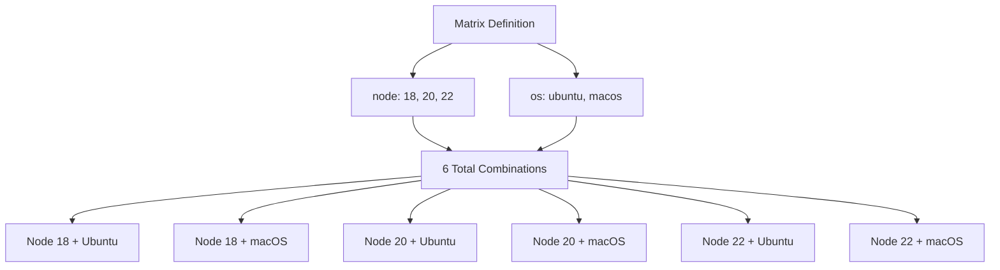

# How to Use Matrix Include/Exclude in GitHub Actions

Author: [nawazdhandala](https://www.github.com/nawazdhandala)

Tags: GitHub Actions, CI/CD, Matrix Strategy, Testing, DevOps, Automation

Description: Master the matrix include and exclude features in GitHub Actions to create sophisticated test matrices, handle edge cases, and optimize CI workflows for complex multi-platform testing scenarios.

---

Matrix strategies in GitHub Actions run the same job across multiple configurations - different OS versions, language versions, or dependency combinations. The `include` and `exclude` keywords let you fine-tune these matrices for real-world complexity where not every combination makes sense.

## Basic Matrix Review

Before diving into include/exclude, understand how basic matrices work.

```yaml
jobs:
  test:
    runs-on: ubuntu-latest
    strategy:
      matrix:
        node: [18, 20, 22]
        os: [ubuntu-latest, macos-latest]

    steps:
      - name: Test on Node ${{ matrix.node }}
        run: echo "Testing Node ${{ matrix.node }} on ${{ matrix.os }}"
```

This creates 6 job combinations (3 node versions x 2 operating systems). Every combination runs.



## Using Exclude to Remove Combinations

The `exclude` keyword removes specific combinations from the matrix. Use it when certain combinations are invalid, unsupported, or unnecessary.

### Excluding Unsupported Combinations

Some tool versions do not support certain platforms.

```yaml
jobs:
  test:
    strategy:
      matrix:
        node: [16, 18, 20]
        os: [ubuntu-latest, macos-latest, windows-latest]
        exclude:
          # Node 16 is EOL, only test on Ubuntu
          - node: 16
            os: macos-latest
          - node: 16
            os: windows-latest

    runs-on: ${{ matrix.os }}

    steps:
      - name: Setup Node
        uses: actions/setup-node@v4
        with:
          node-version: ${{ matrix.node }}

      - name: Run tests
        run: npm test
```

This reduces the matrix from 9 combinations to 7, skipping Node 16 on macOS and Windows.

### Excluding Known Failures

Sometimes specific combinations have known issues that are not worth blocking CI.

```yaml
jobs:
  test:
    strategy:
      fail-fast: false
      matrix:
        python: ['3.10', '3.11', '3.12']
        django: ['4.2', '5.0']
        exclude:
          # Django 5.0 requires Python 3.10+, but has issues on 3.10
          - python: '3.10'
            django: '5.0'

    runs-on: ubuntu-latest

    steps:
      - name: Setup Python ${{ matrix.python }}
        uses: actions/setup-python@v5
        with:
          python-version: ${{ matrix.python }}

      - name: Install Django ${{ matrix.django }}
        run: pip install "django==${{ matrix.django }}.*"

      - name: Run tests
        run: python manage.py test
```

## Using Include to Add Combinations

The `include` keyword adds specific combinations or additional variables to existing combinations.

### Adding Variables to Existing Combinations

Add extra configuration for specific matrix values.

```yaml
jobs:
  test:
    strategy:
      matrix:
        os: [ubuntu-latest, macos-latest, windows-latest]
        include:
          - os: ubuntu-latest
            artifact-name: linux-build
            test-flags: '--coverage'
          - os: macos-latest
            artifact-name: macos-build
            test-flags: ''
          - os: windows-latest
            artifact-name: windows-build
            test-flags: ''

    runs-on: ${{ matrix.os }}

    steps:
      - name: Build
        run: npm run build

      - name: Test
        run: npm test ${{ matrix.test-flags }}

      - name: Upload artifact
        uses: actions/upload-artifact@v4
        with:
          name: ${{ matrix.artifact-name }}
          path: dist/
```

The `include` entries match existing matrix combinations by `os` and add `artifact-name` and `test-flags` variables.

### Adding New Combinations

Include can also add entirely new combinations that are not in the base matrix.

```yaml
jobs:
  test:
    strategy:
      matrix:
        node: [18, 20]
        include:
          # Add experimental Node 22 test
          - node: 22
            experimental: true
          # Add specific configuration test
          - node: 20
            env: production
            experimental: false

    runs-on: ubuntu-latest
    continue-on-error: ${{ matrix.experimental || false }}

    steps:
      - name: Setup Node ${{ matrix.node }}
        uses: actions/setup-node@v4
        with:
          node-version: ${{ matrix.node }}

      - name: Run tests
        run: npm test
        env:
          NODE_ENV: ${{ matrix.env || 'test' }}
```

This creates 4 jobs:
- Node 18 (from base matrix)
- Node 20 (from base matrix)
- Node 22 with experimental flag (from include)
- Node 20 with production env (from include)

## Advanced Matrix Patterns

### Platform-Specific Builds

Build native modules differently per platform.

```yaml
jobs:
  build:
    strategy:
      matrix:
        include:
          - os: ubuntu-latest
            target: x86_64-unknown-linux-gnu
            artifact: myapp-linux-amd64
          - os: ubuntu-latest
            target: aarch64-unknown-linux-gnu
            artifact: myapp-linux-arm64
            cross: true
          - os: macos-latest
            target: x86_64-apple-darwin
            artifact: myapp-macos-amd64
          - os: macos-latest
            target: aarch64-apple-darwin
            artifact: myapp-macos-arm64
          - os: windows-latest
            target: x86_64-pc-windows-msvc
            artifact: myapp-windows-amd64.exe

    runs-on: ${{ matrix.os }}

    steps:
      - name: Checkout
        uses: actions/checkout@v4

      - name: Setup cross-compilation
        if: matrix.cross
        run: |
          sudo apt-get update
          sudo apt-get install -y gcc-aarch64-linux-gnu

      - name: Build
        run: cargo build --release --target ${{ matrix.target }}

      - name: Upload artifact
        uses: actions/upload-artifact@v4
        with:
          name: ${{ matrix.artifact }}
          path: target/${{ matrix.target }}/release/myapp*
```

### Database Version Testing

Test against multiple database versions without creating a huge matrix.

```yaml
jobs:
  test:
    strategy:
      matrix:
        db:
          - type: postgres
            version: '14'
            port: 5432
          - type: postgres
            version: '15'
            port: 5432
          - type: postgres
            version: '16'
            port: 5432
          - type: mysql
            version: '8.0'
            port: 3306

    runs-on: ubuntu-latest

    services:
      database:
        image: ${{ matrix.db.type }}:${{ matrix.db.version }}
        env:
          POSTGRES_PASSWORD: test
          MYSQL_ROOT_PASSWORD: test
        ports:
          - ${{ matrix.db.port }}:${{ matrix.db.port }}
        options: >-
          --health-cmd "${{ matrix.db.type == 'postgres' && 'pg_isready' || 'mysqladmin ping' }}"
          --health-interval 10s
          --health-timeout 5s
          --health-retries 5

    steps:
      - name: Checkout
        uses: actions/checkout@v4

      - name: Run tests
        run: npm test
        env:
          DB_TYPE: ${{ matrix.db.type }}
          DB_PORT: ${{ matrix.db.port }}
```

### Combining Include and Exclude

Use both together for complex scenarios.

```yaml
jobs:
  test:
    strategy:
      fail-fast: false
      matrix:
        os: [ubuntu-latest, macos-latest, windows-latest]
        python: ['3.10', '3.11', '3.12']
        exclude:
          # Skip Python 3.10 on Windows due to known issues
          - os: windows-latest
            python: '3.10'
        include:
          # Add extended test on latest stable
          - os: ubuntu-latest
            python: '3.12'
            coverage: true
            lint: true
          # Add beta Python test
          - os: ubuntu-latest
            python: '3.13-dev'
            experimental: true

    runs-on: ${{ matrix.os }}
    continue-on-error: ${{ matrix.experimental || false }}

    steps:
      - name: Checkout
        uses: actions/checkout@v4

      - name: Setup Python
        uses: actions/setup-python@v5
        with:
          python-version: ${{ matrix.python }}

      - name: Install dependencies
        run: pip install -r requirements.txt

      - name: Lint
        if: matrix.lint
        run: ruff check .

      - name: Test
        run: pytest ${{ matrix.coverage && '--cov=.' || '' }}

      - name: Upload coverage
        if: matrix.coverage
        uses: codecov/codecov-action@v3
```

## Dynamic Matrices

Generate matrix values dynamically for flexible configurations.

```yaml
jobs:
  setup:
    runs-on: ubuntu-latest
    outputs:
      matrix: ${{ steps.set-matrix.outputs.matrix }}

    steps:
      - name: Checkout
        uses: actions/checkout@v4

      - name: Determine test matrix
        id: set-matrix
        run: |
          # Build matrix based on changed files
          if git diff --name-only HEAD~1 | grep -q "^packages/api/"; then
            MATRIX='{"service":["api"],"node":[18,20]}'
          elif git diff --name-only HEAD~1 | grep -q "^packages/"; then
            MATRIX='{"service":["api","web","worker"],"node":[20]}'
          else
            MATRIX='{"service":["api"],"node":[20]}'
          fi
          echo "matrix=$MATRIX" >> $GITHUB_OUTPUT

  test:
    needs: setup
    strategy:
      matrix: ${{ fromJson(needs.setup.outputs.matrix) }}

    runs-on: ubuntu-latest

    steps:
      - name: Test ${{ matrix.service }}
        run: npm test --workspace=packages/${{ matrix.service }}
```

## Matrix Optimization Tips

### Limit Matrix Size

Large matrices consume runner minutes quickly. Keep matrices focused.

```yaml
# Instead of testing every combination
matrix:
  node: [16, 17, 18, 19, 20, 21, 22]  # 7 versions
  os: [ubuntu, macos, windows]         # 3 OS = 21 jobs

# Test key versions
matrix:
  node: [18, 20, 22]    # LTS and current
  os: [ubuntu-latest]   # Primary platform
  include:
    - node: 20
      os: macos-latest  # Spot check other platforms
    - node: 20
      os: windows-latest
```

### Use fail-fast Strategically

By default, matrices cancel remaining jobs when one fails. Disable this when you need complete results.

```yaml
strategy:
  fail-fast: false  # Run all combinations regardless of failures
  matrix:
    node: [18, 20, 22]
```

### Reuse Matrix Definitions

Define matrices in reusable workflows for consistency.

```yaml
# .github/workflows/reusable-test.yml
on:
  workflow_call:
    inputs:
      matrix:
        type: string
        required: true

jobs:
  test:
    strategy:
      matrix: ${{ fromJson(inputs.matrix) }}
    runs-on: ${{ matrix.os }}
    steps:
      - run: npm test
```

Matrix include and exclude transform simple multi-version testing into sophisticated CI strategies that match real-world requirements. Start with basic matrices and add include/exclude as you discover which combinations matter for your project.
