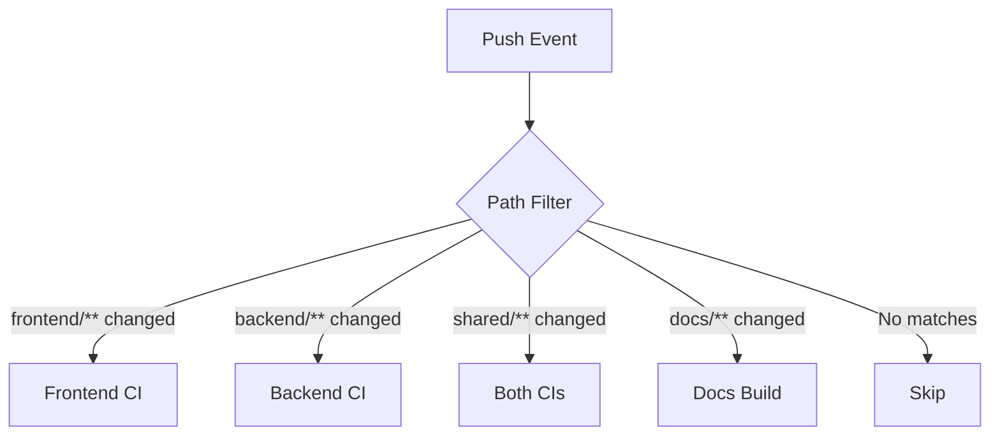

# How to Handle Monorepo Path Filters in GitHub Actions

Author: [nawazdhandala](https://www.github.com/nawazdhandala)

Tags: GitHub Actions, Monorepo, CI/CD, DevOps, Path Filters, Automation

Description: Learn how to configure GitHub Actions path filters for monorepos to run workflows only when relevant files change. This guide covers path filtering patterns, conditional jobs, and optimization strategies.

---

Monorepos contain multiple projects in a single repository. Without path filters, every push triggers all workflows, wasting CI minutes and slowing feedback. GitHub Actions path filters let you run jobs only when relevant code changes.

## Path Filter Architecture



## Basic Path Filtering

Use the `paths` filter in your workflow trigger:

```yaml
name: Frontend CI

on:
  push:
    branches: [main]
    paths:
      - 'frontend/**'
      - 'shared/**'
      - '.github/workflows/frontend-ci.yml'
  pull_request:
    branches: [main]
    paths:
      - 'frontend/**'
      - 'shared/**'

jobs:
  build:
    runs-on: ubuntu-latest
    steps:
      - uses: actions/checkout@v4
      - name: Build frontend
        run: cd frontend && npm ci && npm run build
```

This workflow only runs when files in `frontend/` or `shared/` directories change.

## Path Ignore Patterns

Exclude paths that should not trigger builds:

```yaml
on:
  push:
    branches: [main]
    paths-ignore:
      - '**.md'
      - 'docs/**'
      - '.gitignore'
      - 'LICENSE'
```

Combine with `paths` for precise control:

```yaml
on:
  push:
    paths:
      - 'src/**'
      - '!src/**/*.test.ts'  # Exclude test files
```

## Multiple Service Workflows

Create separate workflows for each service in your monorepo:

```
.github/workflows/
  api-ci.yml
  web-ci.yml
  worker-ci.yml
  shared-ci.yml
```

API service workflow:

```yaml
name: API CI

on:
  push:
    branches: [main]
    paths:
      - 'services/api/**'
      - 'packages/shared/**'
      - 'packages/database/**'

jobs:
  test:
    runs-on: ubuntu-latest
    defaults:
      run:
        working-directory: services/api
    steps:
      - uses: actions/checkout@v4
      - uses: actions/setup-node@v4
        with:
          node-version: '20'
          cache: 'npm'
          cache-dependency-path: services/api/package-lock.json
      - run: npm ci
      - run: npm test
```

## Dynamic Path Detection with dorny/paths-filter

For complex scenarios, use the dorny/paths-filter action:

```yaml
name: Monorepo CI

on:
  push:
    branches: [main]
  pull_request:
    branches: [main]

jobs:
  detect-changes:
    runs-on: ubuntu-latest
    outputs:
      frontend: ${{ steps.filter.outputs.frontend }}
      backend: ${{ steps.filter.outputs.backend }}
      infra: ${{ steps.filter.outputs.infra }}
    steps:
      - uses: actions/checkout@v4

      - uses: dorny/paths-filter@v3
        id: filter
        with:
          filters: |
            frontend:
              - 'frontend/**'
              - 'shared/ui/**'
            backend:
              - 'backend/**'
              - 'shared/types/**'
            infra:
              - 'terraform/**'
              - 'kubernetes/**'

  frontend-ci:
    needs: detect-changes
    if: needs.detect-changes.outputs.frontend == 'true'
    runs-on: ubuntu-latest
    steps:
      - uses: actions/checkout@v4
      - name: Build frontend
        run: cd frontend && npm ci && npm run build

  backend-ci:
    needs: detect-changes
    if: needs.detect-changes.outputs.backend == 'true'
    runs-on: ubuntu-latest
    steps:
      - uses: actions/checkout@v4
      - name: Test backend
        run: cd backend && go test ./...

  infra-validate:
    needs: detect-changes
    if: needs.detect-changes.outputs.infra == 'true'
    runs-on: ubuntu-latest
    steps:
      - uses: actions/checkout@v4
      - name: Validate Terraform
        run: cd terraform && terraform init && terraform validate
```

## Getting Changed Files List

Access the list of changed files for custom logic:

```yaml
jobs:
  detect-changes:
    runs-on: ubuntu-latest
    outputs:
      changed-files: ${{ steps.filter.outputs.backend_files }}
    steps:
      - uses: actions/checkout@v4

      - uses: dorny/paths-filter@v3
        id: filter
        with:
          list-files: json
          filters: |
            backend:
              - 'backend/**/*.go'

      - name: Show changed files
        if: steps.filter.outputs.backend == 'true'
        run: echo "${{ steps.filter.outputs.backend_files }}"
```

## Matrix Strategy with Path Filters

Run tests only for changed packages:

```yaml
jobs:
  detect-packages:
    runs-on: ubuntu-latest
    outputs:
      packages: ${{ steps.filter.outputs.changes }}
    steps:
      - uses: actions/checkout@v4

      - uses: dorny/paths-filter@v3
        id: filter
        with:
          filters: |
            auth:
              - 'packages/auth/**'
            api:
              - 'packages/api/**'
            core:
              - 'packages/core/**'

  test:
    needs: detect-packages
    if: needs.detect-packages.outputs.packages != '[]'
    strategy:
      matrix:
        package: ${{ fromJson(needs.detect-packages.outputs.packages) }}
    runs-on: ubuntu-latest
    steps:
      - uses: actions/checkout@v4

      - name: Test ${{ matrix.package }}
        run: |
          cd packages/${{ matrix.package }}
          npm ci
          npm test
```

## Handling Shared Dependencies

When shared code changes, test all dependent services:

```yaml
jobs:
  detect-changes:
    runs-on: ubuntu-latest
    outputs:
      services: ${{ steps.affected.outputs.services }}
    steps:
      - uses: actions/checkout@v4
        with:
          fetch-depth: 0

      - uses: dorny/paths-filter@v3
        id: filter
        with:
          filters: |
            shared:
              - 'packages/shared/**'
            api:
              - 'services/api/**'
            web:
              - 'services/web/**'

      - name: Calculate affected services
        id: affected
        run: |
          services=()

          if [[ "${{ steps.filter.outputs.shared }}" == "true" ]]; then
            services+=("api" "web" "worker")
          else
            if [[ "${{ steps.filter.outputs.api }}" == "true" ]]; then
              services+=("api")
            fi
            if [[ "${{ steps.filter.outputs.web }}" == "true" ]]; then
              services+=("web")
            fi
          fi

          echo "services=$(printf '%s\n' "${services[@]}" | jq -R . | jq -s -c .)" >> $GITHUB_OUTPUT
```

## Turborepo Integration

If using Turborepo, leverage its built-in change detection:

```yaml
name: Turborepo CI

on:
  push:
    branches: [main]
  pull_request:

jobs:
  build:
    runs-on: ubuntu-latest
    steps:
      - uses: actions/checkout@v4
        with:
          fetch-depth: 2

      - uses: actions/setup-node@v4
        with:
          node-version: '20'
          cache: 'npm'

      - run: npm ci

      - name: Build affected packages
        run: npx turbo run build --filter='...[HEAD^]'

      - name: Test affected packages
        run: npx turbo run test --filter='...[HEAD^]'
```

## Nx Integration

For Nx monorepos, use the affected commands:

```yaml
jobs:
  main:
    runs-on: ubuntu-latest
    steps:
      - uses: actions/checkout@v4
        with:
          fetch-depth: 0

      - uses: nrwl/nx-set-shas@v4

      - uses: actions/setup-node@v4
        with:
          node-version: '20'
          cache: 'npm'

      - run: npm ci

      - name: Run affected tests
        run: npx nx affected -t test --base=${{ env.NX_BASE }} --head=${{ env.NX_HEAD }}

      - name: Build affected projects
        run: npx nx affected -t build --base=${{ env.NX_BASE }} --head=${{ env.NX_HEAD }}
```

## Required Status Checks

Configure branch protection with conditional workflows:

```yaml
# Always run this job, even if skipped due to path filters
jobs:
  check:
    runs-on: ubuntu-latest
    if: always()
    needs: [frontend-ci, backend-ci]
    steps:
      - name: Check all jobs
        run: |
          if [[ "${{ needs.frontend-ci.result }}" == "failure" ]] || \
             [[ "${{ needs.backend-ci.result }}" == "failure" ]]; then
            exit 1
          fi
```

## Complete Monorepo Configuration

```yaml
name: Monorepo CI

on:
  push:
    branches: [main]
  pull_request:

jobs:
  changes:
    runs-on: ubuntu-latest
    outputs:
      frontend: ${{ steps.filter.outputs.frontend }}
      backend: ${{ steps.filter.outputs.backend }}
      docs: ${{ steps.filter.outputs.docs }}
    steps:
      - uses: actions/checkout@v4
      - uses: dorny/paths-filter@v3
        id: filter
        with:
          filters: |
            frontend:
              - 'apps/web/**'
              - 'packages/ui/**'
              - 'packages/shared/**'
            backend:
              - 'apps/api/**'
              - 'packages/database/**'
              - 'packages/shared/**'
            docs:
              - 'docs/**'
              - '*.md'

  frontend:
    needs: changes
    if: needs.changes.outputs.frontend == 'true'
    runs-on: ubuntu-latest
    defaults:
      run:
        working-directory: apps/web
    steps:
      - uses: actions/checkout@v4
      - uses: actions/setup-node@v4
        with:
          node-version: '20'
      - run: npm ci
      - run: npm run lint
      - run: npm run build
      - run: npm test

  backend:
    needs: changes
    if: needs.changes.outputs.backend == 'true'
    runs-on: ubuntu-latest
    defaults:
      run:
        working-directory: apps/api
    steps:
      - uses: actions/checkout@v4
      - uses: actions/setup-go@v5
        with:
          go-version: '1.22'
      - run: go build ./...
      - run: go test ./...

  docs:
    needs: changes
    if: needs.changes.outputs.docs == 'true'
    runs-on: ubuntu-latest
    steps:
      - uses: actions/checkout@v4
      - run: npm ci
      - run: npm run docs:build

  status:
    if: always()
    needs: [frontend, backend, docs]
    runs-on: ubuntu-latest
    steps:
      - name: All checks passed
        run: |
          results="${{ needs.frontend.result }} ${{ needs.backend.result }} ${{ needs.docs.result }}"
          if echo "$results" | grep -q "failure"; then
            exit 1
          fi
```

---

Path filters transform monorepo CI from slow and wasteful to fast and focused. Start with simple path patterns, then adopt tools like dorny/paths-filter for complex dependency graphs. Combined with Turborepo or Nx, you get intelligent builds that only process what changed.
