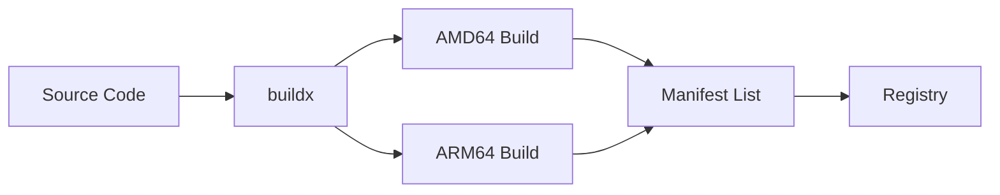

# How to Set Up Multi-Platform Docker Builds in GitHub Actions

Author: [nawazdhandala](https://www.github.com/nawazdhandala)

Tags: GitHub Actions, Docker, Multi-Platform, ARM, BuildKit, CI/CD

Description: Learn how to build multi-platform Docker images with GitHub Actions. This guide covers buildx, QEMU emulation, native builders, and optimization strategies for ARM64 and AMD64 images.

---

Modern deployments span multiple architectures - AMD64 servers, ARM64 instances like AWS Graviton, and Apple Silicon development machines. Building multi-platform Docker images ensures your containers run everywhere without emulation overhead.

## Multi-Platform Build Flow



## Basic Multi-Platform Build

Use Docker buildx with QEMU emulation:

```yaml
name: Multi-Platform Build

on:
  push:
    branches: [main]
    tags: ['v*']

jobs:
  build:
    runs-on: ubuntu-latest
    steps:
      - uses: actions/checkout@v4

      - name: Set up QEMU
        uses: docker/setup-qemu-action@v3

      - name: Set up Docker Buildx
        uses: docker/setup-buildx-action@v3

      - name: Login to Registry
        uses: docker/login-action@v3
        with:
          registry: ghcr.io
          username: ${{ github.actor }}
          password: ${{ secrets.GITHUB_TOKEN }}

      - name: Build and push
        uses: docker/build-push-action@v5
        with:
          context: .
          platforms: linux/amd64,linux/arm64
          push: true
          tags: ghcr.io/${{ github.repository }}:latest
```

## Optimized Caching

Use GitHub Actions cache for faster builds:

```yaml
jobs:
  build:
    runs-on: ubuntu-latest
    steps:
      - uses: actions/checkout@v4

      - uses: docker/setup-qemu-action@v3

      - uses: docker/setup-buildx-action@v3

      - uses: docker/login-action@v3
        with:
          registry: ghcr.io
          username: ${{ github.actor }}
          password: ${{ secrets.GITHUB_TOKEN }}

      - name: Build and push
        uses: docker/build-push-action@v5
        with:
          context: .
          platforms: linux/amd64,linux/arm64
          push: true
          tags: ghcr.io/${{ github.repository }}:${{ github.sha }}
          cache-from: type=gha
          cache-to: type=gha,mode=max
```

## Registry Cache

Use registry-based caching for shared cache across runners:

```yaml
- name: Build and push
  uses: docker/build-push-action@v5
  with:
    context: .
    platforms: linux/amd64,linux/arm64
    push: true
    tags: ghcr.io/${{ github.repository }}:latest
    cache-from: type=registry,ref=ghcr.io/${{ github.repository }}:cache
    cache-to: type=registry,ref=ghcr.io/${{ github.repository }}:cache,mode=max
```

## Separate Platform Builds

Build each platform separately then create manifest:

```yaml
jobs:
  build-amd64:
    runs-on: ubuntu-latest
    steps:
      - uses: actions/checkout@v4
      - uses: docker/setup-buildx-action@v3
      - uses: docker/login-action@v3
        with:
          registry: ghcr.io
          username: ${{ github.actor }}
          password: ${{ secrets.GITHUB_TOKEN }}

      - uses: docker/build-push-action@v5
        with:
          context: .
          platforms: linux/amd64
          push: true
          tags: ghcr.io/${{ github.repository }}:${{ github.sha }}-amd64
          cache-from: type=gha,scope=amd64
          cache-to: type=gha,scope=amd64,mode=max

  build-arm64:
    runs-on: ubuntu-latest
    steps:
      - uses: actions/checkout@v4
      - uses: docker/setup-qemu-action@v3
      - uses: docker/setup-buildx-action@v3
      - uses: docker/login-action@v3
        with:
          registry: ghcr.io
          username: ${{ github.actor }}
          password: ${{ secrets.GITHUB_TOKEN }}

      - uses: docker/build-push-action@v5
        with:
          context: .
          platforms: linux/arm64
          push: true
          tags: ghcr.io/${{ github.repository }}:${{ github.sha }}-arm64
          cache-from: type=gha,scope=arm64
          cache-to: type=gha,scope=arm64,mode=max

  manifest:
    needs: [build-amd64, build-arm64]
    runs-on: ubuntu-latest
    steps:
      - uses: docker/login-action@v3
        with:
          registry: ghcr.io
          username: ${{ github.actor }}
          password: ${{ secrets.GITHUB_TOKEN }}

      - name: Create manifest
        run: |
          docker manifest create ghcr.io/${{ github.repository }}:${{ github.sha }} \
            ghcr.io/${{ github.repository }}:${{ github.sha }}-amd64 \
            ghcr.io/${{ github.repository }}:${{ github.sha }}-arm64

          docker manifest push ghcr.io/${{ github.repository }}:${{ github.sha }}
```

## Native ARM64 Runners

Use native ARM64 runners for faster builds (no emulation):

```yaml
jobs:
  build-amd64:
    runs-on: ubuntu-latest
    steps:
      - uses: actions/checkout@v4
      - uses: docker/setup-buildx-action@v3
      - uses: docker/build-push-action@v5
        with:
          platforms: linux/amd64
          push: true
          tags: myregistry/app:${{ github.sha }}-amd64

  build-arm64:
    runs-on: ubuntu-24.04-arm  # Native ARM64 runner
    steps:
      - uses: actions/checkout@v4
      - uses: docker/setup-buildx-action@v3
      - uses: docker/build-push-action@v5
        with:
          platforms: linux/arm64
          push: true
          tags: myregistry/app:${{ github.sha }}-arm64
```

## Multi-Stage Dockerfile

Optimize for multi-platform:

```dockerfile
# Build stage
FROM --platform=$BUILDPLATFORM golang:1.22 AS builder

ARG TARGETOS
ARG TARGETARCH

WORKDIR /app
COPY go.mod go.sum ./
RUN go mod download

COPY . .
RUN CGO_ENABLED=0 GOOS=$TARGETOS GOARCH=$TARGETARCH go build -o /app/server ./cmd/server

# Runtime stage
FROM alpine:3.19

COPY --from=builder /app/server /server

ENTRYPOINT ["/server"]
```

The `$BUILDPLATFORM`, `$TARGETOS`, and `$TARGETARCH` variables are automatically set by buildx.

## Metadata and Tags

Generate consistent tags:

```yaml
jobs:
  build:
    runs-on: ubuntu-latest
    steps:
      - uses: actions/checkout@v4

      - uses: docker/setup-qemu-action@v3
      - uses: docker/setup-buildx-action@v3

      - name: Docker meta
        id: meta
        uses: docker/metadata-action@v5
        with:
          images: ghcr.io/${{ github.repository }}
          tags: |
            type=schedule
            type=ref,event=branch
            type=ref,event=pr
            type=semver,pattern={{version}}
            type=semver,pattern={{major}}.{{minor}}
            type=semver,pattern={{major}}
            type=sha

      - uses: docker/login-action@v3
        with:
          registry: ghcr.io
          username: ${{ github.actor }}
          password: ${{ secrets.GITHUB_TOKEN }}

      - uses: docker/build-push-action@v5
        with:
          context: .
          platforms: linux/amd64,linux/arm64
          push: ${{ github.event_name != 'pull_request' }}
          tags: ${{ steps.meta.outputs.tags }}
          labels: ${{ steps.meta.outputs.labels }}
```

## Build Arguments Per Platform

Pass different build arguments per platform:

```yaml
- uses: docker/build-push-action@v5
  with:
    context: .
    platforms: linux/amd64,linux/arm64
    push: true
    tags: myapp:latest
    build-args: |
      VERSION=${{ github.ref_name }}
```

In Dockerfile:

```dockerfile
FROM node:20-alpine

ARG TARGETARCH
ARG VERSION

# Install platform-specific dependencies
RUN if [ "$TARGETARCH" = "arm64" ]; then \
      apk add --no-cache some-arm-package; \
    fi

LABEL version=$VERSION
```

## Security: Attestations and SBOM

Add supply chain security:

```yaml
- uses: docker/build-push-action@v5
  with:
    context: .
    platforms: linux/amd64,linux/arm64
    push: true
    tags: ghcr.io/${{ github.repository }}:latest
    provenance: true
    sbom: true
```

## Complete Production Workflow

```yaml
name: Build and Release

on:
  push:
    branches: [main]
    tags: ['v*']
  pull_request:
    branches: [main]

permissions:
  contents: read
  packages: write

env:
  REGISTRY: ghcr.io
  IMAGE_NAME: ${{ github.repository }}

jobs:
  build:
    runs-on: ubuntu-latest
    outputs:
      digest: ${{ steps.build.outputs.digest }}
    steps:
      - uses: actions/checkout@v4

      - name: Set up QEMU
        uses: docker/setup-qemu-action@v3

      - name: Set up Docker Buildx
        uses: docker/setup-buildx-action@v3

      - name: Extract metadata
        id: meta
        uses: docker/metadata-action@v5
        with:
          images: ${{ env.REGISTRY }}/${{ env.IMAGE_NAME }}
          tags: |
            type=ref,event=branch
            type=ref,event=pr
            type=semver,pattern={{version}}
            type=semver,pattern={{major}}.{{minor}}
            type=sha

      - name: Login to Registry
        if: github.event_name != 'pull_request'
        uses: docker/login-action@v3
        with:
          registry: ${{ env.REGISTRY }}
          username: ${{ github.actor }}
          password: ${{ secrets.GITHUB_TOKEN }}

      - name: Build and push
        id: build
        uses: docker/build-push-action@v5
        with:
          context: .
          platforms: linux/amd64,linux/arm64
          push: ${{ github.event_name != 'pull_request' }}
          tags: ${{ steps.meta.outputs.tags }}
          labels: ${{ steps.meta.outputs.labels }}
          cache-from: type=gha
          cache-to: type=gha,mode=max
          provenance: true
          sbom: true

  scan:
    needs: build
    if: github.event_name != 'pull_request'
    runs-on: ubuntu-latest
    steps:
      - name: Scan AMD64 image
        uses: aquasecurity/trivy-action@master
        with:
          image-ref: ${{ env.REGISTRY }}/${{ env.IMAGE_NAME }}@${{ needs.build.outputs.digest }}
          format: sarif
          output: trivy-results.sarif

      - name: Upload scan results
        uses: github/codeql-action/upload-sarif@v3
        with:
          sarif_file: trivy-results.sarif

  deploy:
    needs: [build, scan]
    if: startsWith(github.ref, 'refs/tags/')
    runs-on: ubuntu-latest
    environment: production
    steps:
      - name: Deploy
        run: |
          echo "Deploying ${{ env.REGISTRY }}/${{ env.IMAGE_NAME }}@${{ needs.build.outputs.digest }}"
```

## Troubleshooting

Common issues:

1. **Slow ARM64 builds**: Use native ARM64 runners or optimize Dockerfile for cross-compilation
2. **QEMU failures**: Increase runner memory or split builds
3. **Cache misses**: Verify cache scope matches between builds
4. **Manifest errors**: Ensure all platform images exist before creating manifest

Check build platforms:

```bash
docker buildx imagetools inspect ghcr.io/myorg/myapp:latest
```

---

Multi-platform Docker builds ensure your images work on AMD64 servers and ARM64 instances alike. Use QEMU for simple setups, native runners for performance, and proper caching to keep builds fast. Add attestations for supply chain security and scan images before deployment.
