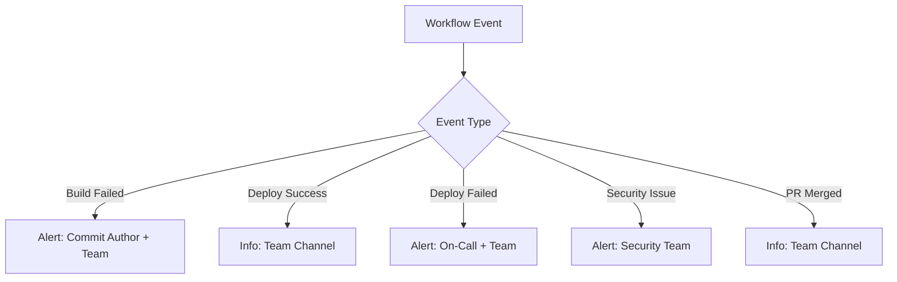

# How to Set Up Notifications in GitHub Actions

Author: [nawazdhandala](https://www.github.com/nawazdhandala)

Tags: GitHub Actions, CI/CD, Notifications, Slack, Teams, Discord, DevOps, Alerting

Description: Learn how to set up workflow notifications in GitHub Actions for Slack, Microsoft Teams, Discord, email, and custom webhooks to keep your team informed about build status, deployments, and failures.

---

Automated notifications transform CI/CD from something you check manually into something that keeps you informed. The right notification strategy alerts the team when action is needed without creating noise from routine successes.

## Notification Strategy

Before implementing notifications, decide what events warrant alerts and who should receive them.



## Slack Notifications

Slack is the most common notification target. GitHub provides both simple webhook notifications and rich message formatting.

### Basic Slack Webhook

Create an incoming webhook in your Slack workspace and add it as a repository secret.

```yaml
name: CI with Slack Notification

on:
  push:
    branches: [main]
  pull_request:
    branches: [main]

jobs:
  build:
    runs-on: ubuntu-latest

    steps:
      - name: Checkout
        uses: actions/checkout@v4

      - name: Build and test
        run: |
          npm ci
          npm test

      - name: Notify Slack on failure
        if: failure()
        run: |
          curl -X POST ${{ secrets.SLACK_WEBHOOK_URL }} \
            -H 'Content-Type: application/json' \
            -d '{
              "text": "Build failed on ${{ github.repository }}",
              "attachments": [{
                "color": "danger",
                "fields": [
                  {"title": "Branch", "value": "${{ github.ref_name }}", "short": true},
                  {"title": "Commit", "value": "${{ github.sha }}", "short": true},
                  {"title": "Author", "value": "${{ github.actor }}", "short": true},
                  {"title": "Workflow", "value": "${{ github.workflow }}", "short": true}
                ],
                "actions": [{
                  "type": "button",
                  "text": "View Run",
                  "url": "${{ github.server_url }}/${{ github.repository }}/actions/runs/${{ github.run_id }}"
                }]
              }]
            }'
```

### Rich Slack Messages with Slack GitHub Action

For more control over message formatting, use a dedicated action.

```yaml
jobs:
  build:
    runs-on: ubuntu-latest

    steps:
      - name: Checkout
        uses: actions/checkout@v4

      - name: Build
        id: build
        run: npm run build

      - name: Test
        id: test
        run: npm test

      - name: Notify Slack
        if: always()
        uses: slackapi/slack-github-action@v1.25.0
        with:
          payload: |
            {
              "blocks": [
                {
                  "type": "header",
                  "text": {
                    "type": "plain_text",
                    "text": "${{ job.status == 'success' && 'Build Passed' || 'Build Failed' }}"
                  }
                },
                {
                  "type": "section",
                  "fields": [
                    {"type": "mrkdwn", "text": "*Repository:*\n${{ github.repository }}"},
                    {"type": "mrkdwn", "text": "*Branch:*\n${{ github.ref_name }}"},
                    {"type": "mrkdwn", "text": "*Commit:*\n<${{ github.server_url }}/${{ github.repository }}/commit/${{ github.sha }}|${{ github.sha }}>"},
                    {"type": "mrkdwn", "text": "*Author:*\n${{ github.actor }}"}
                  ]
                },
                {
                  "type": "actions",
                  "elements": [
                    {
                      "type": "button",
                      "text": {"type": "plain_text", "text": "View Workflow"},
                      "url": "${{ github.server_url }}/${{ github.repository }}/actions/runs/${{ github.run_id }}"
                    }
                  ]
                }
              ]
            }
        env:
          SLACK_WEBHOOK_URL: ${{ secrets.SLACK_WEBHOOK_URL }}
          SLACK_WEBHOOK_TYPE: INCOMING_WEBHOOK
```

## Microsoft Teams Notifications

Teams uses Office 365 Connectors or Workflows for incoming webhooks.

### Teams Webhook Notification

```yaml
jobs:
  deploy:
    runs-on: ubuntu-latest

    steps:
      - name: Deploy
        run: ./scripts/deploy.sh

      - name: Notify Teams on success
        if: success()
        run: |
          curl -X POST "${{ secrets.TEAMS_WEBHOOK_URL }}" \
            -H "Content-Type: application/json" \
            -d '{
              "@type": "MessageCard",
              "@context": "http://schema.org/extensions",
              "themeColor": "00FF00",
              "summary": "Deployment Successful",
              "sections": [{
                "activityTitle": "Deployment to Production",
                "activitySubtitle": "${{ github.repository }}",
                "facts": [
                  {"name": "Branch", "value": "${{ github.ref_name }}"},
                  {"name": "Commit", "value": "${{ github.sha }}"},
                  {"name": "Deployed by", "value": "${{ github.actor }}"}
                ],
                "markdown": true
              }],
              "potentialAction": [{
                "@type": "OpenUri",
                "name": "View Workflow",
                "targets": [{
                  "os": "default",
                  "uri": "${{ github.server_url }}/${{ github.repository }}/actions/runs/${{ github.run_id }}"
                }]
              }]
            }'

      - name: Notify Teams on failure
        if: failure()
        run: |
          curl -X POST "${{ secrets.TEAMS_WEBHOOK_URL }}" \
            -H "Content-Type: application/json" \
            -d '{
              "@type": "MessageCard",
              "@context": "http://schema.org/extensions",
              "themeColor": "FF0000",
              "summary": "Deployment Failed",
              "sections": [{
                "activityTitle": "Deployment Failed",
                "activitySubtitle": "${{ github.repository }}",
                "facts": [
                  {"name": "Branch", "value": "${{ github.ref_name }}"},
                  {"name": "Error", "value": "Check workflow logs for details"}
                ],
                "markdown": true
              }]
            }'
```

## Discord Notifications

Discord webhooks accept a similar format to Slack with some differences.

```yaml
jobs:
  build:
    runs-on: ubuntu-latest

    steps:
      - name: Build
        run: npm run build

      - name: Discord notification
        if: always()
        run: |
          if [ "${{ job.status }}" == "success" ]; then
            COLOR=3066993  # Green
            TITLE="Build Passed"
          else
            COLOR=15158332  # Red
            TITLE="Build Failed"
          fi

          curl -X POST "${{ secrets.DISCORD_WEBHOOK_URL }}" \
            -H "Content-Type: application/json" \
            -d "{
              \"embeds\": [{
                \"title\": \"$TITLE\",
                \"color\": $COLOR,
                \"fields\": [
                  {\"name\": \"Repository\", \"value\": \"${{ github.repository }}\", \"inline\": true},
                  {\"name\": \"Branch\", \"value\": \"${{ github.ref_name }}\", \"inline\": true},
                  {\"name\": \"Author\", \"value\": \"${{ github.actor }}\", \"inline\": true}
                ],
                \"url\": \"${{ github.server_url }}/${{ github.repository }}/actions/runs/${{ github.run_id }}\"
              }]
            }"
```

## Email Notifications

GitHub sends email notifications by default for workflow failures. For custom email notifications, use an SMTP service or email API.

### SendGrid Email Notification

```yaml
jobs:
  build:
    runs-on: ubuntu-latest

    steps:
      - name: Build
        run: npm run build

      - name: Send failure email
        if: failure()
        run: |
          curl -X POST "https://api.sendgrid.com/v3/mail/send" \
            -H "Authorization: Bearer ${{ secrets.SENDGRID_API_KEY }}" \
            -H "Content-Type: application/json" \
            -d '{
              "personalizations": [{"to": [{"email": "team@example.com"}]}],
              "from": {"email": "ci@example.com", "name": "GitHub Actions"},
              "subject": "Build Failed: ${{ github.repository }}",
              "content": [{
                "type": "text/html",
                "value": "<h2>Build Failed</h2><p>Repository: ${{ github.repository }}<br>Branch: ${{ github.ref_name }}<br>Commit: ${{ github.sha }}<br>Author: ${{ github.actor }}</p><p><a href=\"${{ github.server_url }}/${{ github.repository }}/actions/runs/${{ github.run_id }}\">View Workflow</a></p>"
              }]
            }'
```

## Conditional Notifications

Send different notifications based on workflow context.

### Branch-Specific Notifications

```yaml
jobs:
  deploy:
    runs-on: ubuntu-latest

    steps:
      - name: Deploy
        run: ./scripts/deploy.sh

      - name: Notify appropriate channel
        if: always()
        run: |
          # Determine webhook based on branch
          if [ "${{ github.ref_name }}" == "main" ]; then
            WEBHOOK="${{ secrets.SLACK_PROD_WEBHOOK }}"
            CHANNEL="production-deploys"
          else
            WEBHOOK="${{ secrets.SLACK_DEV_WEBHOOK }}"
            CHANNEL="dev-builds"
          fi

          STATUS="${{ job.status }}"
          COLOR=$([ "$STATUS" == "success" ] && echo "good" || echo "danger")

          curl -X POST "$WEBHOOK" \
            -H 'Content-Type: application/json' \
            -d "{
              \"channel\": \"#$CHANNEL\",
              \"attachments\": [{
                \"color\": \"$COLOR\",
                \"text\": \"Deployment to ${{ github.ref_name }}: $STATUS\"
              }]
            }"
```

### First-Time Failure Notification

Only notify on the first failure, not subsequent ones.

```yaml
jobs:
  build:
    runs-on: ubuntu-latest

    steps:
      - name: Checkout
        uses: actions/checkout@v4

      - name: Build
        run: npm run build

      - name: Check previous run status
        id: previous
        if: failure()
        run: |
          # Get previous workflow run status
          PREV_STATUS=$(gh run list --workflow "${{ github.workflow }}" --branch "${{ github.ref_name }}" --limit 2 --json conclusion -q '.[1].conclusion // "none"')
          echo "status=$PREV_STATUS" >> $GITHUB_OUTPUT
        env:
          GH_TOKEN: ${{ secrets.GITHUB_TOKEN }}

      - name: Notify only on first failure
        if: failure() && steps.previous.outputs.status != 'failure'
        run: |
          curl -X POST ${{ secrets.SLACK_WEBHOOK_URL }} \
            -H 'Content-Type: application/json' \
            -d '{"text": "Build started failing on ${{ github.ref_name }}"}'
```

## Reusable Notification Workflow

Create a reusable workflow for consistent notifications across repositories.

```yaml
# .github/workflows/notify.yml
name: Send Notification

on:
  workflow_call:
    inputs:
      status:
        type: string
        required: true
      message:
        type: string
        required: true
      channel:
        type: string
        default: 'ci-notifications'
    secrets:
      SLACK_WEBHOOK:
        required: true

jobs:
  notify:
    runs-on: ubuntu-latest

    steps:
      - name: Send Slack notification
        run: |
          COLOR=$([ "${{ inputs.status }}" == "success" ] && echo "good" || echo "danger")

          curl -X POST ${{ secrets.SLACK_WEBHOOK }} \
            -H 'Content-Type: application/json' \
            -d "{
              \"channel\": \"#${{ inputs.channel }}\",
              \"attachments\": [{
                \"color\": \"$COLOR\",
                \"text\": \"${{ inputs.message }}\",
                \"footer\": \"${{ github.repository }} | ${{ github.ref_name }}\"
              }]
            }"
```

Call from other workflows:

```yaml
jobs:
  build:
    runs-on: ubuntu-latest
    steps:
      - run: npm run build

  notify:
    needs: build
    if: always()
    uses: ./.github/workflows/notify.yml
    with:
      status: ${{ needs.build.result }}
      message: "Build ${{ needs.build.result }} for ${{ github.repository }}"
    secrets:
      SLACK_WEBHOOK: ${{ secrets.SLACK_WEBHOOK_URL }}
```

## GitHub Native Notifications

Use GitHub's built-in notification system for issues and PR comments.

```yaml
jobs:
  build:
    runs-on: ubuntu-latest

    steps:
      - name: Build
        id: build
        run: npm run build

      - name: Comment on PR
        if: failure() && github.event_name == 'pull_request'
        uses: actions/github-script@v7
        with:
          script: |
            github.rest.issues.createComment({
              issue_number: context.issue.number,
              owner: context.repo.owner,
              repo: context.repo.repo,
              body: `## Build Failed

              The build failed for commit ${context.sha.substring(0, 7)}.

              [View workflow run](${context.serverUrl}/${context.repo.owner}/${context.repo.repo}/actions/runs/${context.runId})

              Please check the logs and fix the issues before merging.`
            })
```

Effective notifications inform without overwhelming. Start with failure notifications only, then add success notifications for critical deployments. Review notification volume regularly and adjust thresholds to maintain signal quality.
