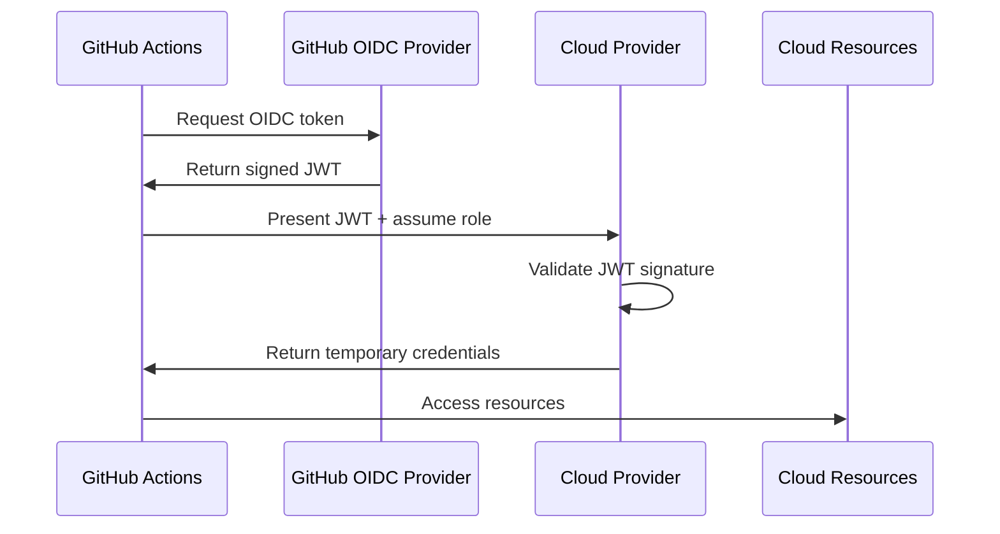

# How to Use OIDC for Cloud Authentication in GitHub Actions

Author: [nawazdhandala](https://www.github.com/nawazdhandala)

Tags: GitHub Actions, OIDC, AWS, Azure, GCP, Security, Cloud Authentication

Description: Learn how to use OpenID Connect (OIDC) for secure, keyless authentication to AWS, Azure, and GCP from GitHub Actions. Eliminate long-lived credentials and improve security.

---

Storing cloud credentials as secrets is risky - they can leak, expire, and require rotation. OIDC (OpenID Connect) lets GitHub Actions authenticate directly with cloud providers using short-lived tokens. No secrets to manage, automatic rotation, and fine-grained access control.

## How OIDC Works



## AWS OIDC Setup

### Step 1: Create OIDC Provider in AWS

```bash
# Create the OIDC provider
aws iam create-open-id-connect-provider \
  --url https://token.actions.githubusercontent.com \
  --client-id-list sts.amazonaws.com \
  --thumbprint-list 6938fd4d98bab03faadb97b34396831e3780aea1
```

### Step 2: Create IAM Role

```json
{
  "Version": "2012-10-17",
  "Statement": [
    {
      "Effect": "Allow",
      "Principal": {
        "Federated": "arn:aws:iam::123456789012:oidc-provider/token.actions.githubusercontent.com"
      },
      "Action": "sts:AssumeRoleWithWebIdentity",
      "Condition": {
        "StringEquals": {
          "token.actions.githubusercontent.com:aud": "sts.amazonaws.com"
        },
        "StringLike": {
          "token.actions.githubusercontent.com:sub": "repo:myorg/myrepo:*"
        }
      }
    }
  ]
}
```

Restrict to specific branches or environments:

```json
{
  "Condition": {
    "StringEquals": {
      "token.actions.githubusercontent.com:aud": "sts.amazonaws.com",
      "token.actions.githubusercontent.com:sub": "repo:myorg/myrepo:ref:refs/heads/main"
    }
  }
}
```

### Step 3: Use in Workflow

```yaml
name: Deploy to AWS

on:
  push:
    branches: [main]

permissions:
  id-token: write
  contents: read

jobs:
  deploy:
    runs-on: ubuntu-latest
    steps:
      - uses: actions/checkout@v4

      - name: Configure AWS Credentials
        uses: aws-actions/configure-aws-credentials@v4
        with:
          role-to-assume: arn:aws:iam::123456789012:role/github-actions-role
          aws-region: us-east-1

      - name: Deploy
        run: aws s3 sync ./dist s3://my-bucket/
```

## Azure OIDC Setup

### Step 1: Create App Registration

```bash
# Create app registration
az ad app create --display-name "GitHub Actions"

# Create service principal
az ad sp create --id <app-id>

# Create federated credential
az ad app federated-credential create \
  --id <app-id> \
  --parameters '{
    "name": "github-main",
    "issuer": "https://token.actions.githubusercontent.com",
    "subject": "repo:myorg/myrepo:ref:refs/heads/main",
    "audiences": ["api://AzureADTokenExchange"]
  }'
```

### Step 2: Assign Role

```bash
az role assignment create \
  --assignee <service-principal-id> \
  --role "Contributor" \
  --scope /subscriptions/<subscription-id>/resourceGroups/<resource-group>
```

### Step 3: Use in Workflow

```yaml
name: Deploy to Azure

on:
  push:
    branches: [main]

permissions:
  id-token: write
  contents: read

jobs:
  deploy:
    runs-on: ubuntu-latest
    steps:
      - uses: actions/checkout@v4

      - name: Azure Login
        uses: azure/login@v2
        with:
          client-id: ${{ vars.AZURE_CLIENT_ID }}
          tenant-id: ${{ vars.AZURE_TENANT_ID }}
          subscription-id: ${{ vars.AZURE_SUBSCRIPTION_ID }}

      - name: Deploy to Azure Web App
        uses: azure/webapps-deploy@v3
        with:
          app-name: my-app
          package: ./dist
```

## GCP OIDC Setup

### Step 1: Create Workload Identity Pool

```bash
# Create workload identity pool
gcloud iam workload-identity-pools create "github-pool" \
  --location="global" \
  --display-name="GitHub Actions Pool"

# Create provider
gcloud iam workload-identity-pools providers create-oidc "github-provider" \
  --location="global" \
  --workload-identity-pool="github-pool" \
  --display-name="GitHub Provider" \
  --issuer-uri="https://token.actions.githubusercontent.com" \
  --attribute-mapping="google.subject=assertion.sub,attribute.actor=assertion.actor,attribute.repository=assertion.repository"
```

### Step 2: Grant Access to Service Account

```bash
gcloud iam service-accounts add-iam-policy-binding "github-sa@my-project.iam.gserviceaccount.com" \
  --role="roles/iam.workloadIdentityUser" \
  --member="principalSet://iam.googleapis.com/projects/123456789/locations/global/workloadIdentityPools/github-pool/attribute.repository/myorg/myrepo"
```

### Step 3: Use in Workflow

```yaml
name: Deploy to GCP

on:
  push:
    branches: [main]

permissions:
  id-token: write
  contents: read

jobs:
  deploy:
    runs-on: ubuntu-latest
    steps:
      - uses: actions/checkout@v4

      - name: Authenticate to GCP
        uses: google-github-actions/auth@v2
        with:
          workload_identity_provider: projects/123456789/locations/global/workloadIdentityPools/github-pool/providers/github-provider
          service_account: github-sa@my-project.iam.gserviceaccount.com

      - name: Setup Cloud SDK
        uses: google-github-actions/setup-gcloud@v2

      - name: Deploy
        run: gcloud run deploy my-service --source .
```

## Environment-Based Access

Restrict OIDC access by environment:

### AWS Trust Policy

```json
{
  "Condition": {
    "StringEquals": {
      "token.actions.githubusercontent.com:sub": "repo:myorg/myrepo:environment:production"
    }
  }
}
```

### Workflow Configuration

```yaml
jobs:
  deploy-staging:
    runs-on: ubuntu-latest
    environment: staging
    permissions:
      id-token: write
      contents: read
    steps:
      - uses: aws-actions/configure-aws-credentials@v4
        with:
          role-to-assume: arn:aws:iam::123456789012:role/github-actions-staging
          aws-region: us-east-1

  deploy-production:
    needs: deploy-staging
    runs-on: ubuntu-latest
    environment: production
    permissions:
      id-token: write
      contents: read
    steps:
      - uses: aws-actions/configure-aws-credentials@v4
        with:
          role-to-assume: arn:aws:iam::123456789012:role/github-actions-production
          aws-region: us-east-1
```

## Multi-Account AWS Setup

Access multiple AWS accounts:

```yaml
jobs:
  deploy:
    runs-on: ubuntu-latest
    permissions:
      id-token: write
      contents: read
    steps:
      - uses: actions/checkout@v4

      # Account 1 - Build
      - name: Configure Build Account
        uses: aws-actions/configure-aws-credentials@v4
        with:
          role-to-assume: arn:aws:iam::111111111111:role/github-build
          aws-region: us-east-1

      - name: Build and Push
        run: |
          aws ecr get-login-password | docker login --username AWS --password-stdin 111111111111.dkr.ecr.us-east-1.amazonaws.com
          docker build -t my-app .
          docker push 111111111111.dkr.ecr.us-east-1.amazonaws.com/my-app:latest

      # Account 2 - Deploy
      - name: Configure Deploy Account
        uses: aws-actions/configure-aws-credentials@v4
        with:
          role-to-assume: arn:aws:iam::222222222222:role/github-deploy
          aws-region: us-east-1

      - name: Deploy
        run: aws ecs update-service --cluster prod --service my-app --force-new-deployment
```

## Terraform with OIDC

Use OIDC with Terraform:

```yaml
jobs:
  terraform:
    runs-on: ubuntu-latest
    permissions:
      id-token: write
      contents: read
    steps:
      - uses: actions/checkout@v4

      - uses: aws-actions/configure-aws-credentials@v4
        with:
          role-to-assume: arn:aws:iam::123456789012:role/terraform-role
          aws-region: us-east-1

      - uses: hashicorp/setup-terraform@v3

      - name: Terraform Init
        run: terraform init
        working-directory: terraform

      - name: Terraform Apply
        run: terraform apply -auto-approve
        working-directory: terraform
```

## Debugging OIDC Issues

Print the OIDC token claims:

```yaml
- name: Debug OIDC Token
  run: |
    TOKEN=$(curl -sLS "${ACTIONS_ID_TOKEN_REQUEST_URL}&audience=sts.amazonaws.com" \
      -H "Authorization: Bearer ${ACTIONS_ID_TOKEN_REQUEST_TOKEN}" \
      | jq -r '.value')

    # Decode and print claims (without signature verification)
    echo $TOKEN | cut -d. -f2 | base64 -d 2>/dev/null | jq .
```

Common issues:
- **Subject mismatch**: Check repo, branch, or environment in trust policy
- **Audience mismatch**: Ensure `aud` claim matches expected value
- **Missing permissions**: Add `id-token: write` permission

## Complete Multi-Cloud Example

```yaml
name: Multi-Cloud Deploy

on:
  push:
    branches: [main]

permissions:
  id-token: write
  contents: read

jobs:
  build:
    runs-on: ubuntu-latest
    outputs:
      image-tag: ${{ steps.meta.outputs.tags }}
    steps:
      - uses: actions/checkout@v4

      - uses: aws-actions/configure-aws-credentials@v4
        with:
          role-to-assume: ${{ vars.AWS_BUILD_ROLE }}
          aws-region: us-east-1

      - name: Login to ECR
        uses: aws-actions/amazon-ecr-login@v2

      - name: Build and Push
        id: meta
        run: |
          IMAGE_TAG=${{ github.sha }}
          docker build -t ${{ vars.ECR_REGISTRY }}/app:$IMAGE_TAG .
          docker push ${{ vars.ECR_REGISTRY }}/app:$IMAGE_TAG
          echo "tags=$IMAGE_TAG" >> $GITHUB_OUTPUT

  deploy-aws:
    needs: build
    runs-on: ubuntu-latest
    environment: production-aws
    steps:
      - uses: aws-actions/configure-aws-credentials@v4
        with:
          role-to-assume: ${{ vars.AWS_DEPLOY_ROLE }}
          aws-region: us-east-1

      - name: Deploy to ECS
        run: |
          aws ecs update-service \
            --cluster production \
            --service app \
            --force-new-deployment

  deploy-gcp:
    needs: build
    runs-on: ubuntu-latest
    environment: production-gcp
    steps:
      - uses: google-github-actions/auth@v2
        with:
          workload_identity_provider: ${{ vars.GCP_WORKLOAD_IDENTITY_PROVIDER }}
          service_account: ${{ vars.GCP_SERVICE_ACCOUNT }}

      - uses: google-github-actions/setup-gcloud@v2

      - name: Deploy to Cloud Run
        run: |
          gcloud run deploy app \
            --image ${{ vars.ECR_REGISTRY }}/app:${{ needs.build.outputs.image-tag }} \
            --region us-central1
```

---

OIDC eliminates the risks of long-lived credentials. Configure trust relationships with precise conditions - specific repositories, branches, and environments. Each cloud provider has slightly different setup, but the result is the same: secure, automatic authentication without secrets to rotate or leak.
