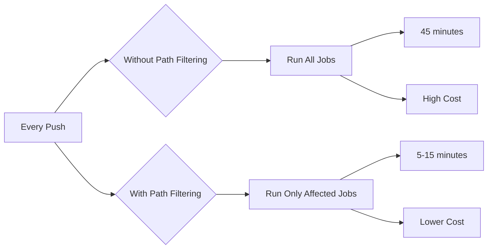

# How to Use Path Filtering in GitHub Actions

Author: [nawazdhandala](https://www.github.com/nawazdhandala)

Tags: GitHub Actions, CI/CD, Path Filtering, Monorepo, Optimization, DevOps

Description: Learn how to use path filtering in GitHub Actions to run workflows only when specific files change, optimizing CI/CD for monorepos and large codebases.

> Run what changed, skip what did not. Path filtering makes CI/CD efficient.

In large repositories, running all tests and builds on every commit wastes time and resources. Path filtering lets you trigger workflows only when relevant files change - run frontend tests when frontend code changes, skip documentation builds when only code changed. This guide covers all path filtering techniques from basic triggers to advanced monorepo strategies.

## Path Filtering Benefits



## Basic Path Triggers

Filter workflows at the trigger level:

```yaml
name: Frontend CI

on:
  push:
    paths:
      - 'frontend/**'
      - 'shared/**'
      - 'package.json'
    branches:
      - main
  pull_request:
    paths:
      - 'frontend/**'
      - 'shared/**'
      - 'package.json'
    branches:
      - main

jobs:
  build:
    runs-on: ubuntu-latest
    steps:
      - uses: actions/checkout@v4
      - run: npm ci
      - run: npm run build:frontend
```

## Path Ignore Patterns

Exclude paths from triggering:

```yaml
name: Code CI

on:
  push:
    branches: [main]
    paths-ignore:
      - '**.md'
      - 'docs/**'
      - '.github/ISSUE_TEMPLATE/**'
      - 'LICENSE'
      - '.gitignore'
  pull_request:
    branches: [main]
    paths-ignore:
      - '**.md'
      - 'docs/**'
      - '.github/ISSUE_TEMPLATE/**'

jobs:
  test:
    runs-on: ubuntu-latest
    steps:
      - uses: actions/checkout@v4
      - run: npm test
```

## Glob Pattern Reference

Common glob patterns for path filtering:

```yaml
on:
  push:
    paths:
      # Exact file
      - 'package.json'

      # All files in directory
      - 'src/*'

      # All files recursively
      - 'src/**'

      # Specific extension
      - '**.ts'
      - '**.tsx'

      # Multiple extensions
      - 'src/**/*.{ts,tsx}'

      # Negation (exclude)
      - '!src/**/*.test.ts'

      # Any single character
      - 'config?.json'

      # Character ranges
      - 'file[0-9].txt'
```

## Dynamic Path Detection

Use dorny/paths-filter for runtime path detection:

```yaml
name: Dynamic Path Filtering

on:
  push:
    branches: [main]
  pull_request:
    branches: [main]

jobs:
  changes:
    runs-on: ubuntu-latest
    outputs:
      frontend: ${{ steps.filter.outputs.frontend }}
      backend: ${{ steps.filter.outputs.backend }}
      infrastructure: ${{ steps.filter.outputs.infrastructure }}
      docs: ${{ steps.filter.outputs.docs }}

    steps:
      - uses: actions/checkout@v4

      - uses: dorny/paths-filter@v3
        id: filter
        with:
          filters: |
            frontend:
              - 'frontend/**'
              - 'shared/types/**'
              - 'package.json'
            backend:
              - 'backend/**'
              - 'shared/**'
              - 'requirements.txt'
            infrastructure:
              - 'terraform/**'
              - 'kubernetes/**'
              - 'docker-compose*.yml'
            docs:
              - 'docs/**'
              - '**.md'

  frontend:
    needs: changes
    if: needs.changes.outputs.frontend == 'true'
    runs-on: ubuntu-latest
    steps:
      - uses: actions/checkout@v4
      - run: cd frontend && npm ci && npm test

  backend:
    needs: changes
    if: needs.changes.outputs.backend == 'true'
    runs-on: ubuntu-latest
    steps:
      - uses: actions/checkout@v4
      - run: cd backend && pip install -r requirements.txt && pytest

  infrastructure:
    needs: changes
    if: needs.changes.outputs.infrastructure == 'true'
    runs-on: ubuntu-latest
    steps:
      - uses: actions/checkout@v4
      - run: cd terraform && terraform validate

  docs:
    needs: changes
    if: needs.changes.outputs.docs == 'true'
    runs-on: ubuntu-latest
    steps:
      - uses: actions/checkout@v4
      - run: npm run docs:build
```

## Monorepo Path Filtering

Efficient CI for monorepos with many packages:

```yaml
name: Monorepo CI

on:
  push:
    branches: [main]
  pull_request:
    branches: [main]

jobs:
  detect-packages:
    runs-on: ubuntu-latest
    outputs:
      packages: ${{ steps.detect.outputs.packages }}
      has_changes: ${{ steps.detect.outputs.has_changes }}

    steps:
      - uses: actions/checkout@v4
        with:
          fetch-depth: 0

      - name: Detect changed packages
        id: detect
        run: |
          if [ "${{ github.event_name }}" == "pull_request" ]; then
            BASE_SHA=${{ github.event.pull_request.base.sha }}
          else
            BASE_SHA=$(git rev-parse HEAD~1)
          fi

          # Get changed files
          CHANGED_FILES=$(git diff --name-only $BASE_SHA HEAD)

          # Map files to packages
          PACKAGES=()
          for file in $CHANGED_FILES; do
            if [[ $file == packages/* ]]; then
              PKG=$(echo $file | cut -d'/' -f2)
              PACKAGES+=("$PKG")
            fi
          done

          # Check for root changes affecting all packages
          ROOT_CHANGES=$(echo "$CHANGED_FILES" | grep -E "^(package\.json|tsconfig\.json|\.eslintrc)" || true)
          if [ -n "$ROOT_CHANGES" ]; then
            PACKAGES=($(ls packages))
          fi

          # Remove duplicates
          UNIQUE=($(echo "${PACKAGES[@]}" | tr ' ' '\n' | sort -u))

          if [ ${#UNIQUE[@]} -eq 0 ]; then
            echo "has_changes=false" >> $GITHUB_OUTPUT
            echo "packages=[]" >> $GITHUB_OUTPUT
          else
            JSON=$(printf '%s\n' "${UNIQUE[@]}" | jq -R . | jq -s .)
            echo "has_changes=true" >> $GITHUB_OUTPUT
            echo "packages=$JSON" >> $GITHUB_OUTPUT
          fi

  test:
    needs: detect-packages
    if: needs.detect-packages.outputs.has_changes == 'true'
    runs-on: ubuntu-latest
    strategy:
      matrix:
        package: ${{ fromJson(needs.detect-packages.outputs.packages) }}
      fail-fast: false

    steps:
      - uses: actions/checkout@v4

      - uses: actions/setup-node@v4
        with:
          node-version: '20'
          cache: 'npm'

      - run: npm ci

      - name: Test ${{ matrix.package }}
        run: npm test --workspace=packages/${{ matrix.package }}
```

## Dependent Path Filtering

Handle dependencies between components:

```yaml
name: Dependency-Aware Filtering

on:
  pull_request:
    branches: [main]

jobs:
  analyze:
    runs-on: ubuntu-latest
    outputs:
      affected: ${{ steps.deps.outputs.affected }}

    steps:
      - uses: actions/checkout@v4
        with:
          fetch-depth: 0

      - uses: dorny/paths-filter@v3
        id: changes
        with:
          list-files: json
          filters: |
            core:
              - 'packages/core/**'
            utils:
              - 'packages/utils/**'
            api:
              - 'packages/api/**'
            web:
              - 'packages/web/**'

      - name: Calculate affected packages
        id: deps
        run: |
          # Define dependency graph
          declare -A DEPS
          DEPS[core]=""
          DEPS[utils]="core"
          DEPS[api]="core utils"
          DEPS[web]="core utils api"

          AFFECTED=()

          # Direct changes
          for pkg in core utils api web; do
            if [ "${{ steps.changes.outputs[pkg] }}" == "true" ]; then
              AFFECTED+=("$pkg")
            fi
          done

          # Dependency changes
          for pkg in "${!DEPS[@]}"; do
            for dep in ${DEPS[$pkg]}; do
              if [[ " ${AFFECTED[@]} " =~ " ${dep} " ]]; then
                if [[ ! " ${AFFECTED[@]} " =~ " ${pkg} " ]]; then
                  AFFECTED+=("$pkg")
                fi
              fi
            done
          done

          # Output as JSON
          JSON=$(printf '%s\n' "${AFFECTED[@]}" | jq -R . | jq -s .)
          echo "affected=$JSON" >> $GITHUB_OUTPUT

  build:
    needs: analyze
    if: needs.analyze.outputs.affected != '[]'
    runs-on: ubuntu-latest
    strategy:
      matrix:
        package: ${{ fromJson(needs.analyze.outputs.affected) }}

    steps:
      - uses: actions/checkout@v4
      - run: npm ci
      - run: npm run build --workspace=packages/${{ matrix.package }}
```

## Combining Path and Branch Filters

Different behavior per branch:

```yaml
name: Branch-Specific Path Filtering

on:
  push:
    branches:
      - main
      - develop
      - 'release/**'

jobs:
  check-paths:
    runs-on: ubuntu-latest
    outputs:
      run_tests: ${{ steps.check.outputs.run_tests }}
      run_deploy: ${{ steps.check.outputs.run_deploy }}

    steps:
      - uses: actions/checkout@v4
        with:
          fetch-depth: 2

      - name: Check changes
        id: check
        run: |
          CHANGED=$(git diff --name-only HEAD~1)

          # Always run tests for code changes
          if echo "$CHANGED" | grep -qE '\.(ts|tsx|js|jsx)$'; then
            echo "run_tests=true" >> $GITHUB_OUTPUT
          else
            echo "run_tests=false" >> $GITHUB_OUTPUT
          fi

          # Deploy only on main with code changes
          if [[ "${{ github.ref }}" == "refs/heads/main" ]] && echo "$CHANGED" | grep -qE '\.(ts|tsx|js|jsx)$'; then
            echo "run_deploy=true" >> $GITHUB_OUTPUT
          else
            echo "run_deploy=false" >> $GITHUB_OUTPUT
          fi

  test:
    needs: check-paths
    if: needs.check-paths.outputs.run_tests == 'true'
    runs-on: ubuntu-latest
    steps:
      - uses: actions/checkout@v4
      - run: npm test

  deploy:
    needs: [check-paths, test]
    if: needs.check-paths.outputs.run_deploy == 'true'
    runs-on: ubuntu-latest
    steps:
      - uses: actions/checkout@v4
      - run: npm run deploy
```

## Path Filtering for Different Test Types

Run different test suites based on changes:

```yaml
name: Selective Testing

on:
  pull_request:
    branches: [main]

jobs:
  detect:
    runs-on: ubuntu-latest
    outputs:
      unit: ${{ steps.filter.outputs.unit }}
      integration: ${{ steps.filter.outputs.integration }}
      e2e: ${{ steps.filter.outputs.e2e }}

    steps:
      - uses: actions/checkout@v4

      - uses: dorny/paths-filter@v3
        id: filter
        with:
          filters: |
            unit:
              - 'src/**/*.ts'
              - 'src/**/*.tsx'
            integration:
              - 'src/api/**'
              - 'src/database/**'
              - 'docker-compose.yml'
            e2e:
              - 'src/**'
              - 'cypress/**'
              - 'playwright/**'

  unit-tests:
    needs: detect
    if: needs.detect.outputs.unit == 'true'
    runs-on: ubuntu-latest
    steps:
      - uses: actions/checkout@v4
      - run: npm test -- --testPathPattern=unit

  integration-tests:
    needs: detect
    if: needs.detect.outputs.integration == 'true'
    runs-on: ubuntu-latest
    steps:
      - uses: actions/checkout@v4
      - run: docker compose up -d
      - run: npm test -- --testPathPattern=integration

  e2e-tests:
    needs: detect
    if: needs.detect.outputs.e2e == 'true'
    runs-on: ubuntu-latest
    steps:
      - uses: actions/checkout@v4
      - run: npx playwright test
```

## Skip CI with Path Override

Allow manual override of path filtering:

```yaml
name: CI with Override

on:
  push:
    branches: [main]
  pull_request:
    branches: [main]

jobs:
  check:
    runs-on: ubuntu-latest
    outputs:
      should_run: ${{ steps.check.outputs.should_run }}

    steps:
      - uses: actions/checkout@v4
        with:
          fetch-depth: 2

      - name: Check if should run
        id: check
        run: |
          # Check for [run ci] or [ci all] in commit message
          COMMIT_MSG=$(git log -1 --pretty=%B)
          if [[ "$COMMIT_MSG" == *"[run ci]"* ]] || [[ "$COMMIT_MSG" == *"[ci all]"* ]]; then
            echo "should_run=true" >> $GITHUB_OUTPUT
            exit 0
          fi

          # Check for code changes
          CHANGED=$(git diff --name-only HEAD~1)
          if echo "$CHANGED" | grep -qE '\.(ts|tsx|js|jsx|py|go)$'; then
            echo "should_run=true" >> $GITHUB_OUTPUT
          else
            echo "should_run=false" >> $GITHUB_OUTPUT
          fi

  build:
    needs: check
    if: needs.check.outputs.should_run == 'true'
    runs-on: ubuntu-latest
    steps:
      - uses: actions/checkout@v4
      - run: npm run build
```

## Best Practices

1. **Be specific** - Narrow paths catch exact changes
2. **Consider dependencies** - Changes to shared code affect dependents
3. **Always run on main** - Sometimes skip filtering on protected branches
4. **Test the filters** - Verify paths trigger expected workflows
5. **Document patterns** - Comment complex glob patterns
6. **Use negation carefully** - `paths-ignore` can miss important changes

## Path Filter Debugging

Debug path detection:

```yaml
- name: Debug path changes
  run: |
    echo "Changed files:"
    git diff --name-only ${{ github.event.before }} ${{ github.sha }}

    echo "Filter results:"
    echo "Frontend: ${{ steps.filter.outputs.frontend }}"
    echo "Backend: ${{ steps.filter.outputs.backend }}"
```

## Conclusion

Path filtering transforms inefficient CI/CD pipelines into targeted, fast workflows. Start with basic path triggers, then add dynamic detection for complex monorepos. The goal is running exactly what needs to run based on what actually changed.

Well-configured path filtering reduces CI times by 70-90% in large repositories while maintaining the same level of confidence in your code.
