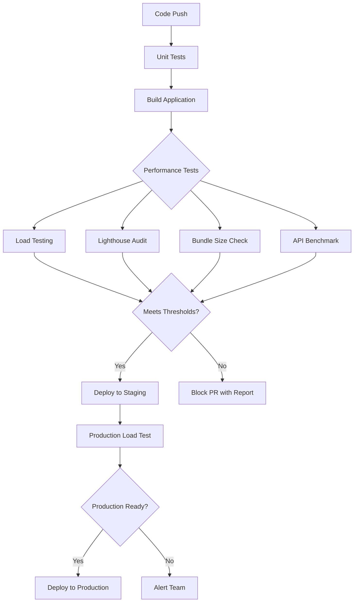

# How to Set Up Performance Testing in GitHub Actions

Author: [nawazdhandala](https://www.github.com/nawazdhandala)

Tags: GitHub Actions, CI/CD, Performance Testing, Load Testing, k6, Artillery, DevOps

Description: Learn how to set up automated performance testing in GitHub Actions using k6, Artillery, and Lighthouse to catch performance regressions before they reach production.

> Performance bugs are features bugs. Automated testing catches them before users do.

Performance testing should not be an afterthought or a manual process before major releases. Integrating performance tests into your CI/CD pipeline catches regressions early, establishes baselines, and gives teams confidence that changes do not degrade user experience. This guide covers setting up various types of performance testing in GitHub Actions.

## Performance Testing Strategy



## Load Testing with k6

k6 is a modern load testing tool that integrates well with CI/CD:

```yaml
name: Load Testing

on:
  push:
    branches: [main]
  pull_request:
    branches: [main]

jobs:
  load-test:
    runs-on: ubuntu-latest

    services:
      app:
        image: ghcr.io/${{ github.repository }}:${{ github.sha }}
        ports:
          - 3000:3000

    steps:
      - uses: actions/checkout@v4

      - name: Install k6
        run: |
          sudo gpg -k
          sudo gpg --no-default-keyring --keyring /usr/share/keyrings/k6-archive-keyring.gpg --keyserver hkp://keyserver.ubuntu.com:80 --recv-keys C5AD17C747E3415A3642D57D77C6C491D6AC1D69
          echo "deb [signed-by=/usr/share/keyrings/k6-archive-keyring.gpg] https://dl.k6.io/deb stable main" | sudo tee /etc/apt/sources.list.d/k6.list
          sudo apt-get update
          sudo apt-get install k6

      - name: Run load tests
        run: k6 run tests/performance/load-test.js --out json=results.json

      - name: Upload results
        uses: actions/upload-artifact@v4
        with:
          name: k6-results
          path: results.json
```

k6 test script example:

```javascript
// tests/performance/load-test.js
import http from 'k6/http';
import { check, sleep } from 'k6';

export const options = {
  stages: [
    { duration: '30s', target: 20 },   // Ramp up
    { duration: '1m', target: 20 },    // Stay at 20 users
    { duration: '30s', target: 0 },    // Ramp down
  ],
  thresholds: {
    http_req_duration: ['p(95)<500'],  // 95% of requests under 500ms
    http_req_failed: ['rate<0.01'],    // Less than 1% failures
  },
};

export default function () {
  const res = http.get('http://localhost:3000/api/health');

  check(res, {
    'status is 200': (r) => r.status === 200,
    'response time OK': (r) => r.timings.duration < 200,
  });

  sleep(1);
}
```

## k6 with Threshold Gates

Fail the build if performance degrades:

```yaml
name: Performance Gates

on:
  pull_request:
    branches: [main]

jobs:
  performance:
    runs-on: ubuntu-latest
    steps:
      - uses: actions/checkout@v4

      - name: Start application
        run: |
          docker compose up -d
          sleep 10

      - name: Install k6
        run: |
          curl -L https://github.com/grafana/k6/releases/download/v0.47.0/k6-v0.47.0-linux-amd64.tar.gz | tar xz
          sudo mv k6-v0.47.0-linux-amd64/k6 /usr/local/bin/

      - name: Run performance tests
        id: k6
        run: |
          k6 run tests/performance/api-benchmark.js \
            --summary-export=summary.json \
            2>&1 | tee k6-output.txt

          # Check if thresholds passed
          if grep -q "thresholds.*failed" k6-output.txt; then
            echo "passed=false" >> $GITHUB_OUTPUT
          else
            echo "passed=true" >> $GITHUB_OUTPUT
          fi

      - name: Comment on PR
        if: github.event_name == 'pull_request'
        uses: actions/github-script@v7
        with:
          script: |
            const fs = require('fs');
            const summary = JSON.parse(fs.readFileSync('summary.json', 'utf8'));

            const metrics = summary.metrics;
            const passed = '${{ steps.k6.outputs.passed }}' === 'true';

            const body = `## Performance Test Results ${passed ? ':white_check_mark:' : ':x:'}

            | Metric | Value | Threshold |
            |--------|-------|-----------|
            | Avg Response Time | ${metrics.http_req_duration.avg.toFixed(2)}ms | <500ms |
            | P95 Response Time | ${metrics.http_req_duration['p(95)'].toFixed(2)}ms | <500ms |
            | Request Rate | ${metrics.http_reqs.rate.toFixed(2)}/s | - |
            | Error Rate | ${(metrics.http_req_failed.rate * 100).toFixed(2)}% | <1% |

            ${!passed ? ':warning: Performance thresholds not met. Please investigate.' : ''}`;

            await github.rest.issues.createComment({
              owner: context.repo.owner,
              repo: context.repo.repo,
              issue_number: context.issue.number,
              body: body
            });

      - name: Fail if thresholds not met
        if: steps.k6.outputs.passed == 'false'
        run: exit 1
```

## Artillery Load Testing

Artillery is another popular option:

```yaml
name: Artillery Load Test

on:
  push:
    branches: [main]

jobs:
  artillery:
    runs-on: ubuntu-latest
    steps:
      - uses: actions/checkout@v4

      - uses: actions/setup-node@v4
        with:
          node-version: '20'

      - name: Install Artillery
        run: npm install -g artillery

      - name: Start application
        run: |
          npm ci
          npm start &
          sleep 10

      - name: Run load test
        run: |
          artillery run tests/performance/artillery.yml \
            --output report.json

      - name: Generate HTML report
        run: artillery report report.json --output report.html

      - name: Upload report
        uses: actions/upload-artifact@v4
        with:
          name: artillery-report
          path: |
            report.json
            report.html
```

Artillery configuration:

```yaml
# tests/performance/artillery.yml
config:
  target: 'http://localhost:3000'
  phases:
    - duration: 60
      arrivalRate: 10
      name: 'Warm up'
    - duration: 120
      arrivalRate: 50
      name: 'Sustained load'
    - duration: 60
      arrivalRate: 100
      name: 'Peak load'

  ensure:
    p95: 500
    maxErrorRate: 1

scenarios:
  - name: 'Browse and search'
    weight: 70
    flow:
      - get:
          url: '/api/products'
      - think: 1
      - get:
          url: '/api/products/search?q=test'

  - name: 'User workflow'
    weight: 30
    flow:
      - post:
          url: '/api/auth/login'
          json:
            email: 'test@example.com'
            password: 'password'
          capture:
            - json: '$.token'
              as: 'authToken'
      - get:
          url: '/api/user/profile'
          headers:
            Authorization: 'Bearer {{ authToken }}'
```

## Lighthouse Performance Audits

Automated frontend performance testing:

```yaml
name: Lighthouse CI

on:
  push:
    branches: [main]
  pull_request:
    branches: [main]

jobs:
  lighthouse:
    runs-on: ubuntu-latest
    steps:
      - uses: actions/checkout@v4

      - uses: actions/setup-node@v4
        with:
          node-version: '20'

      - name: Install dependencies
        run: npm ci

      - name: Build application
        run: npm run build

      - name: Start server
        run: npm run preview &

      - name: Wait for server
        run: npx wait-on http://localhost:4173

      - name: Run Lighthouse
        uses: treosh/lighthouse-ci-action@v11
        with:
          urls: |
            http://localhost:4173/
            http://localhost:4173/about
            http://localhost:4173/products
          budgetPath: ./lighthouse-budget.json
          uploadArtifacts: true

      - name: Check performance budget
        uses: actions/github-script@v7
        with:
          script: |
            const fs = require('fs');
            const results = JSON.parse(fs.readFileSync('.lighthouseci/manifest.json'));

            let passed = true;
            const summary = results.map(result => {
              const scores = result.summary;
              const url = new URL(result.url).pathname;

              if (scores.performance < 0.9) passed = false;
              if (scores.accessibility < 0.9) passed = false;

              return `| ${url} | ${Math.round(scores.performance * 100)} | ${Math.round(scores.accessibility * 100)} | ${Math.round(scores.seo * 100)} |`;
            }).join('\n');

            const body = `## Lighthouse Results ${passed ? ':white_check_mark:' : ':warning:'}

            | Page | Performance | Accessibility | SEO |
            |------|-------------|---------------|-----|
            ${summary}

            ${!passed ? ':warning: Some pages did not meet the performance budget.' : ''}`;

            if (context.issue?.number) {
              await github.rest.issues.createComment({
                owner: context.repo.owner,
                repo: context.repo.repo,
                issue_number: context.issue.number,
                body: body
              });
            }
```

Lighthouse budget configuration:

```json
[
  {
    "path": "/*",
    "timings": [
      { "metric": "first-contentful-paint", "budget": 2000 },
      { "metric": "largest-contentful-paint", "budget": 3000 },
      { "metric": "cumulative-layout-shift", "budget": 0.1 },
      { "metric": "total-blocking-time", "budget": 300 }
    ],
    "resourceSizes": [
      { "resourceType": "script", "budget": 300 },
      { "resourceType": "total", "budget": 1000 }
    ]
  }
]
```

## Bundle Size Tracking

Track JavaScript bundle size changes:

```yaml
name: Bundle Size

on:
  pull_request:
    branches: [main]

jobs:
  bundle-size:
    runs-on: ubuntu-latest
    steps:
      - uses: actions/checkout@v4

      - uses: actions/setup-node@v4
        with:
          node-version: '20'

      - run: npm ci
      - run: npm run build

      - name: Check bundle size
        uses: preactjs/compressed-size-action@v2
        with:
          repo-token: ${{ secrets.GITHUB_TOKEN }}
          pattern: './dist/**/*.{js,css}'
          exclude: '{**/*.map}'
```

## API Benchmark Testing

Benchmark specific API endpoints:

```yaml
name: API Benchmarks

on:
  push:
    branches: [main]

jobs:
  benchmark:
    runs-on: ubuntu-latest
    steps:
      - uses: actions/checkout@v4

      - name: Start application
        run: docker compose up -d && sleep 10

      - name: Install hyperfine
        run: |
          wget https://github.com/sharkdp/hyperfine/releases/download/v1.18.0/hyperfine_1.18.0_amd64.deb
          sudo dpkg -i hyperfine_1.18.0_amd64.deb

      - name: Run benchmarks
        run: |
          hyperfine \
            --warmup 3 \
            --runs 100 \
            --export-json benchmark.json \
            'curl -s http://localhost:3000/api/health' \
            'curl -s http://localhost:3000/api/products' \
            'curl -s http://localhost:3000/api/users/1'

      - name: Upload results
        uses: actions/upload-artifact@v4
        with:
          name: benchmark-results
          path: benchmark.json
```

## Performance Regression Detection

Compare against baseline performance:

```yaml
name: Performance Regression Check

on:
  pull_request:
    branches: [main]

jobs:
  baseline:
    runs-on: ubuntu-latest
    steps:
      - uses: actions/checkout@v4
        with:
          ref: main

      - name: Build and benchmark main
        run: |
          npm ci && npm run build
          npm start &
          sleep 5
          k6 run tests/perf.js --summary-export=baseline.json

      - uses: actions/upload-artifact@v4
        with:
          name: baseline
          path: baseline.json

  current:
    runs-on: ubuntu-latest
    steps:
      - uses: actions/checkout@v4

      - name: Build and benchmark PR
        run: |
          npm ci && npm run build
          npm start &
          sleep 5
          k6 run tests/perf.js --summary-export=current.json

      - uses: actions/upload-artifact@v4
        with:
          name: current
          path: current.json

  compare:
    needs: [baseline, current]
    runs-on: ubuntu-latest
    steps:
      - uses: actions/download-artifact@v4

      - name: Compare results
        uses: actions/github-script@v7
        with:
          script: |
            const fs = require('fs');
            const baseline = JSON.parse(fs.readFileSync('baseline/baseline.json'));
            const current = JSON.parse(fs.readFileSync('current/current.json'));

            const baselineP95 = baseline.metrics.http_req_duration['p(95)'];
            const currentP95 = current.metrics.http_req_duration['p(95)'];
            const diff = ((currentP95 - baselineP95) / baselineP95 * 100).toFixed(2);

            const regression = currentP95 > baselineP95 * 1.1; // 10% threshold

            const body = `## Performance Comparison

            | Metric | Baseline | Current | Change |
            |--------|----------|---------|--------|
            | P95 Response Time | ${baselineP95.toFixed(2)}ms | ${currentP95.toFixed(2)}ms | ${diff}% |

            ${regression ? ':warning: Performance regression detected!' : ':white_check_mark: Performance is acceptable.'}`;

            await github.rest.issues.createComment({
              owner: context.repo.owner,
              repo: context.repo.repo,
              issue_number: context.issue.number,
              body: body
            });

            if (regression) {
              core.setFailed('Performance regression detected');
            }
```

## Best Practices

1. **Set realistic thresholds** - Based on actual user expectations
2. **Test in isolation** - Dedicated resources for consistent results
3. **Warm up before measuring** - Avoid cold start penalties
4. **Track trends** - Single runs are noisy, trends are meaningful
5. **Test critical paths** - Focus on user-facing workflows
6. **Automate baseline updates** - Keep baselines current

## Conclusion

Performance testing in CI/CD catches regressions before they affect users. Start with simple load tests using k6 or Artillery, add Lighthouse for frontend performance, and implement bundle size tracking. The goal is fast feedback on performance changes with every commit.

Performance is a feature. Treat performance tests with the same importance as unit tests.
