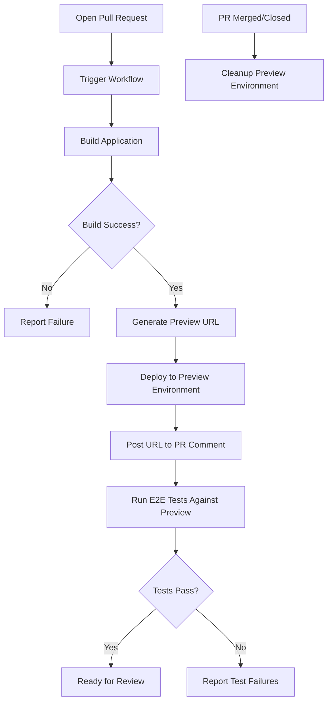

# How to Set Up Preview Deployments in GitHub Actions

Author: [nawazdhandala](https://www.github.com/nawazdhandala)

Tags: GitHub Actions, CI/CD, Preview Deployments, DevOps, Vercel, Netlify, Kubernetes

Description: Learn how to set up preview deployments in GitHub Actions to automatically deploy pull requests to unique URLs for testing and review before merging.

> Every pull request deserves its own live environment where reviewers can see exactly what will ship.

Preview deployments transform code review from reading diffs to clicking through actual changes. Instead of imagining how a PR will look in production, reviewers visit a unique URL and interact with the real application. This guide covers setting up preview deployments with GitHub Actions using various deployment targets.

## Why Preview Deployments Matter

Traditional code review involves reading code and hoping mental models are accurate. Preview deployments provide:

- **Visual verification** - See UI changes before merging
- **Stakeholder review** - Non-technical team members can provide feedback
- **Integration testing** - Test against real APIs and services
- **Confidence** - Catch issues before they reach production

## Preview Deployment Flow



## Basic Preview Deployment Workflow

Here is a foundational workflow that deploys to a cloud provider on every PR:

```yaml
# .github/workflows/preview.yml
name: Preview Deployment

on:
  pull_request:
    types: [opened, synchronize, reopened]

jobs:
  deploy-preview:
    runs-on: ubuntu-latest
    permissions:
      pull-requests: write
      contents: read

    steps:
      - name: Checkout code
        uses: actions/checkout@v4

      - name: Setup Node.js
        uses: actions/setup-node@v4
        with:
          node-version: '20'
          cache: 'npm'

      - name: Install dependencies
        run: npm ci

      - name: Build application
        run: npm run build
        env:
          VITE_API_URL: https://api-preview.example.com

      - name: Deploy to preview
        id: deploy
        run: |
          # Generate unique preview URL based on PR number
          PREVIEW_URL="https://pr-${{ github.event.pull_request.number }}.preview.example.com"
          echo "url=$PREVIEW_URL" >> $GITHUB_OUTPUT

          # Your deployment command here
          ./scripts/deploy-preview.sh ${{ github.event.pull_request.number }}

      - name: Comment on PR
        uses: actions/github-script@v7
        with:
          script: |
            const url = '${{ steps.deploy.outputs.url }}';
            const body = `## Preview Deployment Ready

            Your preview is live at: ${url}

            | Status | URL |
            |--------|-----|
            | Deployed | [Open Preview](${url}) |

            *Last updated: ${new Date().toISOString()}*`;

            // Find existing comment
            const comments = await github.rest.issues.listComments({
              owner: context.repo.owner,
              repo: context.repo.repo,
              issue_number: context.issue.number
            });

            const botComment = comments.data.find(c =>
              c.user.type === 'Bot' && c.body.includes('Preview Deployment')
            );

            if (botComment) {
              await github.rest.issues.updateComment({
                owner: context.repo.owner,
                repo: context.repo.repo,
                comment_id: botComment.id,
                body: body
              });
            } else {
              await github.rest.issues.createComment({
                owner: context.repo.owner,
                repo: context.repo.repo,
                issue_number: context.issue.number,
                body: body
              });
            }
```

## Vercel Preview Deployments

Vercel has built-in preview deployments, but you can enhance them with custom workflows:

```yaml
name: Vercel Preview

on:
  pull_request:
    types: [opened, synchronize]

env:
  VERCEL_ORG_ID: ${{ secrets.VERCEL_ORG_ID }}
  VERCEL_PROJECT_ID: ${{ secrets.VERCEL_PROJECT_ID }}

jobs:
  deploy:
    runs-on: ubuntu-latest
    steps:
      - uses: actions/checkout@v4

      - name: Install Vercel CLI
        run: npm install -g vercel@latest

      - name: Pull Vercel Environment
        run: vercel pull --yes --environment=preview --token=${{ secrets.VERCEL_TOKEN }}

      - name: Build Project
        run: vercel build --token=${{ secrets.VERCEL_TOKEN }}

      - name: Deploy Preview
        id: deploy
        run: |
          URL=$(vercel deploy --prebuilt --token=${{ secrets.VERCEL_TOKEN }})
          echo "url=$URL" >> $GITHUB_OUTPUT

      - name: Add deployment URL to PR
        uses: actions/github-script@v7
        with:
          script: |
            const url = '${{ steps.deploy.outputs.url }}';
            github.rest.issues.createComment({
              owner: context.repo.owner,
              repo: context.repo.repo,
              issue_number: context.issue.number,
              body: `Preview deployed to: ${url}`
            });
```

## Kubernetes Preview Deployments

For more complex applications, deploy to Kubernetes with unique namespaces per PR:

```yaml
name: Kubernetes Preview

on:
  pull_request:
    types: [opened, synchronize, reopened]
  pull_request_target:
    types: [closed]

jobs:
  deploy:
    if: github.event.action != 'closed'
    runs-on: ubuntu-latest
    steps:
      - uses: actions/checkout@v4

      - name: Set up Docker Buildx
        uses: docker/setup-buildx-action@v3

      - name: Login to Container Registry
        uses: docker/login-action@v3
        with:
          registry: ghcr.io
          username: ${{ github.actor }}
          password: ${{ secrets.GITHUB_TOKEN }}

      - name: Build and push image
        uses: docker/build-push-action@v5
        with:
          context: .
          push: true
          tags: ghcr.io/${{ github.repository }}:pr-${{ github.event.pull_request.number }}
          cache-from: type=gha
          cache-to: type=gha,mode=max

      - name: Setup kubectl
        uses: azure/setup-kubectl@v3

      - name: Configure kubeconfig
        run: |
          echo "${{ secrets.KUBECONFIG }}" | base64 -d > kubeconfig
          export KUBECONFIG=kubeconfig

      - name: Deploy to Kubernetes
        run: |
          PR_NUMBER=${{ github.event.pull_request.number }}
          NAMESPACE="preview-pr-${PR_NUMBER}"

          # Create namespace if it doesn't exist
          kubectl create namespace $NAMESPACE --dry-run=client -o yaml | kubectl apply -f -

          # Apply Kubernetes manifests
          cat <<EOF | kubectl apply -f -
          apiVersion: apps/v1
          kind: Deployment
          metadata:
            name: app
            namespace: $NAMESPACE
          spec:
            replicas: 1
            selector:
              matchLabels:
                app: preview
            template:
              metadata:
                labels:
                  app: preview
              spec:
                containers:
                - name: app
                  image: ghcr.io/${{ github.repository }}:pr-${PR_NUMBER}
                  ports:
                  - containerPort: 3000
          ---
          apiVersion: v1
          kind: Service
          metadata:
            name: app
            namespace: $NAMESPACE
          spec:
            selector:
              app: preview
            ports:
            - port: 80
              targetPort: 3000
          ---
          apiVersion: networking.k8s.io/v1
          kind: Ingress
          metadata:
            name: app
            namespace: $NAMESPACE
            annotations:
              cert-manager.io/cluster-issuer: letsencrypt
          spec:
            ingressClassName: nginx
            tls:
            - hosts:
              - pr-${PR_NUMBER}.preview.example.com
              secretName: preview-tls
            rules:
            - host: pr-${PR_NUMBER}.preview.example.com
              http:
                paths:
                - path: /
                  pathType: Prefix
                  backend:
                    service:
                      name: app
                      port:
                        number: 80
          EOF

      - name: Wait for deployment
        run: |
          kubectl rollout status deployment/app -n preview-pr-${{ github.event.pull_request.number }} --timeout=300s

      - name: Comment preview URL
        uses: actions/github-script@v7
        with:
          script: |
            const prNumber = context.payload.pull_request.number;
            const url = `https://pr-${prNumber}.preview.example.com`;

            await github.rest.issues.createComment({
              owner: context.repo.owner,
              repo: context.repo.repo,
              issue_number: prNumber,
              body: `## Kubernetes Preview Ready\n\nYour preview is deployed at: ${url}\n\nNamespace: \`preview-pr-${prNumber}\``
            });

  cleanup:
    if: github.event.action == 'closed'
    runs-on: ubuntu-latest
    steps:
      - name: Setup kubectl
        uses: azure/setup-kubectl@v3

      - name: Configure kubeconfig
        run: |
          echo "${{ secrets.KUBECONFIG }}" | base64 -d > kubeconfig
          export KUBECONFIG=kubeconfig

      - name: Delete preview namespace
        run: |
          kubectl delete namespace preview-pr-${{ github.event.pull_request.number }} --ignore-not-found
```

## Docker Compose Preview Deployments

For simpler setups, use Docker Compose on a preview server:

```yaml
name: Docker Compose Preview

on:
  pull_request:
    types: [opened, synchronize, reopened, closed]

jobs:
  deploy:
    if: github.event.action != 'closed'
    runs-on: ubuntu-latest
    steps:
      - uses: actions/checkout@v4

      - name: Deploy via SSH
        uses: appleboy/ssh-action@v1
        with:
          host: ${{ secrets.PREVIEW_SERVER_HOST }}
          username: ${{ secrets.PREVIEW_SERVER_USER }}
          key: ${{ secrets.PREVIEW_SERVER_SSH_KEY }}
          script: |
            PR_NUMBER=${{ github.event.pull_request.number }}
            PREVIEW_DIR="/opt/previews/pr-${PR_NUMBER}"

            # Clone or update repository
            if [ -d "$PREVIEW_DIR" ]; then
              cd $PREVIEW_DIR && git fetch && git checkout ${{ github.head_ref }} && git pull
            else
              git clone -b ${{ github.head_ref }} ${{ github.server_url }}/${{ github.repository }} $PREVIEW_DIR
            fi

            cd $PREVIEW_DIR

            # Create unique port mapping
            PORT=$((3000 + PR_NUMBER))

            # Deploy with Docker Compose
            PR_NUMBER=$PR_NUMBER PORT=$PORT docker compose -f docker-compose.preview.yml up -d --build

      - name: Comment preview URL
        uses: actions/github-script@v7
        with:
          script: |
            const prNumber = context.payload.pull_request.number;
            const port = 3000 + prNumber;
            const url = `http://preview.example.com:${port}`;

            await github.rest.issues.createComment({
              owner: context.repo.owner,
              repo: context.repo.repo,
              issue_number: prNumber,
              body: `Preview deployed: ${url}`
            });

  cleanup:
    if: github.event.action == 'closed'
    runs-on: ubuntu-latest
    steps:
      - name: Cleanup via SSH
        uses: appleboy/ssh-action@v1
        with:
          host: ${{ secrets.PREVIEW_SERVER_HOST }}
          username: ${{ secrets.PREVIEW_SERVER_USER }}
          key: ${{ secrets.PREVIEW_SERVER_SSH_KEY }}
          script: |
            PR_NUMBER=${{ github.event.pull_request.number }}
            PREVIEW_DIR="/opt/previews/pr-${PR_NUMBER}"

            if [ -d "$PREVIEW_DIR" ]; then
              cd $PREVIEW_DIR
              docker compose -f docker-compose.preview.yml down -v
              rm -rf $PREVIEW_DIR
            fi
```

## Running E2E Tests Against Preview

Once deployed, run end-to-end tests against the preview:

```yaml
name: Preview with E2E Tests

on:
  pull_request:
    types: [opened, synchronize]

jobs:
  deploy:
    runs-on: ubuntu-latest
    outputs:
      url: ${{ steps.deploy.outputs.url }}
    steps:
      - uses: actions/checkout@v4
      - name: Deploy preview
        id: deploy
        run: |
          # Your deployment logic
          echo "url=https://pr-${{ github.event.pull_request.number }}.preview.example.com" >> $GITHUB_OUTPUT

  e2e-tests:
    needs: deploy
    runs-on: ubuntu-latest
    steps:
      - uses: actions/checkout@v4

      - uses: actions/setup-node@v4
        with:
          node-version: '20'

      - name: Install Playwright
        run: |
          npm ci
          npx playwright install --with-deps chromium

      - name: Wait for preview to be ready
        run: |
          URL="${{ needs.deploy.outputs.url }}"
          echo "Waiting for $URL to be ready..."

          for i in {1..30}; do
            if curl -s -o /dev/null -w "%{http_code}" "$URL" | grep -q "200"; then
              echo "Preview is ready!"
              exit 0
            fi
            echo "Attempt $i: Preview not ready yet..."
            sleep 10
          done

          echo "Preview failed to become ready"
          exit 1

      - name: Run Playwright tests
        run: npx playwright test
        env:
          BASE_URL: ${{ needs.deploy.outputs.url }}

      - name: Upload test results
        if: always()
        uses: actions/upload-artifact@v4
        with:
          name: playwright-report
          path: playwright-report/
```

## GitHub Deployments API Integration

Use the GitHub Deployments API for better visibility:

```yaml
name: Preview with Deployments API

on:
  pull_request:
    types: [opened, synchronize]

jobs:
  deploy:
    runs-on: ubuntu-latest
    steps:
      - uses: actions/checkout@v4

      - name: Create deployment
        id: deployment
        uses: actions/github-script@v7
        with:
          script: |
            const deployment = await github.rest.repos.createDeployment({
              owner: context.repo.owner,
              repo: context.repo.repo,
              ref: context.payload.pull_request.head.sha,
              environment: `preview-pr-${context.payload.pull_request.number}`,
              auto_merge: false,
              required_contexts: []
            });
            return deployment.data.id;
          result-encoding: string

      - name: Deploy application
        id: deploy
        run: |
          # Your deployment logic
          echo "url=https://pr-${{ github.event.pull_request.number }}.preview.example.com" >> $GITHUB_OUTPUT

      - name: Update deployment status
        uses: actions/github-script@v7
        with:
          script: |
            await github.rest.repos.createDeploymentStatus({
              owner: context.repo.owner,
              repo: context.repo.repo,
              deployment_id: ${{ steps.deployment.outputs.result }},
              state: 'success',
              environment_url: '${{ steps.deploy.outputs.url }}',
              log_url: `${context.serverUrl}/${context.repo.owner}/${context.repo.repo}/actions/runs/${context.runId}`
            });
```

## Best Practices

1. **Unique URLs per PR** - Use PR number in the URL for easy identification
2. **Automatic cleanup** - Always clean up preview environments when PRs close
3. **Comment updates** - Update existing comments instead of creating new ones
4. **Wait for readiness** - Add health checks before running tests
5. **Use environments** - GitHub environments provide protection rules and secrets
6. **Resource limits** - Set limits on preview deployments to control costs
7. **Expiration** - Add TTL to preview environments for automatic cleanup

## Conclusion

Preview deployments bridge the gap between code review and production deployment. They give reviewers confidence, enable stakeholder feedback, and catch issues before they reach production. Start with a simple setup using Vercel or Netlify, then expand to Kubernetes or custom solutions as your needs grow.

The investment in preview deployments pays off immediately through better code reviews and fewer production issues.
