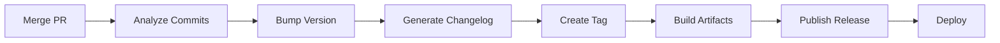

# How to Set Up Release Automation in GitHub Actions

Author: [nawazdhandala](https://www.github.com/nawazdhandala)

Tags: GitHub Actions, Release Automation, CI/CD, Semantic Versioning, DevOps, Changelog

Description: Learn how to automate releases with GitHub Actions using semantic versioning, automatic changelog generation, and multi-platform artifact publishing.

---

Manual releases are error-prone and time-consuming. Automated releases ensure consistent versioning, comprehensive changelogs, and reliable artifact publishing. GitHub Actions provides powerful primitives for end-to-end release automation.

## Release Automation Flow



## Semantic Release Setup

Use semantic-release for fully automated versioning:

```yaml
name: Release

on:
  push:
    branches: [main]

permissions:
  contents: write
  issues: write
  pull-requests: write

jobs:
  release:
    runs-on: ubuntu-latest
    steps:
      - uses: actions/checkout@v4
        with:
          fetch-depth: 0
          persist-credentials: false

      - uses: actions/setup-node@v4
        with:
          node-version: '20'

      - name: Install dependencies
        run: npm ci

      - name: Semantic Release
        env:
          GITHUB_TOKEN: ${{ secrets.GITHUB_TOKEN }}
          NPM_TOKEN: ${{ secrets.NPM_TOKEN }}
        run: npx semantic-release
```

Configure in `package.json`:

```json
{
  "release": {
    "branches": ["main"],
    "plugins": [
      "@semantic-release/commit-analyzer",
      "@semantic-release/release-notes-generator",
      "@semantic-release/changelog",
      "@semantic-release/npm",
      "@semantic-release/github",
      ["@semantic-release/git", {
        "assets": ["CHANGELOG.md", "package.json"],
        "message": "chore(release): ${nextRelease.version}"
      }]
    ]
  }
}
```

## Conventional Commits

Semantic versioning depends on commit message conventions:

```
feat: add user authentication       # Minor version bump (1.0.0 -> 1.1.0)
fix: resolve login timeout          # Patch version bump (1.0.0 -> 1.0.1)
feat!: redesign API endpoints       # Major version bump (1.0.0 -> 2.0.0)
BREAKING CHANGE: remove v1 API      # Major version bump
```

Enforce with commitlint:

```yaml
name: Lint Commits

on:
  pull_request:
    branches: [main]

jobs:
  commitlint:
    runs-on: ubuntu-latest
    steps:
      - uses: actions/checkout@v4
        with:
          fetch-depth: 0

      - uses: actions/setup-node@v4
        with:
          node-version: '20'

      - name: Install commitlint
        run: npm install @commitlint/cli @commitlint/config-conventional

      - name: Validate commits
        run: npx commitlint --from ${{ github.event.pull_request.base.sha }} --to ${{ github.event.pull_request.head.sha }}
```

## Tag-Based Releases

Trigger releases on version tags:

```yaml
name: Release

on:
  push:
    tags:
      - 'v*'

jobs:
  release:
    runs-on: ubuntu-latest
    permissions:
      contents: write
    steps:
      - uses: actions/checkout@v4

      - name: Build
        run: |
          npm ci
          npm run build

      - name: Create Release
        uses: softprops/action-gh-release@v2
        with:
          generate_release_notes: true
          files: |
            dist/*.zip
            dist/*.tar.gz
```

## Multi-Platform Build and Release

Build artifacts for multiple platforms:

```yaml
name: Release

on:
  push:
    tags:
      - 'v*'

jobs:
  build:
    strategy:
      matrix:
        include:
          - os: ubuntu-latest
            target: linux-x64
          - os: macos-latest
            target: darwin-x64
          - os: macos-latest
            target: darwin-arm64
          - os: windows-latest
            target: win-x64
    runs-on: ${{ matrix.os }}
    steps:
      - uses: actions/checkout@v4

      - uses: actions/setup-node@v4
        with:
          node-version: '20'

      - name: Build
        run: |
          npm ci
          npm run build:${{ matrix.target }}

      - name: Upload artifact
        uses: actions/upload-artifact@v4
        with:
          name: build-${{ matrix.target }}
          path: dist/

  release:
    needs: build
    runs-on: ubuntu-latest
    permissions:
      contents: write
    steps:
      - uses: actions/checkout@v4

      - name: Download all artifacts
        uses: actions/download-artifact@v4
        with:
          path: artifacts
          merge-multiple: true

      - name: Create Release
        uses: softprops/action-gh-release@v2
        with:
          files: artifacts/*
          generate_release_notes: true
```

## Changelog Generation

Generate changelogs automatically from commits:

```yaml
jobs:
  changelog:
    runs-on: ubuntu-latest
    steps:
      - uses: actions/checkout@v4
        with:
          fetch-depth: 0

      - name: Generate Changelog
        uses: orhun/git-cliff-action@v3
        with:
          config: cliff.toml
          args: --verbose
        env:
          OUTPUT: CHANGELOG.md

      - name: Commit changelog
        run: |
          git config user.name github-actions
          git config user.email github-actions@github.com
          git add CHANGELOG.md
          git commit -m "docs: update changelog" || true
          git push
```

Configure `cliff.toml`:

```toml
[changelog]
header = "# Changelog\n\n"
body = """

## {{ group }}

- {{ commit.message | upper_first }} ({{ commit.id | truncate(length=7, end="") }})


"""
trim = true

[git]
conventional_commits = true
filter_unconventional = true
commit_parsers = [
    { message = "^feat", group = "Features" },
    { message = "^fix", group = "Bug Fixes" },
    { message = "^doc", group = "Documentation" },
    { message = "^perf", group = "Performance" },
    { message = "^refactor", group = "Refactor" },
]
```

## Release Please

Google's release-please automates releases with Release PRs:

```yaml
name: Release Please

on:
  push:
    branches: [main]

permissions:
  contents: write
  pull-requests: write

jobs:
  release-please:
    runs-on: ubuntu-latest
    outputs:
      release_created: ${{ steps.release.outputs.release_created }}
      tag_name: ${{ steps.release.outputs.tag_name }}
    steps:
      - uses: google-github-actions/release-please-action@v4
        id: release
        with:
          release-type: node

  publish:
    needs: release-please
    if: needs.release-please.outputs.release_created
    runs-on: ubuntu-latest
    steps:
      - uses: actions/checkout@v4

      - uses: actions/setup-node@v4
        with:
          node-version: '20'
          registry-url: 'https://registry.npmjs.org'

      - run: npm ci
      - run: npm publish
        env:
          NODE_AUTH_TOKEN: ${{ secrets.NPM_TOKEN }}
```

## Docker Image Release

Publish Docker images with release tags:

```yaml
name: Release Docker

on:
  release:
    types: [published]

jobs:
  docker:
    runs-on: ubuntu-latest
    permissions:
      contents: read
      packages: write
    steps:
      - uses: actions/checkout@v4

      - uses: docker/setup-buildx-action@v3

      - uses: docker/login-action@v3
        with:
          registry: ghcr.io
          username: ${{ github.actor }}
          password: ${{ secrets.GITHUB_TOKEN }}

      - name: Extract metadata
        id: meta
        uses: docker/metadata-action@v5
        with:
          images: ghcr.io/${{ github.repository }}
          tags: |
            type=semver,pattern={{version}}
            type=semver,pattern={{major}}.{{minor}}
            type=semver,pattern={{major}}

      - uses: docker/build-push-action@v5
        with:
          push: true
          tags: ${{ steps.meta.outputs.tags }}
          labels: ${{ steps.meta.outputs.labels }}
          cache-from: type=gha
          cache-to: type=gha,mode=max
```

## Complete Release Pipeline

```yaml
name: Release

on:
  push:
    branches: [main]

permissions:
  contents: write
  pull-requests: write
  packages: write

jobs:
  release:
    runs-on: ubuntu-latest
    outputs:
      released: ${{ steps.semantic.outputs.new_release_published }}
      version: ${{ steps.semantic.outputs.new_release_version }}
    steps:
      - uses: actions/checkout@v4
        with:
          fetch-depth: 0

      - uses: actions/setup-node@v4
        with:
          node-version: '20'

      - run: npm ci

      - name: Semantic Release
        id: semantic
        uses: cycjimmy/semantic-release-action@v4
        env:
          GITHUB_TOKEN: ${{ secrets.GITHUB_TOKEN }}
          NPM_TOKEN: ${{ secrets.NPM_TOKEN }}

  build-binaries:
    needs: release
    if: needs.release.outputs.released == 'true'
    strategy:
      matrix:
        include:
          - os: ubuntu-latest
            artifact: linux
          - os: macos-latest
            artifact: macos
          - os: windows-latest
            artifact: windows
    runs-on: ${{ matrix.os }}
    steps:
      - uses: actions/checkout@v4
        with:
          ref: v${{ needs.release.outputs.version }}

      - uses: actions/setup-node@v4
        with:
          node-version: '20'

      - run: npm ci
      - run: npm run build

      - uses: actions/upload-artifact@v4
        with:
          name: ${{ matrix.artifact }}
          path: dist/

  upload-assets:
    needs: [release, build-binaries]
    runs-on: ubuntu-latest
    steps:
      - uses: actions/download-artifact@v4
        with:
          path: artifacts

      - name: Upload to release
        uses: softprops/action-gh-release@v2
        with:
          tag_name: v${{ needs.release.outputs.version }}
          files: artifacts/**/*

  docker:
    needs: release
    if: needs.release.outputs.released == 'true'
    runs-on: ubuntu-latest
    steps:
      - uses: actions/checkout@v4
        with:
          ref: v${{ needs.release.outputs.version }}

      - uses: docker/setup-buildx-action@v3

      - uses: docker/login-action@v3
        with:
          registry: ghcr.io
          username: ${{ github.actor }}
          password: ${{ secrets.GITHUB_TOKEN }}

      - uses: docker/build-push-action@v5
        with:
          push: true
          tags: |
            ghcr.io/${{ github.repository }}:${{ needs.release.outputs.version }}
            ghcr.io/${{ github.repository }}:latest
```

## Release Notifications

Notify team on successful releases:

```yaml
  notify:
    needs: [release, docker]
    if: needs.release.outputs.released == 'true'
    runs-on: ubuntu-latest
    steps:
      - name: Slack notification
        uses: slackapi/slack-github-action@v1
        with:
          payload: |
            {
              "text": "Released v${{ needs.release.outputs.version }}",
              "blocks": [
                {
                  "type": "section",
                  "text": {
                    "type": "mrkdwn",
                    "text": "*New Release*: v${{ needs.release.outputs.version }}\n<${{ github.server_url }}/${{ github.repository }}/releases/tag/v${{ needs.release.outputs.version }}|View Release>"
                  }
                }
              ]
            }
        env:
          SLACK_WEBHOOK_URL: ${{ secrets.SLACK_WEBHOOK }}
```

---

Automated releases eliminate human error and ensure every release follows the same rigorous process. Start with semantic-release or release-please for automatic versioning, add multi-platform builds for broader distribution, and integrate notifications to keep your team informed.
