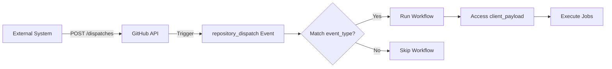
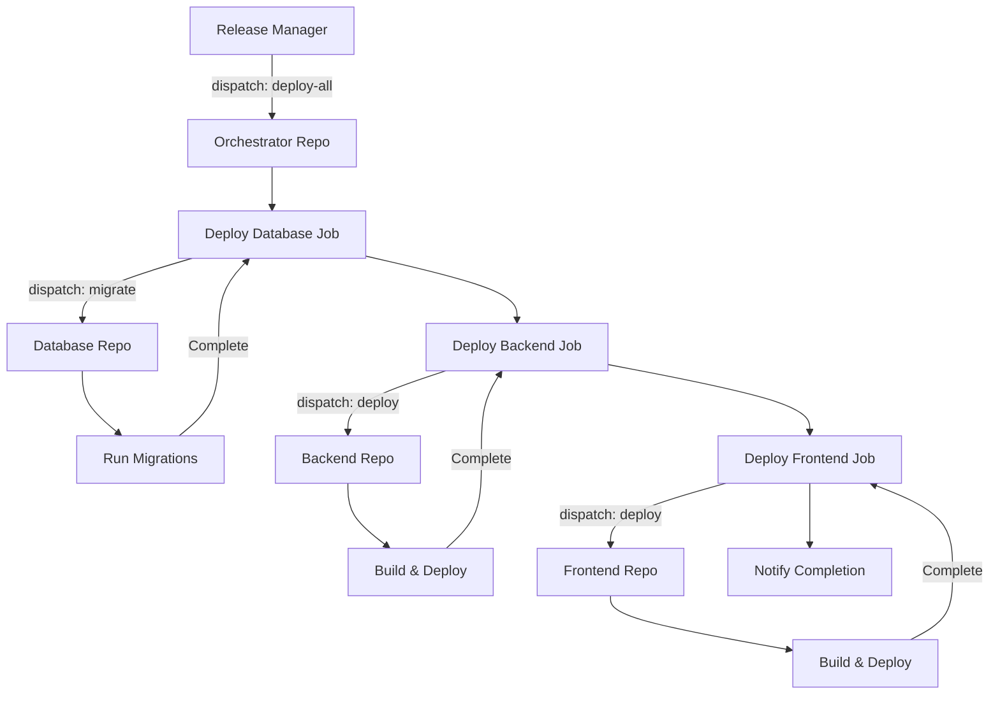

# How to Use Repository Dispatch in GitHub Actions

Author: [nawazdhandala](https://www.github.com/nawazdhandala)

Tags: GitHub Actions, CI/CD, Repository Dispatch, Webhooks, Automation, DevOps

Description: Learn how to use repository dispatch events in GitHub Actions to trigger workflows from external systems, other repositories, or custom automation scripts.

> Repository dispatch turns your GitHub Actions into an API - callable from anywhere, anytime.

While most GitHub Actions workflows trigger on code changes or schedules, repository dispatch enables external systems to trigger workflows on demand. This opens powerful automation possibilities: trigger deployments from Slack, run tests when dependencies update, or coordinate workflows across multiple repositories. This guide covers everything from basic dispatch events to complex cross-repository orchestration.

## Understanding Repository Dispatch

Repository dispatch is a webhook that triggers the `repository_dispatch` event. Any system with a GitHub token can send this event to trigger workflows. The event includes:

- **Event type** - A custom string identifying the type of event
- **Client payload** - JSON data passed to the workflow



## Basic Repository Dispatch Workflow

Create a workflow that responds to dispatch events:

```yaml
# .github/workflows/dispatch.yml
name: Repository Dispatch Handler

on:
  repository_dispatch:
    types: [deploy, test, build]

jobs:
  handle-dispatch:
    runs-on: ubuntu-latest
    steps:
      - name: Checkout code
        uses: actions/checkout@v4

      - name: Show event information
        run: |
          echo "Event type: ${{ github.event.action }}"
          echo "Client payload: ${{ toJson(github.event.client_payload) }}"

      - name: Handle deploy event
        if: github.event.action == 'deploy'
        run: |
          echo "Deploying to ${{ github.event.client_payload.environment }}"
          echo "Version: ${{ github.event.client_payload.version }}"

      - name: Handle test event
        if: github.event.action == 'test'
        run: |
          echo "Running tests for ${{ github.event.client_payload.branch }}"
```

## Triggering Dispatch Events

### Using curl

```bash
# Trigger a deploy event
curl -X POST \
  -H "Accept: application/vnd.github.v3+json" \
  -H "Authorization: token $GITHUB_TOKEN" \
  https://api.github.com/repos/owner/repo/dispatches \
  -d '{
    "event_type": "deploy",
    "client_payload": {
      "environment": "production",
      "version": "1.2.3",
      "triggered_by": "ops-team"
    }
  }'
```

### Using GitHub CLI

```bash
gh api repos/owner/repo/dispatches \
  -f event_type=deploy \
  -f client_payload='{"environment": "staging", "version": "1.2.3"}'
```

### Using Python

```python
import requests
import os

def trigger_dispatch(repo, event_type, payload):
    token = os.environ['GITHUB_TOKEN']
    url = f"https://api.github.com/repos/{repo}/dispatches"

    headers = {
        "Accept": "application/vnd.github.v3+json",
        "Authorization": f"token {token}"
    }

    data = {
        "event_type": event_type,
        "client_payload": payload
    }

    response = requests.post(url, headers=headers, json=data)

    if response.status_code == 204:
        print(f"Successfully triggered {event_type}")
    else:
        print(f"Failed: {response.status_code} - {response.text}")

# Usage
trigger_dispatch(
    "myorg/myrepo",
    "deploy",
    {"environment": "production", "version": "2.0.0"}
)
```

### From Another GitHub Action

```yaml
name: Trigger Downstream Deploy

on:
  push:
    tags:
      - 'v*'

jobs:
  trigger-deploy:
    runs-on: ubuntu-latest
    steps:
      - name: Trigger deployment workflow
        uses: actions/github-script@v7
        with:
          github-token: ${{ secrets.DISPATCH_TOKEN }}
          script: |
            await github.rest.repos.createDispatchEvent({
              owner: 'myorg',
              repo: 'infrastructure',
              event_type: 'deploy-app',
              client_payload: {
                app: '${{ github.repository }}',
                version: '${{ github.ref_name }}',
                sha: '${{ github.sha }}'
              }
            });
```

## Cross-Repository Workflow Orchestration

Coordinate deployments across multiple repositories:

```yaml
# In: infrastructure/workflows/orchestrate.yml
name: Orchestrated Deployment

on:
  repository_dispatch:
    types: [deploy-all]

jobs:
  deploy-database:
    runs-on: ubuntu-latest
    steps:
      - name: Trigger database migration
        uses: actions/github-script@v7
        with:
          github-token: ${{ secrets.DISPATCH_TOKEN }}
          script: |
            await github.rest.repos.createDispatchEvent({
              owner: context.repo.owner,
              repo: 'database',
              event_type: 'migrate',
              client_payload: {
                version: '${{ github.event.client_payload.version }}',
                correlation_id: '${{ github.run_id }}'
              }
            });

  deploy-backend:
    needs: deploy-database
    runs-on: ubuntu-latest
    steps:
      - name: Trigger backend deployment
        uses: actions/github-script@v7
        with:
          github-token: ${{ secrets.DISPATCH_TOKEN }}
          script: |
            await github.rest.repos.createDispatchEvent({
              owner: context.repo.owner,
              repo: 'backend',
              event_type: 'deploy',
              client_payload: {
                version: '${{ github.event.client_payload.version }}',
                environment: '${{ github.event.client_payload.environment }}'
              }
            });

  deploy-frontend:
    needs: deploy-backend
    runs-on: ubuntu-latest
    steps:
      - name: Trigger frontend deployment
        uses: actions/github-script@v7
        with:
          github-token: ${{ secrets.DISPATCH_TOKEN }}
          script: |
            await github.rest.repos.createDispatchEvent({
              owner: context.repo.owner,
              repo: 'frontend',
              event_type: 'deploy',
              client_payload: {
                version: '${{ github.event.client_payload.version }}',
                backend_url: 'https://api.example.com'
              }
            });
```

## Orchestration Architecture



## Slack-Triggered Deployments

Create a Slack command that triggers deployments:

```yaml
# .github/workflows/slack-deploy.yml
name: Slack Deployment

on:
  repository_dispatch:
    types: [slack-deploy]

jobs:
  validate:
    runs-on: ubuntu-latest
    outputs:
      authorized: ${{ steps.check.outputs.authorized }}
    steps:
      - name: Check authorization
        id: check
        run: |
          # Check if user is authorized to deploy
          ALLOWED_USERS="user1,user2,user3"
          REQUESTING_USER="${{ github.event.client_payload.slack_user }}"

          if [[ "$ALLOWED_USERS" == *"$REQUESTING_USER"* ]]; then
            echo "authorized=true" >> $GITHUB_OUTPUT
          else
            echo "authorized=false" >> $GITHUB_OUTPUT
          fi

  deploy:
    needs: validate
    if: needs.validate.outputs.authorized == 'true'
    runs-on: ubuntu-latest
    steps:
      - uses: actions/checkout@v4

      - name: Deploy to environment
        run: |
          echo "Deploying to ${{ github.event.client_payload.environment }}"
          ./scripts/deploy.sh ${{ github.event.client_payload.environment }}

      - name: Notify Slack
        run: |
          curl -X POST "${{ github.event.client_payload.response_url }}" \
            -H "Content-Type: application/json" \
            -d '{
              "text": "Deployment to ${{ github.event.client_payload.environment }} completed successfully!"
            }'

  unauthorized:
    needs: validate
    if: needs.validate.outputs.authorized == 'false'
    runs-on: ubuntu-latest
    steps:
      - name: Notify unauthorized
        run: |
          curl -X POST "${{ github.event.client_payload.response_url }}" \
            -H "Content-Type: application/json" \
            -d '{
              "text": "Sorry, you are not authorized to deploy."
            }'
```

## Webhook Integration

Build a webhook receiver that triggers dispatch events:

```javascript
// webhook-server.js
const express = require('express');
const crypto = require('crypto');
const { Octokit } = require('@octokit/rest');

const app = express();
app.use(express.json());

const octokit = new Octokit({ auth: process.env.GITHUB_TOKEN });

// Verify webhook signature
function verifySignature(req, secret) {
  const signature = req.headers['x-hub-signature-256'];
  const payload = JSON.stringify(req.body);
  const hmac = crypto.createHmac('sha256', secret);
  const digest = 'sha256=' + hmac.update(payload).digest('hex');
  return crypto.timingSafeEqual(Buffer.from(signature), Buffer.from(digest));
}

// Handle incoming webhooks
app.post('/webhook', async (req, res) => {
  if (!verifySignature(req, process.env.WEBHOOK_SECRET)) {
    return res.status(401).send('Invalid signature');
  }

  const { event, data } = req.body;

  try {
    await octokit.repos.createDispatchEvent({
      owner: 'myorg',
      repo: 'myrepo',
      event_type: event,
      client_payload: data
    });

    res.status(200).json({ message: 'Dispatch triggered' });
  } catch (error) {
    res.status(500).json({ error: error.message });
  }
});

app.listen(3000, () => console.log('Webhook server running'));
```

## Handling Dispatch with Dynamic Checkout

Dispatch events can specify which ref to checkout:

```yaml
name: Dynamic Ref Dispatch

on:
  repository_dispatch:
    types: [build-ref]

jobs:
  build:
    runs-on: ubuntu-latest
    steps:
      - name: Checkout specified ref
        uses: actions/checkout@v4
        with:
          ref: ${{ github.event.client_payload.ref || 'main' }}

      - name: Build
        run: |
          echo "Building ref: ${{ github.event.client_payload.ref }}"
          npm ci
          npm run build
```

## Chaining Workflows with Callbacks

Implement callback patterns for workflow coordination:

```yaml
# In: service-a/workflows/build.yml
name: Build with Callback

on:
  repository_dispatch:
    types: [build]

jobs:
  build:
    runs-on: ubuntu-latest
    steps:
      - uses: actions/checkout@v4

      - name: Build application
        id: build
        run: |
          npm ci
          npm run build
          echo "artifact_url=https://artifacts.example.com/build-${{ github.run_id }}" >> $GITHUB_OUTPUT

      - name: Send callback on success
        if: success()
        uses: actions/github-script@v7
        with:
          github-token: ${{ secrets.DISPATCH_TOKEN }}
          script: |
            const callbackRepo = '${{ github.event.client_payload.callback_repo }}';
            if (callbackRepo) {
              const [owner, repo] = callbackRepo.split('/');
              await github.rest.repos.createDispatchEvent({
                owner,
                repo,
                event_type: 'build-complete',
                client_payload: {
                  source_repo: '${{ github.repository }}',
                  status: 'success',
                  artifact_url: '${{ steps.build.outputs.artifact_url }}',
                  correlation_id: '${{ github.event.client_payload.correlation_id }}'
                }
              });
            }

      - name: Send callback on failure
        if: failure()
        uses: actions/github-script@v7
        with:
          github-token: ${{ secrets.DISPATCH_TOKEN }}
          script: |
            const callbackRepo = '${{ github.event.client_payload.callback_repo }}';
            if (callbackRepo) {
              const [owner, repo] = callbackRepo.split('/');
              await github.rest.repos.createDispatchEvent({
                owner,
                repo,
                event_type: 'build-complete',
                client_payload: {
                  source_repo: '${{ github.repository }}',
                  status: 'failure',
                  run_url: '${{ github.server_url }}/${{ github.repository }}/actions/runs/${{ github.run_id }}',
                  correlation_id: '${{ github.event.client_payload.correlation_id }}'
                }
              });
            }
```

## Security Considerations

### Token Permissions

Create a fine-grained personal access token with minimal permissions:

```yaml
# Required permissions for dispatch
# - Repository: Contents (read)
# - Repository: Actions (write)
```

### Payload Validation

Always validate incoming payloads:

```yaml
jobs:
  validate:
    runs-on: ubuntu-latest
    steps:
      - name: Validate payload
        run: |
          # Check required fields exist
          if [ -z "${{ github.event.client_payload.environment }}" ]; then
            echo "Error: environment is required"
            exit 1
          fi

          # Validate environment value
          VALID_ENVS="staging production"
          ENV="${{ github.event.client_payload.environment }}"
          if [[ ! "$VALID_ENVS" =~ "$ENV" ]]; then
            echo "Error: Invalid environment: $ENV"
            exit 1
          fi
```

## Best Practices

1. **Use descriptive event types** - `deploy-production` is better than `deploy`
2. **Include correlation IDs** - Track related events across systems
3. **Validate payloads** - Never trust external input
4. **Use fine-grained tokens** - Minimize token permissions
5. **Implement callbacks** - Let callers know when workflows complete
6. **Log dispatch events** - Maintain audit trail of who triggered what
7. **Set timeouts** - Prevent hanging workflows

## Conclusion

Repository dispatch transforms GitHub Actions from a CI/CD tool into a flexible automation platform. You can trigger workflows from any system - Slack bots, monitoring alerts, other repositories, or custom applications. Start with simple dispatch events, then build toward coordinated multi-repository workflows.

The key is treating dispatch events as an API contract. Document your event types and payload schemas so external systems can integrate reliably.
