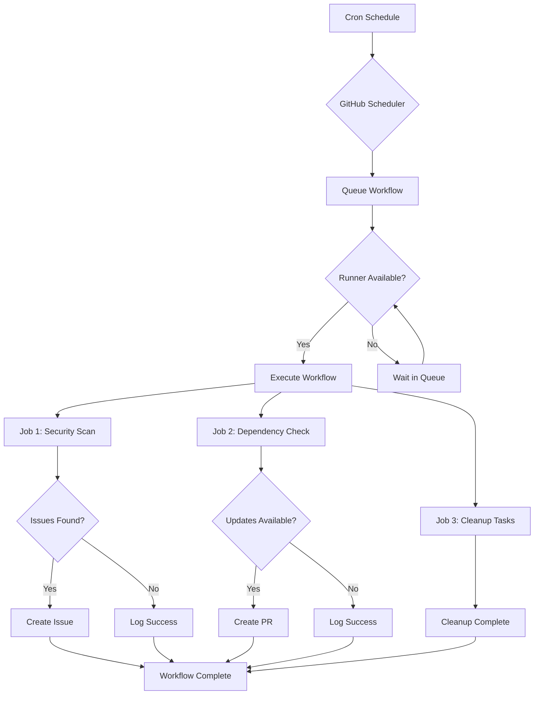

# How to Use Scheduled Workflows (Cron) in GitHub Actions

Author: [nawazdhandala](https://www.github.com/nawazdhandala)

Tags: GitHub Actions, CI/CD, Cron, Scheduled Workflows, Automation, DevOps

Description: Learn how to use scheduled workflows with cron expressions in GitHub Actions to automate recurring tasks like dependency updates, security scans, and report generation.

> Automation that runs while you sleep is the highest leverage investment in your CI/CD pipeline.

Not all CI/CD tasks should be triggered by code changes. Security scans, dependency updates, database cleanups, and report generation often need to run on a schedule. GitHub Actions provides the `schedule` trigger with cron syntax to automate these recurring tasks. This guide covers everything from basic cron syntax to production-ready scheduled workflows.

## Understanding Cron Syntax

GitHub Actions uses standard cron syntax with five fields:

```
* * * * *
| | | | |
| | | | +-- Day of week (0-6, Sunday=0)
| | | +---- Month (1-12)
| | +------ Day of month (1-31)
| +-------- Hour (0-23, UTC)
+---------- Minute (0-59)
```

Common patterns:

| Pattern | Description |
|---------|-------------|
| `0 0 * * *` | Daily at midnight UTC |
| `0 */6 * * *` | Every 6 hours |
| `30 4 * * 1-5` | Weekdays at 4:30 AM UTC |
| `0 9 * * 1` | Every Monday at 9 AM UTC |
| `0 0 1 * *` | First day of every month |

## Basic Scheduled Workflow

Here is a simple workflow that runs daily:

```yaml
# .github/workflows/daily-tasks.yml
name: Daily Tasks

on:
  schedule:
    # Run at 6 AM UTC every day
    - cron: '0 6 * * *'
  # Allow manual trigger for testing
  workflow_dispatch:

jobs:
  daily-security-scan:
    runs-on: ubuntu-latest
    steps:
      - name: Checkout code
        uses: actions/checkout@v4

      - name: Run security scan
        run: |
          npm audit --audit-level=high
          echo "Security scan completed at $(date)"
```

Always include `workflow_dispatch` alongside scheduled triggers. This lets you test the workflow manually without waiting for the schedule.

## Scheduled Workflow Architecture



## Multiple Schedules

You can define multiple schedules for different purposes:

```yaml
name: Scheduled Maintenance

on:
  schedule:
    # Security scan - daily at 2 AM
    - cron: '0 2 * * *'
    # Full dependency audit - weekly on Sunday
    - cron: '0 3 * * 0'
    # Performance benchmark - every 6 hours
    - cron: '0 */6 * * *'
  workflow_dispatch:

jobs:
  determine-task:
    runs-on: ubuntu-latest
    outputs:
      task: ${{ steps.check.outputs.task }}
    steps:
      - name: Determine which task to run
        id: check
        run: |
          HOUR=$(date -u +%H)
          DAY=$(date -u +%u)

          if [[ "$DAY" == "7" && "$HOUR" == "03" ]]; then
            echo "task=full-audit" >> $GITHUB_OUTPUT
          elif [[ "$HOUR" == "02" ]]; then
            echo "task=security-scan" >> $GITHUB_OUTPUT
          else
            echo "task=benchmark" >> $GITHUB_OUTPUT
          fi

  security-scan:
    needs: determine-task
    if: needs.determine-task.outputs.task == 'security-scan'
    runs-on: ubuntu-latest
    steps:
      - uses: actions/checkout@v4
      - run: npm audit

  full-audit:
    needs: determine-task
    if: needs.determine-task.outputs.task == 'full-audit'
    runs-on: ubuntu-latest
    steps:
      - uses: actions/checkout@v4
      - run: |
          npm audit
          npm outdated
          npx depcheck

  benchmark:
    needs: determine-task
    if: needs.determine-task.outputs.task == 'benchmark'
    runs-on: ubuntu-latest
    steps:
      - uses: actions/checkout@v4
      - run: npm run benchmark
```

## Automated Dependency Updates

Schedule dependency checks and create PRs for updates:

```yaml
name: Dependency Updates

on:
  schedule:
    - cron: '0 9 * * 1'  # Every Monday at 9 AM UTC
  workflow_dispatch:

jobs:
  check-updates:
    runs-on: ubuntu-latest
    steps:
      - uses: actions/checkout@v4

      - uses: actions/setup-node@v4
        with:
          node-version: '20'

      - name: Check for updates
        id: updates
        run: |
          npm outdated --json > outdated.json || true
          if [ -s outdated.json ]; then
            echo "has_updates=true" >> $GITHUB_OUTPUT
          else
            echo "has_updates=false" >> $GITHUB_OUTPUT
          fi

      - name: Update dependencies
        if: steps.updates.outputs.has_updates == 'true'
        run: |
          npm update
          npm audit fix || true

      - name: Create Pull Request
        if: steps.updates.outputs.has_updates == 'true'
        uses: peter-evans/create-pull-request@v6
        with:
          token: ${{ secrets.GITHUB_TOKEN }}
          commit-message: 'chore: update dependencies'
          title: 'chore: weekly dependency updates'
          body: |
            Automated dependency updates from scheduled workflow.

            Run `npm outdated` locally to see the changes.
          branch: automated/dependency-updates
          delete-branch: true
```

## Scheduled Security Scanning

Run comprehensive security scans on a schedule:

```yaml
name: Security Scan

on:
  schedule:
    - cron: '0 4 * * *'  # Daily at 4 AM UTC
  workflow_dispatch:

jobs:
  security-scan:
    runs-on: ubuntu-latest
    steps:
      - uses: actions/checkout@v4

      - name: Run Trivy vulnerability scanner
        uses: aquasecurity/trivy-action@master
        with:
          scan-type: 'fs'
          scan-ref: '.'
          format: 'sarif'
          output: 'trivy-results.sarif'

      - name: Upload Trivy scan results
        uses: github/codeql-action/upload-sarif@v3
        with:
          sarif_file: 'trivy-results.sarif'

      - name: Check for critical vulnerabilities
        id: check
        run: |
          CRITICAL=$(cat trivy-results.sarif | jq '.runs[0].results | map(select(.level == "error")) | length')
          if [ "$CRITICAL" -gt 0 ]; then
            echo "critical_found=true" >> $GITHUB_OUTPUT
            echo "Found $CRITICAL critical vulnerabilities"
          else
            echo "critical_found=false" >> $GITHUB_OUTPUT
          fi

      - name: Create issue for critical vulnerabilities
        if: steps.check.outputs.critical_found == 'true'
        uses: actions/github-script@v7
        with:
          script: |
            const title = `Security Alert: Critical vulnerabilities found - ${new Date().toISOString().split('T')[0]}`;
            const body = `The daily security scan found critical vulnerabilities.

            Please review the [Security tab](/${context.repo.owner}/${context.repo.repo}/security/code-scanning) for details.

            This issue was created automatically by the scheduled security scan.`;

            await github.rest.issues.create({
              owner: context.repo.owner,
              repo: context.repo.repo,
              title: title,
              body: body,
              labels: ['security', 'automated']
            });
```

## Database and Cleanup Tasks

Schedule cleanup jobs for maintenance:

```yaml
name: Scheduled Cleanup

on:
  schedule:
    - cron: '0 3 * * 0'  # Weekly on Sunday at 3 AM UTC
  workflow_dispatch:

jobs:
  cleanup-artifacts:
    runs-on: ubuntu-latest
    steps:
      - name: Delete old workflow runs
        uses: actions/github-script@v7
        with:
          script: |
            const days = 30;
            const cutoff = new Date();
            cutoff.setDate(cutoff.getDate() - days);

            const runs = await github.rest.actions.listWorkflowRunsForRepo({
              owner: context.repo.owner,
              repo: context.repo.repo,
              per_page: 100
            });

            let deleted = 0;
            for (const run of runs.data.workflow_runs) {
              if (new Date(run.created_at) < cutoff) {
                await github.rest.actions.deleteWorkflowRun({
                  owner: context.repo.owner,
                  repo: context.repo.repo,
                  run_id: run.id
                });
                deleted++;
              }
            }

            console.log(`Deleted ${deleted} old workflow runs`);

  cleanup-caches:
    runs-on: ubuntu-latest
    steps:
      - name: Cleanup old caches
        uses: actions/github-script@v7
        with:
          script: |
            const caches = await github.rest.actions.getActionsCacheList({
              owner: context.repo.owner,
              repo: context.repo.repo
            });

            const cutoff = new Date();
            cutoff.setDate(cutoff.getDate() - 7);

            for (const cache of caches.data.actions_caches) {
              if (new Date(cache.last_accessed_at) < cutoff) {
                await github.rest.actions.deleteActionsCacheById({
                  owner: context.repo.owner,
                  repo: context.repo.repo,
                  cache_id: cache.id
                });
                console.log(`Deleted cache: ${cache.key}`);
              }
            }
```

## Scheduled Reports

Generate and send reports on a schedule:

```yaml
name: Weekly Report

on:
  schedule:
    - cron: '0 8 * * 1'  # Every Monday at 8 AM UTC
  workflow_dispatch:

jobs:
  generate-report:
    runs-on: ubuntu-latest
    steps:
      - uses: actions/checkout@v4

      - name: Generate metrics report
        id: report
        run: |
          # Get repository statistics
          echo "## Weekly Repository Report" > report.md
          echo "" >> report.md
          echo "Generated: $(date -u)" >> report.md
          echo "" >> report.md

          # Count commits this week
          COMMITS=$(git log --oneline --since="7 days ago" | wc -l)
          echo "- Commits this week: $COMMITS" >> report.md

          # Count contributors
          CONTRIBUTORS=$(git log --since="7 days ago" --format='%ae' | sort -u | wc -l)
          echo "- Active contributors: $CONTRIBUTORS" >> report.md

          # Lines of code
          LOC=$(find . -name "*.js" -o -name "*.ts" | xargs wc -l | tail -1 | awk '{print $1}')
          echo "- Lines of code: $LOC" >> report.md

          cat report.md

          # Save for later steps
          echo "report<<EOF" >> $GITHUB_OUTPUT
          cat report.md >> $GITHUB_OUTPUT
          echo "EOF" >> $GITHUB_OUTPUT

      - name: Create report issue
        uses: actions/github-script@v7
        with:
          script: |
            const report = `${{ steps.report.outputs.report }}`;

            await github.rest.issues.create({
              owner: context.repo.owner,
              repo: context.repo.repo,
              title: `Weekly Report - ${new Date().toISOString().split('T')[0]}`,
              body: report,
              labels: ['report', 'automated']
            });
```

## Handling Schedule Delays

GitHub Actions scheduled workflows can be delayed during high-load periods. Handle this gracefully:

```yaml
name: Time-Sensitive Task

on:
  schedule:
    - cron: '0 9 * * 1-5'
  workflow_dispatch:

jobs:
  time-sensitive:
    runs-on: ubuntu-latest
    steps:
      - name: Check if within acceptable window
        id: check-time
        run: |
          CURRENT_HOUR=$(date -u +%H)
          SCHEDULED_HOUR=9
          TOLERANCE=2

          DIFF=$((CURRENT_HOUR - SCHEDULED_HOUR))
          if [ $DIFF -lt 0 ]; then
            DIFF=$((DIFF * -1))
          fi

          if [ $DIFF -gt $TOLERANCE ]; then
            echo "Workflow started too late (${DIFF}h delay). Skipping."
            echo "skip=true" >> $GITHUB_OUTPUT
          else
            echo "skip=false" >> $GITHUB_OUTPUT
          fi

      - name: Run task
        if: steps.check-time.outputs.skip != 'true'
        run: echo "Running time-sensitive task"
```

## Timezone Considerations

Cron schedules run in UTC. Convert your desired time:

```yaml
# To run at 9 AM EST (UTC-5), schedule for 2 PM UTC
# Note: Adjust for daylight saving time manually
on:
  schedule:
    # 9 AM EST = 14:00 UTC (winter) or 13:00 UTC (summer)
    - cron: '0 14 * * 1-5'
```

For complex timezone requirements, check the time in your workflow:

```yaml
jobs:
  check-timezone:
    runs-on: ubuntu-latest
    steps:
      - name: Check if business hours in EST
        run: |
          # Convert UTC to EST and check
          EST_HOUR=$(TZ="America/New_York" date +%H)
          if [ "$EST_HOUR" -ge 9 ] && [ "$EST_HOUR" -lt 17 ]; then
            echo "Within business hours"
          else
            echo "Outside business hours - skipping"
            exit 0
          fi
```

## Best Practices

1. **Always add workflow_dispatch** - Enables manual testing
2. **Use appropriate frequency** - Do not schedule more often than needed
3. **Handle delays gracefully** - Scheduled runs can be delayed
4. **Log timestamps** - Include timestamps in output for debugging
5. **Set timeouts** - Prevent runaway scheduled jobs
6. **Monitor failures** - Set up notifications for failed scheduled runs
7. **Consider timezone** - All schedules are in UTC

## Complete Production Example

```yaml
name: Scheduled Maintenance

on:
  schedule:
    - cron: '0 4 * * *'  # Daily at 4 AM UTC
  workflow_dispatch:
    inputs:
      task:
        description: 'Task to run'
        required: false
        default: 'all'
        type: choice
        options:
          - all
          - security
          - cleanup
          - report

jobs:
  security:
    if: github.event.inputs.task == 'all' || github.event.inputs.task == 'security' || github.event_name == 'schedule'
    runs-on: ubuntu-latest
    timeout-minutes: 30
    steps:
      - uses: actions/checkout@v4
      - run: npm audit --audit-level=moderate

  cleanup:
    if: github.event.inputs.task == 'all' || github.event.inputs.task == 'cleanup' || github.event_name == 'schedule'
    runs-on: ubuntu-latest
    timeout-minutes: 15
    steps:
      - name: Cleanup old artifacts
        run: echo "Cleaning up..."

  report:
    needs: [security, cleanup]
    if: always()
    runs-on: ubuntu-latest
    steps:
      - name: Send summary
        run: |
          echo "Scheduled maintenance completed at $(date -u)"
          echo "Security: ${{ needs.security.result }}"
          echo "Cleanup: ${{ needs.cleanup.result }}"
```

## Conclusion

Scheduled workflows automate the tasks that keep your repository healthy - security scans, dependency updates, cleanups, and reports. Start with simple daily or weekly schedules, then expand as you identify more automation opportunities. The goal is to handle routine maintenance automatically so your team can focus on building features.
