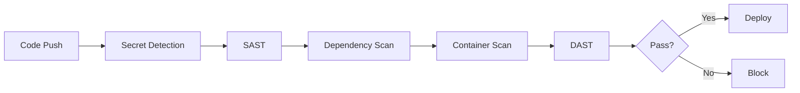

# How to Set Up Security Scanning in GitHub Actions

Author: [nawazdhandala](https://www.github.com/nawazdhandala)

Tags: GitHub Actions, Security, SAST, DAST, Vulnerability Scanning, DevSecOps

Description: Learn how to implement comprehensive security scanning in GitHub Actions. This guide covers SAST, dependency scanning, secret detection, container scanning, and DAST integration.

---

Security scanning should be part of every CI pipeline. Catching vulnerabilities early is cheaper than fixing them in production. GitHub Actions integrates with numerous security tools, and GitHub Advanced Security provides native scanning capabilities.

## Security Scanning Architecture



## Secret Detection

Prevent secrets from entering the repository:

```yaml
name: Secret Scanning

on:
  push:
  pull_request:

jobs:
  detect-secrets:
    runs-on: ubuntu-latest
    steps:
      - uses: actions/checkout@v4
        with:
          fetch-depth: 0

      - name: Detect secrets with Gitleaks
        uses: gitleaks/gitleaks-action@v2
        env:
          GITHUB_TOKEN: ${{ secrets.GITHUB_TOKEN }}
```

Configure `.gitleaks.toml`:

```toml
[allowlist]
description = "Allowed patterns"
paths = [
  '''test/.*''',
  '''.*_test\.go''',
]

[[rules]]
id = "aws-access-key"
description = "AWS Access Key"
regex = '''AKIA[0-9A-Z]{16}'''
tags = ["aws", "credentials"]

[[rules]]
id = "generic-api-key"
description = "Generic API Key"
regex = '''(?i)(api[_-]?key|apikey)\s*[:=]\s*['"][a-zA-Z0-9]{20,}['"]'''
```

## Static Application Security Testing (SAST)

### CodeQL Analysis

GitHub's native SAST tool:

```yaml
name: CodeQL

on:
  push:
    branches: [main]
  pull_request:
    branches: [main]
  schedule:
    - cron: '0 6 * * 1'  # Weekly on Monday

jobs:
  analyze:
    runs-on: ubuntu-latest
    permissions:
      security-events: write
      contents: read

    strategy:
      matrix:
        language: ['javascript', 'python', 'go']

    steps:
      - uses: actions/checkout@v4

      - name: Initialize CodeQL
        uses: github/codeql-action/init@v3
        with:
          languages: ${{ matrix.language }}
          queries: security-extended

      - name: Autobuild
        uses: github/codeql-action/autobuild@v3

      - name: Perform CodeQL Analysis
        uses: github/codeql-action/analyze@v3
        with:
          category: "/language:${{ matrix.language }}"
```

### Semgrep

Fast, customizable SAST:

```yaml
jobs:
  semgrep:
    runs-on: ubuntu-latest
    permissions:
      security-events: write
    steps:
      - uses: actions/checkout@v4

      - name: Semgrep Scan
        uses: semgrep/semgrep-action@v1
        with:
          config: >-
            p/security-audit
            p/secrets
            p/owasp-top-ten

      - name: Upload SARIF
        uses: github/codeql-action/upload-sarif@v3
        with:
          sarif_file: semgrep.sarif
```

## Dependency Scanning

### Dependabot

Enable in `.github/dependabot.yml`:

```yaml
version: 2
updates:
  - package-ecosystem: npm
    directory: "/"
    schedule:
      interval: weekly
    groups:
      production:
        dependency-type: production
      development:
        dependency-type: development

  - package-ecosystem: docker
    directory: "/"
    schedule:
      interval: weekly

  - package-ecosystem: github-actions
    directory: "/"
    schedule:
      interval: weekly
```

### OWASP Dependency Check

```yaml
jobs:
  dependency-check:
    runs-on: ubuntu-latest
    steps:
      - uses: actions/checkout@v4

      - name: OWASP Dependency Check
        uses: dependency-check/Dependency-Check_Action@main
        with:
          project: 'my-app'
          path: '.'
          format: 'SARIF'
          args: >-
            --failOnCVSS 7
            --enableRetired

      - name: Upload results
        uses: github/codeql-action/upload-sarif@v3
        with:
          sarif_file: reports/dependency-check-report.sarif
```

### npm Audit

```yaml
jobs:
  audit:
    runs-on: ubuntu-latest
    steps:
      - uses: actions/checkout@v4

      - uses: actions/setup-node@v4
        with:
          node-version: '20'

      - run: npm ci

      - name: Security audit
        run: npm audit --audit-level=high

      - name: Check for outdated packages
        run: npm outdated || true
```

## Container Security

### Trivy Scanner

```yaml
jobs:
  container-scan:
    runs-on: ubuntu-latest
    steps:
      - uses: actions/checkout@v4

      - name: Build image
        run: docker build -t myapp:${{ github.sha }} .

      - name: Scan image
        uses: aquasecurity/trivy-action@master
        with:
          image-ref: myapp:${{ github.sha }}
          format: 'sarif'
          output: 'trivy-results.sarif'
          severity: 'CRITICAL,HIGH'
          exit-code: '1'

      - name: Upload Trivy scan results
        uses: github/codeql-action/upload-sarif@v3
        if: always()
        with:
          sarif_file: 'trivy-results.sarif'
```

### Grype Scanner

```yaml
jobs:
  grype-scan:
    runs-on: ubuntu-latest
    steps:
      - uses: actions/checkout@v4

      - name: Build image
        run: docker build -t myapp:latest .

      - name: Scan with Grype
        uses: anchore/scan-action@v3
        with:
          image: myapp:latest
          fail-build: true
          severity-cutoff: high

      - name: Upload SARIF
        uses: github/codeql-action/upload-sarif@v3
        with:
          sarif_file: results.sarif
```

## Infrastructure as Code Scanning

### Checkov

```yaml
jobs:
  iac-scan:
    runs-on: ubuntu-latest
    steps:
      - uses: actions/checkout@v4

      - name: Checkov Scan
        uses: bridgecrewio/checkov-action@v12
        with:
          directory: terraform/
          framework: terraform
          output_format: sarif
          output_file_path: checkov.sarif
          soft_fail: false

      - name: Upload SARIF
        uses: github/codeql-action/upload-sarif@v3
        with:
          sarif_file: checkov.sarif
```

### tfsec

```yaml
jobs:
  tfsec:
    runs-on: ubuntu-latest
    steps:
      - uses: actions/checkout@v4

      - name: tfsec
        uses: aquasecurity/tfsec-action@v1.0.3
        with:
          soft_fail: false
          format: sarif
          sarif_file: tfsec.sarif

      - name: Upload SARIF
        uses: github/codeql-action/upload-sarif@v3
        with:
          sarif_file: tfsec.sarif
```

## Dynamic Application Security Testing (DAST)

### OWASP ZAP

```yaml
jobs:
  dast:
    runs-on: ubuntu-latest
    steps:
      - uses: actions/checkout@v4

      - name: Build and start app
        run: |
          docker-compose up -d
          sleep 30  # Wait for app to start

      - name: OWASP ZAP Scan
        uses: zaproxy/action-full-scan@v0.10.0
        with:
          target: 'http://localhost:3000'
          rules_file_name: '.zap/rules.tsv'
          cmd_options: '-a'

      - name: Upload ZAP Report
        uses: actions/upload-artifact@v4
        if: always()
        with:
          name: zap-report
          path: report_html.html
```

## License Compliance

```yaml
jobs:
  license-check:
    runs-on: ubuntu-latest
    steps:
      - uses: actions/checkout@v4

      - name: Check licenses
        uses: fossas/fossa-action@main
        with:
          api-key: ${{ secrets.FOSSA_API_KEY }}
          run-tests: true
```

## Complete Security Pipeline

```yaml
name: Security Pipeline

on:
  push:
    branches: [main]
  pull_request:
    branches: [main]
  schedule:
    - cron: '0 6 * * 1'

permissions:
  contents: read
  security-events: write

jobs:
  secrets:
    runs-on: ubuntu-latest
    steps:
      - uses: actions/checkout@v4
        with:
          fetch-depth: 0
      - uses: gitleaks/gitleaks-action@v2
        env:
          GITHUB_TOKEN: ${{ secrets.GITHUB_TOKEN }}

  sast:
    runs-on: ubuntu-latest
    steps:
      - uses: actions/checkout@v4
      - uses: github/codeql-action/init@v3
        with:
          languages: javascript
      - uses: github/codeql-action/autobuild@v3
      - uses: github/codeql-action/analyze@v3

  dependencies:
    runs-on: ubuntu-latest
    steps:
      - uses: actions/checkout@v4
      - uses: actions/setup-node@v4
        with:
          node-version: '20'
      - run: npm ci
      - run: npm audit --audit-level=high

  container:
    runs-on: ubuntu-latest
    steps:
      - uses: actions/checkout@v4
      - run: docker build -t app:${{ github.sha }} .
      - uses: aquasecurity/trivy-action@master
        with:
          image-ref: app:${{ github.sha }}
          format: sarif
          output: trivy.sarif
          exit-code: '1'
          severity: CRITICAL,HIGH
      - uses: github/codeql-action/upload-sarif@v3
        if: always()
        with:
          sarif_file: trivy.sarif

  iac:
    runs-on: ubuntu-latest
    steps:
      - uses: actions/checkout@v4
      - uses: bridgecrewio/checkov-action@v12
        with:
          directory: terraform/
          output_format: sarif
          output_file_path: checkov.sarif
      - uses: github/codeql-action/upload-sarif@v3
        if: always()
        with:
          sarif_file: checkov.sarif

  dast:
    needs: [sast, dependencies, container]
    runs-on: ubuntu-latest
    steps:
      - uses: actions/checkout@v4
      - run: docker-compose up -d && sleep 30
      - uses: zaproxy/action-baseline@v0.11.0
        with:
          target: 'http://localhost:3000'

  summary:
    needs: [secrets, sast, dependencies, container, iac, dast]
    runs-on: ubuntu-latest
    if: always()
    steps:
      - name: Check results
        run: |
          if [ "${{ needs.secrets.result }}" != "success" ] || \
             [ "${{ needs.sast.result }}" != "success" ] || \
             [ "${{ needs.dependencies.result }}" != "success" ] || \
             [ "${{ needs.container.result }}" != "success" ] || \
             [ "${{ needs.iac.result }}" != "success" ]; then
            echo "Security checks failed"
            exit 1
          fi
          echo "All security checks passed"
```

---

Security scanning catches vulnerabilities before they reach production. Layer multiple tools - secret detection, SAST, dependency scanning, container scanning, and DAST - for defense in depth. Upload results to GitHub Security tab for centralized visibility and integrate findings into your development workflow.
