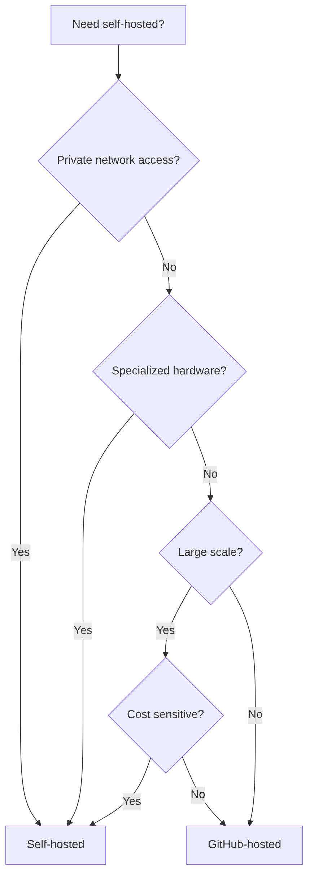

# How to Use Self-Hosted Runners in GitHub Actions

Author: [nawazdhandala](https://www.github.com/nawazdhandala)

Tags: GitHub Actions, Self-Hosted Runners, CI/CD, DevOps, Kubernetes, Infrastructure

Description: Learn how to set up and manage self-hosted runners for GitHub Actions. This guide covers installation, scaling, security hardening, and Kubernetes deployment with Actions Runner Controller.

---

GitHub-hosted runners work well for most projects, but self-hosted runners offer advantages: faster builds with persistent caches, access to private networks, specialized hardware like GPUs, and cost savings at scale. This guide shows you how to deploy and manage them effectively.

## When to Use Self-Hosted Runners



Use self-hosted runners when you need:
- Access to internal services without exposing them
- GPU, ARM, or other specialized hardware
- Persistent caches for large dependencies
- Cost control at high volume
- Compliance requirements for data locality

## Basic Runner Setup

Install a runner on a Linux VM:

```bash
# Create a directory for the runner
mkdir actions-runner && cd actions-runner

# Download the runner package
curl -o actions-runner-linux-x64-2.311.0.tar.gz -L \
  https://github.com/actions/runner/releases/download/v2.311.0/actions-runner-linux-x64-2.311.0.tar.gz

# Extract the package
tar xzf ./actions-runner-linux-x64-2.311.0.tar.gz

# Configure the runner
./config.sh --url https://github.com/YOUR-ORG/YOUR-REPO \
  --token YOUR_REGISTRATION_TOKEN

# Run as a service
sudo ./svc.sh install
sudo ./svc.sh start
```

Use the runner in workflows:

```yaml
jobs:
  build:
    runs-on: self-hosted
    steps:
      - uses: actions/checkout@v4
      - run: echo "Running on self-hosted runner"
```

## Runner Labels

Add labels to target specific runners:

```bash
./config.sh --url https://github.com/YOUR-ORG/YOUR-REPO \
  --token YOUR_TOKEN \
  --labels gpu,linux,x64
```

Target labeled runners:

```yaml
jobs:
  ml-training:
    runs-on: [self-hosted, gpu, linux]
    steps:
      - uses: actions/checkout@v4
      - name: Train model
        run: python train.py
```

## Runner Groups

Organize runners into groups for access control:

```yaml
# Only accessible by specific repositories
jobs:
  deploy:
    runs-on:
      group: production-runners
    steps:
      - run: ./deploy.sh
```

Configure groups in GitHub organization settings to restrict which repositories can use which runners.

## Docker-Based Runner

Run the runner in Docker for isolation:

```dockerfile
FROM ubuntu:22.04

RUN apt-get update && apt-get install -y \
    curl \
    git \
    jq \
    libicu70 \
    && rm -rf /var/lib/apt/lists/*

ARG RUNNER_VERSION=2.311.0

RUN mkdir /actions-runner && cd /actions-runner \
    && curl -o actions-runner.tar.gz -L \
       https://github.com/actions/runner/releases/download/v${RUNNER_VERSION}/actions-runner-linux-x64-${RUNNER_VERSION}.tar.gz \
    && tar xzf actions-runner.tar.gz \
    && rm actions-runner.tar.gz

WORKDIR /actions-runner

COPY entrypoint.sh /entrypoint.sh
RUN chmod +x /entrypoint.sh

ENTRYPOINT ["/entrypoint.sh"]
```

Create `entrypoint.sh`:

```bash
#!/bin/bash
set -e

./config.sh --url "$GITHUB_URL" \
  --token "$RUNNER_TOKEN" \
  --labels "$RUNNER_LABELS" \
  --unattended \
  --replace

cleanup() {
    ./config.sh remove --token "$RUNNER_TOKEN"
}
trap cleanup EXIT

./run.sh
```

## Actions Runner Controller (ARC)

Deploy auto-scaling runners on Kubernetes:

```bash
# Install ARC using Helm
helm install arc \
  --namespace arc-systems \
  --create-namespace \
  oci://ghcr.io/actions/actions-runner-controller-charts/gha-runner-scale-set-controller
```

Create a runner scale set:

```yaml
apiVersion: actions.github.com/v1alpha1
kind: AutoscalingRunnerSet
metadata:
  name: arc-runner-set
  namespace: arc-runners
spec:
  githubConfigUrl: "https://github.com/YOUR-ORG"
  githubConfigSecret: github-config
  minRunners: 1
  maxRunners: 10
  template:
    spec:
      containers:
        - name: runner
          image: ghcr.io/actions/actions-runner:latest
          resources:
            limits:
              cpu: "2"
              memory: "4Gi"
            requests:
              cpu: "500m"
              memory: "1Gi"
```

Create the GitHub config secret:

```bash
kubectl create secret generic github-config \
  --namespace arc-runners \
  --from-literal=github_app_id=YOUR_APP_ID \
  --from-literal=github_app_installation_id=YOUR_INSTALLATION_ID \
  --from-file=github_app_private_key=private-key.pem
```

Use ARC runners:

```yaml
jobs:
  build:
    runs-on: arc-runner-set
    steps:
      - uses: actions/checkout@v4
      - run: npm ci && npm test
```

## Security Hardening

### Ephemeral Runners

Configure runners to be replaced after each job:

```bash
./config.sh --url https://github.com/YOUR-ORG \
  --token YOUR_TOKEN \
  --ephemeral
```

In ARC:

```yaml
spec:
  template:
    spec:
      containers:
        - name: runner
          env:
            - name: ACTIONS_RUNNER_REQUIRE_JOB_CONTAINER
              value: "true"
```

### Network Isolation

Run jobs in isolated containers:

```yaml
jobs:
  build:
    runs-on: self-hosted
    container:
      image: node:20
      options: --network=isolated
    steps:
      - uses: actions/checkout@v4
      - run: npm ci && npm test
```

### Limit Repository Access

Use runner groups to restrict access:

1. Create a runner group in org settings
2. Assign runners to the group
3. Select which repositories can access the group

## Caching Strategies

Self-hosted runners can maintain persistent caches:

```yaml
jobs:
  build:
    runs-on: self-hosted
    steps:
      - uses: actions/checkout@v4

      # Use local cache directory
      - name: Setup cache
        run: |
          mkdir -p /opt/cache/npm
          npm config set cache /opt/cache/npm

      - run: npm ci
      - run: npm test
```

For Docker builds with BuildKit:

```yaml
jobs:
  build:
    runs-on: self-hosted
    steps:
      - uses: actions/checkout@v4

      - uses: docker/setup-buildx-action@v3
        with:
          driver-opts: |
            image=moby/buildkit:latest
            network=host

      - uses: docker/build-push-action@v5
        with:
          context: .
          cache-from: type=local,src=/opt/cache/buildx
          cache-to: type=local,dest=/opt/cache/buildx,mode=max
```

## Monitoring Runners

Add health checks and metrics:

```yaml
apiVersion: apps/v1
kind: Deployment
metadata:
  name: runner-monitor
spec:
  template:
    spec:
      containers:
        - name: monitor
          image: prom/prometheus
          ports:
            - containerPort: 9090
---
apiVersion: v1
kind: ConfigMap
metadata:
  name: prometheus-config
data:
  prometheus.yml: |
    scrape_configs:
      - job_name: 'github-runners'
        static_configs:
          - targets: ['arc-controller:8080']
```

## Complete ARC Setup

```yaml
# runner-scale-set.yaml
apiVersion: actions.github.com/v1alpha1
kind: AutoscalingRunnerSet
metadata:
  name: production-runners
  namespace: arc-runners
spec:
  githubConfigUrl: "https://github.com/YOUR-ORG"
  githubConfigSecret: github-config
  minRunners: 2
  maxRunners: 20

  template:
    spec:
      serviceAccountName: runner-sa
      containers:
        - name: runner
          image: ghcr.io/actions/actions-runner:latest
          resources:
            limits:
              cpu: "4"
              memory: "8Gi"
            requests:
              cpu: "1"
              memory: "2Gi"
          volumeMounts:
            - name: work
              mountPath: /home/runner/_work
            - name: cache
              mountPath: /opt/cache
      volumes:
        - name: work
          emptyDir: {}
        - name: cache
          persistentVolumeClaim:
            claimName: runner-cache

      nodeSelector:
        node-type: ci

      tolerations:
        - key: "ci-workload"
          operator: "Equal"
          value: "true"
          effect: "NoSchedule"
```

## Troubleshooting

Check runner logs:

```bash
# Service logs
sudo journalctl -u actions.runner.YOUR-ORG-YOUR-REPO.runner-name

# Docker logs
docker logs runner-container

# Kubernetes logs
kubectl logs -n arc-runners deployment/arc-runner-set
```

Common issues:
- **Runner offline**: Check network connectivity and token expiration
- **Job stuck**: Verify runner has required labels
- **Permission denied**: Check runner user has access to required resources
- **Out of disk**: Clean up old artifacts and Docker images

---

Self-hosted runners give you control over your CI infrastructure. Start with a single runner for testing, then scale with Actions Runner Controller on Kubernetes. Combine ephemeral runners with container isolation for security, and leverage persistent caches for speed.
