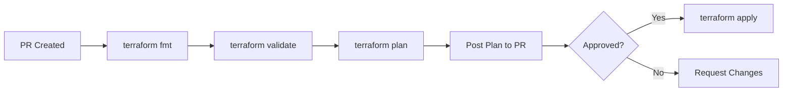

# How to Set Up Terraform Pipeline in GitHub Actions

Author: [nawazdhandala](https://www.github.com/nawazdhandala)

Tags: GitHub Actions, Terraform, Infrastructure as Code, CI/CD, DevOps, Cloud

Description: Learn how to build a secure Terraform CI/CD pipeline with GitHub Actions. This guide covers plan/apply workflows, state management, drift detection, and multi-environment deployments.

---

Infrastructure as Code requires rigorous CI/CD practices. Terraform pipelines should validate changes, show plans for review, and apply changes safely. GitHub Actions provides excellent Terraform integration with proper secret handling and approval workflows.

## Terraform Pipeline Architecture



## Basic Terraform Workflow

Create `.github/workflows/terraform.yml`:

```yaml
name: Terraform

on:
  push:
    branches: [main]
    paths:
      - 'terraform/**'
  pull_request:
    branches: [main]
    paths:
      - 'terraform/**'

env:
  TF_VERSION: '1.7.0'
  WORKING_DIR: terraform

jobs:
  terraform:
    runs-on: ubuntu-latest
    defaults:
      run:
        working-directory: ${{ env.WORKING_DIR }}

    steps:
      - uses: actions/checkout@v4

      - name: Setup Terraform
        uses: hashicorp/setup-terraform@v3
        with:
          terraform_version: ${{ env.TF_VERSION }}

      - name: Terraform Format
        run: terraform fmt -check -recursive

      - name: Terraform Init
        run: terraform init
        env:
          AWS_ACCESS_KEY_ID: ${{ secrets.AWS_ACCESS_KEY_ID }}
          AWS_SECRET_ACCESS_KEY: ${{ secrets.AWS_SECRET_ACCESS_KEY }}

      - name: Terraform Validate
        run: terraform validate

      - name: Terraform Plan
        run: terraform plan -out=tfplan
        env:
          AWS_ACCESS_KEY_ID: ${{ secrets.AWS_ACCESS_KEY_ID }}
          AWS_SECRET_ACCESS_KEY: ${{ secrets.AWS_SECRET_ACCESS_KEY }}

      - name: Terraform Apply
        if: github.ref == 'refs/heads/main' && github.event_name == 'push'
        run: terraform apply -auto-approve tfplan
        env:
          AWS_ACCESS_KEY_ID: ${{ secrets.AWS_ACCESS_KEY_ID }}
          AWS_SECRET_ACCESS_KEY: ${{ secrets.AWS_SECRET_ACCESS_KEY }}
```

## OIDC Authentication (Recommended)

Use OIDC instead of long-lived credentials:

```yaml
jobs:
  terraform:
    runs-on: ubuntu-latest
    permissions:
      id-token: write
      contents: read

    steps:
      - uses: actions/checkout@v4

      - name: Configure AWS Credentials
        uses: aws-actions/configure-aws-credentials@v4
        with:
          role-to-assume: arn:aws:iam::123456789012:role/github-actions-terraform
          aws-region: us-east-1

      - uses: hashicorp/setup-terraform@v3

      - run: terraform init
      - run: terraform plan
```

## Plan Comments on PRs

Post Terraform plan output to pull requests:

```yaml
jobs:
  plan:
    runs-on: ubuntu-latest
    permissions:
      pull-requests: write
      contents: read
      id-token: write

    steps:
      - uses: actions/checkout@v4

      - uses: aws-actions/configure-aws-credentials@v4
        with:
          role-to-assume: ${{ vars.AWS_ROLE_ARN }}
          aws-region: us-east-1

      - uses: hashicorp/setup-terraform@v3

      - name: Terraform Init
        id: init
        run: terraform init
        working-directory: terraform

      - name: Terraform Plan
        id: plan
        run: terraform plan -no-color -out=tfplan
        working-directory: terraform
        continue-on-error: true

      - name: Post Plan to PR
        uses: actions/github-script@v7
        if: github.event_name == 'pull_request'
        with:
          script: |
            const output = `#### Terraform Plan
            \`\`\`
            ${{ steps.plan.outputs.stdout }}
            \`\`\`

            *Pushed by: @${{ github.actor }}, Action: \`${{ github.event_name }}\`*`;

            github.rest.issues.createComment({
              issue_number: context.issue.number,
              owner: context.repo.owner,
              repo: context.repo.repo,
              body: output
            });

      - name: Plan Status
        if: steps.plan.outcome == 'failure'
        run: exit 1
```

## Multi-Environment Pipeline

Deploy to multiple environments with approvals:

```yaml
name: Terraform Multi-Environment

on:
  push:
    branches: [main]
  pull_request:
    branches: [main]

jobs:
  plan-dev:
    runs-on: ubuntu-latest
    environment: development
    steps:
      - uses: actions/checkout@v4
      - uses: hashicorp/setup-terraform@v3

      - name: Plan Dev
        run: |
          terraform init -backend-config=environments/dev/backend.tfvars
          terraform plan -var-file=environments/dev/terraform.tfvars -out=tfplan
        working-directory: terraform

      - uses: actions/upload-artifact@v4
        with:
          name: dev-plan
          path: terraform/tfplan

  apply-dev:
    needs: plan-dev
    if: github.ref == 'refs/heads/main'
    runs-on: ubuntu-latest
    environment: development
    steps:
      - uses: actions/checkout@v4
      - uses: hashicorp/setup-terraform@v3

      - uses: actions/download-artifact@v4
        with:
          name: dev-plan
          path: terraform/

      - name: Apply Dev
        run: |
          terraform init -backend-config=environments/dev/backend.tfvars
          terraform apply -auto-approve tfplan
        working-directory: terraform

  plan-prod:
    needs: apply-dev
    runs-on: ubuntu-latest
    steps:
      - uses: actions/checkout@v4
      - uses: hashicorp/setup-terraform@v3

      - name: Plan Prod
        run: |
          terraform init -backend-config=environments/prod/backend.tfvars
          terraform plan -var-file=environments/prod/terraform.tfvars -out=tfplan
        working-directory: terraform

      - uses: actions/upload-artifact@v4
        with:
          name: prod-plan
          path: terraform/tfplan

  apply-prod:
    needs: plan-prod
    runs-on: ubuntu-latest
    environment:
      name: production
      url: https://app.example.com
    steps:
      - uses: actions/checkout@v4
      - uses: hashicorp/setup-terraform@v3

      - uses: actions/download-artifact@v4
        with:
          name: prod-plan
          path: terraform/

      - name: Apply Prod
        run: |
          terraform init -backend-config=environments/prod/backend.tfvars
          terraform apply -auto-approve tfplan
        working-directory: terraform
```

## Terraform State Management

Configure remote state with S3:

```hcl
# backend.tf
terraform {
  backend "s3" {
    bucket         = "my-terraform-state"
    key            = "infrastructure/terraform.tfstate"
    region         = "us-east-1"
    encrypt        = true
    dynamodb_table = "terraform-locks"
  }
}
```

For Terraform Cloud:

```yaml
jobs:
  terraform:
    runs-on: ubuntu-latest
    env:
      TF_CLOUD_ORGANIZATION: "my-org"
      TF_API_TOKEN: ${{ secrets.TF_API_TOKEN }}
    steps:
      - uses: actions/checkout@v4

      - uses: hashicorp/setup-terraform@v3
        with:
          cli_config_credentials_token: ${{ secrets.TF_API_TOKEN }}

      - run: terraform init
      - run: terraform plan
```

## Drift Detection

Schedule drift detection to catch manual changes:

```yaml
name: Terraform Drift Detection

on:
  schedule:
    - cron: '0 8 * * *'  # Daily at 8 AM
  workflow_dispatch:

jobs:
  detect-drift:
    runs-on: ubuntu-latest
    permissions:
      id-token: write
      contents: read
      issues: write

    steps:
      - uses: actions/checkout@v4

      - uses: aws-actions/configure-aws-credentials@v4
        with:
          role-to-assume: ${{ vars.AWS_ROLE_ARN }}
          aws-region: us-east-1

      - uses: hashicorp/setup-terraform@v3

      - name: Terraform Init
        run: terraform init
        working-directory: terraform

      - name: Detect Drift
        id: drift
        run: |
          terraform plan -detailed-exitcode -out=tfplan 2>&1 | tee plan.txt
          echo "exitcode=$?" >> $GITHUB_OUTPUT
        working-directory: terraform
        continue-on-error: true

      - name: Create Issue on Drift
        if: steps.drift.outputs.exitcode == '2'
        uses: actions/github-script@v7
        with:
          script: |
            const fs = require('fs');
            const plan = fs.readFileSync('terraform/plan.txt', 'utf8');

            await github.rest.issues.create({
              owner: context.repo.owner,
              repo: context.repo.repo,
              title: 'Infrastructure Drift Detected',
              body: `Terraform detected drift from the desired state.\n\n\`\`\`\n${plan.slice(0, 60000)}\n\`\`\``,
              labels: ['infrastructure', 'drift']
            });
```

## Security Scanning

Add security scanning with tfsec or Checkov:

```yaml
jobs:
  security:
    runs-on: ubuntu-latest
    steps:
      - uses: actions/checkout@v4

      - name: tfsec
        uses: aquasecurity/tfsec-action@v1.0.3
        with:
          working_directory: terraform
          soft_fail: false

      - name: Checkov
        uses: bridgecrewio/checkov-action@v12
        with:
          directory: terraform
          framework: terraform
          output_format: sarif
          output_file_path: results.sarif

      - name: Upload SARIF
        uses: github/codeql-action/upload-sarif@v3
        with:
          sarif_file: results.sarif
```

## Module Testing

Test Terraform modules with Terratest:

```yaml
jobs:
  test:
    runs-on: ubuntu-latest
    steps:
      - uses: actions/checkout@v4

      - uses: actions/setup-go@v5
        with:
          go-version: '1.22'

      - uses: aws-actions/configure-aws-credentials@v4
        with:
          role-to-assume: ${{ vars.AWS_ROLE_ARN }}
          aws-region: us-east-1

      - name: Run Terratest
        run: |
          cd test
          go test -v -timeout 30m
```

## Complete Production Pipeline

```yaml
name: Terraform

on:
  push:
    branches: [main]
    paths: ['terraform/**']
  pull_request:
    branches: [main]
    paths: ['terraform/**']

permissions:
  id-token: write
  contents: read
  pull-requests: write

env:
  TF_VERSION: '1.7.0'
  AWS_REGION: us-east-1

jobs:
  validate:
    runs-on: ubuntu-latest
    steps:
      - uses: actions/checkout@v4

      - uses: hashicorp/setup-terraform@v3
        with:
          terraform_version: ${{ env.TF_VERSION }}

      - name: Format Check
        run: terraform fmt -check -recursive
        working-directory: terraform

      - name: Init
        run: terraform init -backend=false
        working-directory: terraform

      - name: Validate
        run: terraform validate
        working-directory: terraform

  security:
    runs-on: ubuntu-latest
    steps:
      - uses: actions/checkout@v4

      - uses: aquasecurity/tfsec-action@v1.0.3
        with:
          working_directory: terraform

  plan:
    needs: [validate, security]
    runs-on: ubuntu-latest
    steps:
      - uses: actions/checkout@v4

      - uses: aws-actions/configure-aws-credentials@v4
        with:
          role-to-assume: ${{ vars.AWS_ROLE_ARN }}
          aws-region: ${{ env.AWS_REGION }}

      - uses: hashicorp/setup-terraform@v3
        with:
          terraform_version: ${{ env.TF_VERSION }}

      - name: Init
        run: terraform init
        working-directory: terraform

      - name: Plan
        id: plan
        run: terraform plan -no-color -out=tfplan
        working-directory: terraform

      - uses: actions/upload-artifact@v4
        with:
          name: tfplan
          path: terraform/tfplan

      - name: Comment Plan
        if: github.event_name == 'pull_request'
        uses: actions/github-script@v7
        with:
          script: |
            const output = `### Terraform Plan
            \`\`\`
            ${{ steps.plan.outputs.stdout }}
            \`\`\``;
            github.rest.issues.createComment({
              issue_number: context.issue.number,
              owner: context.repo.owner,
              repo: context.repo.repo,
              body: output.slice(0, 65000)
            });

  apply:
    needs: plan
    if: github.ref == 'refs/heads/main' && github.event_name == 'push'
    runs-on: ubuntu-latest
    environment: production
    steps:
      - uses: actions/checkout@v4

      - uses: aws-actions/configure-aws-credentials@v4
        with:
          role-to-assume: ${{ vars.AWS_ROLE_ARN }}
          aws-region: ${{ env.AWS_REGION }}

      - uses: hashicorp/setup-terraform@v3
        with:
          terraform_version: ${{ env.TF_VERSION }}

      - uses: actions/download-artifact@v4
        with:
          name: tfplan
          path: terraform/

      - name: Init
        run: terraform init
        working-directory: terraform

      - name: Apply
        run: terraform apply -auto-approve tfplan
        working-directory: terraform
```

---

A well-designed Terraform pipeline ensures infrastructure changes are validated, reviewed, and applied safely. Use OIDC for secure cloud authentication, post plans to PRs for review, and add security scanning to catch misconfigurations early. Scheduled drift detection keeps your infrastructure aligned with code.
