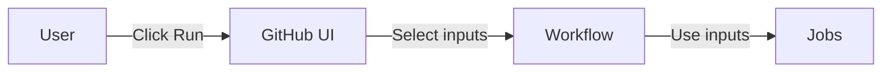

# How to Use Workflow Dispatch Inputs in GitHub Actions

Author: [nawazdhandala](https://www.github.com/nawazdhandala)

Tags: GitHub Actions, Workflow Dispatch, Manual Triggers, CI/CD, Automation, DevOps

Description: Learn how to create interactive GitHub Actions workflows with workflow_dispatch inputs. This guide covers input types, validation, conditional logic, and real-world use cases.

---

The `workflow_dispatch` trigger lets you run workflows manually with custom inputs. This is powerful for deployments, releases, maintenance tasks, and any operation requiring human decision-making. Inputs turn static workflows into flexible, parameterized tools.

## Workflow Dispatch Overview



## Basic Input Types

GitHub Actions supports several input types:

```yaml
name: Manual Deploy

on:
  workflow_dispatch:
    inputs:
      environment:
        description: 'Deployment environment'
        required: true
        type: choice
        options:
          - development
          - staging
          - production

      version:
        description: 'Version to deploy'
        required: true
        type: string
        default: 'latest'

      dry_run:
        description: 'Run without making changes'
        required: false
        type: boolean
        default: false

jobs:
  deploy:
    runs-on: ubuntu-latest
    steps:
      - name: Deploy
        run: |
          echo "Environment: ${{ inputs.environment }}"
          echo "Version: ${{ inputs.version }}"
          echo "Dry run: ${{ inputs.dry_run }}"
```

## Input Types Reference

### String Input

```yaml
inputs:
  tag:
    description: 'Release tag'
    required: true
    type: string
    default: 'v1.0.0'
```

### Choice Input

```yaml
inputs:
  log_level:
    description: 'Log verbosity'
    required: true
    type: choice
    options:
      - debug
      - info
      - warning
      - error
    default: 'info'
```

### Boolean Input

```yaml
inputs:
  skip_tests:
    description: 'Skip test execution'
    required: false
    type: boolean
    default: false
```

### Environment Input

```yaml
inputs:
  target_env:
    description: 'Target environment'
    required: true
    type: environment
```

## Conditional Logic with Inputs

Use inputs for conditional execution:

```yaml
name: Conditional Deploy

on:
  workflow_dispatch:
    inputs:
      environment:
        description: 'Environment'
        required: true
        type: choice
        options:
          - staging
          - production
      run_migrations:
        description: 'Run database migrations'
        type: boolean
        default: true
      notify_slack:
        description: 'Send Slack notification'
        type: boolean
        default: true

jobs:
  deploy:
    runs-on: ubuntu-latest
    environment: ${{ inputs.environment }}
    steps:
      - uses: actions/checkout@v4

      - name: Run migrations
        if: inputs.run_migrations
        run: npm run db:migrate

      - name: Deploy
        run: ./deploy.sh ${{ inputs.environment }}

      - name: Notify Slack
        if: inputs.notify_slack
        run: |
          curl -X POST ${{ secrets.SLACK_WEBHOOK }} \
            -d '{"text":"Deployed to ${{ inputs.environment }}"}'
```

## Input Validation

Validate inputs before proceeding:

```yaml
jobs:
  validate:
    runs-on: ubuntu-latest
    steps:
      - name: Validate version format
        run: |
          VERSION="${{ inputs.version }}"
          if [[ ! $VERSION =~ ^v[0-9]+\.[0-9]+\.[0-9]+$ ]]; then
            echo "Error: Version must be in format v1.2.3"
            exit 1
          fi

      - name: Validate environment access
        run: |
          if [[ "${{ inputs.environment }}" == "production" ]]; then
            if [[ "${{ github.actor }}" != "admin-user" ]]; then
              echo "Error: Only admin-user can deploy to production"
              exit 1
            fi
          fi
```

## Multiple Related Inputs

Group related inputs for complex operations:

```yaml
name: Release

on:
  workflow_dispatch:
    inputs:
      release_type:
        description: 'Release type'
        required: true
        type: choice
        options:
          - major
          - minor
          - patch
          - prerelease
      prerelease_tag:
        description: 'Prerelease tag (alpha, beta, rc)'
        required: false
        type: string
        default: ''
      create_github_release:
        description: 'Create GitHub release'
        type: boolean
        default: true
      publish_npm:
        description: 'Publish to npm'
        type: boolean
        default: true
      publish_docker:
        description: 'Publish Docker image'
        type: boolean
        default: true

jobs:
  release:
    runs-on: ubuntu-latest
    steps:
      - uses: actions/checkout@v4
        with:
          fetch-depth: 0

      - name: Calculate version
        id: version
        run: |
          CURRENT=$(git describe --tags --abbrev=0 2>/dev/null || echo "v0.0.0")
          CURRENT=${CURRENT#v}
          IFS='.' read -r major minor patch <<< "$CURRENT"

          case "${{ inputs.release_type }}" in
            major) NEW="$((major + 1)).0.0" ;;
            minor) NEW="$major.$((minor + 1)).0" ;;
            patch) NEW="$major.$minor.$((patch + 1))" ;;
            prerelease) NEW="$major.$minor.$((patch + 1))-${{ inputs.prerelease_tag }}" ;;
          esac

          echo "version=v$NEW" >> $GITHUB_OUTPUT

      - name: Create tag
        run: |
          git tag ${{ steps.version.outputs.version }}
          git push origin ${{ steps.version.outputs.version }}

      - name: Create GitHub Release
        if: inputs.create_github_release
        uses: softprops/action-gh-release@v2
        with:
          tag_name: ${{ steps.version.outputs.version }}
          generate_release_notes: true

      - name: Publish to npm
        if: inputs.publish_npm
        run: npm publish
        env:
          NODE_AUTH_TOKEN: ${{ secrets.NPM_TOKEN }}

      - name: Build and push Docker
        if: inputs.publish_docker
        run: |
          docker build -t myapp:${{ steps.version.outputs.version }} .
          docker push myapp:${{ steps.version.outputs.version }}
```

## Dynamic Environments

Use environment input type for built-in protection:

```yaml
name: Deploy

on:
  workflow_dispatch:
    inputs:
      environment:
        description: 'Deployment environment'
        required: true
        type: environment

jobs:
  deploy:
    runs-on: ubuntu-latest
    environment: ${{ inputs.environment }}
    steps:
      - uses: actions/checkout@v4

      - name: Deploy to ${{ inputs.environment }}
        run: ./deploy.sh
        env:
          DEPLOY_URL: ${{ vars.DEPLOY_URL }}
          API_KEY: ${{ secrets.API_KEY }}
```

## Triggering Workflows via API

Trigger with inputs programmatically:

```bash
curl -X POST \
  -H "Authorization: token $GITHUB_TOKEN" \
  -H "Accept: application/vnd.github.v3+json" \
  https://api.github.com/repos/owner/repo/actions/workflows/deploy.yml/dispatches \
  -d '{
    "ref": "main",
    "inputs": {
      "environment": "staging",
      "version": "v1.2.3",
      "dry_run": "false"
    }
  }'
```

Or with GitHub CLI:

```bash
gh workflow run deploy.yml \
  -f environment=staging \
  -f version=v1.2.3 \
  -f dry_run=false
```

## Chained Workflows

One workflow triggers another with inputs:

```yaml
# build.yml
name: Build

on:
  workflow_dispatch:
    inputs:
      trigger_deploy:
        type: boolean
        default: false
      target_environment:
        type: choice
        options: [staging, production]

jobs:
  build:
    runs-on: ubuntu-latest
    steps:
      - uses: actions/checkout@v4
      - run: npm run build

      - name: Trigger deploy
        if: inputs.trigger_deploy
        uses: actions/github-script@v7
        with:
          script: |
            await github.rest.actions.createWorkflowDispatch({
              owner: context.repo.owner,
              repo: context.repo.repo,
              workflow_id: 'deploy.yml',
              ref: 'main',
              inputs: {
                environment: '${{ inputs.target_environment }}',
                version: '${{ github.sha }}'
              }
            });
```

## Maintenance Tasks

Create operational runbooks:

```yaml
name: Maintenance

on:
  workflow_dispatch:
    inputs:
      task:
        description: 'Maintenance task'
        required: true
        type: choice
        options:
          - clear-cache
          - restart-services
          - run-migrations
          - scale-down
          - scale-up
      environment:
        description: 'Target environment'
        required: true
        type: environment
      confirm:
        description: 'Type CONFIRM to proceed'
        required: true
        type: string

jobs:
  validate:
    runs-on: ubuntu-latest
    steps:
      - name: Require confirmation
        if: inputs.confirm != 'CONFIRM'
        run: |
          echo "Error: You must type CONFIRM to proceed"
          exit 1

  execute:
    needs: validate
    runs-on: ubuntu-latest
    environment: ${{ inputs.environment }}
    steps:
      - uses: actions/checkout@v4

      - name: Clear cache
        if: inputs.task == 'clear-cache'
        run: ./scripts/clear-cache.sh

      - name: Restart services
        if: inputs.task == 'restart-services'
        run: ./scripts/restart-services.sh

      - name: Run migrations
        if: inputs.task == 'run-migrations'
        run: ./scripts/run-migrations.sh

      - name: Scale down
        if: inputs.task == 'scale-down'
        run: ./scripts/scale.sh down

      - name: Scale up
        if: inputs.task == 'scale-up'
        run: ./scripts/scale.sh up
```

## Complete Example

```yaml
name: Production Deploy

on:
  workflow_dispatch:
    inputs:
      version:
        description: 'Version to deploy (e.g., v1.2.3 or commit SHA)'
        required: true
        type: string
      environment:
        description: 'Target environment'
        required: true
        type: environment
      skip_tests:
        description: 'Skip test execution'
        type: boolean
        default: false
      rollback_on_failure:
        description: 'Automatically rollback on failure'
        type: boolean
        default: true
      notify_channels:
        description: 'Notification channels'
        type: choice
        options:
          - slack-only
          - email-only
          - both
          - none
        default: 'slack-only'

jobs:
  validate:
    runs-on: ubuntu-latest
    outputs:
      resolved_version: ${{ steps.resolve.outputs.version }}
    steps:
      - uses: actions/checkout@v4
        with:
          fetch-depth: 0

      - name: Resolve version
        id: resolve
        run: |
          VERSION="${{ inputs.version }}"
          if [[ $VERSION =~ ^v[0-9] ]]; then
            # It's a tag
            if git rev-parse "$VERSION" >/dev/null 2>&1; then
              echo "version=$VERSION" >> $GITHUB_OUTPUT
            else
              echo "Error: Tag $VERSION not found"
              exit 1
            fi
          else
            # Assume it's a commit SHA
            if git cat-file -e "$VERSION" 2>/dev/null; then
              echo "version=$VERSION" >> $GITHUB_OUTPUT
            else
              echo "Error: Commit $VERSION not found"
              exit 1
            fi
          fi

  test:
    needs: validate
    if: inputs.skip_tests == false
    runs-on: ubuntu-latest
    steps:
      - uses: actions/checkout@v4
        with:
          ref: ${{ needs.validate.outputs.resolved_version }}
      - run: npm ci
      - run: npm test

  deploy:
    needs: [validate, test]
    if: always() && needs.validate.result == 'success' && (needs.test.result == 'success' || needs.test.result == 'skipped')
    runs-on: ubuntu-latest
    environment: ${{ inputs.environment }}
    steps:
      - uses: actions/checkout@v4
        with:
          ref: ${{ needs.validate.outputs.resolved_version }}

      - name: Get current version
        id: current
        run: echo "version=$(./scripts/get-current-version.sh)" >> $GITHUB_OUTPUT

      - name: Deploy
        id: deploy
        run: ./scripts/deploy.sh ${{ needs.validate.outputs.resolved_version }}
        continue-on-error: ${{ inputs.rollback_on_failure }}

      - name: Rollback on failure
        if: failure() && inputs.rollback_on_failure
        run: ./scripts/deploy.sh ${{ steps.current.outputs.version }}

  notify:
    needs: [validate, deploy]
    if: always() && inputs.notify_channels != 'none'
    runs-on: ubuntu-latest
    steps:
      - name: Slack notification
        if: inputs.notify_channels == 'slack-only' || inputs.notify_channels == 'both'
        run: |
          STATUS=${{ needs.deploy.result == 'success' && 'succeeded' || 'failed' }}
          curl -X POST ${{ secrets.SLACK_WEBHOOK }} \
            -d "{\"text\":\"Deploy to ${{ inputs.environment }} $STATUS\"}"

      - name: Email notification
        if: inputs.notify_channels == 'email-only' || inputs.notify_channels == 'both'
        run: echo "Send email notification"
```

---

Workflow dispatch inputs transform static CI/CD pipelines into interactive tools. Use them for deployments, releases, and maintenance tasks that require human judgment. Combine with environment protections for safe production operations, and provide sensible defaults to reduce friction for common cases.
