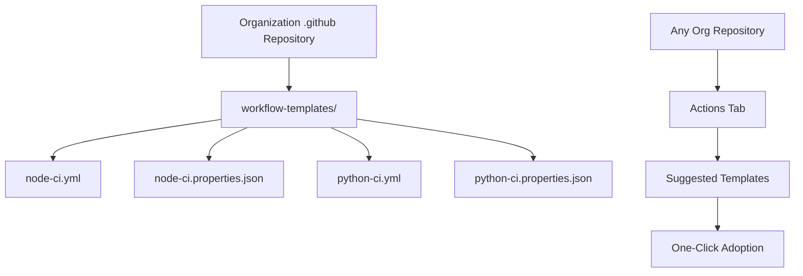

# How to Use Workflow Templates in GitHub Actions

Author: [nawazdhandala](https://www.github.com/nawazdhandala)

Tags: GitHub Actions, CI/CD, Workflow Templates, DevOps, Automation, Organization

Description: Learn how to create and use workflow templates in GitHub Actions to standardize CI/CD practices across your organization, reduce duplication, and ensure consistent quality gates for all repositories.

---

As organizations scale, maintaining consistent CI/CD practices across dozens or hundreds of repositories becomes challenging. Workflow templates solve this by providing pre-configured workflows that any repository in your organization can adopt with minimal effort.

## Understanding Workflow Templates

Workflow templates live in a special `.github` repository at your organization level. When developers create new workflows, GitHub suggests these templates based on the repository's language and characteristics.



## Creating Your First Template

Templates require two files: the workflow YAML and a properties JSON file that describes when to suggest it.

### Setting Up the Template Repository

First, create a repository named `.github` in your organization if it does not exist. This is a special repository that GitHub uses for organization-level configurations.

```bash
# Create the workflow-templates directory
mkdir -p workflow-templates
```

### Node.js CI Template

Create a comprehensive Node.js workflow template that handles testing, linting, and security scanning.

```yaml
# workflow-templates/node-ci.yml
name: Node.js CI

on:
  push:
    branches: [$default-branch]
  pull_request:
    branches: [$default-branch]

jobs:
  test:
    runs-on: ubuntu-latest

    strategy:
      matrix:
        node-version: [18.x, 20.x]

    steps:
      - name: Checkout repository
        uses: actions/checkout@v4

      - name: Setup Node.js ${{ matrix.node-version }}
        uses: actions/setup-node@v4
        with:
          node-version: ${{ matrix.node-version }}
          cache: 'npm'

      - name: Install dependencies
        run: npm ci

      - name: Run linter
        run: npm run lint --if-present

      - name: Run tests
        run: npm test

      - name: Upload coverage
        if: matrix.node-version == '20.x'
        uses: codecov/codecov-action@v3
        with:
          fail_ci_if_error: false

  security:
    runs-on: ubuntu-latest
    permissions:
      security-events: write

    steps:
      - name: Checkout
        uses: actions/checkout@v4

      - name: Run npm audit
        run: npm audit --audit-level=high
        continue-on-error: true

      - name: Initialize CodeQL
        uses: github/codeql-action/init@v3
        with:
          languages: javascript

      - name: Perform CodeQL Analysis
        uses: github/codeql-action/analyze@v3
```

The `$default-branch` placeholder automatically resolves to the repository's default branch, whether that is `main`, `master`, or something custom.

### Properties File

Create the accompanying properties file that tells GitHub when to suggest this template.

```json
{
  "name": "Node.js CI",
  "description": "Standard Node.js CI pipeline with testing, linting, and security scanning.",
  "iconName": "nodejs",
  "categories": ["Node.js"],
  "filePatterns": ["package.json"]
}
```

The `filePatterns` array determines when GitHub suggests this template. When a repository contains `package.json`, this template appears as a suggestion in the Actions tab.

## Python CI Template

Create a similar template for Python projects.

```yaml
# workflow-templates/python-ci.yml
name: Python CI

on:
  push:
    branches: [$default-branch]
  pull_request:
    branches: [$default-branch]

jobs:
  test:
    runs-on: ubuntu-latest

    strategy:
      matrix:
        python-version: ['3.10', '3.11', '3.12']

    steps:
      - name: Checkout repository
        uses: actions/checkout@v4

      - name: Set up Python ${{ matrix.python-version }}
        uses: actions/setup-python@v5
        with:
          python-version: ${{ matrix.python-version }}
          cache: 'pip'

      - name: Install dependencies
        run: |
          python -m pip install --upgrade pip
          pip install -r requirements.txt
          pip install -r requirements-dev.txt || true

      - name: Lint with ruff
        run: |
          pip install ruff
          ruff check .
        continue-on-error: true

      - name: Type check with mypy
        run: |
          pip install mypy
          mypy . --ignore-missing-imports
        continue-on-error: true

      - name: Run tests with pytest
        run: |
          pip install pytest pytest-cov
          pytest --cov=. --cov-report=xml

      - name: Upload coverage
        if: matrix.python-version == '3.12'
        uses: codecov/codecov-action@v3
```

```json
{
  "name": "Python CI",
  "description": "Standard Python CI pipeline with pytest, linting, and type checking.",
  "iconName": "python",
  "categories": ["Python"],
  "filePatterns": ["requirements.txt", "pyproject.toml", "setup.py"]
}
```

## Docker Build and Push Template

For repositories that build container images, provide a template that handles building, scanning, and pushing.

```yaml
# workflow-templates/docker-build.yml
name: Docker Build and Push

on:
  push:
    branches: [$default-branch]
    tags: ['v*']
  pull_request:
    branches: [$default-branch]

env:
  REGISTRY: ghcr.io
  IMAGE_NAME: ${{ github.repository }}

jobs:
  build:
    runs-on: ubuntu-latest
    permissions:
      contents: read
      packages: write
      security-events: write

    steps:
      - name: Checkout
        uses: actions/checkout@v4

      - name: Set up QEMU
        uses: docker/setup-qemu-action@v3

      - name: Set up Docker Buildx
        uses: docker/setup-buildx-action@v3

      - name: Login to Container Registry
        if: github.event_name != 'pull_request'
        uses: docker/login-action@v3
        with:
          registry: ${{ env.REGISTRY }}
          username: ${{ github.actor }}
          password: ${{ secrets.GITHUB_TOKEN }}

      - name: Extract metadata
        id: meta
        uses: docker/metadata-action@v5
        with:
          images: ${{ env.REGISTRY }}/${{ env.IMAGE_NAME }}
          tags: |
            type=ref,event=branch
            type=ref,event=pr
            type=semver,pattern={{version}}
            type=sha,prefix=

      - name: Build and push
        uses: docker/build-push-action@v5
        with:
          context: .
          platforms: linux/amd64,linux/arm64
          push: ${{ github.event_name != 'pull_request' }}
          tags: ${{ steps.meta.outputs.tags }}
          labels: ${{ steps.meta.outputs.labels }}
          cache-from: type=gha
          cache-to: type=gha,mode=max

      - name: Scan image for vulnerabilities
        uses: aquasecurity/trivy-action@master
        with:
          image-ref: ${{ env.REGISTRY }}/${{ env.IMAGE_NAME }}:${{ github.sha }}
          format: 'sarif'
          output: 'trivy-results.sarif'
        if: github.event_name != 'pull_request'

      - name: Upload scan results
        uses: github/codeql-action/upload-sarif@v3
        with:
          sarif_file: 'trivy-results.sarif'
        if: github.event_name != 'pull_request'
```

```json
{
  "name": "Docker Build and Push",
  "description": "Build multi-platform Docker images and push to GitHub Container Registry with security scanning.",
  "iconName": "docker",
  "categories": ["Containers"],
  "filePatterns": ["Dockerfile", "*.dockerfile"]
}
```

## Release Automation Template

Standardize how repositories create releases.

```yaml
# workflow-templates/release.yml
name: Release

on:
  push:
    tags: ['v*']

permissions:
  contents: write

jobs:
  release:
    runs-on: ubuntu-latest

    steps:
      - name: Checkout
        uses: actions/checkout@v4
        with:
          fetch-depth: 0

      - name: Generate changelog
        id: changelog
        run: |
          # Get previous tag
          PREV_TAG=$(git describe --tags --abbrev=0 HEAD^ 2>/dev/null || echo "")

          if [ -n "$PREV_TAG" ]; then
            CHANGES=$(git log --pretty=format:"- %s (%h)" ${PREV_TAG}..HEAD)
          else
            CHANGES=$(git log --pretty=format:"- %s (%h)")
          fi

          echo "changes<<EOF" >> $GITHUB_OUTPUT
          echo "$CHANGES" >> $GITHUB_OUTPUT
          echo "EOF" >> $GITHUB_OUTPUT

      - name: Create GitHub Release
        uses: softprops/action-gh-release@v1
        with:
          body: |
            ## Changes

            ${{ steps.changelog.outputs.changes }}
          generate_release_notes: true
```

```json
{
  "name": "Release Automation",
  "description": "Automatically create GitHub releases with changelogs when tags are pushed.",
  "iconName": "rocket",
  "categories": ["Automation"]
}
```

## Using Templates in Repositories

Once templates are in the organization's `.github` repository, they appear in the Actions tab of any repository.

### Adopting a Template

1. Navigate to your repository's Actions tab
2. Click "New workflow"
3. Organization templates appear under "Workflows created by [org name]"
4. Click "Configure" on the desired template
5. Customize any organization-specific values
6. Commit the workflow file

### Customizing After Adoption

Templates are starting points, not restrictions. After adoption, teams can modify workflows for their specific needs while maintaining the standard structure.

```yaml
# Customized from template - added deployment job
jobs:
  test:
    # ... inherited from template ...

  deploy:
    needs: test
    if: github.ref == 'refs/heads/main'
    runs-on: ubuntu-latest
    steps:
      - name: Deploy to staging
        run: ./scripts/deploy.sh staging
```

## Starter Workflows vs Reusable Workflows

Workflow templates (also called starter workflows) are copied into repositories. Changes to the template do not propagate to existing adoptions. For centralized control, combine templates with reusable workflows.

```yaml
# workflow-templates/standard-ci.yml
name: Standard CI

on:
  push:
    branches: [$default-branch]
  pull_request:
    branches: [$default-branch]

jobs:
  ci:
    uses: your-org/.github/.github/workflows/reusable-ci.yml@main
    secrets: inherit
```

Now the template calls a reusable workflow. Updates to the reusable workflow automatically apply to all repositories that adopted this template.

## Template Organization Best Practices

### Naming Conventions

Use clear, descriptive names that indicate technology and purpose:

- `node-ci.yml` - Node.js continuous integration
- `python-deploy.yml` - Python deployment workflow
- `docker-build.yml` - Docker image building
- `terraform-plan.yml` - Infrastructure planning

### Documentation

Include comments explaining non-obvious configurations:

```yaml
# This workflow runs on pull requests to ensure changes pass
# all quality gates before merging. Security scanning results
# appear in the repository's Security tab.
```

### Version Management

Tag stable versions of your templates repository. Reference specific versions in documentation to help teams understand what they adopted.

```bash
git tag -a v1.0.0 -m "Initial stable templates"
git push origin v1.0.0
```

Workflow templates transform CI/CD from a per-repository burden into an organizational capability. Start with templates for your most common use cases, gather feedback from teams, and iterate. The goal is consistency without rigidity - standard patterns that teams can customize for their specific needs.
