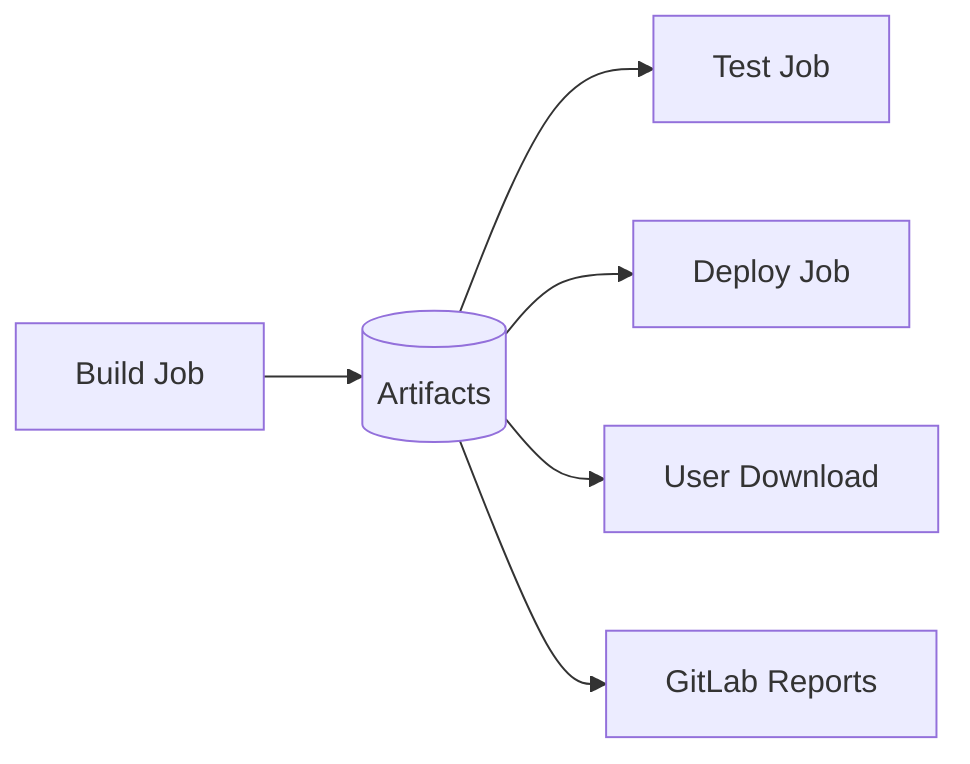

# How to Use Artifacts in GitLab CI

Author: [nawazdhandala](https://www.github.com/nawazdhandala)

Tags: GitLab, CI/CD, Artifacts, Build Outputs, Test Reports, Pipeline Data

Description: Master GitLab CI artifacts to pass data between jobs, store build outputs, and generate reports. Learn about artifact types, expiration, dependencies, and best practices.

---

Artifacts in GitLab CI are files created by jobs that can be passed to subsequent jobs or downloaded after the pipeline completes. Unlike cache (which is best-effort), artifacts are guaranteed to be available when needed. This guide covers everything you need to know about using artifacts effectively.

## Understanding Artifacts

Artifacts serve multiple purposes in GitLab CI:



### Artifacts vs Cache

| Feature | Artifacts | Cache |
|---------|-----------|-------|
| Purpose | Pass data between jobs | Speed up jobs |
| Guarantee | Always available | Best effort |
| Scope | Pipeline | Branch/global |
| Download | Yes, from UI | No |
| Reports | Yes | No |

## Basic Artifact Configuration

```yaml
build:
  stage: build
  script:
    - npm ci
    - npm run build
  artifacts:
    paths:
      - dist/

test:
  stage: test
  script:
    - npm test
  dependencies:
    - build
```

## Artifact Paths

### Single Path

```yaml
artifacts:
  paths:
    - build/
```

### Multiple Paths

```yaml
artifacts:
  paths:
    - dist/
    - build/
    - coverage/
```

### Glob Patterns

```yaml
artifacts:
  paths:
    - "*.jar"
    - "build/**/*.js"
    - "!build/**/*.map"  # Exclude source maps
```

## Artifact Expiration

Control how long artifacts are stored:

```yaml
build:
  artifacts:
    paths:
      - dist/
    expire_in: 1 week

# Other examples
artifacts:
  expire_in: 30 days
  # expire_in: 1 month
  # expire_in: 6 mos
  # expire_in: 1 year
  # expire_in: never
```

### Default Expiration

Set a default at the job or global level:

```yaml
default:
  artifacts:
    expire_in: 1 day

build:
  artifacts:
    paths:
      - dist/
    # Inherits 1 day expiration
```

## Artifact Names

Customize artifact archive names:

```yaml
build:
  artifacts:
    name: "${CI_JOB_NAME}-${CI_COMMIT_REF_SLUG}"
    paths:
      - dist/

# Results in: build-main.zip or build-feature-branch.zip
```

### Dynamic Names

```yaml
artifacts:
  name: "myapp-${CI_COMMIT_SHA:0:8}-${CI_JOB_NAME}"
  paths:
    - dist/
```

## Controlling Artifact Upload

### Upload on Specific Conditions

```yaml
test:
  script:
    - npm test
  artifacts:
    paths:
      - coverage/
    when: always  # Upload even if job fails

build:
  script:
    - npm run build
  artifacts:
    paths:
      - dist/
    when: on_success  # Default - only on success

debug:
  script:
    - ./debug.sh
  artifacts:
    paths:
      - logs/
    when: on_failure  # Only when job fails
```

## Job Dependencies

### Using dependencies

Control which artifacts are downloaded:

```yaml
stages:
  - build
  - test
  - deploy

build_frontend:
  stage: build
  script:
    - npm run build:frontend
  artifacts:
    paths:
      - frontend/dist/

build_backend:
  stage: build
  script:
    - npm run build:backend
  artifacts:
    paths:
      - backend/dist/

test_frontend:
  stage: test
  dependencies:
    - build_frontend  # Only download frontend artifacts
  script:
    - npm run test:frontend

deploy:
  stage: deploy
  dependencies:
    - build_frontend
    - build_backend
  script:
    - ./deploy.sh
```

### Using needs

More granular control with DAG:

```yaml
build:
  stage: build
  script:
    - npm run build
  artifacts:
    paths:
      - dist/

test:
  stage: test
  needs:
    - job: build
      artifacts: true  # Download artifacts from build
  script:
    - npm test

lint:
  stage: test
  needs:
    - job: build
      artifacts: false  # Don't need build artifacts
  script:
    - npm run lint
```

### Empty Dependencies

Download no artifacts:

```yaml
test:
  dependencies: []  # Don't download any artifacts
  script:
    - npm test
```

## Artifact Reports

GitLab can parse certain artifact types for special handling:

### JUnit Test Reports

```yaml
test:
  script:
    - npm test -- --reporter=junit --outputFile=junit.xml
  artifacts:
    reports:
      junit: junit.xml
```

### Code Coverage

```yaml
test:
  script:
    - npm test -- --coverage
  coverage: '/Lines\s*:\s*(\d+\.?\d*)%/'
  artifacts:
    reports:
      coverage_report:
        coverage_format: cobertura
        path: coverage/cobertura-coverage.xml
```

### Code Quality

```yaml
code_quality:
  image: docker:stable
  script:
    - docker run --rm -v "$PWD":/code pipelinecomponents/codeclimate codeclimate.json
  artifacts:
    reports:
      codequality: codeclimate.json
```

### SAST (Security)

```yaml
sast:
  stage: test
  artifacts:
    reports:
      sast: gl-sast-report.json
```

### Dependency Scanning

```yaml
dependency_scanning:
  artifacts:
    reports:
      dependency_scanning: gl-dependency-scanning-report.json
```

### Terraform Reports

```yaml
plan:
  script:
    - terraform plan -out=plan.cache
    - terraform show -json plan.cache > plan.json
  artifacts:
    reports:
      terraform: plan.json
```

## Dotenv Artifacts

Pass variables between jobs:

```yaml
stages:
  - prepare
  - build
  - deploy

generate_version:
  stage: prepare
  script:
    - VERSION=$(date +%Y%m%d)-${CI_COMMIT_SHORT_SHA}
    - echo "VERSION=$VERSION" >> build.env
    - echo "BUILD_DATE=$(date -u +%Y-%m-%dT%H:%M:%SZ)" >> build.env
  artifacts:
    reports:
      dotenv: build.env

build:
  stage: build
  needs:
    - generate_version
  script:
    - echo "Building version $VERSION"
    - docker build --build-arg VERSION=$VERSION -t myapp:$VERSION .

deploy:
  stage: deploy
  needs:
    - generate_version
    - build
  script:
    - echo "Deploying version $VERSION built on $BUILD_DATE"
```

## Excluding Files

Exclude files from artifacts:

```yaml
build:
  script:
    - npm run build
  artifacts:
    paths:
      - dist/
    exclude:
      - dist/**/*.map
      - dist/**/*.test.js
```

## Artifact Size Limits

Be aware of size limits:

```yaml
build:
  script:
    - npm run build
  artifacts:
    paths:
      - dist/
    # Check size before uploading
  after_script:
    - du -sh dist/
```

### Reducing Artifact Size

```yaml
build:
  script:
    - npm run build
    # Compress artifacts
    - tar -czf dist.tar.gz dist/
  artifacts:
    paths:
      - dist.tar.gz
    expire_in: 1 day
```

## Complete Example

```yaml
variables:
  npm_config_cache: "$CI_PROJECT_DIR/.npm"

stages:
  - prepare
  - build
  - test
  - package
  - deploy

default:
  cache:
    key: npm-${CI_COMMIT_REF_SLUG}
    paths:
      - .npm/

# Generate build metadata
prepare:
  stage: prepare
  script:
    - |
      echo "VERSION=${CI_COMMIT_TAG:-${CI_COMMIT_SHORT_SHA}}" >> build.env
      echo "BUILD_TIME=$(date -u +%Y-%m-%dT%H:%M:%SZ)" >> build.env
      echo "GIT_BRANCH=${CI_COMMIT_BRANCH}" >> build.env
  artifacts:
    reports:
      dotenv: build.env

# Build application
build:
  stage: build
  needs:
    - prepare
  image: node:18-alpine
  script:
    - npm ci
    - npm run build
    - echo "Built version $VERSION"
  artifacts:
    name: "build-${CI_COMMIT_SHORT_SHA}"
    paths:
      - dist/
      - node_modules/
    exclude:
      - node_modules/.cache/
    expire_in: 1 day

# Run unit tests
unit_tests:
  stage: test
  needs:
    - job: build
      artifacts: true
  image: node:18-alpine
  script:
    - npm run test:unit -- --coverage
  coverage: '/Lines\s*:\s*(\d+\.?\d*)%/'
  artifacts:
    when: always
    paths:
      - coverage/
    reports:
      junit: junit.xml
      coverage_report:
        coverage_format: cobertura
        path: coverage/cobertura-coverage.xml
    expire_in: 1 week

# Run integration tests
integration_tests:
  stage: test
  needs:
    - job: build
      artifacts: true
  image: node:18-alpine
  services:
    - postgres:15-alpine
  variables:
    POSTGRES_DB: test
    POSTGRES_USER: test
    POSTGRES_PASSWORD: test
  script:
    - npm run test:integration
  artifacts:
    when: always
    reports:
      junit: integration-junit.xml
    expire_in: 1 week

# Lint and quality checks
lint:
  stage: test
  needs:
    - job: build
      artifacts: false
  image: node:18-alpine
  script:
    - npm ci
    - npm run lint -- --format json --output-file eslint-report.json
  artifacts:
    reports:
      codequality: eslint-report.json
    expire_in: 1 week
  allow_failure: true

# Package for deployment
package:
  stage: package
  needs:
    - prepare
    - build
    - unit_tests
    - integration_tests
  image: docker:24.0
  services:
    - docker:24.0-dind
  script:
    - docker login -u $CI_REGISTRY_USER -p $CI_REGISTRY_PASSWORD $CI_REGISTRY
    - docker build -t $CI_REGISTRY_IMAGE:$VERSION .
    - docker push $CI_REGISTRY_IMAGE:$VERSION
  artifacts:
    reports:
      dotenv: build.env  # Re-export for deploy

# Deploy to staging
deploy_staging:
  stage: deploy
  needs:
    - package
  environment:
    name: staging
    url: https://staging.example.com
  script:
    - echo "Deploying $VERSION to staging"
    - ./deploy.sh staging $VERSION
  artifacts:
    name: "deploy-staging-${CI_COMMIT_SHORT_SHA}"
    paths:
      - deploy-log.txt
    when: always
    expire_in: 1 month

# Deploy to production
deploy_production:
  stage: deploy
  needs:
    - package
    - deploy_staging
  environment:
    name: production
    url: https://example.com
  script:
    - echo "Deploying $VERSION to production"
    - ./deploy.sh production $VERSION
  artifacts:
    name: "deploy-production-${CI_COMMIT_SHORT_SHA}"
    paths:
      - deploy-log.txt
    when: always
    expire_in: 1 year
  when: manual
  only:
    - main
```

## Browsing and Downloading Artifacts

### From GitLab UI

1. Navigate to CI/CD > Pipelines
2. Click on the pipeline
3. Click on the job
4. Use "Browse" or "Download" buttons

### From API

```bash
# Download artifacts
curl --header "PRIVATE-TOKEN: $TOKEN" \
  "https://gitlab.com/api/v4/projects/$PROJECT_ID/jobs/$JOB_ID/artifacts" \
  --output artifacts.zip

# Download specific file
curl --header "PRIVATE-TOKEN: $TOKEN" \
  "https://gitlab.com/api/v4/projects/$PROJECT_ID/jobs/$JOB_ID/artifacts/path/to/file"
```

## Best Practices

1. **Set expiration times**: Avoid filling storage with old artifacts
2. **Use meaningful names**: Include commit SHA or version in artifact names
3. **Exclude unnecessary files**: Source maps, dev dependencies, etc.
4. **Use dependencies/needs**: Only download what each job needs
5. **Leverage reports**: Let GitLab parse test results and coverage
6. **Compress large artifacts**: Reduce upload/download times
7. **Use dotenv for variables**: Pass dynamic values between jobs

## Conclusion

Artifacts are fundamental to building effective GitLab CI pipelines. They enable data sharing between jobs, provide test reports integrated into merge requests, and allow you to download build outputs. Proper artifact management leads to faster, more reliable pipelines with better visibility into build results.
