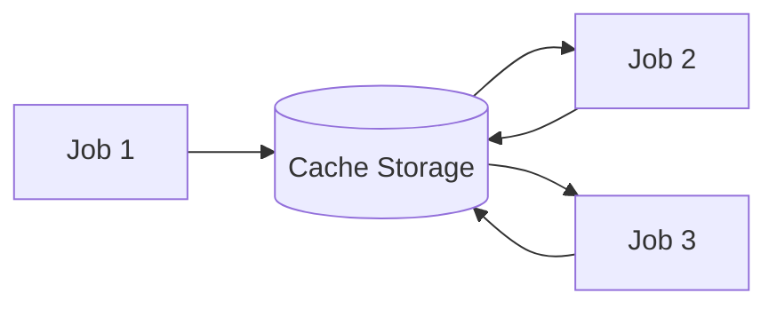

# How to Cache Dependencies in GitLab CI

Author: [nawazdhandala](https://www.github.com/nawazdhandala)

Tags: GitLab, CI/CD, Caching, Performance, Dependencies, Build Optimization

Description: Learn how to effectively cache dependencies in GitLab CI to dramatically speed up your pipelines. This guide covers cache configuration, strategies, and troubleshooting common issues.

---

Caching is one of the most effective ways to speed up GitLab CI pipelines. By storing and reusing files between jobs and pipeline runs, you can avoid repeatedly downloading dependencies and rebuilding unchanged artifacts. This guide shows you how to implement effective caching strategies.

## Understanding GitLab CI Cache

The cache in GitLab CI stores files that jobs create and need to reuse:



### Cache vs Artifacts

Understanding the difference is crucial:

| Feature | Cache | Artifacts |
|---------|-------|-----------|
| Purpose | Speed up jobs | Pass data between jobs |
| Persistence | Best effort | Guaranteed |
| Scope | Branch/global | Pipeline |
| Use case | Dependencies | Build outputs |

## Basic Cache Configuration

Here is a simple caching setup for a Node.js project:

```yaml
cache:
  key: ${CI_COMMIT_REF_SLUG}
  paths:
    - node_modules/

install:
  script:
    - npm ci

test:
  script:
    - npm test

build:
  script:
    - npm run build
```

## Cache Keys

Cache keys determine when cached data is reused or refreshed.

### Branch-Based Keys

```yaml
cache:
  key: ${CI_COMMIT_REF_SLUG}
  paths:
    - node_modules/
```

### File-Based Keys

Invalidate cache when dependency files change:

```yaml
cache:
  key:
    files:
      - package-lock.json
  paths:
    - node_modules/
```

### Composite Keys

Combine multiple factors:

```yaml
cache:
  key:
    prefix: ${CI_JOB_NAME}
    files:
      - Gemfile.lock
      - package-lock.json
  paths:
    - vendor/
    - node_modules/
```

## Cache Policies

Control how jobs interact with the cache:

```yaml
stages:
  - setup
  - test

# Only push to cache, don't pull
install_dependencies:
  stage: setup
  cache:
    key: deps-${CI_COMMIT_REF_SLUG}
    paths:
      - node_modules/
    policy: push
  script:
    - npm ci

# Only pull from cache, don't push
run_tests:
  stage: test
  cache:
    key: deps-${CI_COMMIT_REF_SLUG}
    paths:
      - node_modules/
    policy: pull
  script:
    - npm test
```

### Policy Options

- `pull-push` (default): Download cache at start, upload at end
- `pull`: Only download cache, never upload
- `push`: Only upload cache, don't download existing

## Language-Specific Caching

### Node.js

```yaml
variables:
  npm_config_cache: "$CI_PROJECT_DIR/.npm"

cache:
  key:
    files:
      - package-lock.json
  paths:
    - .npm/
    - node_modules/

install:
  script:
    - npm ci --cache .npm --prefer-offline
```

### Python

```yaml
variables:
  PIP_CACHE_DIR: "$CI_PROJECT_DIR/.pip-cache"

cache:
  key:
    files:
      - requirements.txt
  paths:
    - .pip-cache/
    - venv/

install:
  script:
    - python -m venv venv
    - source venv/bin/activate
    - pip install -r requirements.txt
```

### Go

```yaml
variables:
  GOPATH: "$CI_PROJECT_DIR/.go"

cache:
  key:
    files:
      - go.sum
  paths:
    - .go/pkg/mod/

build:
  script:
    - go build ./...
```

### Ruby

```yaml
variables:
  BUNDLE_PATH: vendor/bundle

cache:
  key:
    files:
      - Gemfile.lock
  paths:
    - vendor/bundle/

install:
  script:
    - bundle install --jobs $(nproc)
```

### Java/Maven

```yaml
variables:
  MAVEN_OPTS: "-Dmaven.repo.local=$CI_PROJECT_DIR/.m2/repository"

cache:
  key:
    files:
      - pom.xml
  paths:
    - .m2/repository/

build:
  script:
    - mvn package -B
```

## Multiple Caches

Use multiple caches for different purposes:

```yaml
test:
  cache:
    - key:
        files:
          - package-lock.json
      paths:
        - node_modules/
    - key:
        files:
          - requirements.txt
      paths:
        - .pip-cache/
  script:
    - npm test
    - python -m pytest
```

## Global vs Job-Specific Cache

```yaml
# Global cache available to all jobs
cache:
  key: global-deps
  paths:
    - .cache/

build:
  # Override global cache for this job
  cache:
    key: build-cache-${CI_COMMIT_REF_SLUG}
    paths:
      - build/
      - node_modules/
  script:
    - npm run build

deploy:
  # Disable cache for this job
  cache: []
  script:
    - ./deploy.sh
```

## Cache Fallback Keys

Provide fallback keys when primary cache misses:

```yaml
cache:
  key: ${CI_COMMIT_REF_SLUG}
  paths:
    - node_modules/
  fallback_keys:
    - main
    - default
```

This tries caches in order:
1. Current branch cache
2. Main branch cache
3. Default cache

## Combining Cache with Artifacts

Use both for optimal pipeline performance:

```yaml
stages:
  - install
  - build
  - test
  - deploy

install:
  stage: install
  cache:
    key:
      files:
        - package-lock.json
    paths:
      - node_modules/
    policy: push
  script:
    - npm ci
  artifacts:
    paths:
      - node_modules/
    expire_in: 1 hour

build:
  stage: build
  dependencies:
    - install
  script:
    - npm run build
  artifacts:
    paths:
      - dist/
    expire_in: 1 week

test:
  stage: test
  dependencies:
    - install
  script:
    - npm test

deploy:
  stage: deploy
  dependencies:
    - build
  script:
    - ./deploy.sh dist/
```

## Debugging Cache Issues

### Check Cache Status

```yaml
debug_cache:
  cache:
    key: debug-${CI_COMMIT_REF_SLUG}
    paths:
      - node_modules/
  script:
    - echo "Cache key: debug-${CI_COMMIT_REF_SLUG}"
    - ls -la node_modules/ 2>/dev/null || echo "node_modules not found"
    - du -sh node_modules/ 2>/dev/null || echo "Cannot measure size"
```

### Clear Cache

To clear the cache:

1. Change the cache key
2. Use the GitLab UI: CI/CD > Pipelines > Clear Runner Caches
3. Add a random prefix temporarily

```yaml
cache:
  key: v2-${CI_COMMIT_REF_SLUG}  # Bump version to clear
  paths:
    - node_modules/
```

## Performance Optimization Tips

### 1. Cache Only What You Need

```yaml
# Good - specific paths
cache:
  paths:
    - node_modules/
    - .npm/

# Bad - too broad
cache:
  paths:
    - ./
```

### 2. Use Separate Caches for Different Jobs

```yaml
lint:
  cache:
    key: lint-${CI_COMMIT_REF_SLUG}
    paths:
      - node_modules/
  script:
    - npm run lint

test:
  cache:
    key: test-${CI_COMMIT_REF_SLUG}
    paths:
      - node_modules/
      - .jest-cache/
  script:
    - npm test -- --cache-directory=.jest-cache
```

### 3. Consider Cache Size

```yaml
# Monitor cache size
check_cache:
  script:
    - du -sh node_modules/
    - du -sh .npm/
    - find node_modules -type f | wc -l
```

### 4. Use Distributed Cache

For teams using multiple runners:

```yaml
cache:
  key: shared-deps
  paths:
    - node_modules/
  # S3-based distributed cache configured at runner level
```

## Complete Example

Here is a comprehensive caching setup:

```yaml
variables:
  npm_config_cache: "$CI_PROJECT_DIR/.npm"
  PIP_CACHE_DIR: "$CI_PROJECT_DIR/.pip"

stages:
  - prepare
  - build
  - test
  - deploy

.node_cache:
  cache:
    key:
      files:
        - package-lock.json
    paths:
      - .npm/
      - node_modules/

.python_cache:
  cache:
    key:
      files:
        - requirements.txt
    paths:
      - .pip/
      - venv/

install_node:
  stage: prepare
  extends: .node_cache
  cache:
    policy: push
  script:
    - npm ci --cache .npm

install_python:
  stage: prepare
  extends: .python_cache
  cache:
    policy: push
  script:
    - python -m venv venv
    - source venv/bin/activate
    - pip install -r requirements.txt

build:
  stage: build
  extends: .node_cache
  cache:
    policy: pull
  script:
    - npm run build
  artifacts:
    paths:
      - dist/
    expire_in: 1 day

test_frontend:
  stage: test
  extends: .node_cache
  cache:
    policy: pull
  script:
    - npm test

test_backend:
  stage: test
  extends: .python_cache
  cache:
    policy: pull
  script:
    - source venv/bin/activate
    - pytest

deploy:
  stage: deploy
  cache: []
  dependencies:
    - build
  script:
    - ./deploy.sh
  only:
    - main
```

## Conclusion

Effective caching can reduce pipeline execution time by 50% or more. Key strategies include:

1. Use file-based cache keys for automatic invalidation
2. Apply appropriate cache policies (push, pull, pull-push)
3. Separate caches for different job types
4. Combine cache with artifacts appropriately
5. Monitor and optimize cache size

With proper caching, your GitLab CI pipelines will run faster, consume fewer resources, and provide quicker feedback to developers.
