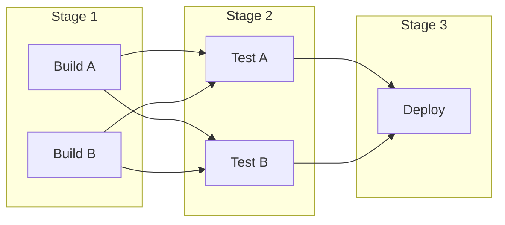
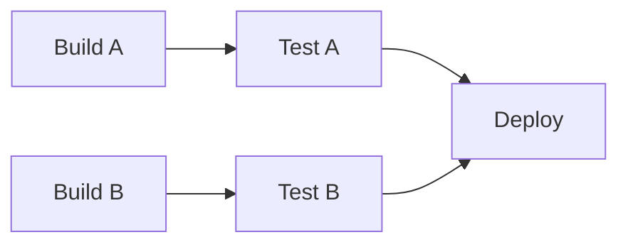

# How to Use DAG (Directed Acyclic Graph) in GitLab CI

Author: [nawazdhandala](https://www.github.com/nawazdhandala)

Tags: GitLab, CI/CD, DAG, Pipeline Optimization, Parallel Jobs, Dependencies

Description: Learn how to use Directed Acyclic Graph (DAG) in GitLab CI to create faster, more efficient pipelines by defining explicit job dependencies with the needs keyword.

---

Directed Acyclic Graph (DAG) in GitLab CI allows you to define explicit dependencies between jobs, enabling them to run as soon as their dependencies complete rather than waiting for entire stages to finish. This can dramatically reduce pipeline execution time. This guide shows you how to leverage DAG effectively.

## Understanding DAG vs Stages

Traditional stage-based execution waits for all jobs in a stage to complete:



With DAG, jobs run as soon as their specific dependencies complete:



## The needs Keyword

Use `needs` to define job dependencies:

```yaml
stages:
  - build
  - test
  - deploy

build_frontend:
  stage: build
  script:
    - npm run build:frontend
  artifacts:
    paths:
      - frontend/dist/

build_backend:
  stage: build
  script:
    - npm run build:backend
  artifacts:
    paths:
      - backend/dist/

test_frontend:
  stage: test
  needs: [build_frontend]  # Only waits for build_frontend
  script:
    - npm run test:frontend

test_backend:
  stage: test
  needs: [build_backend]  # Only waits for build_backend
  script:
    - npm run test:backend

deploy:
  stage: deploy
  needs: [test_frontend, test_backend]
  script:
    - ./deploy.sh
```

## Artifact Handling with needs

### Downloading Artifacts

By default, `needs` downloads artifacts from dependency jobs:

```yaml
build:
  script:
    - npm run build
  artifacts:
    paths:
      - dist/

test:
  needs:
    - job: build
      artifacts: true  # Default - download artifacts
  script:
    - npm test
```

### Skipping Artifact Download

```yaml
lint:
  needs:
    - job: install
      artifacts: false  # Don't download artifacts
  script:
    - npm run lint
```

### Optional Dependencies

```yaml
deploy:
  needs:
    - job: build
      artifacts: true
    - job: integration_tests
      artifacts: false
      optional: true  # Deploy even if integration_tests was skipped
  script:
    - ./deploy.sh
```

## Complex DAG Patterns

### Diamond Dependency

```yaml
stages:
  - prepare
  - build
  - test
  - deploy

install:
  stage: prepare
  script:
    - npm ci
  artifacts:
    paths:
      - node_modules/

build_app:
  stage: build
  needs: [install]
  script:
    - npm run build
  artifacts:
    paths:
      - dist/

build_docs:
  stage: build
  needs: [install]
  script:
    - npm run docs
  artifacts:
    paths:
      - docs/

test_app:
  stage: test
  needs: [build_app]
  script:
    - npm test

test_docs:
  stage: test
  needs: [build_docs]
  script:
    - npm run test:docs

deploy:
  stage: deploy
  needs: [test_app, test_docs]
  script:
    - ./deploy.sh
```

### Parallel Streams

```yaml
# API stream
build_api:
  stage: build
  script: npm run build:api
  artifacts:
    paths: [api/dist/]

test_api:
  stage: test
  needs: [build_api]
  script: npm run test:api

# Web stream
build_web:
  stage: build
  script: npm run build:web
  artifacts:
    paths: [web/dist/]

test_web:
  stage: test
  needs: [build_web]
  script: npm run test:web

# Worker stream
build_worker:
  stage: build
  script: npm run build:worker
  artifacts:
    paths: [worker/dist/]

test_worker:
  stage: test
  needs: [build_worker]
  script: npm run test:worker

# Final deployment
deploy:
  stage: deploy
  needs: [test_api, test_web, test_worker]
  script: ./deploy-all.sh
```

## Combining needs with stages

Jobs still respect stage ordering for jobs without explicit needs:

```yaml
stages:
  - build
  - test
  - deploy

build:
  stage: build
  script: npm run build

# Uses DAG - starts immediately after build
unit_tests:
  stage: test
  needs: [build]
  script: npm run test:unit

# No needs - waits for all build stage jobs
integration_tests:
  stage: test
  script: npm run test:integration

deploy:
  stage: deploy
  needs: [unit_tests, integration_tests]
  script: ./deploy.sh
```

## Empty needs Array

Start a job immediately without waiting:

```yaml
stages:
  - build
  - test

build:
  stage: build
  script: npm run build

# Starts immediately, doesn't wait for build
lint:
  stage: test
  needs: []  # No dependencies
  script: npm run lint

# Waits for build
test:
  stage: test
  needs: [build]
  script: npm test
```

## Pipeline Visualization

GitLab visualizes DAG dependencies in the pipeline graph:

```yaml
# This creates a clear visual flow
prepare:
  stage: .pre
  script: echo "Preparing"

build_a:
  stage: build
  needs: [prepare]
  script: echo "Building A"

build_b:
  stage: build
  needs: [prepare]
  script: echo "Building B"

test_a:
  stage: test
  needs: [build_a]
  script: echo "Testing A"

test_b:
  stage: test
  needs: [build_b]
  script: echo "Testing B"

deploy:
  stage: deploy
  needs: [test_a, test_b]
  script: echo "Deploying"
```

## Performance Optimization

### Before DAG

```yaml
# All test jobs wait for ALL build jobs
stages:
  - build
  - test

build_frontend:  # Takes 2 min
  stage: build
  script: npm run build:frontend

build_backend:   # Takes 5 min
  stage: build
  script: npm run build:backend

test_frontend:   # Waits 5 min (for backend)
  stage: test
  script: npm run test:frontend

test_backend:
  stage: test
  script: npm run test:backend

# Total: ~7-8 minutes
```

### After DAG

```yaml
stages:
  - build
  - test

build_frontend:  # Takes 2 min
  stage: build
  script: npm run build:frontend

build_backend:   # Takes 5 min
  stage: build
  script: npm run build:backend

test_frontend:   # Starts after 2 min
  stage: test
  needs: [build_frontend]
  script: npm run test:frontend

test_backend:    # Starts after 5 min
  stage: test
  needs: [build_backend]
  script: npm run test:backend

# Total: ~6 minutes (frontend tests run while backend builds)
```

## Limitations and Considerations

### Maximum needs Entries

GitLab limits `needs` to 50 entries per job. For complex pipelines, group related jobs:

```yaml
# Instead of many individual needs
deploy:
  needs:
    - test_a
    - test_b
    - test_c
    # ... many more

# Consider a coordinator job
all_tests_passed:
  stage: verify
  needs: [test_a, test_b, test_c]
  script: echo "All tests passed"

deploy:
  needs: [all_tests_passed]
  script: ./deploy.sh
```

### Cross-Stage needs

Jobs can depend on jobs from later stages (but this is usually a design smell):

```yaml
# Allowed but unusual
build:
  stage: build
  needs: []
  script: npm run build

validate:
  stage: test
  needs: [build]
  script: npm run validate

# build_more depends on validate from a later stage
build_more:
  stage: build
  needs: [validate]
  script: npm run build:more
```

## Complete Example

```yaml
variables:
  npm_config_cache: "$CI_PROJECT_DIR/.npm"

stages:
  - prepare
  - build
  - test
  - security
  - deploy

# Immediate jobs - no dependencies
lint:
  stage: prepare
  needs: []
  script:
    - npm ci
    - npm run lint

typecheck:
  stage: prepare
  needs: []
  script:
    - npm ci
    - npm run typecheck

# Install dependencies once
install:
  stage: prepare
  script:
    - npm ci
  artifacts:
    paths:
      - node_modules/
    expire_in: 1 hour

# Parallel builds
build_api:
  stage: build
  needs: [install]
  script:
    - npm run build:api
  artifacts:
    paths:
      - packages/api/dist/

build_web:
  stage: build
  needs: [install]
  script:
    - npm run build:web
  artifacts:
    paths:
      - packages/web/dist/

build_shared:
  stage: build
  needs: [install]
  script:
    - npm run build:shared
  artifacts:
    paths:
      - packages/shared/dist/

# Tests start as soon as their dependencies are ready
test_api:
  stage: test
  needs:
    - job: build_api
      artifacts: true
    - job: build_shared
      artifacts: true
  script:
    - npm run test:api
  artifacts:
    reports:
      junit: packages/api/junit.xml

test_web:
  stage: test
  needs:
    - job: build_web
      artifacts: true
    - job: build_shared
      artifacts: true
  script:
    - npm run test:web
  artifacts:
    reports:
      junit: packages/web/junit.xml

test_e2e:
  stage: test
  needs:
    - job: build_api
      artifacts: true
    - job: build_web
      artifacts: true
  script:
    - npm run test:e2e
  artifacts:
    when: always
    paths:
      - e2e-results/

# Security scans run in parallel
security_api:
  stage: security
  needs:
    - job: build_api
      artifacts: false
  script:
    - npm audit --workspace=packages/api

security_web:
  stage: security
  needs:
    - job: build_web
      artifacts: false
  script:
    - npm audit --workspace=packages/web

# Deploy after all tests pass
deploy_staging:
  stage: deploy
  needs:
    - test_api
    - test_web
    - test_e2e
    - security_api
    - security_web
    - lint
    - typecheck
  script:
    - ./deploy.sh staging
  environment:
    name: staging

deploy_production:
  stage: deploy
  needs:
    - deploy_staging
  script:
    - ./deploy.sh production
  environment:
    name: production
  when: manual
  rules:
    - if: $CI_COMMIT_BRANCH == "main"
```

## Debugging DAG Pipelines

### Visualize Dependencies

Use the pipeline graph in GitLab UI to see job relationships.

### Check Artifact Flow

```yaml
debug_artifacts:
  needs:
    - job: build
      artifacts: true
  script:
    - ls -la
    - find . -type f -name "*.js" | head -20
```

### Verify needs Configuration

```yaml
# CI Lint shows job dependencies
# Navigate to CI/CD > Editor > Visualize
```

## Best Practices

1. **Start simple**: Add DAG incrementally to existing pipelines
2. **Group related jobs**: Use coordinator jobs to reduce needs complexity
3. **Consider artifacts**: Only download what each job needs
4. **Maintain readability**: Clear job names indicate dependencies
5. **Test changes**: DAG changes can affect pipeline timing
6. **Use optional**: For non-critical dependencies
7. **Monitor duration**: Compare pipeline times before and after DAG

## Conclusion

DAG in GitLab CI transforms linear, stage-based pipelines into efficient, parallel workflows. By explicitly defining job dependencies with `needs`, you can significantly reduce pipeline execution time while maintaining clear job relationships. Start by identifying independent job streams in your pipeline and add `needs` to enable parallel execution.
