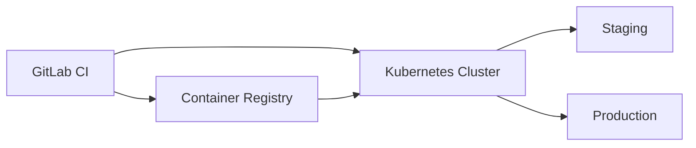

# How to Deploy to Kubernetes from GitLab CI

Author: [nawazdhandala](https://www.github.com/nawazdhandala)

Tags: GitLab, CI/CD, Kubernetes, Deployment, DevOps, Helm, kubectl

Description: Learn how to deploy applications to Kubernetes clusters using GitLab CI. This guide covers kubectl deployments, Helm charts, environments, and production-ready deployment strategies.

---

Deploying to Kubernetes from GitLab CI enables automated, consistent, and traceable deployments. GitLab provides excellent Kubernetes integration, including built-in cluster management, environments, and deployment tracking. This guide shows you how to set up reliable Kubernetes deployments.

## Deployment Architecture



## Basic kubectl Deployment

The simplest approach uses kubectl directly:

```yaml
stages:
  - build
  - deploy

variables:
  IMAGE_TAG: $CI_REGISTRY_IMAGE:$CI_COMMIT_SHA

build:
  stage: build
  image: docker:24.0
  services:
    - docker:24.0-dind
  script:
    - docker login -u $CI_REGISTRY_USER -p $CI_REGISTRY_PASSWORD $CI_REGISTRY
    - docker build -t $IMAGE_TAG .
    - docker push $IMAGE_TAG

deploy:
  stage: deploy
  image: bitnami/kubectl:latest
  script:
    - kubectl config set-cluster k8s --server="$KUBE_URL" --certificate-authority="$KUBE_CA_PEM_FILE"
    - kubectl config set-credentials gitlab --token="$KUBE_TOKEN"
    - kubectl config set-context default --cluster=k8s --user=gitlab
    - kubectl config use-context default
    - kubectl set image deployment/myapp myapp=$IMAGE_TAG -n production
```

## Setting Up Kubernetes Credentials

### Using Service Account Token

Create a service account in your cluster:

```yaml
# k8s/gitlab-deploy-sa.yaml
apiVersion: v1
kind: ServiceAccount
metadata:
  name: gitlab-deploy
  namespace: default
---
apiVersion: rbac.authorization.k8s.io/v1
kind: ClusterRole
metadata:
  name: gitlab-deploy-role
rules:
  - apiGroups: ["", "apps", "extensions"]
    resources: ["deployments", "services", "pods", "configmaps", "secrets"]
    verbs: ["get", "list", "watch", "create", "update", "patch", "delete"]
---
apiVersion: rbac.authorization.k8s.io/v1
kind: ClusterRoleBinding
metadata:
  name: gitlab-deploy-binding
subjects:
  - kind: ServiceAccount
    name: gitlab-deploy
    namespace: default
roleRef:
  kind: ClusterRole
  name: gitlab-deploy-role
  apiGroup: rbac.authorization.k8s.io
```

Get the token:

```bash
# Create token
kubectl create token gitlab-deploy -n default --duration=8760h

# Store as CI/CD variable KUBE_TOKEN
```

### Using kubeconfig File

Store the entire kubeconfig as a file variable:

```yaml
deploy:
  stage: deploy
  image: bitnami/kubectl:latest
  script:
    - export KUBECONFIG=$KUBECONFIG_FILE
    - kubectl get nodes
    - kubectl apply -f k8s/
```

## Deploying with Manifests

### Simple Manifest Deployment

```yaml
# k8s/deployment.yaml
apiVersion: apps/v1
kind: Deployment
metadata:
  name: myapp
  namespace: production
spec:
  replicas: 3
  selector:
    matchLabels:
      app: myapp
  template:
    metadata:
      labels:
        app: myapp
    spec:
      containers:
        - name: myapp
          image: IMAGE_PLACEHOLDER
          ports:
            - containerPort: 3000
          resources:
            requests:
              cpu: 100m
              memory: 128Mi
            limits:
              cpu: 500m
              memory: 512Mi
```

```yaml
# .gitlab-ci.yml
deploy:
  stage: deploy
  image: bitnami/kubectl:latest
  script:
    - sed -i "s|IMAGE_PLACEHOLDER|$CI_REGISTRY_IMAGE:$CI_COMMIT_SHA|g" k8s/deployment.yaml
    - kubectl apply -f k8s/deployment.yaml
    - kubectl rollout status deployment/myapp -n production
```

### Using Kustomize

```yaml
# k8s/base/kustomization.yaml
apiVersion: kustomize.config.k8s.io/v1beta1
kind: Kustomization
resources:
  - deployment.yaml
  - service.yaml

# k8s/overlays/production/kustomization.yaml
apiVersion: kustomize.config.k8s.io/v1beta1
kind: Kustomization
bases:
  - ../../base
namespace: production
images:
  - name: myapp
    newName: registry.gitlab.com/mygroup/myapp
    newTag: latest
```

```yaml
# .gitlab-ci.yml
deploy_production:
  stage: deploy
  image: bitnami/kubectl:latest
  script:
    - cd k8s/overlays/production
    - kustomize edit set image myapp=$CI_REGISTRY_IMAGE:$CI_COMMIT_SHA
    - kubectl apply -k .
    - kubectl rollout status deployment/myapp -n production
```

## Deploying with Helm

### Basic Helm Deployment

```yaml
deploy:
  stage: deploy
  image: alpine/helm:3.13
  script:
    - helm repo add myrepo https://charts.example.com
    - helm upgrade --install myapp myrepo/myapp
      --namespace production
      --set image.repository=$CI_REGISTRY_IMAGE
      --set image.tag=$CI_COMMIT_SHA
      --wait
```

### Using Local Helm Chart

```yaml
# Chart structure
# helm/myapp/
#   Chart.yaml
#   values.yaml
#   templates/
#     deployment.yaml
#     service.yaml

deploy:
  stage: deploy
  image: alpine/helm:3.13
  before_script:
    - mkdir -p /root/.kube
    - echo "$KUBECONFIG_CONTENT" > /root/.kube/config
  script:
    - helm upgrade --install myapp ./helm/myapp
      --namespace production
      --set image.repository=$CI_REGISTRY_IMAGE
      --set image.tag=$CI_COMMIT_SHA
      --set replicaCount=3
      --wait
      --timeout 5m
```

### Environment-Specific Values

```yaml
# helm/myapp/values-staging.yaml
replicaCount: 1
resources:
  requests:
    cpu: 100m
    memory: 128Mi

# helm/myapp/values-production.yaml
replicaCount: 3
resources:
  requests:
    cpu: 500m
    memory: 512Mi
```

```yaml
deploy_staging:
  stage: deploy
  script:
    - helm upgrade --install myapp ./helm/myapp
      -f helm/myapp/values-staging.yaml
      --namespace staging
      --set image.tag=$CI_COMMIT_SHA

deploy_production:
  stage: deploy
  script:
    - helm upgrade --install myapp ./helm/myapp
      -f helm/myapp/values-production.yaml
      --namespace production
      --set image.tag=$CI_COMMIT_SHA
  when: manual
```

## GitLab Environments

Track deployments with GitLab environments:

```yaml
deploy_staging:
  stage: deploy
  script:
    - kubectl apply -f k8s/staging/
  environment:
    name: staging
    url: https://staging.example.com
  only:
    - develop

deploy_production:
  stage: deploy
  script:
    - kubectl apply -f k8s/production/
  environment:
    name: production
    url: https://example.com
  when: manual
  only:
    - main
```

### Dynamic Environments

```yaml
deploy_review:
  stage: deploy
  script:
    - kubectl create namespace review-$CI_COMMIT_REF_SLUG || true
    - helm upgrade --install myapp-$CI_COMMIT_REF_SLUG ./helm/myapp
      --namespace review-$CI_COMMIT_REF_SLUG
      --set image.tag=$CI_COMMIT_SHA
      --set ingress.host=$CI_COMMIT_REF_SLUG.review.example.com
  environment:
    name: review/$CI_COMMIT_REF_SLUG
    url: https://$CI_COMMIT_REF_SLUG.review.example.com
    on_stop: stop_review
  only:
    - merge_requests

stop_review:
  stage: deploy
  script:
    - helm uninstall myapp-$CI_COMMIT_REF_SLUG --namespace review-$CI_COMMIT_REF_SLUG
    - kubectl delete namespace review-$CI_COMMIT_REF_SLUG
  environment:
    name: review/$CI_COMMIT_REF_SLUG
    action: stop
  when: manual
  only:
    - merge_requests
```

## Deployment Strategies

### Rolling Update

```yaml
# k8s/deployment.yaml
spec:
  strategy:
    type: RollingUpdate
    rollingUpdate:
      maxSurge: 25%
      maxUnavailable: 25%
```

### Blue-Green Deployment

```yaml
deploy_blue_green:
  stage: deploy
  script:
    # Deploy new version as green
    - kubectl apply -f k8s/deployment-green.yaml
    - kubectl rollout status deployment/myapp-green -n production

    # Run smoke tests
    - ./scripts/smoke-test.sh green.internal.example.com

    # Switch traffic
    - kubectl patch service myapp -n production
      -p '{"spec":{"selector":{"version":"green"}}}'

    # Remove old blue deployment
    - kubectl delete deployment myapp-blue -n production || true

    # Rename green to blue for next deployment
    - kubectl label deployment myapp-green version=blue --overwrite
```

### Canary Deployment

```yaml
deploy_canary:
  stage: deploy
  script:
    # Deploy canary (10% of replicas)
    - kubectl apply -f k8s/deployment-canary.yaml
    - kubectl scale deployment myapp-canary --replicas=1 -n production

    # Wait and monitor
    - sleep 300
    - ./scripts/check-error-rate.sh

    # If successful, scale up canary and scale down stable
    - kubectl scale deployment myapp-canary --replicas=3 -n production
    - kubectl scale deployment myapp-stable --replicas=0 -n production
```

## Complete Pipeline Example

```yaml
variables:
  IMAGE_TAG: $CI_REGISTRY_IMAGE:$CI_COMMIT_SHA
  DOCKER_HOST: tcp://docker:2376
  DOCKER_TLS_CERTDIR: "/certs"

stages:
  - build
  - test
  - deploy
  - cleanup

.kube_setup:
  image: bitnami/kubectl:latest
  before_script:
    - kubectl config set-cluster k8s --server="$KUBE_URL" --insecure-skip-tls-verify=true
    - kubectl config set-credentials gitlab --token="$KUBE_TOKEN"
    - kubectl config set-context default --cluster=k8s --user=gitlab
    - kubectl config use-context default

build:
  stage: build
  image: docker:24.0
  services:
    - docker:24.0-dind
  script:
    - docker login -u $CI_REGISTRY_USER -p $CI_REGISTRY_PASSWORD $CI_REGISTRY
    - docker build -t $IMAGE_TAG -t $CI_REGISTRY_IMAGE:latest .
    - docker push $IMAGE_TAG
    - docker push $CI_REGISTRY_IMAGE:latest

test:
  stage: test
  image: $IMAGE_TAG
  script:
    - npm test

deploy_staging:
  extends: .kube_setup
  stage: deploy
  script:
    - kubectl create namespace staging || true
    - |
      cat <<EOF | kubectl apply -f -
      apiVersion: apps/v1
      kind: Deployment
      metadata:
        name: myapp
        namespace: staging
      spec:
        replicas: 2
        selector:
          matchLabels:
            app: myapp
        template:
          metadata:
            labels:
              app: myapp
          spec:
            containers:
            - name: myapp
              image: $IMAGE_TAG
              ports:
              - containerPort: 3000
      EOF
    - kubectl rollout status deployment/myapp -n staging --timeout=300s
  environment:
    name: staging
    url: https://staging.example.com
  only:
    - develop

deploy_production:
  extends: .kube_setup
  stage: deploy
  script:
    - kubectl set image deployment/myapp myapp=$IMAGE_TAG -n production
    - kubectl rollout status deployment/myapp -n production --timeout=300s
  environment:
    name: production
    url: https://example.com
  when: manual
  only:
    - main

rollback_production:
  extends: .kube_setup
  stage: cleanup
  script:
    - kubectl rollout undo deployment/myapp -n production
    - kubectl rollout status deployment/myapp -n production
  environment:
    name: production
  when: manual
  only:
    - main
```

## Monitoring Deployments

### Deployment Status Check

```yaml
deploy:
  script:
    - kubectl apply -f k8s/
    - |
      if ! kubectl rollout status deployment/myapp -n production --timeout=300s; then
        echo "Deployment failed, rolling back"
        kubectl rollout undo deployment/myapp -n production
        exit 1
      fi
```

### Health Check After Deploy

```yaml
verify_deployment:
  stage: verify
  script:
    - sleep 30  # Wait for pods to stabilize
    - |
      READY=$(kubectl get deployment myapp -n production -o jsonpath='{.status.readyReplicas}')
      DESIRED=$(kubectl get deployment myapp -n production -o jsonpath='{.spec.replicas}')
      if [ "$READY" != "$DESIRED" ]; then
        echo "Deployment unhealthy: $READY/$DESIRED pods ready"
        exit 1
      fi
    - curl -f https://example.com/health || exit 1
```

## Conclusion

Deploying to Kubernetes from GitLab CI provides automated, consistent deployments with full traceability. Key practices:

1. Store credentials securely as CI/CD variables
2. Use Helm or Kustomize for templating
3. Implement GitLab environments for tracking
4. Choose appropriate deployment strategies
5. Include rollback mechanisms
6. Verify deployments with health checks

With these patterns, your Kubernetes deployments will be reliable, repeatable, and easy to manage.
