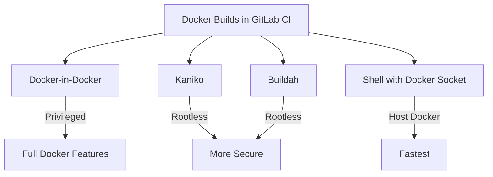

# How to Set Up Docker Builds in GitLab CI

Author: [nawazdhandala](https://www.github.com/nawazdhandala)

Tags: GitLab, CI/CD, Docker, Container Registry, DevOps, Containerization

Description: Learn how to build, test, and push Docker images using GitLab CI. This guide covers Docker-in-Docker, Kaniko builds, multi-stage builds, and best practices for container pipelines.

---

Building Docker images in CI/CD pipelines is essential for modern application deployment. GitLab CI provides multiple approaches for Docker builds, from Docker-in-Docker to rootless alternatives like Kaniko. This guide covers everything you need to containerize your applications effectively.

## Docker Build Approaches

GitLab CI offers several methods for building Docker images:



## Docker-in-Docker Setup

The most common approach uses Docker-in-Docker (dind):

```yaml
variables:
  DOCKER_HOST: tcp://docker:2376
  DOCKER_TLS_CERTDIR: "/certs"
  DOCKER_TLS_VERIFY: 1
  DOCKER_CERT_PATH: "$DOCKER_TLS_CERTDIR/client"

build:
  image: docker:24.0
  services:
    - docker:24.0-dind
  script:
    - docker info
    - docker build -t myapp:latest .
    - docker push myapp:latest
```

### Without TLS (Development Only)

```yaml
variables:
  DOCKER_HOST: tcp://docker:2375
  DOCKER_TLS_CERTDIR: ""

build:
  image: docker:24.0
  services:
    - docker:24.0-dind
  script:
    - docker build -t myapp .
```

## Using GitLab Container Registry

GitLab provides a built-in container registry:

```yaml
variables:
  DOCKER_HOST: tcp://docker:2376
  DOCKER_TLS_CERTDIR: "/certs"

stages:
  - build
  - deploy

build_image:
  stage: build
  image: docker:24.0
  services:
    - docker:24.0-dind
  before_script:
    - docker login -u $CI_REGISTRY_USER -p $CI_REGISTRY_PASSWORD $CI_REGISTRY
  script:
    - docker build -t $CI_REGISTRY_IMAGE:$CI_COMMIT_SHA .
    - docker build -t $CI_REGISTRY_IMAGE:latest .
    - docker push $CI_REGISTRY_IMAGE:$CI_COMMIT_SHA
    - docker push $CI_REGISTRY_IMAGE:latest
  only:
    - main
```

### Complete Registry Workflow

```yaml
variables:
  DOCKER_HOST: tcp://docker:2376
  DOCKER_TLS_CERTDIR: "/certs"
  IMAGE_TAG: $CI_REGISTRY_IMAGE:$CI_COMMIT_REF_SLUG

stages:
  - build
  - test
  - release

build:
  stage: build
  image: docker:24.0
  services:
    - docker:24.0-dind
  before_script:
    - docker login -u $CI_REGISTRY_USER -p $CI_REGISTRY_PASSWORD $CI_REGISTRY
  script:
    - docker pull $CI_REGISTRY_IMAGE:latest || true
    - docker build --cache-from $CI_REGISTRY_IMAGE:latest -t $IMAGE_TAG .
    - docker push $IMAGE_TAG

test_image:
  stage: test
  image: docker:24.0
  services:
    - docker:24.0-dind
  before_script:
    - docker login -u $CI_REGISTRY_USER -p $CI_REGISTRY_PASSWORD $CI_REGISTRY
  script:
    - docker pull $IMAGE_TAG
    - docker run $IMAGE_TAG npm test

release:
  stage: release
  image: docker:24.0
  services:
    - docker:24.0-dind
  before_script:
    - docker login -u $CI_REGISTRY_USER -p $CI_REGISTRY_PASSWORD $CI_REGISTRY
  script:
    - docker pull $IMAGE_TAG
    - docker tag $IMAGE_TAG $CI_REGISTRY_IMAGE:$CI_COMMIT_TAG
    - docker tag $IMAGE_TAG $CI_REGISTRY_IMAGE:latest
    - docker push $CI_REGISTRY_IMAGE:$CI_COMMIT_TAG
    - docker push $CI_REGISTRY_IMAGE:latest
  only:
    - tags
```

## Building with Kaniko

Kaniko builds containers without requiring privileged mode:

```yaml
build:
  stage: build
  image:
    name: gcr.io/kaniko-project/executor:v1.18.0-debug
    entrypoint: [""]
  script:
    - /kaniko/executor
      --context "${CI_PROJECT_DIR}"
      --dockerfile "${CI_PROJECT_DIR}/Dockerfile"
      --destination "${CI_REGISTRY_IMAGE}:${CI_COMMIT_TAG}"
```

### Kaniko with GitLab Registry

```yaml
build:
  stage: build
  image:
    name: gcr.io/kaniko-project/executor:v1.18.0-debug
    entrypoint: [""]
  script:
    - mkdir -p /kaniko/.docker
    - echo "{\"auths\":{\"${CI_REGISTRY}\":{\"auth\":\"$(printf "%s:%s" "${CI_REGISTRY_USER}" "${CI_REGISTRY_PASSWORD}" | base64 | tr -d '\n')\"}}}" > /kaniko/.docker/config.json
    - /kaniko/executor
      --context "${CI_PROJECT_DIR}"
      --dockerfile "${CI_PROJECT_DIR}/Dockerfile"
      --destination "${CI_REGISTRY_IMAGE}:${CI_COMMIT_SHA}"
      --destination "${CI_REGISTRY_IMAGE}:latest"
```

## Multi-Stage Dockerfile

Create efficient images with multi-stage builds:

```dockerfile
# Build stage
FROM node:18-alpine AS builder
WORKDIR /app
COPY package*.json ./
RUN npm ci --only=production
COPY . .
RUN npm run build

# Production stage
FROM node:18-alpine AS production
WORKDIR /app
RUN addgroup -g 1001 -S nodejs && adduser -S nodejs -u 1001
COPY --from=builder --chown=nodejs:nodejs /app/dist ./dist
COPY --from=builder --chown=nodejs:nodejs /app/node_modules ./node_modules
USER nodejs
EXPOSE 3000
CMD ["node", "dist/index.js"]
```

```yaml
build:
  stage: build
  image: docker:24.0
  services:
    - docker:24.0-dind
  script:
    - docker build --target production -t $CI_REGISTRY_IMAGE:$CI_COMMIT_SHA .
    - docker push $CI_REGISTRY_IMAGE:$CI_COMMIT_SHA
```

## Build Arguments and Secrets

Pass build-time arguments:

```yaml
build:
  stage: build
  image: docker:24.0
  services:
    - docker:24.0-dind
  script:
    - docker build
      --build-arg NODE_ENV=production
      --build-arg VERSION=$CI_COMMIT_SHA
      --build-arg BUILD_DATE=$(date -u +"%Y-%m-%dT%H:%M:%SZ")
      -t $CI_REGISTRY_IMAGE:$CI_COMMIT_SHA .
```

### Using BuildKit Secrets

```yaml
build:
  stage: build
  image: docker:24.0
  services:
    - docker:24.0-dind
  variables:
    DOCKER_BUILDKIT: 1
  script:
    - echo "$NPM_TOKEN" > /tmp/npm_token
    - docker build
      --secret id=npm_token,src=/tmp/npm_token
      -t $CI_REGISTRY_IMAGE:$CI_COMMIT_SHA .
    - rm /tmp/npm_token
```

## Docker Layer Caching

Speed up builds with layer caching:

```yaml
variables:
  DOCKER_BUILDKIT: 1

build:
  stage: build
  image: docker:24.0
  services:
    - docker:24.0-dind
  before_script:
    - docker login -u $CI_REGISTRY_USER -p $CI_REGISTRY_PASSWORD $CI_REGISTRY
  script:
    # Pull existing image for cache
    - docker pull $CI_REGISTRY_IMAGE:latest || true

    # Build with cache
    - docker build
      --cache-from $CI_REGISTRY_IMAGE:latest
      --build-arg BUILDKIT_INLINE_CACHE=1
      -t $CI_REGISTRY_IMAGE:$CI_COMMIT_SHA
      -t $CI_REGISTRY_IMAGE:latest .

    - docker push $CI_REGISTRY_IMAGE:$CI_COMMIT_SHA
    - docker push $CI_REGISTRY_IMAGE:latest
```

## Multi-Platform Builds

Build for multiple architectures:

```yaml
build_multiplatform:
  stage: build
  image: docker:24.0
  services:
    - docker:24.0-dind
  variables:
    DOCKER_BUILDKIT: 1
  before_script:
    - docker login -u $CI_REGISTRY_USER -p $CI_REGISTRY_PASSWORD $CI_REGISTRY
    - docker buildx create --use
  script:
    - docker buildx build
      --platform linux/amd64,linux/arm64
      --push
      -t $CI_REGISTRY_IMAGE:$CI_COMMIT_SHA .
```

## Testing Docker Images

### Container Structure Tests

```yaml
test_structure:
  stage: test
  image: gcr.io/gcp-runtimes/container-structure-test:latest
  script:
    - container-structure-test test
      --image $CI_REGISTRY_IMAGE:$CI_COMMIT_SHA
      --config structure-tests.yaml
```

```yaml
# structure-tests.yaml
schemaVersion: 2.0.0
commandTests:
  - name: "node version"
    command: "node"
    args: ["--version"]
    expectedOutput: ["v18"]
fileExistenceTests:
  - name: "app files exist"
    path: "/app/dist/index.js"
    shouldExist: true
metadataTest:
  exposedPorts: ["3000"]
  user: "nodejs"
```

### Security Scanning with Trivy

```yaml
scan_image:
  stage: test
  image:
    name: aquasec/trivy:latest
    entrypoint: [""]
  script:
    - trivy image
      --exit-code 1
      --severity HIGH,CRITICAL
      --no-progress
      $CI_REGISTRY_IMAGE:$CI_COMMIT_SHA
  allow_failure: true
```

## Complete Docker Pipeline

```yaml
variables:
  DOCKER_HOST: tcp://docker:2376
  DOCKER_TLS_CERTDIR: "/certs"
  DOCKER_BUILDKIT: 1
  IMAGE_NAME: $CI_REGISTRY_IMAGE
  IMAGE_TAG: $CI_COMMIT_SHA

stages:
  - build
  - test
  - scan
  - release
  - deploy

.docker_setup:
  image: docker:24.0
  services:
    - docker:24.0-dind
  before_script:
    - docker login -u $CI_REGISTRY_USER -p $CI_REGISTRY_PASSWORD $CI_REGISTRY

build:
  extends: .docker_setup
  stage: build
  script:
    - docker pull $IMAGE_NAME:latest || true
    - docker build
      --cache-from $IMAGE_NAME:latest
      --build-arg BUILDKIT_INLINE_CACHE=1
      -t $IMAGE_NAME:$IMAGE_TAG .
    - docker push $IMAGE_NAME:$IMAGE_TAG

test_unit:
  extends: .docker_setup
  stage: test
  script:
    - docker pull $IMAGE_NAME:$IMAGE_TAG
    - docker run --rm $IMAGE_NAME:$IMAGE_TAG npm test

test_integration:
  extends: .docker_setup
  stage: test
  script:
    - docker pull $IMAGE_NAME:$IMAGE_TAG
    - docker-compose -f docker-compose.test.yml up --abort-on-container-exit
    - docker-compose -f docker-compose.test.yml down -v

security_scan:
  stage: scan
  image:
    name: aquasec/trivy:latest
    entrypoint: [""]
  script:
    - trivy image
      --exit-code 0
      --format template
      --template "@/contrib/gitlab.tpl"
      --output gl-container-scanning-report.json
      $IMAGE_NAME:$IMAGE_TAG
  artifacts:
    reports:
      container_scanning: gl-container-scanning-report.json

release_tag:
  extends: .docker_setup
  stage: release
  script:
    - docker pull $IMAGE_NAME:$IMAGE_TAG
    - docker tag $IMAGE_NAME:$IMAGE_TAG $IMAGE_NAME:$CI_COMMIT_TAG
    - docker tag $IMAGE_NAME:$IMAGE_TAG $IMAGE_NAME:latest
    - docker push $IMAGE_NAME:$CI_COMMIT_TAG
    - docker push $IMAGE_NAME:latest
  only:
    - tags

deploy_staging:
  stage: deploy
  image: bitnami/kubectl:latest
  script:
    - kubectl set image deployment/myapp
      myapp=$IMAGE_NAME:$IMAGE_TAG
      --namespace=staging
  environment:
    name: staging
  only:
    - main
```

## Best Practices

### 1. Use Specific Image Tags

```yaml
# Good
image: docker:24.0.7-alpine

# Avoid
image: docker:latest
```

### 2. Minimize Image Size

```dockerfile
FROM node:18-alpine
RUN apk add --no-cache tini
# Use tini as init
ENTRYPOINT ["/sbin/tini", "--"]
```

### 3. Clean Up

```yaml
after_script:
  - docker system prune -f || true
```

### 4. Use .dockerignore

```
node_modules
.git
.env
*.md
Dockerfile
.gitlab-ci.yml
```

## Conclusion

Docker builds in GitLab CI enable consistent, reproducible container images. Key points:

1. Choose the right build method (dind, Kaniko, or Buildah)
2. Use GitLab Container Registry for seamless integration
3. Implement layer caching to speed up builds
4. Scan images for vulnerabilities
5. Use multi-stage builds for smaller images

With these practices, your container pipelines will be fast, secure, and reliable.
