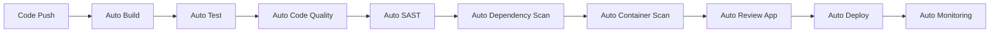

# How to Set Up Auto DevOps in GitLab

Author: [nawazdhandala](https://www.github.com/nawazdhandala)

Tags: GitLab CI, Auto DevOps, Kubernetes, DevOps, CI/CD, Automation

Description: Learn how to set up GitLab Auto DevOps to automatically build, test, and deploy your applications. This guide covers Auto DevOps configuration, customization, Kubernetes integration, and best practices.

> Auto DevOps provides a complete CI/CD pipeline out of the box, automatically detecting your application type and deploying to Kubernetes with zero configuration.

GitLab Auto DevOps is a collection of pre-configured CI/CD features that automatically build, test, secure, and deploy your applications. It detects the programming language and framework of your project and creates an appropriate pipeline without requiring you to write any `.gitlab-ci.yml` configuration.

## Understanding Auto DevOps

Auto DevOps includes multiple stages that run automatically based on your project's characteristics and configuration.



## Enabling Auto DevOps

You can enable Auto DevOps at the project level or group level.

### Project Level

Go to Settings > CI/CD > Auto DevOps and check "Default to Auto DevOps pipeline".

### Group Level

Go to Group Settings > CI/CD > Auto DevOps to enable it for all projects in the group.

### Via gitlab-ci.yml

You can also explicitly include the Auto DevOps template.

```yaml
# .gitlab-ci.yml
include:
  - template: Auto-DevOps.gitlab-ci.yml
```

## Requirements for Auto DevOps

Auto DevOps works best with the following setup.

### Kubernetes Cluster

Connect a Kubernetes cluster to your project under Infrastructure > Kubernetes clusters.

```yaml
# Example cluster configuration variables
# Set these in Settings > CI/CD > Variables
KUBE_INGRESS_BASE_DOMAIN: apps.example.com
KUBE_NAMESPACE: my-app-production
```

### Container Registry

Auto DevOps uses GitLab Container Registry by default. Ensure it is enabled under Settings > Packages and registries > Container Registry.

### Buildpacks or Dockerfile

Auto DevOps detects your application using Cloud Native Buildpacks. Alternatively, provide a Dockerfile.

## Auto DevOps Stages

### Auto Build

Auto Build creates a container image from your code. It uses Cloud Native Buildpacks to detect your language and build an appropriate image.

```yaml
# Customize build with environment variables
variables:
  # Use a specific buildpack
  BUILDPACK_URL: https://github.com/heroku/heroku-buildpack-nodejs

  # Build arguments
  AUTO_DEVOPS_BUILD_IMAGE_EXTRA_ARGS: "--build-arg NODE_ENV=production"
```

For Dockerfile-based builds, simply add a Dockerfile to your repository root.

```dockerfile
# Dockerfile
FROM node:20-alpine
WORKDIR /app
COPY package*.json ./
RUN npm ci --only=production
COPY . .
EXPOSE 3000
CMD ["node", "server.js"]
```

### Auto Test

Auto Test runs tests based on your project type. For Node.js projects, it runs `npm test`.

```yaml
# Customize test command
variables:
  TEST_DISABLED: "false"
  # Custom test command for specific frameworks
  AUTO_DEVOPS_TEST_SCRIPT: "npm run test:ci"
```

### Auto Code Quality

Auto Code Quality analyzes your code for maintainability issues using Code Climate.

```yaml
# Configure code quality
variables:
  CODE_QUALITY_DISABLED: "false"
  # Exclude certain paths
  CODE_QUALITY_EXCLUDE_PATHS: "node_modules,vendor,spec"
```

### Auto SAST (Static Application Security Testing)

Auto SAST scans your source code for security vulnerabilities.

```yaml
# Configure SAST
variables:
  SAST_DISABLED: "false"
  # Exclude paths from scanning
  SAST_EXCLUDED_PATHS: "spec, test, tests, tmp"
```

### Auto Dependency Scanning

Scans your dependencies for known vulnerabilities.

```yaml
# Configure dependency scanning
variables:
  DEPENDENCY_SCANNING_DISABLED: "false"
```

### Auto Container Scanning

Scans your built container images for vulnerabilities.

```yaml
# Configure container scanning
variables:
  CONTAINER_SCANNING_DISABLED: "false"
```

## Auto Deploy Configuration

Auto Deploy deploys your application to Kubernetes. Configure deployment behavior with variables.

```yaml
# Deployment configuration
variables:
  # Kubernetes namespace
  KUBE_NAMESPACE: my-app

  # Number of replicas
  REPLICAS: 3

  # Enable canary deployments
  CANARY_ENABLED: "true"
  CANARY_WEIGHT: 25

  # Resource limits
  KUBERNETES_MEMORY_LIMIT: 512Mi
  KUBERNETES_MEMORY_REQUEST: 256Mi
  KUBERNETES_CPU_LIMIT: "1"
  KUBERNETES_CPU_REQUEST: "100m"

  # Ingress configuration
  KUBE_INGRESS_BASE_DOMAIN: apps.example.com
  AUTO_DEVOPS_DOMAIN: apps.example.com
```

### Environment-Specific Configuration

Configure different settings for different environments.

```yaml
# Environment-specific variables in .gitlab-ci.yml
variables:
  PRODUCTION_REPLICAS: 5
  STAGING_REPLICAS: 2

# Override for production
production:
  variables:
    REPLICAS: $PRODUCTION_REPLICAS
    KUBERNETES_MEMORY_LIMIT: 1Gi

# Override for staging
staging:
  variables:
    REPLICAS: $STAGING_REPLICAS
    KUBERNETES_MEMORY_LIMIT: 512Mi
```

## Customizing Auto DevOps

You can customize Auto DevOps by overriding specific jobs while keeping the rest of the pipeline.

```yaml
# .gitlab-ci.yml
include:
  - template: Auto-DevOps.gitlab-ci.yml

# Override the build job
build:
  script:
    - echo "Custom build step"
    - docker build -t $CI_REGISTRY_IMAGE:$CI_COMMIT_SHA .
    - docker push $CI_REGISTRY_IMAGE:$CI_COMMIT_SHA

# Add a custom job
custom_validation:
  stage: test
  script:
    - ./scripts/custom-validation.sh

# Disable a specific job
code_quality:
  rules:
    - when: never
```

## Review Apps with Auto DevOps

Auto DevOps automatically creates review apps for merge requests.

```yaml
# Review app configuration
variables:
  REVIEW_DISABLED: "false"

  # Auto-stop review apps after merge
  REVIEW_APP_AUTO_STOP_IN: "1 week"
```

Review apps are deployed to URLs like `https://branch-name.apps.example.com`.

## Incremental Rollouts

Auto DevOps supports incremental rollouts to gradually shift traffic to new versions.

```yaml
# Enable incremental rollout
variables:
  INCREMENTAL_ROLLOUT_MODE: timed
  ROLLOUT_RESOURCE_TYPE: deployment

  # Rollout timing
  INCREMENTAL_ROLLOUT_INTERVAL: 60
```

Rollout modes include manual, which requires manual promotion at each step, and timed, which automatically progresses after the interval.

## Monitoring Integration

Auto DevOps integrates with Prometheus for monitoring.

```yaml
# Enable monitoring
variables:
  AUTO_DEVOPS_MODSECURITY_SEC_RULE_ENGINE: "On"

  # Prometheus metrics
  PROMETHEUS_METRICS_ENABLED: "true"
```

## Complete Custom Auto DevOps Configuration

Here is a complete example with common customizations.

```yaml
# .gitlab-ci.yml
include:
  - template: Auto-DevOps.gitlab-ci.yml

variables:
  # Application settings
  AUTO_DEVOPS_DOMAIN: apps.example.com
  KUBE_INGRESS_BASE_DOMAIN: apps.example.com

  # Build settings
  DOCKERFILE_PATH: Dockerfile

  # Deployment settings
  REPLICAS: 3
  KUBERNETES_MEMORY_LIMIT: 512Mi
  KUBERNETES_MEMORY_REQUEST: 256Mi

  # Feature flags
  STAGING_ENABLED: "true"
  CANARY_ENABLED: "true"
  INCREMENTAL_ROLLOUT_MODE: manual

  # Security scanning
  SAST_DISABLED: "false"
  DEPENDENCY_SCANNING_DISABLED: "false"
  CONTAINER_SCANNING_DISABLED: "false"

  # Review apps
  REVIEW_DISABLED: "false"
  REVIEW_APP_AUTO_STOP_IN: "3 days"

# Custom pre-build validation
validate:
  stage: .pre
  script:
    - ./scripts/validate.sh
  rules:
    - if: '$CI_COMMIT_BRANCH'

# Override test job
test:
  script:
    - npm ci
    - npm run test:coverage
  coverage: '/Lines\s*:\s*(\d+\.?\d*)%/'
  artifacts:
    reports:
      junit: junit.xml
      coverage_report:
        coverage_format: cobertura
        path: coverage/cobertura-coverage.xml

# Custom database migration before production deploy
.deploy_migrations:
  before_script:
    - echo "Running database migrations"
    - kubectl exec -it deployment/$CI_ENVIRONMENT_SLUG -- npm run migrate

production:
  extends: .deploy_migrations

# Add smoke tests after deployment
smoke_test_production:
  stage: production
  script:
    - curl -f https://www.example.com/health
    - ./scripts/smoke-tests.sh
  rules:
    - if: '$CI_COMMIT_BRANCH == "main"'
  needs:
    - job: production
      artifacts: false
```

## Auto DevOps with Helm Charts

Auto DevOps uses a default Helm chart, but you can provide your own.

```yaml
# Use custom Helm chart
variables:
  AUTO_DEVOPS_CHART: ./chart
  AUTO_DEVOPS_CHART_REPOSITORY: https://charts.example.com
  AUTO_DEVOPS_CHART_REPOSITORY_NAME: my-charts
  AUTO_DEVOPS_CHART_REPOSITORY_USERNAME: $CHART_REPO_USER
  AUTO_DEVOPS_CHART_REPOSITORY_PASSWORD: $CHART_REPO_PASS
```

Create a custom chart in your repository.

```
chart/
  Chart.yaml
  values.yaml
  templates/
    deployment.yaml
    service.yaml
    ingress.yaml
```

## Best Practices

Start with default Auto DevOps and customize incrementally as needed. Use environment-specific variables for different deployment configurations. Enable all security scanning features for comprehensive vulnerability detection. Configure review apps with auto-stop to avoid resource waste. Use incremental rollouts for production deployments to minimize risk. Monitor deployments with the built-in Prometheus integration.

Auto DevOps significantly reduces the time to set up a complete CI/CD pipeline. Even if you eventually need a fully custom pipeline, Auto DevOps provides a solid starting point that demonstrates GitLab CI best practices.
