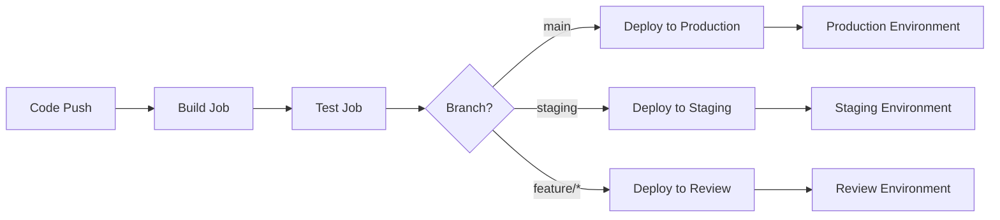

# How to Use Environments in GitLab CI

Author: [nawazdhandala](https://www.github.com/nawazdhandala)

Tags: GitLab CI, Environments, DevOps, Deployment, CI/CD

Description: Learn how to use GitLab CI environments to manage deployments across development, staging, and production. This guide covers environment configuration, dynamic environments, protected environments, and deployment tracking.

> Environments in GitLab CI provide a powerful way to track and manage deployments across your infrastructure, giving you visibility into what code is running where.

GitLab CI environments are more than just labels - they provide a complete deployment tracking system that shows you exactly what version of your code is deployed where, who deployed it, and when. They integrate with GitLab's monitoring, auto-rollback capabilities, and access controls to create a production-ready deployment workflow.

## Understanding GitLab Environments

An environment in GitLab represents a place where your code gets deployed. This could be a server, a Kubernetes cluster, a serverless function, or any other deployment target. When you define an environment in your `.gitlab-ci.yml`, GitLab tracks every deployment to that environment.



## Basic Environment Configuration

The simplest way to define an environment is to add the `environment` keyword to a deployment job.

```yaml
# .gitlab-ci.yml
stages:
  - build
  - test
  - deploy

build:
  stage: build
  script:
    - npm ci
    - npm run build
  artifacts:
    paths:
      - dist/

test:
  stage: test
  script:
    - npm test

deploy_staging:
  stage: deploy
  script:
    - echo "Deploying to staging server..."
    - rsync -avz dist/ user@staging.example.com:/var/www/app/
  environment:
    name: staging
    url: https://staging.example.com
  only:
    - develop

deploy_production:
  stage: deploy
  script:
    - echo "Deploying to production server..."
    - rsync -avz dist/ user@production.example.com:/var/www/app/
  environment:
    name: production
    url: https://example.com
  only:
    - main
  when: manual
```

The `environment` configuration includes the name used to identify the environment in GitLab and an optional URL that provides a link to access the deployed application directly from the GitLab interface.

## Dynamic Environments

Dynamic environments are created automatically based on variables like branch names. This is perfect for review apps where each feature branch gets its own isolated environment.

```yaml
# Dynamic environment for review apps
deploy_review:
  stage: deploy
  script:
    - echo "Deploying review app for branch $CI_COMMIT_REF_SLUG"
    - kubectl apply -f kubernetes/review.yml
    - kubectl set image deployment/review-$CI_COMMIT_REF_SLUG app=$CI_REGISTRY_IMAGE:$CI_COMMIT_SHA
  environment:
    name: review/$CI_COMMIT_REF_SLUG
    url: https://$CI_COMMIT_REF_SLUG.review.example.com
    on_stop: stop_review
    auto_stop_in: 1 week
  rules:
    - if: '$CI_COMMIT_BRANCH != "main" && $CI_COMMIT_BRANCH != "develop"'

stop_review:
  stage: deploy
  script:
    - echo "Stopping review app for branch $CI_COMMIT_REF_SLUG"
    - kubectl delete deployment review-$CI_COMMIT_REF_SLUG
    - kubectl delete service review-$CI_COMMIT_REF_SLUG
  environment:
    name: review/$CI_COMMIT_REF_SLUG
    action: stop
  rules:
    - if: '$CI_COMMIT_BRANCH != "main" && $CI_COMMIT_BRANCH != "develop"'
      when: manual
  allow_failure: true
```

The `on_stop` keyword links the deployment job to a cleanup job that runs when the environment is stopped. The `auto_stop_in` keyword automatically stops the environment after a specified time period.

## Protected Environments

Protected environments restrict who can deploy to critical environments like production. You configure this in the GitLab UI under Settings > CI/CD > Protected Environments.

```yaml
# Production deployment with protected environment
deploy_production:
  stage: deploy
  script:
    - echo "Deploying to production..."
    - ./scripts/deploy-production.sh
  environment:
    name: production
    url: https://example.com
  rules:
    - if: '$CI_COMMIT_BRANCH == "main"'
      when: manual
  resource_group: production
```

The `resource_group` keyword ensures only one deployment to production runs at a time, preventing race conditions during concurrent pipeline runs.

## Environment Tiers

GitLab supports environment tiers that help organize environments by their purpose. Tiers include production, staging, testing, development, and other.

```yaml
# Explicit tier configuration
deploy_staging:
  stage: deploy
  script:
    - ./deploy.sh staging
  environment:
    name: staging
    url: https://staging.example.com
    deployment_tier: staging

deploy_production:
  stage: deploy
  script:
    - ./deploy.sh production
  environment:
    name: production
    url: https://example.com
    deployment_tier: production
```

## Kubernetes Integration

When deploying to Kubernetes, GitLab environments integrate with the Kubernetes dashboard to show pod status and logs directly in the GitLab interface.

```yaml
# Kubernetes deployment with environment
deploy_k8s:
  stage: deploy
  image: bitnami/kubectl:latest
  script:
    - kubectl config use-context $KUBE_CONTEXT
    - kubectl apply -f kubernetes/deployment.yml
    - kubectl apply -f kubernetes/service.yml
    - kubectl rollout status deployment/myapp -n $KUBE_NAMESPACE
  environment:
    name: production
    url: https://myapp.example.com
    kubernetes:
      namespace: production
  only:
    - main
```

## Deployment Tracking and Rollback

Every deployment is tracked in the Environments section of your GitLab project. You can see the deployment history and roll back to any previous deployment.

```yaml
# Deployment with rollback script
deploy_production:
  stage: deploy
  script:
    - echo "Deploying version $CI_COMMIT_SHA"
    - ./scripts/deploy.sh
    - echo $CI_COMMIT_SHA > /deployments/current-version.txt
  environment:
    name: production
    url: https://example.com
  rules:
    - if: '$CI_COMMIT_BRANCH == "main"'
      when: manual

rollback_production:
  stage: deploy
  script:
    - PREVIOUS_SHA=$(cat /deployments/previous-version.txt)
    - echo "Rolling back to $PREVIOUS_SHA"
    - git checkout $PREVIOUS_SHA
    - ./scripts/deploy.sh
  environment:
    name: production
    action: stop
  when: manual
  allow_failure: true
```

## Environment Variables Per Environment

You can set environment-specific variables in the GitLab UI under Settings > CI/CD > Variables. Scope variables to specific environments.

```yaml
# Using environment-scoped variables
deploy_staging:
  stage: deploy
  script:
    # DATABASE_URL is set in GitLab UI, scoped to staging environment
    - echo "Connecting to $DATABASE_URL"
    - ./scripts/migrate.sh
    - ./scripts/deploy.sh
  environment:
    name: staging
    url: https://staging.example.com
  only:
    - develop

deploy_production:
  stage: deploy
  script:
    # Different DATABASE_URL scoped to production environment
    - echo "Connecting to $DATABASE_URL"
    - ./scripts/migrate.sh
    - ./scripts/deploy.sh
  environment:
    name: production
    url: https://example.com
  only:
    - main
  when: manual
```

## Complete Multi-Environment Pipeline

Here is a complete pipeline that demonstrates multiple environment configurations.

```yaml
# Complete multi-environment pipeline
stages:
  - build
  - test
  - deploy
  - cleanup

variables:
  DOCKER_IMAGE: $CI_REGISTRY_IMAGE:$CI_COMMIT_SHA

build:
  stage: build
  image: docker:24
  services:
    - docker:24-dind
  script:
    - docker login -u $CI_REGISTRY_USER -p $CI_REGISTRY_PASSWORD $CI_REGISTRY
    - docker build -t $DOCKER_IMAGE .
    - docker push $DOCKER_IMAGE

test:
  stage: test
  image: $DOCKER_IMAGE
  script:
    - npm test

# Review environment for feature branches
deploy_review:
  stage: deploy
  script:
    - ./scripts/deploy-review.sh $CI_COMMIT_REF_SLUG
  environment:
    name: review/$CI_COMMIT_REF_SLUG
    url: https://$CI_COMMIT_REF_SLUG.review.example.com
    on_stop: stop_review
    auto_stop_in: 3 days
  rules:
    - if: '$CI_MERGE_REQUEST_IID'

stop_review:
  stage: cleanup
  script:
    - ./scripts/cleanup-review.sh $CI_COMMIT_REF_SLUG
  environment:
    name: review/$CI_COMMIT_REF_SLUG
    action: stop
  rules:
    - if: '$CI_MERGE_REQUEST_IID'
      when: manual
  allow_failure: true

# Staging environment
deploy_staging:
  stage: deploy
  script:
    - ./scripts/deploy.sh staging
  environment:
    name: staging
    url: https://staging.example.com
    deployment_tier: staging
  rules:
    - if: '$CI_COMMIT_BRANCH == "develop"'

# Production environment
deploy_production:
  stage: deploy
  script:
    - ./scripts/deploy.sh production
  environment:
    name: production
    url: https://example.com
    deployment_tier: production
  resource_group: production
  rules:
    - if: '$CI_COMMIT_BRANCH == "main"'
      when: manual
```

## Best Practices

When working with GitLab environments, always include URLs so you can access deployed applications directly from GitLab. Use dynamic environments for feature branches to enable review apps. Set up auto-stop for temporary environments to avoid resource waste. Protect production environments and require manual approval. Use resource groups to prevent concurrent deployments to the same environment.

Environments transform GitLab from a simple CI runner into a complete deployment management platform. Combined with protected environments and deployment approvals, you get enterprise-grade deployment controls without additional tooling.
