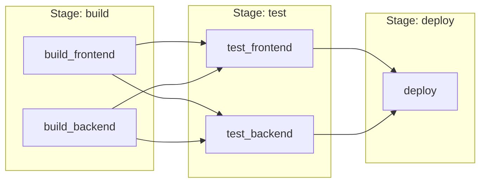
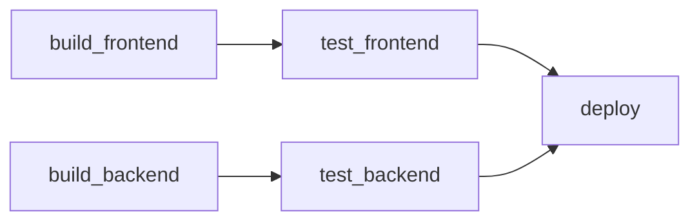

# How to Use Needs Keyword for Job Dependencies

Author: [nawazdhandala](https://www.github.com/nawazdhandala)

Tags: GitLab CI, Needs, DAG, Job Dependencies, CI/CD, Pipeline Optimization

Description: Learn how to use the needs keyword in GitLab CI to create directed acyclic graph pipelines. This guide covers job dependencies, artifact passing, and optimizing pipeline execution time.

> The needs keyword transforms your pipeline from sequential stage execution to a directed acyclic graph, allowing jobs to start as soon as their dependencies complete.

By default, GitLab CI runs all jobs in a stage in parallel, then waits for all to complete before moving to the next stage. The `needs` keyword changes this behavior, allowing jobs to start immediately when their specific dependencies finish, regardless of stage boundaries.

## Understanding Needs vs Stages

Traditional stage-based execution waits for all jobs in a stage to complete before starting the next stage.



With `needs`, jobs start as soon as their dependencies complete.



## Basic Needs Configuration

Specify which jobs a job depends on using the `needs` keyword.

```yaml
# .gitlab-ci.yml
stages:
  - build
  - test
  - deploy

build_frontend:
  stage: build
  script:
    - npm ci
    - npm run build
  artifacts:
    paths:
      - frontend/dist/

build_backend:
  stage: build
  script:
    - go build -o app
  artifacts:
    paths:
      - app

# test_frontend starts as soon as build_frontend completes
# It does not wait for build_backend
test_frontend:
  stage: test
  needs:
    - build_frontend
  script:
    - npm test

# test_backend starts as soon as build_backend completes
test_backend:
  stage: test
  needs:
    - build_backend
  script:
    - go test ./...

# deploy waits for both test jobs
deploy:
  stage: deploy
  needs:
    - test_frontend
    - test_backend
  script:
    - ./deploy.sh
```

## Needs with Artifacts

By default, `needs` downloads artifacts from the specified jobs. Control this behavior explicitly.

```yaml
build:
  stage: build
  script:
    - npm run build
  artifacts:
    paths:
      - dist/

# Automatically downloads artifacts from build
test:
  stage: test
  needs:
    - job: build
      artifacts: true
  script:
    - npm test

# Does not download artifacts, just waits for job completion
lint:
  stage: test
  needs:
    - job: build
      artifacts: false
  script:
    - npm run lint
```

## Needs with Optional Jobs

Mark dependencies as optional so the job runs even if the dependency did not run or failed.

```yaml
build:
  stage: build
  script:
    - npm run build
  rules:
    - if: '$CI_COMMIT_BRANCH == "main"'

# This job runs even if build did not run
# (e.g., on branches other than main)
test:
  stage: test
  needs:
    - job: build
      optional: true
  script:
    - npm test
```

## Needs Across Stages

Jobs can depend on jobs from any previous stage, not just the immediately preceding one.

```yaml
stages:
  - build
  - test
  - security
  - deploy

build:
  stage: build
  script:
    - npm run build
  artifacts:
    paths:
      - dist/

test:
  stage: test
  needs:
    - build
  script:
    - npm test

security_scan:
  stage: security
  needs:
    - build
  script:
    - npm audit

# Deploy needs build artifacts but does not need to wait for test and security
# They run in parallel, and deploy only starts after all complete
deploy:
  stage: deploy
  needs:
    - build
    - test
    - security_scan
  script:
    - ./deploy.sh
```

## Empty Needs

Use an empty needs array to start a job immediately without waiting for any other job.

```yaml
stages:
  - build
  - test

# Starts immediately, does not wait for build stage
static_analysis:
  stage: test
  needs: []
  script:
    - npm run lint

build:
  stage: build
  script:
    - npm run build

# Waits for build
test:
  stage: test
  needs:
    - build
  script:
    - npm test
```

## Parallel Jobs with Needs

Reference specific parallel job instances.

```yaml
build:
  stage: build
  parallel: 3
  script:
    - npm run build:part$CI_NODE_INDEX
  artifacts:
    paths:
      - dist-$CI_NODE_INDEX/

# Wait for all parallel build jobs
test:
  stage: test
  needs:
    - job: build
      parallel:
        matrix:
          - CI_NODE_INDEX: [1, 2, 3]
  script:
    - npm test
```

## Matrix Jobs with Needs

Handle dependencies with matrix jobs.

```yaml
build:
  stage: build
  parallel:
    matrix:
      - PLATFORM: [linux, macos, windows]
  script:
    - ./build.sh $PLATFORM
  artifacts:
    paths:
      - build-$PLATFORM/

# Depend on specific matrix job
test_linux:
  stage: test
  needs:
    - job: build
      parallel:
        matrix:
          - PLATFORM: linux
  script:
    - ./test.sh linux

# Depend on all matrix jobs
package:
  stage: deploy
  needs:
    - job: build
      parallel:
        matrix:
          - PLATFORM: [linux, macos, windows]
  script:
    - ./package-all.sh
```

## Complex DAG Pipeline

Build a complex pipeline with multiple dependency paths.

```yaml
stages:
  - setup
  - build
  - test
  - integration
  - deploy

# Setup runs first
install_deps:
  stage: setup
  script:
    - npm ci
  artifacts:
    paths:
      - node_modules/
  cache:
    key: $CI_COMMIT_REF_SLUG
    paths:
      - node_modules/

# Lint can start immediately after setup
lint:
  stage: build
  needs:
    - install_deps
  script:
    - npm run lint

# Build also starts after setup
build_app:
  stage: build
  needs:
    - install_deps
  script:
    - npm run build
  artifacts:
    paths:
      - dist/

# Type check runs in parallel with build
typecheck:
  stage: build
  needs:
    - install_deps
  script:
    - npm run typecheck

# Unit tests start after build
unit_tests:
  stage: test
  needs:
    - build_app
  script:
    - npm test

# E2E tests need build artifacts
e2e_tests:
  stage: test
  needs:
    - build_app
  script:
    - npm run test:e2e

# Security scan runs in parallel
security_scan:
  stage: test
  needs:
    - install_deps
  script:
    - npm audit

# Integration tests need both build and all validations
integration:
  stage: integration
  needs:
    - unit_tests
    - e2e_tests
    - lint
    - typecheck
  script:
    - npm run test:integration

# Deploy requires everything
deploy:
  stage: deploy
  needs:
    - integration
    - security_scan
  script:
    - ./deploy.sh
  rules:
    - if: '$CI_COMMIT_BRANCH == "main"'
```

## Visualizing the Pipeline DAG

GitLab automatically visualizes your pipeline as a DAG. View it in your pipeline page under the "Needs" tab.

```yaml
# This pipeline creates a clear DAG visualization
stages:
  - prepare
  - build
  - test
  - deploy

prepare:
  stage: prepare
  script: echo "Preparing"

build_a:
  stage: build
  needs: [prepare]
  script: echo "Building A"

build_b:
  stage: build
  needs: [prepare]
  script: echo "Building B"

test_a:
  stage: test
  needs: [build_a]
  script: echo "Testing A"

test_b:
  stage: test
  needs: [build_b]
  script: echo "Testing B"

deploy:
  stage: deploy
  needs: [test_a, test_b]
  script: echo "Deploying"
```

## Needs with Trigger Jobs

Reference child pipeline or downstream pipeline jobs.

```yaml
stages:
  - trigger
  - deploy

trigger_child:
  stage: trigger
  trigger:
    include: child-pipeline.yml
    strategy: depend

# Wait for the triggered pipeline to complete
deploy:
  stage: deploy
  needs:
    - trigger_child
  script:
    - ./deploy.sh
```

## Performance Optimization with Needs

Use `needs` to optimize pipeline execution time.

```yaml
# Before: Sequential execution (slow)
# Total time: build(5m) + test(10m) + deploy(2m) = 17m

# After: DAG execution (fast)
# Total time: max(build_fe + test_fe, build_be + test_be) + deploy
# = max(2m + 5m, 3m + 5m) + 2m = 10m

stages:
  - build
  - test
  - deploy

build_frontend:
  stage: build
  needs: []
  script:
    - npm run build:frontend # 2 minutes

build_backend:
  stage: build
  needs: []
  script:
    - npm run build:backend # 3 minutes

test_frontend:
  stage: test
  needs:
    - build_frontend
  script:
    - npm run test:frontend # 5 minutes

test_backend:
  stage: test
  needs:
    - build_backend
  script:
    - npm run test:backend # 5 minutes

deploy:
  stage: deploy
  needs:
    - test_frontend
    - test_backend
  script:
    - ./deploy.sh # 2 minutes
```

## Best Practices

Use `needs` when jobs have clear dependencies that do not align with stage boundaries. Keep the dependency graph simple and understandable. Use `needs: []` for jobs that can run immediately without dependencies. Always specify `artifacts: false` when you only need to wait for completion. Consider the total number of concurrent jobs your runners can handle. Use the pipeline visualization to verify your DAG structure.

The `needs` keyword is essential for optimizing complex pipelines. By explicitly defining job dependencies, you can significantly reduce pipeline execution time while maintaining the correct execution order.
