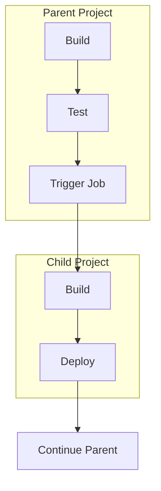

# How to Use Trigger Jobs in GitLab CI

Author: [nawazdhandala](https://www.github.com/nawazdhandala)

Tags: GitLab CI, Trigger Jobs, Multi-Project Pipelines, CI/CD, Automation

Description: Learn how to use trigger jobs in GitLab CI to create multi-project pipelines, parent-child pipelines, and cross-project dependencies. This guide covers trigger tokens, pipeline bridges, and downstream pipelines.

> Trigger jobs enable complex deployment workflows by connecting pipelines across multiple projects or creating hierarchical pipeline structures within a single project.

GitLab CI trigger jobs allow you to start pipelines in other projects or create child pipelines within the same project. This is essential for microservices architectures, monorepos, and any scenario where changes in one project should trigger builds in dependent projects.

## Understanding Trigger Jobs

Trigger jobs create a connection between pipelines. They can start a downstream pipeline in another project, create a child pipeline in the same project, or wait for the downstream pipeline to complete before continuing.



## Basic Trigger Configuration

The simplest trigger starts a pipeline in another project when a job runs.

```yaml
# .gitlab-ci.yml in parent project
stages:
  - build
  - trigger
  - deploy

build:
  stage: build
  script:
    - npm ci
    - npm run build
  artifacts:
    paths:
      - dist/

# Trigger downstream project
trigger_downstream:
  stage: trigger
  trigger:
    project: mygroup/downstream-project
    branch: main

# This runs after downstream completes
deploy:
  stage: deploy
  script:
    - ./scripts/deploy.sh
  needs:
    - trigger_downstream
```

## Passing Variables to Downstream Pipelines

You can pass variables from the parent pipeline to the downstream pipeline.

```yaml
# Parent pipeline passing variables
stages:
  - build
  - trigger

build:
  stage: build
  script:
    - npm run build
    - echo "BUILD_VERSION=$(cat package.json | jq -r .version)" >> build.env
  artifacts:
    reports:
      dotenv: build.env

trigger_downstream:
  stage: trigger
  variables:
    UPSTREAM_PROJECT: $CI_PROJECT_NAME
    UPSTREAM_COMMIT: $CI_COMMIT_SHA
    UPSTREAM_VERSION: $BUILD_VERSION
  trigger:
    project: mygroup/deployment-project
    branch: main
  needs:
    - build
```

The downstream project can access these variables in its pipeline.

```yaml
# .gitlab-ci.yml in downstream project
stages:
  - deploy

deploy:
  stage: deploy
  script:
    - echo "Triggered by $UPSTREAM_PROJECT"
    - echo "Deploying version $UPSTREAM_VERSION from commit $UPSTREAM_COMMIT"
    - ./scripts/deploy.sh $UPSTREAM_VERSION
```

## Waiting for Downstream Pipeline

By default, trigger jobs complete immediately after starting the downstream pipeline. Use `strategy: depend` to wait for the downstream pipeline to finish.

```yaml
# Wait for downstream pipeline to complete
stages:
  - build
  - integration
  - deploy

build:
  stage: build
  script:
    - npm run build

# Trigger and wait for external tests
trigger_integration_tests:
  stage: integration
  trigger:
    project: mygroup/integration-tests
    branch: main
    strategy: depend
  variables:
    SERVICE_VERSION: $CI_COMMIT_SHA

# Only runs if downstream pipeline succeeds
deploy_production:
  stage: deploy
  script:
    - ./scripts/deploy.sh
  needs:
    - trigger_integration_tests
  when: on_success
```

## Parent-Child Pipelines

Parent-child pipelines allow you to split a complex pipeline into multiple YAML files within the same project. This is useful for monorepos or when you want to dynamically generate pipeline configuration.

```yaml
# .gitlab-ci.yml (parent pipeline)
stages:
  - build
  - test
  - trigger-children
  - deploy

build:
  stage: build
  script:
    - npm run build

# Trigger child pipelines for different services
trigger_frontend:
  stage: trigger-children
  trigger:
    include: frontend/.gitlab-ci.yml
    strategy: depend

trigger_backend:
  stage: trigger-children
  trigger:
    include: backend/.gitlab-ci.yml
    strategy: depend

trigger_api:
  stage: trigger-children
  trigger:
    include: api/.gitlab-ci.yml
    strategy: depend

deploy:
  stage: deploy
  script:
    - ./scripts/deploy-all.sh
  needs:
    - trigger_frontend
    - trigger_backend
    - trigger_api
```

Each child pipeline has its own configuration file.

```yaml
# frontend/.gitlab-ci.yml (child pipeline)
stages:
  - build
  - test

build_frontend:
  stage: build
  script:
    - cd frontend
    - npm ci
    - npm run build
  artifacts:
    paths:
      - frontend/dist/

test_frontend:
  stage: test
  script:
    - cd frontend
    - npm test
```

## Dynamic Child Pipelines

You can generate pipeline configuration dynamically and use it as a child pipeline.

```yaml
# Generate pipeline configuration based on changed files
stages:
  - generate
  - trigger

generate_pipeline:
  stage: generate
  script:
    - |
      # Generate pipeline based on changed files
      cat > generated-pipeline.yml << 'EOF'
      stages:
        - test

      EOF

      # Add jobs for changed services
      for service in $(git diff --name-only HEAD~1 | cut -d/ -f1 | sort -u); do
        if [ -d "$service" ] && [ -f "$service/package.json" ]; then
          cat >> generated-pipeline.yml << EOF
      test_${service}:
        stage: test
        script:
          - cd $service
          - npm ci
          - npm test

      EOF
        fi
      done

      cat generated-pipeline.yml
  artifacts:
    paths:
      - generated-pipeline.yml

trigger_dynamic:
  stage: trigger
  trigger:
    include:
      - artifact: generated-pipeline.yml
        job: generate_pipeline
    strategy: depend
  needs:
    - generate_pipeline
```

## Multi-Project Pipelines with Dependencies

Create complex workflows that span multiple projects with proper dependency management.

```yaml
# Main application pipeline
stages:
  - build
  - trigger-deps
  - integration
  - deploy

build:
  stage: build
  script:
    - npm run build
  artifacts:
    paths:
      - dist/

# Trigger library rebuild
trigger_shared_library:
  stage: trigger-deps
  trigger:
    project: mygroup/shared-library
    branch: main
    strategy: depend
  rules:
    - changes:
        - shared/**

# Trigger API gateway update
trigger_api_gateway:
  stage: trigger-deps
  trigger:
    project: mygroup/api-gateway
    branch: main
    strategy: depend
  variables:
    SERVICE_NAME: main-app
    SERVICE_VERSION: $CI_COMMIT_SHA

# Run integration tests after all dependencies are updated
integration_tests:
  stage: integration
  script:
    - ./scripts/integration-tests.sh
  needs:
    - build
    - trigger_shared_library
    - trigger_api_gateway

deploy:
  stage: deploy
  script:
    - ./scripts/deploy.sh
  needs:
    - integration_tests
  when: manual
```

## Using Pipeline Triggers with API

You can also trigger pipelines programmatically using the GitLab API with trigger tokens.

First, create a trigger token in Settings > CI/CD > Pipeline triggers. Then use it in your pipeline.

```yaml
# Trigger external pipeline via API
stages:
  - build
  - notify

build:
  stage: build
  script:
    - npm run build

# Trigger pipeline in another project via API
notify_downstream:
  stage: notify
  script:
    - |
      curl --request POST \
        --form "token=$TRIGGER_TOKEN" \
        --form "ref=main" \
        --form "variables[UPSTREAM_PROJECT]=$CI_PROJECT_NAME" \
        --form "variables[UPSTREAM_COMMIT]=$CI_COMMIT_SHA" \
        "https://gitlab.example.com/api/v4/projects/123/trigger/pipeline"
```

## Triggering Pipelines from External Systems

External systems like GitHub, Jenkins, or custom applications can trigger GitLab pipelines using trigger tokens.

```bash
# Trigger from external system
curl --request POST \
  --form "token=YOUR_TRIGGER_TOKEN" \
  --form "ref=main" \
  --form "variables[DEPLOY_ENV]=production" \
  --form "variables[VERSION]=1.2.3" \
  "https://gitlab.com/api/v4/projects/12345/trigger/pipeline"
```

```yaml
# .gitlab-ci.yml in triggered project
stages:
  - deploy

deploy:
  stage: deploy
  script:
    - echo "Deploying version $VERSION to $DEPLOY_ENV"
    - ./scripts/deploy.sh $DEPLOY_ENV $VERSION
  rules:
    - if: '$CI_PIPELINE_SOURCE == "trigger"'
```

## Complete Multi-Project Workflow

Here is a complete example of a microservices deployment workflow using trigger jobs.

```yaml
# Main orchestration pipeline
stages:
  - validate
  - build-services
  - integration
  - deploy

variables:
  DEPLOY_VERSION: $CI_COMMIT_SHA

validate:
  stage: validate
  script:
    - ./scripts/validate-config.sh

# Build all services in parallel
build_user_service:
  stage: build-services
  trigger:
    project: mygroup/user-service
    strategy: depend
  variables:
    BUILD_VERSION: $DEPLOY_VERSION

build_order_service:
  stage: build-services
  trigger:
    project: mygroup/order-service
    strategy: depend
  variables:
    BUILD_VERSION: $DEPLOY_VERSION

build_payment_service:
  stage: build-services
  trigger:
    project: mygroup/payment-service
    strategy: depend
  variables:
    BUILD_VERSION: $DEPLOY_VERSION

# Integration tests after all services are built
integration_tests:
  stage: integration
  trigger:
    project: mygroup/integration-tests
    strategy: depend
  variables:
    USER_SERVICE_VERSION: $DEPLOY_VERSION
    ORDER_SERVICE_VERSION: $DEPLOY_VERSION
    PAYMENT_SERVICE_VERSION: $DEPLOY_VERSION
  needs:
    - build_user_service
    - build_order_service
    - build_payment_service

# Deploy all services
deploy_all:
  stage: deploy
  trigger:
    project: mygroup/deployment-orchestrator
    strategy: depend
  variables:
    DEPLOY_VERSION: $DEPLOY_VERSION
  needs:
    - integration_tests
  when: manual
```

## Best Practices

Use `strategy: depend` when you need to wait for downstream pipelines to complete before continuing. Pass only necessary variables to downstream pipelines to avoid confusion. Use parent-child pipelines for monorepos to keep configuration manageable. Protect trigger tokens and store them as CI/CD variables. Use rules to conditionally trigger downstream pipelines based on changed files or branches.

Trigger jobs transform GitLab CI from a single-project tool into an orchestration platform for complex multi-project workflows. Whether you are managing microservices, monorepos, or cross-team dependencies, trigger jobs provide the flexibility to model your deployment workflow accurately.
