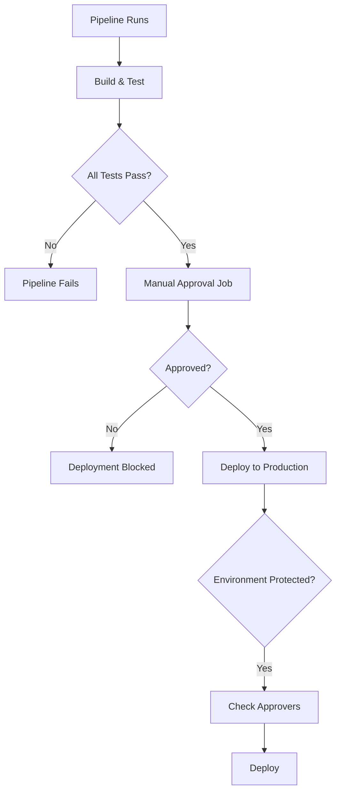

# How to Set Up Deployment Approvals in GitLab CI

Author: [nawazdhandala](https://www.github.com/nawazdhandala)

Tags: GitLab CI, Deployment Approvals, Protected Environments, CI/CD, DevOps, Security

Description: Learn how to set up deployment approvals in GitLab CI to add human oversight before deploying to production. This guide covers protected environments, approval rules, and manual deployment gates.

> Deployment approvals add a critical human checkpoint before code reaches production, ensuring that changes are reviewed and approved by the right people.

In production environments, automated deployments are not always appropriate. Sometimes you need human oversight to verify that a deployment should proceed. GitLab CI provides several mechanisms for adding approval gates to your deployment pipeline, from simple manual jobs to sophisticated protected environment configurations.

## Understanding Deployment Approvals

Deployment approvals in GitLab work through several mechanisms that can be combined for comprehensive control.



## Simple Manual Deployment Gates

The simplest form of approval is a manual job that requires someone to click a button.

```yaml
# .gitlab-ci.yml
stages:
  - build
  - test
  - approve
  - deploy

build:
  stage: build
  script:
    - npm ci
    - npm run build
  artifacts:
    paths:
      - dist/

test:
  stage: test
  script:
    - npm test

# Manual approval gate
approve_production:
  stage: approve
  script:
    - echo "Production deployment approved by $GITLAB_USER_NAME at $(date)"
  when: manual
  allow_failure: false
  rules:
    - if: '$CI_COMMIT_BRANCH == "main"'

deploy_production:
  stage: deploy
  script:
    - ./scripts/deploy.sh production
  environment:
    name: production
    url: https://example.com
  needs:
    - approve_production
  rules:
    - if: '$CI_COMMIT_BRANCH == "main"'
```

The `allow_failure: false` setting ensures that the pipeline blocks until the manual job is triggered.

## Protected Environments

Protected environments provide more granular control over who can deploy. Configure them in Settings > CI/CD > Protected environments.

```yaml
# Using protected environments
deploy_staging:
  stage: deploy
  script:
    - ./scripts/deploy.sh staging
  environment:
    name: staging
    url: https://staging.example.com
  rules:
    - if: '$CI_COMMIT_BRANCH == "develop"'

deploy_production:
  stage: deploy
  script:
    - ./scripts/deploy.sh production
  environment:
    name: production
    url: https://example.com
  rules:
    - if: '$CI_COMMIT_BRANCH == "main"'
```

In the GitLab UI, protect the production environment and specify who can deploy. You can allow specific users, groups with a certain role, or require multiple approvers.

## Multiple Approvers

For high-stakes deployments, require approval from multiple people.

```yaml
# Configuration for multi-approver workflow
stages:
  - build
  - test
  - approve
  - deploy

build:
  stage: build
  script:
    - npm run build
  artifacts:
    paths:
      - dist/

test:
  stage: test
  script:
    - npm test

# First approval - Tech Lead
tech_lead_approval:
  stage: approve
  script:
    - echo "Tech lead approval by $GITLAB_USER_NAME"
    - echo "TECH_APPROVED=true" >> approval.env
  when: manual
  allow_failure: false
  artifacts:
    reports:
      dotenv: approval.env
  rules:
    - if: '$CI_COMMIT_BRANCH == "main"'

# Second approval - QA
qa_approval:
  stage: approve
  script:
    - echo "QA approval by $GITLAB_USER_NAME"
    - echo "QA_APPROVED=true" >> qa_approval.env
  when: manual
  allow_failure: false
  needs:
    - tech_lead_approval
  artifacts:
    reports:
      dotenv: qa_approval.env
  rules:
    - if: '$CI_COMMIT_BRANCH == "main"'

deploy_production:
  stage: deploy
  script:
    - echo "Deploying with tech lead and QA approval"
    - ./scripts/deploy.sh production
  environment:
    name: production
  needs:
    - tech_lead_approval
    - qa_approval
  rules:
    - if: '$CI_COMMIT_BRANCH == "main"'
```

## Approval with Timeout

Add a timeout to approval jobs so stale deployments do not hang indefinitely.

```yaml
approve_production:
  stage: approve
  script:
    - echo "Approved by $GITLAB_USER_NAME"
  when: manual
  allow_failure: false
  timeout: 24h
  rules:
    - if: '$CI_COMMIT_BRANCH == "main"'
```

If the job is not triggered within 24 hours, the pipeline will fail.

## Deployment Windows

Restrict deployments to specific time windows using scheduled pipelines and rules.

```yaml
# Deployment window enforcement
variables:
  DEPLOYMENT_WINDOW_START: "09"
  DEPLOYMENT_WINDOW_END: "17"

check_deployment_window:
  stage: approve
  script:
    - |
      CURRENT_HOUR=$(date +%H)
      if [ "$CURRENT_HOUR" -lt "$DEPLOYMENT_WINDOW_START" ] || [ "$CURRENT_HOUR" -ge "$DEPLOYMENT_WINDOW_END" ]; then
        echo "Deployments are only allowed between ${DEPLOYMENT_WINDOW_START}:00 and ${DEPLOYMENT_WINDOW_END}:00"
        echo "Current time: $(date)"
        exit 1
      fi
      echo "Within deployment window, proceeding..."
  rules:
    - if: '$CI_COMMIT_BRANCH == "main"'

deploy_production:
  stage: deploy
  script:
    - ./scripts/deploy.sh production
  environment:
    name: production
  needs:
    - check_deployment_window
  rules:
    - if: '$CI_COMMIT_BRANCH == "main"'
```

## Approval with Validation Checks

Combine manual approval with automated validation checks.

```yaml
stages:
  - build
  - test
  - validate
  - approve
  - deploy

build:
  stage: build
  script:
    - npm run build

test:
  stage: test
  script:
    - npm test

# Automated validation before approval
security_scan:
  stage: validate
  script:
    - npm audit --audit-level=high
  allow_failure: false

dependency_check:
  stage: validate
  script:
    - ./scripts/check-dependencies.sh

# Approval only available after validation passes
approve_production:
  stage: approve
  script:
    - echo "All validations passed"
    - echo "Deployment approved by $GITLAB_USER_NAME"
  when: manual
  allow_failure: false
  needs:
    - security_scan
    - dependency_check
  rules:
    - if: '$CI_COMMIT_BRANCH == "main"'

deploy_production:
  stage: deploy
  script:
    - ./scripts/deploy.sh production
  environment:
    name: production
  needs:
    - approve_production
```

## Slack Approval Notifications

Notify team members when approval is needed.

```yaml
stages:
  - build
  - test
  - notify
  - approve
  - deploy

test:
  stage: test
  script:
    - npm test

# Notify team that approval is needed
notify_approval_needed:
  stage: notify
  script:
    - |
      curl -X POST -H 'Content-type: application/json' \
        --data "{
          \"text\": \"Deployment approval needed for $CI_PROJECT_NAME\",
          \"blocks\": [
            {
              \"type\": \"section\",
              \"text\": {
                \"type\": \"mrkdwn\",
                \"text\": \"*Deployment Approval Required*\n\nProject: $CI_PROJECT_NAME\nBranch: $CI_COMMIT_BRANCH\nCommit: $CI_COMMIT_SHORT_SHA\nAuthor: $GITLAB_USER_NAME\n\n<$CI_PIPELINE_URL|View Pipeline>\"
              }
            }
          ]
        }" \
        $SLACK_WEBHOOK_URL
  rules:
    - if: '$CI_COMMIT_BRANCH == "main"'

approve_production:
  stage: approve
  script:
    - echo "Approved by $GITLAB_USER_NAME"
  when: manual
  allow_failure: false
  rules:
    - if: '$CI_COMMIT_BRANCH == "main"'

# Notify after approval
notify_approved:
  stage: approve
  script:
    - |
      curl -X POST -H 'Content-type: application/json' \
        --data "{
          \"text\": \"Deployment approved for $CI_PROJECT_NAME by $GITLAB_USER_NAME\"
        }" \
        $SLACK_WEBHOOK_URL
  needs:
    - approve_production
  rules:
    - if: '$CI_COMMIT_BRANCH == "main"'

deploy_production:
  stage: deploy
  script:
    - ./scripts/deploy.sh production
  environment:
    name: production
  needs:
    - notify_approved
```

## Deployment Freeze Periods

Implement deployment freezes for critical periods like holidays.

```yaml
variables:
  FREEZE_START: "2025-12-20"
  FREEZE_END: "2026-01-02"

check_deployment_freeze:
  stage: approve
  script:
    - |
      TODAY=$(date +%Y-%m-%d)
      if [[ "$TODAY" > "$FREEZE_START" && "$TODAY" < "$FREEZE_END" ]]; then
        echo "Deployment freeze in effect from $FREEZE_START to $FREEZE_END"
        echo "Emergency deployments require manual override"
        exit 1
      fi
      echo "No deployment freeze active"
  rules:
    - if: '$CI_COMMIT_BRANCH == "main" && $OVERRIDE_FREEZE != "true"'

# Emergency override job
emergency_override:
  stage: approve
  script:
    - echo "EMERGENCY DEPLOYMENT OVERRIDE"
    - echo "Approved by: $GITLAB_USER_NAME"
    - echo "Reason: $OVERRIDE_REASON"
  when: manual
  rules:
    - if: '$CI_COMMIT_BRANCH == "main"'
      variables:
        OVERRIDE_FREEZE: "true"
```

## Rollback Approval

Add approval requirements for rollback operations.

```yaml
stages:
  - deploy
  - rollback

deploy_production:
  stage: deploy
  script:
    - ./scripts/deploy.sh production
  environment:
    name: production

# Rollback requires approval
approve_rollback:
  stage: rollback
  script:
    - echo "Rollback approved by $GITLAB_USER_NAME"
    - echo "Rolling back to previous version"
  when: manual
  allow_failure: true
  rules:
    - if: '$CI_COMMIT_BRANCH == "main"'

execute_rollback:
  stage: rollback
  script:
    - ./scripts/rollback.sh production
  environment:
    name: production
    action: stop
  needs:
    - approve_rollback
  rules:
    - if: '$CI_COMMIT_BRANCH == "main"'
```

## Complete Approval Pipeline

Here is a complete pipeline with comprehensive approval controls.

```yaml
stages:
  - build
  - test
  - security
  - notify
  - approve
  - deploy
  - verify

variables:
  DEPLOYMENT_WINDOW_START: "09"
  DEPLOYMENT_WINDOW_END: "18"

# Build and test stages
build:
  stage: build
  script:
    - npm ci
    - npm run build
  artifacts:
    paths:
      - dist/

test:
  stage: test
  script:
    - npm test
  coverage: '/Lines\s*:\s*(\d+\.?\d*)%/'

# Security validation
security_scan:
  stage: security
  script:
    - npm audit --audit-level=high
  allow_failure: false

# Notify approvers
notify_approval_needed:
  stage: notify
  script:
    - |
      curl -X POST -H 'Content-type: application/json' \
        --data "{\"text\": \"Approval needed: $CI_PROJECT_NAME pipeline $CI_PIPELINE_ID\"}" \
        $SLACK_WEBHOOK_URL
  rules:
    - if: '$CI_COMMIT_BRANCH == "main"'

# Deployment window check
check_window:
  stage: approve
  script:
    - |
      HOUR=$(date +%H)
      if [ "$HOUR" -lt "$DEPLOYMENT_WINDOW_START" ] || [ "$HOUR" -ge "$DEPLOYMENT_WINDOW_END" ]; then
        echo "Outside deployment window"
        exit 1
      fi
  rules:
    - if: '$CI_COMMIT_BRANCH == "main"'

# Manual approval
approve_production:
  stage: approve
  script:
    - echo "Deployment approved by $GITLAB_USER_NAME at $(date)"
  when: manual
  allow_failure: false
  timeout: 4h
  needs:
    - security_scan
    - check_window
  rules:
    - if: '$CI_COMMIT_BRANCH == "main"'

# Deploy
deploy_production:
  stage: deploy
  script:
    - ./scripts/deploy.sh production
  environment:
    name: production
    url: https://example.com
  resource_group: production
  needs:
    - approve_production
    - build
  rules:
    - if: '$CI_COMMIT_BRANCH == "main"'

# Post-deployment verification
verify_deployment:
  stage: verify
  script:
    - curl -f https://example.com/health
    - ./scripts/smoke-tests.sh
  needs:
    - deploy_production
  rules:
    - if: '$CI_COMMIT_BRANCH == "main"'

# Notify success
notify_deployed:
  stage: verify
  script:
    - |
      curl -X POST -H 'Content-type: application/json' \
        --data "{\"text\": \"Successfully deployed $CI_PROJECT_NAME to production\"}" \
        $SLACK_WEBHOOK_URL
  needs:
    - verify_deployment
  rules:
    - if: '$CI_COMMIT_BRANCH == "main"'
```

## Best Practices

Use protected environments for production and staging to control who can deploy. Combine automated checks with manual approval to ensure both code quality and human oversight. Add notifications so approvers know when their action is needed. Set timeouts on approval jobs to prevent stale deployments. Document your approval process so team members understand the workflow. Use resource groups to prevent concurrent deployments to the same environment.

Deployment approvals add the human judgment layer that automated pipelines lack. By combining GitLab's protected environments with manual jobs and notifications, you create a deployment process that is both efficient and safe.
