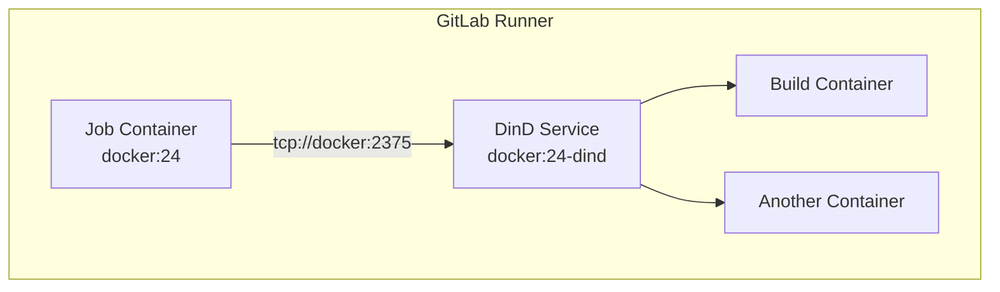

# How to Set Up Docker-in-Docker in GitLab CI

Author: [nawazdhandala](https://www.github.com/nawazdhandala)

Tags: GitLab CI, Docker, DinD, Containers, CI/CD, DevOps

Description: Learn how to set up Docker-in-Docker in GitLab CI to build Docker images in your pipelines. This guide covers DinD configuration, socket binding, security considerations, and alternatives like Kaniko.

> Docker-in-Docker enables building Docker images inside GitLab CI pipelines, essential for containerized application deployments.

Building Docker images in CI pipelines requires running Docker commands inside a containerized job. GitLab CI supports this through Docker-in-Docker (DinD), where a Docker daemon runs as a service alongside your job. This guide covers the configuration options, security implications, and alternatives.

## Understanding Docker-in-Docker

DinD runs a full Docker daemon inside a container, allowing you to execute Docker commands like build, push, and run from within your CI job.



## Basic DinD Configuration

The standard DinD setup uses the Docker image with a DinD service.

```yaml
# .gitlab-ci.yml
build:
  image: docker:24
  services:
    - docker:24-dind
  variables:
    DOCKER_HOST: tcp://docker:2375
    DOCKER_TLS_CERTDIR: ""
  script:
    - docker info
    - docker build -t myapp .
    - docker push myapp
```

The `DOCKER_HOST` variable tells the Docker client where to find the Docker daemon. Setting `DOCKER_TLS_CERTDIR` to empty disables TLS, which simplifies the setup but is less secure.

## Secure DinD with TLS

For production pipelines, enable TLS encryption between the job and the DinD service.

```yaml
build:
  image: docker:24
  services:
    - docker:24-dind
  variables:
    DOCKER_HOST: tcp://docker:2376
    DOCKER_TLS_CERTDIR: "/certs"
    DOCKER_TLS_VERIFY: 1
    DOCKER_CERT_PATH: "/certs/client"
  script:
    - docker info
    - docker build -t myapp .
```

When `DOCKER_TLS_CERTDIR` is set, the DinD service generates certificates and shares them with the job container through a shared volume.

## Building and Pushing Images

Build images and push them to GitLab Container Registry.

```yaml
stages:
  - build
  - deploy

variables:
  DOCKER_HOST: tcp://docker:2375
  DOCKER_TLS_CERTDIR: ""
  IMAGE_TAG: $CI_REGISTRY_IMAGE:$CI_COMMIT_SHA

build:
  stage: build
  image: docker:24
  services:
    - docker:24-dind
  before_script:
    - docker login -u $CI_REGISTRY_USER -p $CI_REGISTRY_PASSWORD $CI_REGISTRY
  script:
    - docker build -t $IMAGE_TAG .
    - docker push $IMAGE_TAG
  after_script:
    - docker logout $CI_REGISTRY

deploy:
  stage: deploy
  image: docker:24
  services:
    - docker:24-dind
  variables:
    DOCKER_HOST: tcp://docker:2375
  script:
    - docker pull $IMAGE_TAG
    - docker tag $IMAGE_TAG $CI_REGISTRY_IMAGE:latest
    - docker push $CI_REGISTRY_IMAGE:latest
  rules:
    - if: '$CI_COMMIT_BRANCH == "main"'
```

## Multi-Stage Builds

Use multi-stage Dockerfiles with DinD for efficient builds.

```dockerfile
# Dockerfile
FROM node:20 AS builder
WORKDIR /app
COPY package*.json ./
RUN npm ci
COPY . .
RUN npm run build

FROM node:20-alpine AS production
WORKDIR /app
COPY --from=builder /app/dist ./dist
COPY --from=builder /app/node_modules ./node_modules
EXPOSE 3000
CMD ["node", "dist/server.js"]
```

```yaml
build:
  image: docker:24
  services:
    - docker:24-dind
  variables:
    DOCKER_HOST: tcp://docker:2375
    DOCKER_BUILDKIT: 1
  script:
    - docker build --target production -t $CI_REGISTRY_IMAGE:$CI_COMMIT_SHA .
    - docker push $CI_REGISTRY_IMAGE:$CI_COMMIT_SHA
```

## Caching Docker Builds

Use BuildKit cache mounts and registry caching to speed up builds.

```yaml
build:
  image: docker:24
  services:
    - docker:24-dind
  variables:
    DOCKER_HOST: tcp://docker:2375
    DOCKER_BUILDKIT: 1
  script:
    - docker login -u $CI_REGISTRY_USER -p $CI_REGISTRY_PASSWORD $CI_REGISTRY
    - |
      docker build \
        --build-arg BUILDKIT_INLINE_CACHE=1 \
        --cache-from $CI_REGISTRY_IMAGE:cache \
        --tag $CI_REGISTRY_IMAGE:$CI_COMMIT_SHA \
        --tag $CI_REGISTRY_IMAGE:cache \
        .
    - docker push $CI_REGISTRY_IMAGE:$CI_COMMIT_SHA
    - docker push $CI_REGISTRY_IMAGE:cache
```

## Docker Compose in CI

Use Docker Compose for integration testing.

```yaml
integration_test:
  image: docker:24
  services:
    - docker:24-dind
  variables:
    DOCKER_HOST: tcp://docker:2375
    DOCKER_TLS_CERTDIR: ""
  before_script:
    - apk add --no-cache docker-compose
  script:
    - docker-compose -f docker-compose.test.yml up -d
    - docker-compose -f docker-compose.test.yml exec -T app npm test
    - docker-compose -f docker-compose.test.yml logs
  after_script:
    - docker-compose -f docker-compose.test.yml down -v
```

```yaml
# docker-compose.test.yml
version: '3.8'
services:
  app:
    build: .
    environment:
      - DATABASE_URL=postgresql://test:test@db:5432/test
    depends_on:
      - db
      - redis

  db:
    image: postgres:15
    environment:
      - POSTGRES_USER=test
      - POSTGRES_PASSWORD=test
      - POSTGRES_DB=test

  redis:
    image: redis:7
```

## Socket Binding Alternative

Instead of DinD, you can bind the host's Docker socket. This is faster but has security implications.

```yaml
# Requires privileged runner with socket access
build:
  image: docker:24
  variables:
    DOCKER_HOST: unix:///var/run/docker.sock
  script:
    - docker build -t myapp .
    - docker push myapp
  tags:
    - docker-socket
```

This approach shares the host Docker daemon with all jobs, which is faster but means jobs can see and affect each other's containers.

## Kaniko Alternative

Kaniko builds Docker images without requiring a Docker daemon, making it more secure for shared runners.

```yaml
build:
  image:
    name: gcr.io/kaniko-project/executor:v1.9.0-debug
    entrypoint: [""]
  script:
    - |
      /kaniko/executor \
        --context $CI_PROJECT_DIR \
        --dockerfile $CI_PROJECT_DIR/Dockerfile \
        --destination $CI_REGISTRY_IMAGE:$CI_COMMIT_SHA \
        --cache=true \
        --cache-repo=$CI_REGISTRY_IMAGE/cache
```

Kaniko does not need privileged mode and works well in restricted environments.

## Buildah Alternative

Buildah is another rootless alternative for building images.

```yaml
build:
  image: quay.io/buildah/stable
  variables:
    STORAGE_DRIVER: vfs
    BUILDAH_FORMAT: docker
  before_script:
    - buildah login -u $CI_REGISTRY_USER -p $CI_REGISTRY_PASSWORD $CI_REGISTRY
  script:
    - buildah bud -t $CI_REGISTRY_IMAGE:$CI_COMMIT_SHA .
    - buildah push $CI_REGISTRY_IMAGE:$CI_COMMIT_SHA
```

## Parallel Image Builds

Build multiple images in parallel using DinD.

```yaml
stages:
  - build

.build_template:
  stage: build
  image: docker:24
  services:
    - docker:24-dind
  variables:
    DOCKER_HOST: tcp://docker:2375
    DOCKER_TLS_CERTDIR: ""
  before_script:
    - docker login -u $CI_REGISTRY_USER -p $CI_REGISTRY_PASSWORD $CI_REGISTRY

build_api:
  extends: .build_template
  script:
    - docker build -t $CI_REGISTRY_IMAGE/api:$CI_COMMIT_SHA -f services/api/Dockerfile .
    - docker push $CI_REGISTRY_IMAGE/api:$CI_COMMIT_SHA

build_worker:
  extends: .build_template
  script:
    - docker build -t $CI_REGISTRY_IMAGE/worker:$CI_COMMIT_SHA -f services/worker/Dockerfile .
    - docker push $CI_REGISTRY_IMAGE/worker:$CI_COMMIT_SHA

build_frontend:
  extends: .build_template
  script:
    - docker build -t $CI_REGISTRY_IMAGE/frontend:$CI_COMMIT_SHA -f services/frontend/Dockerfile .
    - docker push $CI_REGISTRY_IMAGE/frontend:$CI_COMMIT_SHA
```

## Security Scanning with DinD

Scan built images for vulnerabilities.

```yaml
stages:
  - build
  - scan

build:
  stage: build
  image: docker:24
  services:
    - docker:24-dind
  variables:
    DOCKER_HOST: tcp://docker:2375
  script:
    - docker build -t $CI_REGISTRY_IMAGE:$CI_COMMIT_SHA .
    - docker push $CI_REGISTRY_IMAGE:$CI_COMMIT_SHA

scan:
  stage: scan
  image: docker:24
  services:
    - docker:24-dind
  variables:
    DOCKER_HOST: tcp://docker:2375
  script:
    - docker pull $CI_REGISTRY_IMAGE:$CI_COMMIT_SHA
    - |
      docker run --rm \
        -v /var/run/docker.sock:/var/run/docker.sock \
        aquasec/trivy:latest \
        image --exit-code 1 --severity HIGH,CRITICAL \
        $CI_REGISTRY_IMAGE:$CI_COMMIT_SHA
  allow_failure: true
```

## Complete DinD Pipeline

Here is a complete pipeline demonstrating DinD best practices.

```yaml
stages:
  - build
  - test
  - scan
  - push

variables:
  DOCKER_HOST: tcp://docker:2376
  DOCKER_TLS_CERTDIR: "/certs"
  DOCKER_TLS_VERIFY: 1
  DOCKER_CERT_PATH: "/certs/client"
  DOCKER_BUILDKIT: 1
  IMAGE_TAG: $CI_REGISTRY_IMAGE:$CI_COMMIT_SHA

.docker_template:
  image: docker:24
  services:
    - docker:24-dind
  before_script:
    - docker login -u $CI_REGISTRY_USER -p $CI_REGISTRY_PASSWORD $CI_REGISTRY

# Build the image
build:
  extends: .docker_template
  stage: build
  script:
    - |
      docker build \
        --build-arg BUILDKIT_INLINE_CACHE=1 \
        --cache-from $CI_REGISTRY_IMAGE:cache \
        --tag $IMAGE_TAG \
        --tag $CI_REGISTRY_IMAGE:cache \
        .
    - docker push $IMAGE_TAG
    - docker push $CI_REGISTRY_IMAGE:cache

# Run tests using the built image
test:
  extends: .docker_template
  stage: test
  script:
    - docker pull $IMAGE_TAG
    - docker run --rm $IMAGE_TAG npm test
  needs:
    - build

# Integration tests with compose
integration_test:
  extends: .docker_template
  stage: test
  before_script:
    - apk add --no-cache docker-compose
    - docker login -u $CI_REGISTRY_USER -p $CI_REGISTRY_PASSWORD $CI_REGISTRY
  script:
    - docker pull $IMAGE_TAG
    - docker tag $IMAGE_TAG myapp:test
    - docker-compose -f docker-compose.test.yml up -d
    - sleep 10
    - docker-compose -f docker-compose.test.yml exec -T app npm run test:integration
  after_script:
    - docker-compose -f docker-compose.test.yml logs
    - docker-compose -f docker-compose.test.yml down -v
  needs:
    - build

# Security scan
security_scan:
  stage: scan
  image:
    name: aquasec/trivy:latest
    entrypoint: [""]
  script:
    - trivy image --exit-code 0 --severity HIGH,CRITICAL $IMAGE_TAG
  needs:
    - build
  allow_failure: true

# Push final tags
push:
  extends: .docker_template
  stage: push
  script:
    - docker pull $IMAGE_TAG
    - docker tag $IMAGE_TAG $CI_REGISTRY_IMAGE:latest
    - docker tag $IMAGE_TAG $CI_REGISTRY_IMAGE:$CI_COMMIT_REF_SLUG
    - docker push $CI_REGISTRY_IMAGE:latest
    - docker push $CI_REGISTRY_IMAGE:$CI_COMMIT_REF_SLUG
  needs:
    - test
    - integration_test
  rules:
    - if: '$CI_COMMIT_BRANCH == "main"'
```

## Troubleshooting

If Docker commands fail with connection refused, ensure the DinD service is running and `DOCKER_HOST` is set correctly. If TLS errors occur, check that `DOCKER_TLS_CERTDIR` is consistent between job and service. For slow builds, enable BuildKit and use caching. If builds fail with permission errors, ensure your runner supports privileged containers.

## Best Practices

Use TLS for production pipelines to encrypt traffic between job and daemon. Enable BuildKit for faster builds and better caching. Use Kaniko or Buildah for shared runners where privileged mode is not available. Tag images with commit SHA for immutable references. Scan images for vulnerabilities before pushing to production registries. Clean up unused images to avoid disk space issues on runners.

Docker-in-Docker is essential for containerized application pipelines. While it requires some configuration, understanding the security tradeoffs and alternatives ensures you choose the right approach for your environment.
