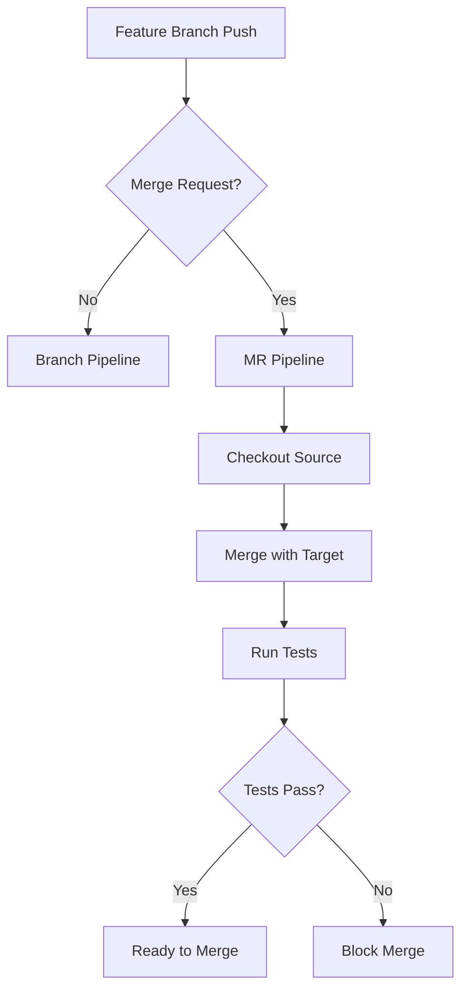

# How to Set Up Merge Request Pipelines

Author: [nawazdhandala](https://www.github.com/nawazdhandala)

Tags: GitLab CI, Merge Request, Pipelines, Code Review, CI/CD

Description: Learn how to set up merge request pipelines in GitLab CI to run tests and validations specifically for merge requests. This guide covers pipeline configuration, merge result pipelines, and merge trains.

> Merge request pipelines ensure that every proposed change is tested before it can be merged, catching issues early in the development process.

Merge request pipelines are a GitLab CI feature that runs pipelines specifically for merge requests. Unlike branch pipelines that run on every push, merge request pipelines can test the merged result of your changes with the target branch, ensuring compatibility before the actual merge happens.

## Understanding Merge Request Pipelines

When you create a merge request, GitLab can run a pipeline that tests your changes in the context of being merged into the target branch. This catches integration issues that might not appear when testing the source branch alone.



## Basic Merge Request Pipeline

Use the `rules` keyword to create jobs that only run for merge requests.

```yaml
# .gitlab-ci.yml
stages:
  - build
  - test
  - review

build:
  stage: build
  script:
    - npm ci
    - npm run build
  artifacts:
    paths:
      - dist/
  rules:
    - if: '$CI_PIPELINE_SOURCE == "merge_request_event"'
    - if: '$CI_COMMIT_BRANCH == "main"'

test:
  stage: test
  script:
    - npm test
  rules:
    - if: '$CI_PIPELINE_SOURCE == "merge_request_event"'
    - if: '$CI_COMMIT_BRANCH == "main"'

lint:
  stage: test
  script:
    - npm run lint
  rules:
    - if: '$CI_PIPELINE_SOURCE == "merge_request_event"'

# Review app only for merge requests
deploy_review:
  stage: review
  script:
    - ./scripts/deploy-review.sh
  environment:
    name: review/$CI_MERGE_REQUEST_IID
    url: https://mr-$CI_MERGE_REQUEST_IID.review.example.com
    on_stop: stop_review
  rules:
    - if: '$CI_PIPELINE_SOURCE == "merge_request_event"'

stop_review:
  stage: review
  script:
    - ./scripts/cleanup-review.sh
  environment:
    name: review/$CI_MERGE_REQUEST_IID
    action: stop
  rules:
    - if: '$CI_PIPELINE_SOURCE == "merge_request_event"'
      when: manual
  allow_failure: true
```

## Using workflow:rules for Global Configuration

Instead of adding rules to each job, use `workflow:rules` to control when pipelines run at the global level.

```yaml
# Global workflow configuration
workflow:
  rules:
    # Run for merge requests
    - if: '$CI_PIPELINE_SOURCE == "merge_request_event"'
    # Run for main branch
    - if: '$CI_COMMIT_BRANCH == "main"'
    # Run for tags
    - if: '$CI_COMMIT_TAG'
    # Run for scheduled pipelines
    - if: '$CI_PIPELINE_SOURCE == "schedule"'

stages:
  - build
  - test
  - deploy

build:
  stage: build
  script:
    - npm ci
    - npm run build

test:
  stage: test
  script:
    - npm test

# This job only runs on main branch, not merge requests
deploy_production:
  stage: deploy
  script:
    - ./scripts/deploy.sh
  rules:
    - if: '$CI_COMMIT_BRANCH == "main"'
```

## Merge Result Pipelines

Merge result pipelines test the actual merged result of your source and target branches. This catches issues where both branches work independently but fail when combined.

```yaml
# Enable merge result pipelines
workflow:
  rules:
    - if: '$CI_PIPELINE_SOURCE == "merge_request_event"'
      variables:
        # Enable merged results pipeline
        CI_MERGE_REQUEST_EVENT_TYPE: merged_result

stages:
  - build
  - test

build:
  stage: build
  script:
    - echo "Testing merge result of $CI_MERGE_REQUEST_SOURCE_BRANCH into $CI_MERGE_REQUEST_TARGET_BRANCH"
    - npm ci
    - npm run build

test:
  stage: test
  script:
    - npm test
```

To enable merged results pipelines, go to Settings > General > Merge requests and enable "Merged results pipelines".

## Merge Trains

Merge trains queue merge requests and test them sequentially to ensure that multiple merges do not conflict with each other.

```yaml
# Pipeline optimized for merge trains
workflow:
  rules:
    - if: '$CI_PIPELINE_SOURCE == "merge_request_event"'
    - if: '$CI_MERGE_REQUEST_EVENT_TYPE == "merge_train"'

stages:
  - build
  - test

variables:
  # Cache npm modules for faster builds
  npm_config_cache: '$CI_PROJECT_DIR/.npm'

build:
  stage: build
  script:
    - npm ci
    - npm run build
  cache:
    key: $CI_COMMIT_REF_SLUG
    paths:
      - .npm/
      - node_modules/

test:
  stage: test
  script:
    - npm test
  interruptible: true
```

The `interruptible: true` setting allows GitLab to cancel running jobs when a newer commit is pushed, keeping merge trains efficient.

## Merge Request Specific Variables

GitLab provides special variables for merge request pipelines that you can use in your scripts.

```yaml
# Using merge request variables
stages:
  - info
  - test
  - review

show_mr_info:
  stage: info
  script:
    - echo "Merge Request IID: $CI_MERGE_REQUEST_IID"
    - echo "Source Branch: $CI_MERGE_REQUEST_SOURCE_BRANCH_NAME"
    - echo "Target Branch: $CI_MERGE_REQUEST_TARGET_BRANCH_NAME"
    - echo "MR Title: $CI_MERGE_REQUEST_TITLE"
    - echo "Author: $CI_MERGE_REQUEST_AUTHOR"
  rules:
    - if: '$CI_PIPELINE_SOURCE == "merge_request_event"'

test:
  stage: test
  script:
    - npm test
  rules:
    - if: '$CI_PIPELINE_SOURCE == "merge_request_event"'

# Comment test results back to MR
report_coverage:
  stage: test
  script:
    - npm test -- --coverage
    - COVERAGE=$(cat coverage/coverage-summary.json | jq '.total.lines.pct')
    - |
      curl --request POST \
        --header "PRIVATE-TOKEN: $GITLAB_API_TOKEN" \
        --data "body=Test coverage: ${COVERAGE}%" \
        "$CI_API_V4_URL/projects/$CI_PROJECT_ID/merge_requests/$CI_MERGE_REQUEST_IID/notes"
  rules:
    - if: '$CI_PIPELINE_SOURCE == "merge_request_event"'
  coverage: '/Lines\s*:\s*(\d+\.?\d*)%/'
```

## Comparing Changes in Merge Request Pipelines

You can access the diff between the source and target branches in your jobs.

```yaml
# Analyze changed files in merge request
stages:
  - analyze
  - test

detect_changes:
  stage: analyze
  script:
    - |
      # Get list of changed files
      git fetch origin $CI_MERGE_REQUEST_TARGET_BRANCH_NAME
      CHANGED_FILES=$(git diff --name-only origin/$CI_MERGE_REQUEST_TARGET_BRANCH_NAME...HEAD)
      echo "Changed files:"
      echo "$CHANGED_FILES"

      # Check if specific paths changed
      if echo "$CHANGED_FILES" | grep -q "^src/"; then
        echo "SOURCE_CHANGED=true" >> build.env
      fi
      if echo "$CHANGED_FILES" | grep -q "^tests/"; then
        echo "TESTS_CHANGED=true" >> build.env
      fi
  artifacts:
    reports:
      dotenv: build.env
  rules:
    - if: '$CI_PIPELINE_SOURCE == "merge_request_event"'

run_tests:
  stage: test
  script:
    - |
      if [ "$SOURCE_CHANGED" = "true" ]; then
        echo "Running full test suite..."
        npm test
      else
        echo "Only non-source files changed, running quick tests..."
        npm run test:quick
      fi
  needs:
    - detect_changes
  rules:
    - if: '$CI_PIPELINE_SOURCE == "merge_request_event"'
```

## Blocking Merge Without Successful Pipeline

Configure your project to require a successful pipeline before merging. Go to Settings > General > Merge requests and enable "Pipelines must succeed".

```yaml
# Complete merge request pipeline with quality gates
workflow:
  rules:
    - if: '$CI_PIPELINE_SOURCE == "merge_request_event"'
    - if: '$CI_COMMIT_BRANCH == "main"'

stages:
  - build
  - test
  - security
  - review

build:
  stage: build
  script:
    - npm ci
    - npm run build
  artifacts:
    paths:
      - dist/

unit_tests:
  stage: test
  script:
    - npm test
  coverage: '/Lines\s*:\s*(\d+\.?\d*)%/'
  artifacts:
    reports:
      junit: junit.xml
      coverage_report:
        coverage_format: cobertura
        path: coverage/cobertura-coverage.xml

lint:
  stage: test
  script:
    - npm run lint

type_check:
  stage: test
  script:
    - npm run typecheck

security_scan:
  stage: security
  script:
    - npm audit --audit-level=high
  allow_failure: false

deploy_review:
  stage: review
  script:
    - ./scripts/deploy-review.sh $CI_MERGE_REQUEST_IID
  environment:
    name: review/$CI_MERGE_REQUEST_IID
    url: https://mr-$CI_MERGE_REQUEST_IID.review.example.com
    on_stop: stop_review
    auto_stop_in: 1 week
  rules:
    - if: '$CI_PIPELINE_SOURCE == "merge_request_event"'

stop_review:
  stage: review
  script:
    - ./scripts/cleanup-review.sh $CI_MERGE_REQUEST_IID
  environment:
    name: review/$CI_MERGE_REQUEST_IID
    action: stop
  rules:
    - if: '$CI_PIPELINE_SOURCE == "merge_request_event"'
      when: manual
  allow_failure: true
```

## Merge Request Approval Rules

Combine pipeline requirements with code review approvals for comprehensive merge controls.

```yaml
# Pipeline with approval-required jobs
stages:
  - test
  - deploy

test:
  stage: test
  script:
    - npm test

# Manual approval gate before deployment
manual_approval:
  stage: deploy
  script:
    - echo "Deployment approved by $GITLAB_USER_NAME"
  rules:
    - if: '$CI_PIPELINE_SOURCE == "merge_request_event"'
      when: manual
      allow_failure: false

deploy_review:
  stage: deploy
  script:
    - ./scripts/deploy.sh
  needs:
    - manual_approval
  rules:
    - if: '$CI_PIPELINE_SOURCE == "merge_request_event"'
```

## Best Practices

Use `workflow:rules` to define global pipeline behavior instead of repeating rules in every job. Enable merged results pipelines to catch integration issues before merging. Use merge trains for high-traffic repositories to prevent merge conflicts. Set `interruptible: true` on long-running jobs to allow cancellation when new commits are pushed. Deploy review apps for visual verification of changes. Configure branch protection to require successful pipelines before merging.

Merge request pipelines create a safety net that catches issues before they reach your main branch. Combined with code reviews and automated tests, they form a robust quality gate for your development workflow.
