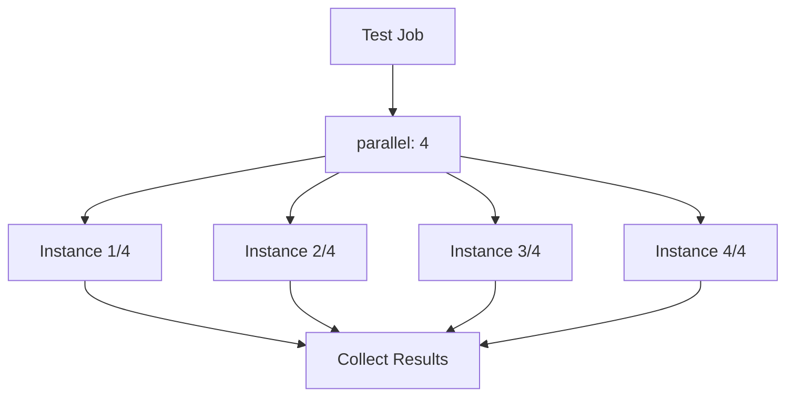

# How to Use Parallel Testing in GitLab CI

Author: [nawazdhandala](https://www.github.com/nawazdhandala)

Tags: GitLab CI, Parallel Testing, CI/CD, Testing, Performance, DevOps

Description: Learn how to use parallel testing in GitLab CI to speed up your test suite. This guide covers the parallel keyword, test splitting strategies, and optimizing test distribution.

> Parallel testing can reduce your CI pipeline time from hours to minutes by distributing tests across multiple runners simultaneously.

As your test suite grows, running tests sequentially becomes a bottleneck. A test suite that takes 30 minutes to run sequentially can finish in 5 minutes when split across 6 parallel jobs. GitLab CI provides built-in support for parallel job execution, making it easy to dramatically reduce your feedback loop.

## Understanding Parallel Jobs

The `parallel` keyword creates multiple instances of the same job that run simultaneously. Each instance receives unique environment variables to determine which subset of tests to run.



## Basic Parallel Configuration

Add the `parallel` keyword to any job to run multiple instances.

```yaml
# .gitlab-ci.yml
stages:
  - build
  - test

build:
  stage: build
  script:
    - npm ci
    - npm run build
  artifacts:
    paths:
      - node_modules/
      - dist/

test:
  stage: test
  parallel: 4
  script:
    - echo "Running test instance $CI_NODE_INDEX of $CI_NODE_TOTAL"
    - npm test
```

GitLab provides two variables: `CI_NODE_INDEX`, which is the current instance number starting from 1, and `CI_NODE_TOTAL`, which is the total number of parallel instances.

## Splitting Tests by File

Split your test files across parallel jobs.

```yaml
test:
  stage: test
  parallel: 4
  script:
    - |
      # Get all test files
      TEST_FILES=$(find tests -name "*.test.js" | sort)

      # Calculate which files this instance should run
      TOTAL_FILES=$(echo "$TEST_FILES" | wc -l)
      FILES_PER_INSTANCE=$(( (TOTAL_FILES + CI_NODE_TOTAL - 1) / CI_NODE_TOTAL ))
      START=$(( (CI_NODE_INDEX - 1) * FILES_PER_INSTANCE + 1 ))
      END=$(( CI_NODE_INDEX * FILES_PER_INSTANCE ))

      # Get files for this instance
      MY_FILES=$(echo "$TEST_FILES" | sed -n "${START},${END}p")

      echo "Running files $START to $END of $TOTAL_FILES"
      echo "$MY_FILES"

      # Run tests
      npm test -- $MY_FILES
```

## Using Jest with Parallel Jobs

Jest has built-in support for test sharding.

```yaml
test:
  stage: test
  parallel: 4
  script:
    - npm ci
    - npm test -- --shard=$CI_NODE_INDEX/$CI_NODE_TOTAL
  artifacts:
    reports:
      junit: junit.xml
    paths:
      - coverage/
```

## Using pytest with Parallel Jobs

Pytest can split tests using the pytest-split plugin.

```yaml
test:
  stage: test
  image: python:3.11
  parallel: 4
  before_script:
    - pip install pytest pytest-split
  script:
    - pytest --splits $CI_NODE_TOTAL --group $CI_NODE_INDEX --junit-xml=report.xml
  artifacts:
    reports:
      junit: report.xml
```

## Using RSpec with Parallel Jobs

RSpec can use knapsack or similar tools for intelligent test splitting.

```yaml
test:
  stage: test
  image: ruby:3.2
  parallel: 4
  before_script:
    - bundle install
  script:
    - |
      # Simple file-based splitting
      TEST_FILES=$(find spec -name "*_spec.rb" | sort)
      MY_FILES=$(echo "$TEST_FILES" | awk "NR % $CI_NODE_TOTAL == ($CI_NODE_INDEX - 1) % $CI_NODE_TOTAL")
      bundle exec rspec $MY_FILES --format RspecJunitFormatter --out rspec.xml
  artifacts:
    reports:
      junit: rspec.xml
```

## Parallel Matrix

Use the `parallel:matrix` keyword to run jobs with different variable combinations.

```yaml
test:
  stage: test
  parallel:
    matrix:
      - NODE_VERSION: ["18", "20", "22"]
        OS: ["ubuntu", "alpine"]
  image: node:$NODE_VERSION-$OS
  script:
    - node --version
    - npm ci
    - npm test
```

This creates 6 jobs: Node 18 on Ubuntu, Node 18 on Alpine, Node 20 on Ubuntu, and so on.

## Combining Parallel and Matrix

Combine parallel instances with matrix for comprehensive testing.

```yaml
test:
  stage: test
  parallel:
    matrix:
      - NODE_VERSION: ["18", "20"]
  image: node:$NODE_VERSION
  script:
    - npm ci
    # Each matrix variant also gets 3 parallel instances
    - npm test -- --shard=$CI_NODE_INDEX/3
  variables:
    CI_NODE_TOTAL: 3
```

## Time-Based Test Splitting

For more balanced distribution, split tests based on historical run times.

```yaml
# Store test timing data
test:
  stage: test
  parallel: 4
  script:
    - npm ci
    # Use timing data if available
    - |
      if [ -f test-times.json ]; then
        npm test -- --shard=$CI_NODE_INDEX/$CI_NODE_TOTAL --timing-file=test-times.json
      else
        npm test -- --shard=$CI_NODE_INDEX/$CI_NODE_TOTAL
      fi
    # Save timing data for next run
    - npm test -- --save-timing=test-times.json || true
  artifacts:
    paths:
      - test-times.json
    expire_in: 1 week
  cache:
    key: test-timing
    paths:
      - test-times.json
```

## Merging Test Results

Combine coverage and test reports from parallel jobs.

```yaml
stages:
  - build
  - test
  - report

test:
  stage: test
  parallel: 4
  script:
    - npm test -- --shard=$CI_NODE_INDEX/$CI_NODE_TOTAL --coverage
  artifacts:
    paths:
      - coverage/
    reports:
      junit: junit.xml
      coverage_report:
        coverage_format: cobertura
        path: coverage/cobertura-coverage.xml

# Merge coverage reports
merge_coverage:
  stage: report
  script:
    - npm install -g nyc
    - npx nyc merge coverage/ merged-coverage/
    - npx nyc report --reporter=html --reporter=text -t merged-coverage/
  coverage: '/Lines\s*:\s*(\d+\.?\d*)%/'
  artifacts:
    paths:
      - coverage-report/
  needs:
    - test
```

## Dynamic Parallel Count

Adjust the number of parallel jobs based on the number of tests.

```yaml
# First, count tests
count_tests:
  stage: .pre
  script:
    - TEST_COUNT=$(find tests -name "*.test.js" | wc -l)
    - |
      # Calculate optimal parallel count (1 job per 10 tests, max 10)
      PARALLEL_COUNT=$(( (TEST_COUNT + 9) / 10 ))
      if [ $PARALLEL_COUNT -gt 10 ]; then
        PARALLEL_COUNT=10
      fi
      echo "PARALLEL_COUNT=$PARALLEL_COUNT" >> count.env
  artifacts:
    reports:
      dotenv: count.env

test:
  stage: test
  parallel: $PARALLEL_COUNT
  needs:
    - count_tests
  script:
    - npm test -- --shard=$CI_NODE_INDEX/$CI_NODE_TOTAL
```

## Parallel Integration Tests

Run integration tests in parallel against isolated databases.

```yaml
integration_test:
  stage: test
  parallel: 4
  services:
    - name: postgres:15
      alias: db
  variables:
    POSTGRES_DB: test_$CI_NODE_INDEX
    POSTGRES_USER: test
    POSTGRES_PASSWORD: test
    DATABASE_URL: postgresql://test:test@db:5432/test_$CI_NODE_INDEX
  before_script:
    - npm ci
    - npm run db:migrate
  script:
    - npm run test:integration -- --shard=$CI_NODE_INDEX/$CI_NODE_TOTAL
```

## Parallel E2E Tests

Split end-to-end tests across parallel jobs.

```yaml
e2e_test:
  stage: test
  image: cypress/browsers:node18.12.0-chrome107
  parallel: 4
  script:
    - npm ci
    - |
      # Get spec files for this instance
      SPECS=$(find cypress/e2e -name "*.cy.js" | sort)
      MY_SPECS=$(echo "$SPECS" | awk "NR % $CI_NODE_TOTAL == ($CI_NODE_INDEX - 1) % $CI_NODE_TOTAL" | tr '\n' ',')
      npx cypress run --spec "$MY_SPECS"
  artifacts:
    paths:
      - cypress/videos/
      - cypress/screenshots/
    when: on_failure
```

## Complete Parallel Testing Pipeline

Here is a complete pipeline with parallel testing across multiple test types.

```yaml
stages:
  - build
  - test
  - report
  - deploy

variables:
  npm_config_cache: "$CI_PROJECT_DIR/.npm"

build:
  stage: build
  script:
    - npm ci
    - npm run build
  artifacts:
    paths:
      - node_modules/
      - dist/
  cache:
    key: $CI_COMMIT_REF_SLUG
    paths:
      - .npm/

# Parallel unit tests
unit_tests:
  stage: test
  parallel: 4
  script:
    - npm test -- --shard=$CI_NODE_INDEX/$CI_NODE_TOTAL --coverage
  artifacts:
    paths:
      - coverage/coverage-$CI_NODE_INDEX.json
    reports:
      junit: junit-$CI_NODE_INDEX.xml

# Parallel integration tests
integration_tests:
  stage: test
  parallel: 3
  services:
    - postgres:15
    - redis:7
  variables:
    POSTGRES_DB: test
    POSTGRES_USER: test
    POSTGRES_PASSWORD: test
  script:
    - npm run test:integration -- --shard=$CI_NODE_INDEX/$CI_NODE_TOTAL
  artifacts:
    reports:
      junit: integration-junit-$CI_NODE_INDEX.xml

# Parallel E2E tests
e2e_tests:
  stage: test
  parallel: 6
  image: cypress/browsers:node18.12.0-chrome107
  script:
    - npm run test:e2e -- --spec "$(./scripts/get-e2e-specs.sh $CI_NODE_INDEX $CI_NODE_TOTAL)"
  artifacts:
    paths:
      - cypress/videos/
      - cypress/screenshots/
    when: on_failure
    reports:
      junit: e2e-junit-$CI_NODE_INDEX.xml

# Matrix testing across Node versions
compatibility_tests:
  stage: test
  parallel:
    matrix:
      - NODE_VERSION: ["18", "20", "22"]
  image: node:$NODE_VERSION
  script:
    - npm ci
    - npm test

# Merge all coverage reports
coverage_report:
  stage: report
  script:
    - npm install -g nyc
    - npx nyc merge coverage/ .nyc_output/
    - npx nyc report --reporter=html --reporter=text-summary
  coverage: '/Statements\s*:\s*(\d+\.?\d*)%/'
  artifacts:
    paths:
      - coverage-report/
  needs:
    - unit_tests

deploy:
  stage: deploy
  script:
    - ./scripts/deploy.sh
  needs:
    - unit_tests
    - integration_tests
    - e2e_tests
  rules:
    - if: '$CI_COMMIT_BRANCH == "main"'
```

## Best Practices

Choose a parallel count that balances runner availability with test distribution. Use test sharding features built into your test framework when available. Store and use timing data to improve test distribution over time. Merge coverage and test reports to get a complete picture. Consider test isolation - ensure parallel tests do not interfere with each other. Monitor runner queue times - too many parallel jobs may increase wait times.

Parallel testing is one of the most effective ways to reduce CI pipeline time. By distributing your test suite across multiple runners, you can maintain fast feedback loops even as your codebase and test suite grow.
