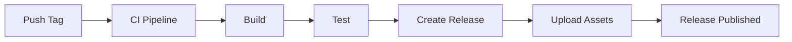

# How to Use Release Jobs in GitLab CI

Author: [nawazdhandala](https://www.github.com/nawazdhandala)

Tags: GitLab CI, Releases, Versioning, CI/CD, DevOps, Changelog

Description: Learn how to use release jobs in GitLab CI to automate creating releases with changelogs, assets, and version tags. This guide covers the release keyword, semantic versioning, and release automation.

> Automated releases ensure consistent versioning, complete changelogs, and reliable artifact distribution every time you ship.

GitLab CI provides built-in support for creating releases directly from your pipeline. The `release` keyword allows you to create tagged releases with descriptions, links, and assets automatically when your code reaches a release-ready state.

## Understanding GitLab Releases

A GitLab release is a snapshot of your project at a specific point in time, identified by a tag. Releases can include release notes describing changes, links to documentation or external resources, and assets like binaries or packages.



## Basic Release Configuration

Create a release using the `release` keyword in a job.

```yaml
# .gitlab-ci.yml
stages:
  - build
  - test
  - release

build:
  stage: build
  script:
    - npm ci
    - npm run build
  artifacts:
    paths:
      - dist/

test:
  stage: test
  script:
    - npm test

create_release:
  stage: release
  image: registry.gitlab.com/gitlab-org/release-cli:latest
  script:
    - echo "Creating release for $CI_COMMIT_TAG"
  release:
    tag_name: $CI_COMMIT_TAG
    name: 'Release $CI_COMMIT_TAG'
    description: 'Release created from CI pipeline'
  rules:
    - if: '$CI_COMMIT_TAG'
```

## Release with Changelog

Include a changelog in your release description.

```yaml
create_release:
  stage: release
  image: registry.gitlab.com/gitlab-org/release-cli:latest
  script:
    - echo "Generating changelog..."
  release:
    tag_name: $CI_COMMIT_TAG
    name: 'Release $CI_COMMIT_TAG'
    description: |
      ## What's Changed

      See the [CHANGELOG](CHANGELOG.md) for details.

      ### Installation

      ```bash
      npm install mypackage@$CI_COMMIT_TAG
      ```
  rules:
    - if: '$CI_COMMIT_TAG'
```

## Dynamic Release Description

Generate the release description dynamically from commit history or a changelog file.

```yaml
create_release:
  stage: release
  image: registry.gitlab.com/gitlab-org/release-cli:latest
  script:
    - |
      # Generate changelog from git history
      PREVIOUS_TAG=$(git describe --tags --abbrev=0 HEAD^ 2>/dev/null || echo "")
      if [ -n "$PREVIOUS_TAG" ]; then
        CHANGELOG=$(git log ${PREVIOUS_TAG}..HEAD --pretty=format:"- %s (%h)" --no-merges)
      else
        CHANGELOG=$(git log --pretty=format:"- %s (%h)" --no-merges -20)
      fi

      # Write to file for release
      cat > release_notes.md << EOF
      ## Changes in $CI_COMMIT_TAG

      $CHANGELOG

      ## Installation

      \`\`\`bash
      npm install @myorg/mypackage@$CI_COMMIT_TAG
      \`\`\`
      EOF

      cat release_notes.md
  release:
    tag_name: $CI_COMMIT_TAG
    name: 'Release $CI_COMMIT_TAG'
    description: './release_notes.md'
  rules:
    - if: '$CI_COMMIT_TAG'
```

## Release with Assets

Attach build artifacts to your release.

```yaml
stages:
  - build
  - release

build:
  stage: build
  script:
    - npm ci
    - npm run build
    - tar -czvf app-$CI_COMMIT_TAG.tar.gz dist/
  artifacts:
    paths:
      - app-$CI_COMMIT_TAG.tar.gz

create_release:
  stage: release
  image: registry.gitlab.com/gitlab-org/release-cli:latest
  script:
    - echo "Creating release with assets"
  release:
    tag_name: $CI_COMMIT_TAG
    name: 'Release $CI_COMMIT_TAG'
    description: 'Release with downloadable assets'
    assets:
      links:
        - name: 'Application Bundle'
          url: '${CI_PROJECT_URL}/-/jobs/${CI_JOB_ID}/artifacts/file/app-${CI_COMMIT_TAG}.tar.gz'
          link_type: package
  rules:
    - if: '$CI_COMMIT_TAG'
```

## Release with Multiple Asset Types

Include different types of assets.

```yaml
build:
  stage: build
  script:
    - npm run build
    - npm run build:linux
    - npm run build:macos
    - npm run build:windows
  artifacts:
    paths:
      - dist/
      - releases/

create_release:
  stage: release
  image: registry.gitlab.com/gitlab-org/release-cli:latest
  script:
    - echo "Creating multi-platform release"
  release:
    tag_name: $CI_COMMIT_TAG
    name: 'Release $CI_COMMIT_TAG'
    description: 'Multi-platform release'
    assets:
      links:
        - name: 'Linux Binary'
          url: '${CI_PROJECT_URL}/-/jobs/artifacts/${CI_COMMIT_TAG}/raw/releases/app-linux?job=build'
          link_type: package
        - name: 'macOS Binary'
          url: '${CI_PROJECT_URL}/-/jobs/artifacts/${CI_COMMIT_TAG}/raw/releases/app-macos?job=build'
          link_type: package
        - name: 'Windows Binary'
          url: '${CI_PROJECT_URL}/-/jobs/artifacts/${CI_COMMIT_TAG}/raw/releases/app-windows.exe?job=build'
          link_type: package
        - name: 'Documentation'
          url: 'https://docs.example.com/v${CI_COMMIT_TAG}'
          link_type: other
  rules:
    - if: '$CI_COMMIT_TAG'
```

## Semantic Versioning

Automate semantic versioning based on commit messages.

```yaml
stages:
  - version
  - build
  - release

determine_version:
  stage: version
  image: node:20
  script:
    - npm install -g semantic-release @semantic-release/gitlab
    - npx semantic-release --dry-run > version.txt || true
    - |
      NEXT_VERSION=$(grep "next release version" version.txt | grep -oP '\d+\.\d+\.\d+' || echo "")
      if [ -n "$NEXT_VERSION" ]; then
        echo "NEXT_VERSION=$NEXT_VERSION" >> version.env
      fi
  artifacts:
    reports:
      dotenv: version.env
  rules:
    - if: '$CI_COMMIT_BRANCH == "main"'

create_tag:
  stage: version
  script:
    - |
      if [ -n "$NEXT_VERSION" ]; then
        git tag "v$NEXT_VERSION"
        git push origin "v$NEXT_VERSION"
      fi
  needs:
    - determine_version
  rules:
    - if: '$CI_COMMIT_BRANCH == "main"'
```

## Conventional Commits Changelog

Generate changelog from conventional commits.

```yaml
create_release:
  stage: release
  image: node:20
  before_script:
    - npm install -g conventional-changelog-cli
  script:
    - |
      # Generate changelog
      conventional-changelog -p angular -i CHANGELOG.md -s -r 1

      # Extract latest version changelog
      LATEST_CHANGELOG=$(sed -n '/^## \[/,/^## \[/p' CHANGELOG.md | sed '$d')

      echo "$LATEST_CHANGELOG" > release_notes.md
  release:
    tag_name: $CI_COMMIT_TAG
    name: 'Release $CI_COMMIT_TAG'
    description: './release_notes.md'
  rules:
    - if: '$CI_COMMIT_TAG'
```

## Release with Milestones

Associate releases with GitLab milestones.

```yaml
create_release:
  stage: release
  image: registry.gitlab.com/gitlab-org/release-cli:latest
  script:
    - echo "Creating release linked to milestone"
  release:
    tag_name: $CI_COMMIT_TAG
    name: 'Release $CI_COMMIT_TAG'
    description: 'See milestone for included issues'
    milestones:
      - $CI_COMMIT_TAG
  rules:
    - if: '$CI_COMMIT_TAG'
```

## Pre-release and Release Candidates

Mark releases as pre-releases.

```yaml
create_release:
  stage: release
  image: registry.gitlab.com/gitlab-org/release-cli:latest
  script:
    - |
      # Determine if this is a pre-release
      if echo "$CI_COMMIT_TAG" | grep -qE "(alpha|beta|rc)"; then
        echo "PRE_RELEASE=true" >> release.env
      else
        echo "PRE_RELEASE=false" >> release.env
      fi
  release:
    tag_name: $CI_COMMIT_TAG
    name: 'Release $CI_COMMIT_TAG'
    description: 'Release notes here'
    released_at: $CI_COMMIT_TIMESTAMP
  rules:
    - if: '$CI_COMMIT_TAG'
```

## Complete Release Pipeline

Here is a complete pipeline for automated releases.

```yaml
stages:
  - build
  - test
  - package
  - release

variables:
  PACKAGE_NAME: myapp

# Build stage
build:
  stage: build
  image: node:20
  script:
    - npm ci
    - npm run build
  artifacts:
    paths:
      - dist/

# Test stage
test:
  stage: test
  image: node:20
  script:
    - npm ci
    - npm test
  coverage: '/Lines\s*:\s*(\d+\.?\d*)%/'

# Package for different platforms
package:
  stage: package
  image: node:20
  script:
    - npm ci
    - npm run package
    - |
      # Create archives
      tar -czvf ${PACKAGE_NAME}-${CI_COMMIT_TAG}-linux.tar.gz -C dist/linux .
      tar -czvf ${PACKAGE_NAME}-${CI_COMMIT_TAG}-macos.tar.gz -C dist/macos .
      zip -r ${PACKAGE_NAME}-${CI_COMMIT_TAG}-windows.zip dist/windows/
  artifacts:
    paths:
      - "*.tar.gz"
      - "*.zip"
  rules:
    - if: '$CI_COMMIT_TAG'

# Generate changelog
changelog:
  stage: release
  image: node:20
  before_script:
    - npm install -g conventional-changelog-cli
  script:
    - |
      # Get previous tag
      PREV_TAG=$(git describe --tags --abbrev=0 HEAD^ 2>/dev/null || echo "")

      # Generate changelog
      if [ -n "$PREV_TAG" ]; then
        git log ${PREV_TAG}..HEAD --pretty=format:"- %s (%an)" --no-merges > commits.txt
      else
        git log --pretty=format:"- %s (%an)" --no-merges -50 > commits.txt
      fi

      # Create release notes
      cat > release_notes.md << EOF
      ## What's New in ${CI_COMMIT_TAG}

      ### Changes
      $(cat commits.txt)

      ### Downloads
      - [Linux](${CI_PROJECT_URL}/-/releases/${CI_COMMIT_TAG}/downloads/${PACKAGE_NAME}-${CI_COMMIT_TAG}-linux.tar.gz)
      - [macOS](${CI_PROJECT_URL}/-/releases/${CI_COMMIT_TAG}/downloads/${PACKAGE_NAME}-${CI_COMMIT_TAG}-macos.tar.gz)
      - [Windows](${CI_PROJECT_URL}/-/releases/${CI_COMMIT_TAG}/downloads/${PACKAGE_NAME}-${CI_COMMIT_TAG}-windows.zip)

      ### Installation

      \`\`\`bash
      # Linux/macOS
      curl -L ${CI_PROJECT_URL}/-/releases/${CI_COMMIT_TAG}/downloads/${PACKAGE_NAME}-${CI_COMMIT_TAG}-linux.tar.gz | tar xz

      # npm
      npm install @myorg/${PACKAGE_NAME}@${CI_COMMIT_TAG}
      \`\`\`
      EOF

      cat release_notes.md
  artifacts:
    paths:
      - release_notes.md
  rules:
    - if: '$CI_COMMIT_TAG'

# Create the release
create_release:
  stage: release
  image: registry.gitlab.com/gitlab-org/release-cli:latest
  script:
    - echo "Creating release ${CI_COMMIT_TAG}"
  release:
    tag_name: $CI_COMMIT_TAG
    name: 'Release $CI_COMMIT_TAG'
    description: './release_notes.md'
    assets:
      links:
        - name: 'Linux Binary'
          url: '${CI_PROJECT_URL}/-/jobs/${CI_JOB_ID}/artifacts/raw/${PACKAGE_NAME}-${CI_COMMIT_TAG}-linux.tar.gz'
          link_type: package
          filepath: '/${PACKAGE_NAME}-${CI_COMMIT_TAG}-linux.tar.gz'
        - name: 'macOS Binary'
          url: '${CI_PROJECT_URL}/-/jobs/${CI_JOB_ID}/artifacts/raw/${PACKAGE_NAME}-${CI_COMMIT_TAG}-macos.tar.gz'
          link_type: package
          filepath: '/${PACKAGE_NAME}-${CI_COMMIT_TAG}-macos.tar.gz'
        - name: 'Windows Binary'
          url: '${CI_PROJECT_URL}/-/jobs/${CI_JOB_ID}/artifacts/raw/${PACKAGE_NAME}-${CI_COMMIT_TAG}-windows.zip'
          link_type: package
          filepath: '/${PACKAGE_NAME}-${CI_COMMIT_TAG}-windows.zip'
  needs:
    - package
    - changelog
  rules:
    - if: '$CI_COMMIT_TAG'
```

## Triggering Releases

Create releases by pushing a tag.

```bash
# Create and push a tag
git tag -a v1.2.3 -m "Release version 1.2.3"
git push origin v1.2.3

# Or create annotated tag with changelog
git tag -a v1.2.3 -m "Release 1.2.3

- Added new feature X
- Fixed bug Y
- Improved performance"
git push origin v1.2.3
```

## Best Practices

Use semantic versioning for consistent version numbering. Generate changelogs automatically from commit messages or a CHANGELOG file. Include installation instructions in release notes. Attach platform-specific binaries as release assets. Link releases to milestones for project management integration. Use conventional commits to enable automatic changelog generation. Test your release pipeline with pre-release tags before going live.

Automated releases remove the manual toil from shipping software. By integrating release creation into your CI/CD pipeline, you ensure that every release is consistent, documented, and complete.
