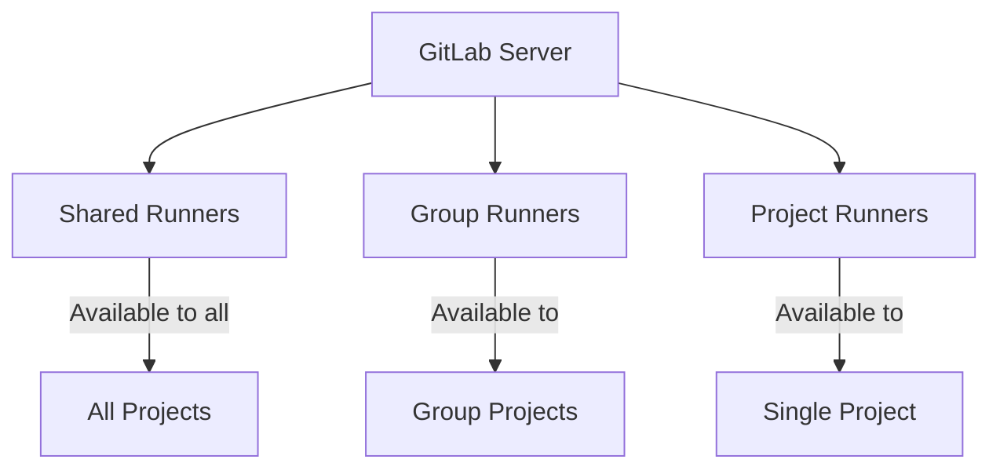
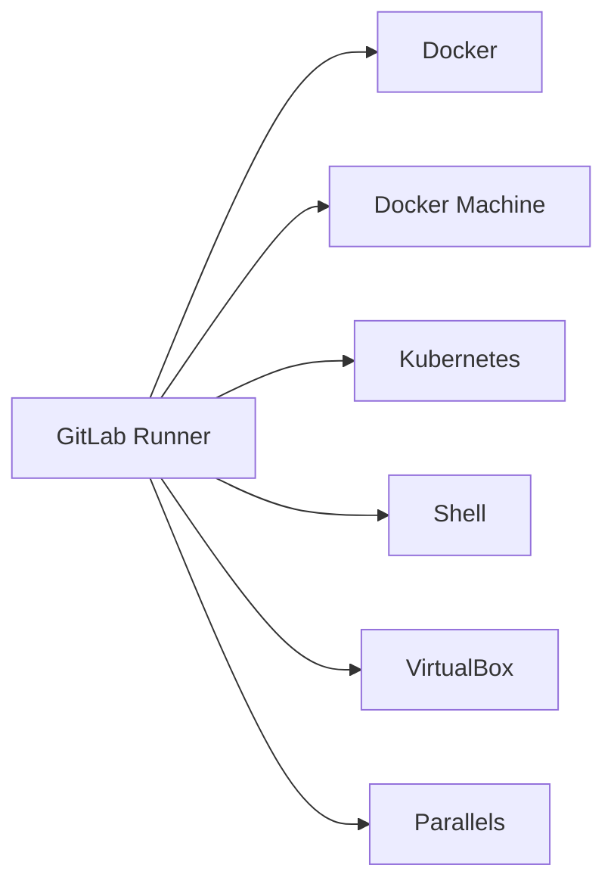

# How to Use GitLab Runners Effectively

Author: [nawazdhandala](https://www.github.com/nawazdhandala)

Tags: GitLab, CI/CD, Runners, DevOps, Infrastructure, Kubernetes, Docker

Description: Master GitLab Runners to optimize your CI/CD pipelines. Learn about runner types, registration, configuration, scaling strategies, and best practices for efficient job execution.

---

GitLab Runners are the workhorses of your CI/CD pipelines. They execute the jobs defined in your `.gitlab-ci.yml` file and report results back to GitLab. Understanding how to configure and optimize runners is essential for efficient pipelines.

## Understanding GitLab Runners

Runners can be deployed in various configurations:



### Runner Types

| Type | Scope | Use Case |
|------|-------|----------|
| Shared | Instance-wide | General purpose workloads |
| Group | Group projects | Team-specific requirements |
| Project | Single project | Special security/compliance needs |

## Runner Executors

The executor determines how jobs run:



### Docker Executor

Most common for isolated, reproducible builds:

```toml
# /etc/gitlab-runner/config.toml
[[runners]]
  name = "docker-runner"
  url = "https://gitlab.com/"
  token = "your-token"
  executor = "docker"
  [runners.docker]
    image = "alpine:latest"
    privileged = true
    volumes = ["/cache", "/var/run/docker.sock:/var/run/docker.sock"]
    shm_size = 0
```

### Kubernetes Executor

Scalable, cloud-native execution:

```toml
[[runners]]
  name = "kubernetes-runner"
  url = "https://gitlab.com/"
  token = "your-token"
  executor = "kubernetes"
  [runners.kubernetes]
    namespace = "gitlab-runner"
    image = "alpine:latest"
    privileged = true
    [[runners.kubernetes.volumes.host_path]]
      name = "docker"
      mount_path = "/var/run/docker.sock"
      host_path = "/var/run/docker.sock"
```

### Shell Executor

Direct execution on the host:

```toml
[[runners]]
  name = "shell-runner"
  url = "https://gitlab.com/"
  token = "your-token"
  executor = "shell"
```

## Installing GitLab Runner

### On Linux

```bash
# Download the binary
curl -L --output /usr/local/bin/gitlab-runner \
  "https://gitlab-runner-downloads.s3.amazonaws.com/latest/binaries/gitlab-runner-linux-amd64"

# Make it executable
chmod +x /usr/local/bin/gitlab-runner

# Create a GitLab CI user
useradd --comment 'GitLab Runner' --create-home gitlab-runner --shell /bin/bash

# Install and run as service
gitlab-runner install --user=gitlab-runner --working-directory=/home/gitlab-runner
gitlab-runner start
```

### On Kubernetes with Helm

```bash
# Add the GitLab Helm repository
helm repo add gitlab https://charts.gitlab.io

# Create namespace
kubectl create namespace gitlab-runner

# Install the runner
helm install gitlab-runner gitlab/gitlab-runner \
  --namespace gitlab-runner \
  --set gitlabUrl=https://gitlab.com/ \
  --set runnerRegistrationToken="your-token" \
  --set runners.privileged=true
```

## Registering Runners

### Interactive Registration

```bash
gitlab-runner register
```

### Non-Interactive Registration

```bash
gitlab-runner register \
  --non-interactive \
  --url "https://gitlab.com/" \
  --registration-token "PROJECT_REGISTRATION_TOKEN" \
  --executor "docker" \
  --docker-image alpine:latest \
  --description "Docker Runner" \
  --tag-list "docker,linux" \
  --run-untagged="true" \
  --locked="false"
```

## Using Tags

Tags help route jobs to specific runners:

```yaml
# .gitlab-ci.yml
build_gpu:
  tags:
    - gpu
    - linux
  script:
    - nvidia-smi
    - python train_model.py

build_docker:
  tags:
    - docker
  script:
    - docker build -t myapp .

build_any:
  # No tags - runs on any available runner
  script:
    - npm test
```

### Runner Configuration with Tags

```toml
[[runners]]
  name = "gpu-runner"
  token = "token"
  url = "https://gitlab.com/"
  executor = "shell"
  tag_list = ["gpu", "linux", "cuda"]
  run_untagged = false
```

## Resource Management

### Concurrent Jobs

```toml
# Global setting
concurrent = 10

[[runners]]
  name = "runner-1"
  limit = 5  # Max concurrent jobs for this runner
```

### Job Timeouts

```yaml
# .gitlab-ci.yml
long_running_job:
  timeout: 3 hours
  script:
    - ./long_build.sh

quick_job:
  timeout: 10 minutes
  script:
    - npm test
```

### Resource Requests (Kubernetes)

```toml
[[runners]]
  executor = "kubernetes"
  [runners.kubernetes]
    namespace = "gitlab-runner"
    [runners.kubernetes.pod_spec]
      containers = '''
      - name: build
        resources:
          requests:
            cpu: "500m"
            memory: "1Gi"
          limits:
            cpu: "2000m"
            memory: "4Gi"
      '''
```

## Caching Configuration

### Local Cache

```toml
[[runners]]
  [runners.cache]
    Type = "local"
    Path = "/cache"
    Shared = true
```

### S3 Cache

```toml
[[runners]]
  [runners.cache]
    Type = "s3"
    Path = "runner-cache"
    Shared = true
    [runners.cache.s3]
      ServerAddress = "s3.amazonaws.com"
      BucketName = "my-cache-bucket"
      BucketLocation = "us-east-1"
      AccessKey = "your-access-key"
      SecretKey = "your-secret-key"
```

### GCS Cache

```toml
[[runners]]
  [runners.cache]
    Type = "gcs"
    Path = "runner-cache"
    Shared = true
    [runners.cache.gcs]
      BucketName = "my-gcs-bucket"
      CredentialsFile = "/path/to/credentials.json"
```

## Autoscaling Runners

### Docker Machine Autoscaling

```toml
[[runners]]
  name = "autoscale-runner"
  executor = "docker+machine"
  limit = 100

  [runners.machine]
    IdleCount = 2
    IdleTime = 1800
    MaxBuilds = 50
    MachineDriver = "amazonec2"
    MachineName = "gitlab-runner-%s"
    MachineOptions = [
      "amazonec2-instance-type=t3.medium",
      "amazonec2-region=us-east-1",
      "amazonec2-vpc-id=vpc-12345",
      "amazonec2-subnet-id=subnet-12345",
      "amazonec2-zone=a"
    ]

    [[runners.machine.autoscaling]]
      Periods = ["* * 9-17 * * mon-fri *"]
      IdleCount = 10
      IdleTime = 600
      Timezone = "America/New_York"

    [[runners.machine.autoscaling]]
      Periods = ["* * * * * sat,sun *"]
      IdleCount = 0
      IdleTime = 60
```

### Kubernetes Autoscaling

```yaml
# values.yaml for Helm chart
runners:
  config: |
    [[runners]]
      executor = "kubernetes"
      [runners.kubernetes]
        namespace = "{{.Release.Namespace}}"
        cpu_request = "100m"
        memory_request = "256Mi"
        cpu_limit = "2"
        memory_limit = "4Gi"

# Combined with Kubernetes HPA/VPA
```

## Security Best Practices

### Protected Runners

Only run jobs from protected branches:

```toml
[[runners]]
  name = "protected-runner"
  token = "token"
  executor = "docker"
  # Set via UI or API - only runs protected branch/tag jobs
```

### Limiting Runner Access

```yaml
# .gitlab-ci.yml
deploy_production:
  tags:
    - protected
    - production
  script:
    - ./deploy.sh
  only:
    - main
  environment:
    name: production
```

### Docker Socket Security

```toml
[[runners]]
  [runners.docker]
    # Avoid mounting Docker socket in production
    # Use Kaniko or buildah instead for builds
    privileged = false
    volumes = ["/cache"]
```

## Monitoring Runners

### Prometheus Metrics

```toml
listen_address = ":9252"

[[runners]]
  name = "monitored-runner"
  # ... config
```

```yaml
# prometheus.yml
scrape_configs:
  - job_name: 'gitlab-runner'
    static_configs:
      - targets: ['runner-host:9252']
```

### Health Checks

```bash
# Check runner status
gitlab-runner status

# Verify runner connection
gitlab-runner verify

# Debug mode
gitlab-runner --debug run
```

## Optimizing Runner Performance

### 1. Use Appropriate Executor

```yaml
# Fast feedback jobs - use Docker
lint:
  tags: [docker]
  image: node:18-alpine
  script: npm run lint

# Heavy builds - use dedicated runners
build:
  tags: [high-cpu]
  script: npm run build
```

### 2. Optimize Docker Images

```yaml
# Use slim images
test:
  image: node:18-alpine  # Not node:18
  script: npm test
```

### 3. Pre-pull Images

```toml
[[runners]]
  [runners.docker]
    pull_policy = ["if-not-present"]
    allowed_pull_policies = ["always", "if-not-present"]
```

### 4. Use Local Registries

```toml
[[runners]]
  [runners.docker]
    allowed_images = ["registry.company.com/*"]
```

## Complete Runner Configuration Example

```toml
# /etc/gitlab-runner/config.toml
concurrent = 20
check_interval = 0
log_level = "info"

[session_server]
  listen_address = "[::]:8093"
  session_timeout = 1800

[[runners]]
  name = "docker-runner-production"
  url = "https://gitlab.company.com/"
  token = "runner-token"
  executor = "docker"
  limit = 10

  [runners.custom_build_dir]
    enabled = true

  [runners.cache]
    Type = "s3"
    Path = "cache"
    Shared = true
    [runners.cache.s3]
      ServerAddress = "s3.amazonaws.com"
      BucketName = "gitlab-runner-cache"
      BucketLocation = "us-east-1"

  [runners.docker]
    tls_verify = false
    image = "alpine:latest"
    privileged = true
    disable_entrypoint_overwrite = false
    oom_kill_disable = false
    disable_cache = false
    volumes = ["/cache", "/var/run/docker.sock:/var/run/docker.sock"]
    shm_size = 300000000
    pull_policy = ["if-not-present"]
    allowed_images = ["*"]

  [runners.docker.dns]
    servers = ["8.8.8.8", "8.8.4.4"]
```

## Conclusion

Effective GitLab Runner management is crucial for CI/CD performance. Key takeaways:

1. Choose the right executor for your workload
2. Use tags to route jobs to appropriate runners
3. Configure caching for faster builds
4. Implement autoscaling for cost efficiency
5. Monitor runner health and performance
6. Follow security best practices

With properly configured runners, your pipelines will execute faster, scale automatically, and provide reliable feedback to your development team.
