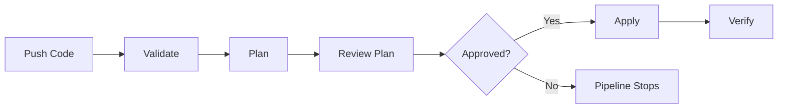

# How to Set Up Terraform Pipeline in GitLab CI

Author: [nawazdhandala](https://www.github.com/nawazdhandala)

Tags: GitLab CI, Terraform, Infrastructure as Code, IaC, CI/CD, DevOps

Description: Learn how to set up a Terraform pipeline in GitLab CI for infrastructure as code deployments. This guide covers state management, plan/apply workflows, environment separation, and security best practices.

> A well-designed Terraform pipeline automates infrastructure changes while maintaining safety through plan reviews and approval gates.

Infrastructure as Code with Terraform requires careful CI/CD design. Unlike application code where a failed deployment can be rolled back, infrastructure changes can have lasting consequences. A good Terraform pipeline provides visibility into planned changes, requires approval for production modifications, and maintains state consistency.

## Understanding Terraform CI/CD

A typical Terraform pipeline includes validation, planning, approval, and apply stages.



## Basic Terraform Pipeline

Start with a simple pipeline that validates and plans on every push, then applies on the main branch.

```yaml
# .gitlab-ci.yml
image: hashicorp/terraform:1.6

variables:
  TF_ROOT: ${CI_PROJECT_DIR}/terraform
  TF_STATE_NAME: default

stages:
  - validate
  - plan
  - apply

cache:
  key: terraform-cache
  paths:
    - ${TF_ROOT}/.terraform

before_script:
  - cd ${TF_ROOT}
  - terraform init

validate:
  stage: validate
  script:
    - terraform validate
    - terraform fmt -check

plan:
  stage: plan
  script:
    - terraform plan -out=plan.tfplan
  artifacts:
    paths:
      - ${TF_ROOT}/plan.tfplan
    expire_in: 1 week

apply:
  stage: apply
  script:
    - terraform apply -auto-approve plan.tfplan
  dependencies:
    - plan
  rules:
    - if: '$CI_COMMIT_BRANCH == "main"'
      when: manual
```

## GitLab Managed Terraform State

GitLab can manage your Terraform state, eliminating the need for external state backends.

```yaml
# Using GitLab-managed Terraform state
image: registry.gitlab.com/gitlab-org/terraform-images/stable:latest

variables:
  TF_ROOT: ${CI_PROJECT_DIR}/terraform
  TF_STATE_NAME: production
  TF_ADDRESS: ${CI_API_V4_URL}/projects/${CI_PROJECT_ID}/terraform/state/${TF_STATE_NAME}

stages:
  - prepare
  - validate
  - plan
  - apply

init:
  stage: prepare
  script:
    - cd ${TF_ROOT}
    - gitlab-terraform init
  artifacts:
    paths:
      - ${TF_ROOT}/.terraform

validate:
  stage: validate
  script:
    - cd ${TF_ROOT}
    - gitlab-terraform validate

plan:
  stage: plan
  script:
    - cd ${TF_ROOT}
    - gitlab-terraform plan
    - gitlab-terraform plan-json
  artifacts:
    paths:
      - ${TF_ROOT}/plan.cache
    reports:
      terraform: ${TF_ROOT}/plan.json

apply:
  stage: apply
  script:
    - cd ${TF_ROOT}
    - gitlab-terraform apply
  dependencies:
    - plan
  rules:
    - if: '$CI_COMMIT_BRANCH == "main"'
      when: manual
```

## External State Backend (AWS S3)

Configure Terraform to use an external state backend.

```hcl
# terraform/backend.tf
terraform {
  backend "s3" {
    bucket         = "my-terraform-state"
    key            = "project/terraform.tfstate"
    region         = "us-east-1"
    encrypt        = true
    dynamodb_table = "terraform-locks"
  }
}
```

```yaml
# .gitlab-ci.yml
image: hashicorp/terraform:1.6

variables:
  TF_ROOT: ${CI_PROJECT_DIR}/terraform
  AWS_DEFAULT_REGION: us-east-1

stages:
  - validate
  - plan
  - apply

before_script:
  - cd ${TF_ROOT}
  - terraform init -backend-config="access_key=${AWS_ACCESS_KEY_ID}" -backend-config="secret_key=${AWS_SECRET_ACCESS_KEY}"

validate:
  stage: validate
  script:
    - terraform validate
    - terraform fmt -check -recursive

plan:
  stage: plan
  script:
    - terraform plan -out=plan.tfplan
  artifacts:
    paths:
      - ${TF_ROOT}/plan.tfplan

apply:
  stage: apply
  script:
    - terraform apply -auto-approve plan.tfplan
  rules:
    - if: '$CI_COMMIT_BRANCH == "main"'
      when: manual
  resource_group: terraform-apply
```

## Multi-Environment Pipeline

Manage multiple environments with separate state files.

```yaml
image: hashicorp/terraform:1.6

variables:
  TF_ROOT: ${CI_PROJECT_DIR}/terraform

stages:
  - validate
  - plan
  - apply

.terraform_template:
  before_script:
    - cd ${TF_ROOT}
    - terraform init -backend-config="key=${TF_STATE_KEY}"
  cache:
    key: terraform-${TF_ENV}
    paths:
      - ${TF_ROOT}/.terraform

# Development environment
plan_dev:
  extends: .terraform_template
  stage: plan
  variables:
    TF_ENV: dev
    TF_STATE_KEY: dev/terraform.tfstate
    TF_VAR_environment: dev
  script:
    - terraform workspace select ${TF_ENV} || terraform workspace new ${TF_ENV}
    - terraform plan -var-file=environments/dev.tfvars -out=plan-dev.tfplan
  artifacts:
    paths:
      - ${TF_ROOT}/plan-dev.tfplan
  rules:
    - if: '$CI_COMMIT_BRANCH'

apply_dev:
  extends: .terraform_template
  stage: apply
  variables:
    TF_ENV: dev
    TF_STATE_KEY: dev/terraform.tfstate
  script:
    - terraform workspace select ${TF_ENV}
    - terraform apply -auto-approve plan-dev.tfplan
  dependencies:
    - plan_dev
  rules:
    - if: '$CI_COMMIT_BRANCH == "develop"'
  resource_group: terraform-dev

# Production environment
plan_prod:
  extends: .terraform_template
  stage: plan
  variables:
    TF_ENV: prod
    TF_STATE_KEY: prod/terraform.tfstate
    TF_VAR_environment: prod
  script:
    - terraform workspace select ${TF_ENV} || terraform workspace new ${TF_ENV}
    - terraform plan -var-file=environments/prod.tfvars -out=plan-prod.tfplan
  artifacts:
    paths:
      - ${TF_ROOT}/plan-prod.tfplan
  rules:
    - if: '$CI_COMMIT_BRANCH == "main"'

apply_prod:
  extends: .terraform_template
  stage: apply
  variables:
    TF_ENV: prod
    TF_STATE_KEY: prod/terraform.tfstate
  script:
    - terraform workspace select ${TF_ENV}
    - terraform apply -auto-approve plan-prod.tfplan
  dependencies:
    - plan_prod
  rules:
    - if: '$CI_COMMIT_BRANCH == "main"'
      when: manual
  resource_group: terraform-prod
```

## Merge Request Pipeline

Show plan output in merge requests.

```yaml
image: hashicorp/terraform:1.6

stages:
  - validate
  - plan

validate:
  stage: validate
  script:
    - cd terraform
    - terraform init
    - terraform validate
    - terraform fmt -check
  rules:
    - if: '$CI_PIPELINE_SOURCE == "merge_request_event"'

plan:
  stage: plan
  script:
    - cd terraform
    - terraform init
    - terraform plan -out=plan.tfplan
    - terraform show -no-color plan.tfplan > plan.txt
  artifacts:
    paths:
      - terraform/plan.tfplan
      - terraform/plan.txt
    reports:
      terraform: terraform/plan.json
  rules:
    - if: '$CI_PIPELINE_SOURCE == "merge_request_event"'

# Post plan output as MR comment
comment_plan:
  stage: plan
  image: alpine:latest
  before_script:
    - apk add --no-cache curl
  script:
    - |
      PLAN_OUTPUT=$(cat terraform/plan.txt)
      curl --request POST \
        --header "PRIVATE-TOKEN: ${GITLAB_API_TOKEN}" \
        --data-urlencode "body=## Terraform Plan Output
      \`\`\`
      ${PLAN_OUTPUT}
      \`\`\`" \
        "${CI_API_V4_URL}/projects/${CI_PROJECT_ID}/merge_requests/${CI_MERGE_REQUEST_IID}/notes"
  needs:
    - plan
  rules:
    - if: '$CI_PIPELINE_SOURCE == "merge_request_event"'
```

## Security Scanning for Terraform

Add security scanning to catch misconfigurations.

```yaml
stages:
  - validate
  - security
  - plan
  - apply

validate:
  stage: validate
  script:
    - terraform validate
    - terraform fmt -check

# Checkov security scanning
checkov:
  stage: security
  image: bridgecrew/checkov:latest
  script:
    - checkov -d terraform/ --output junitxml --output-file-path . || true
  artifacts:
    reports:
      junit: results_junitxml.xml

# tfsec scanning
tfsec:
  stage: security
  image: aquasec/tfsec:latest
  script:
    - tfsec terraform/ --format junit --out tfsec-report.xml || true
  artifacts:
    reports:
      junit: tfsec-report.xml

# Terrascan scanning
terrascan:
  stage: security
  image: tenable/terrascan:latest
  script:
    - terrascan scan -i terraform -d terraform/ -o junit-xml > terrascan-report.xml || true
  artifacts:
    reports:
      junit: terrascan-report.xml

plan:
  stage: plan
  needs:
    - validate
    - checkov
    - tfsec
  script:
    - terraform plan -out=plan.tfplan
```

## Cost Estimation

Add cost estimation to your pipeline.

```yaml
stages:
  - plan
  - cost
  - apply

plan:
  stage: plan
  script:
    - terraform plan -out=plan.tfplan
    - terraform show -json plan.tfplan > plan.json
  artifacts:
    paths:
      - terraform/plan.tfplan
      - terraform/plan.json

cost_estimate:
  stage: cost
  image: infracost/infracost:latest
  script:
    - infracost breakdown --path terraform/plan.json --format json --out-file infracost.json
    - infracost breakdown --path terraform/plan.json
  artifacts:
    paths:
      - infracost.json
  needs:
    - plan
```

## Complete Terraform Pipeline

Here is a complete pipeline with all best practices.

```yaml
image: hashicorp/terraform:1.6

variables:
  TF_ROOT: ${CI_PROJECT_DIR}/terraform
  TF_IN_AUTOMATION: "true"

stages:
  - validate
  - security
  - plan
  - cost
  - apply
  - verify

cache:
  key: terraform-${CI_COMMIT_REF_SLUG}
  paths:
    - ${TF_ROOT}/.terraform

# Validation
validate:
  stage: validate
  script:
    - cd ${TF_ROOT}
    - terraform init -backend=false
    - terraform validate
    - terraform fmt -check -recursive
  rules:
    - if: '$CI_PIPELINE_SOURCE == "merge_request_event"'
    - if: '$CI_COMMIT_BRANCH == "main"'

# Security scanning
security_scan:
  stage: security
  image: bridgecrew/checkov:latest
  script:
    - checkov -d ${TF_ROOT}/ --soft-fail --output junitxml --output-file-path .
  artifacts:
    reports:
      junit: results_junitxml.xml
  rules:
    - if: '$CI_PIPELINE_SOURCE == "merge_request_event"'
    - if: '$CI_COMMIT_BRANCH == "main"'

# Plan
plan:
  stage: plan
  script:
    - cd ${TF_ROOT}
    - terraform init
    - terraform plan -out=plan.tfplan
    - terraform show -no-color plan.tfplan > plan.txt
    - terraform show -json plan.tfplan > plan.json
  artifacts:
    paths:
      - ${TF_ROOT}/plan.tfplan
      - ${TF_ROOT}/plan.txt
      - ${TF_ROOT}/plan.json
    reports:
      terraform: ${TF_ROOT}/plan.json
  needs:
    - validate
    - security_scan
  rules:
    - if: '$CI_PIPELINE_SOURCE == "merge_request_event"'
    - if: '$CI_COMMIT_BRANCH == "main"'

# Cost estimation
cost:
  stage: cost
  image: infracost/infracost:latest
  script:
    - infracost breakdown --path ${TF_ROOT}/plan.json --format table
  needs:
    - plan
  rules:
    - if: '$CI_PIPELINE_SOURCE == "merge_request_event"'
    - if: '$CI_COMMIT_BRANCH == "main"'
  allow_failure: true

# Apply
apply:
  stage: apply
  script:
    - cd ${TF_ROOT}
    - terraform init
    - terraform apply -auto-approve plan.tfplan
  dependencies:
    - plan
  rules:
    - if: '$CI_COMMIT_BRANCH == "main"'
      when: manual
  resource_group: terraform-production
  environment:
    name: production

# Verify
verify:
  stage: verify
  script:
    - cd ${TF_ROOT}
    - terraform output -json > outputs.json
    - cat outputs.json
  needs:
    - apply
  rules:
    - if: '$CI_COMMIT_BRANCH == "main"'
  artifacts:
    paths:
      - ${TF_ROOT}/outputs.json
```

## Best Practices

Always use remote state with locking to prevent concurrent modifications. Store sensitive variables in GitLab CI/CD variables, not in code. Use resource groups to prevent parallel applies to the same environment. Require manual approval for production applies. Include security scanning to catch misconfigurations before apply. Save plan output as artifacts for audit trails. Use workspaces or separate state files for different environments.

A well-designed Terraform pipeline provides the safety rails needed for infrastructure automation. By combining validation, security scanning, cost estimation, and approval gates, you can confidently automate infrastructure changes while maintaining control.
