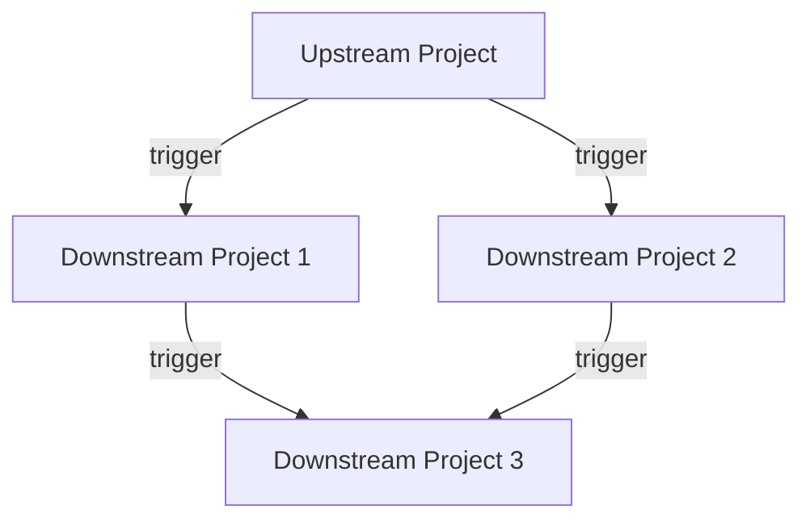

# How to Set Up Multi-Project Pipelines in GitLab CI

Author: [nawazdhandala](https://www.github.com/nawazdhandala)

Tags: GitLab, CI/CD, Multi-Project, Cross-Project, Pipelines, Microservices

Description: Learn how to set up multi-project pipelines in GitLab CI to coordinate builds across multiple repositories. This guide covers triggers, dependencies, and orchestration patterns.

---

Multi-project pipelines in GitLab CI allow you to trigger and coordinate pipelines across different repositories. This is essential for microservices architectures, shared libraries, and any system where changes in one project affect others. This guide shows you how to implement effective cross-project pipeline orchestration.

## Understanding Multi-Project Pipelines



### Use Cases

- Deploying dependent services after library updates
- Running integration tests across multiple services
- Coordinating releases across repositories
- Building documentation from multiple sources

## Basic Cross-Project Trigger

### Triggering a Downstream Pipeline

```yaml
# upstream/.gitlab-ci.yml
stages:
  - build
  - trigger

build:
  stage: build
  script:
    - npm run build

trigger_downstream:
  stage: trigger
  trigger:
    project: mygroup/downstream-project
    branch: main
```

### Waiting for Downstream Pipeline

```yaml
trigger_downstream:
  trigger:
    project: mygroup/downstream-project
    strategy: depend  # Wait for downstream to complete
```

## Passing Variables

### Explicit Variables

```yaml
trigger_deploy:
  trigger:
    project: mygroup/deployment
    branch: main
  variables:
    UPSTREAM_VERSION: $CI_COMMIT_SHA
    DEPLOY_ENVIRONMENT: staging
    SERVICE_NAME: api
```

### Forward Variables

```yaml
trigger_downstream:
  trigger:
    project: mygroup/downstream
    forward:
      yaml_variables: true       # Forward job-defined variables
      pipeline_variables: true   # Forward pipeline trigger variables
```

## Using Pipeline Triggers

### Create a Trigger Token

1. Navigate to Settings > CI/CD > Pipeline triggers
2. Add a new trigger
3. Store the token securely

### Trigger via API

```yaml
# In downstream project, create trigger token
# Then use it from upstream:

trigger_api:
  script:
    - |
      curl -X POST \
        -F "token=$DOWNSTREAM_TRIGGER_TOKEN" \
        -F "ref=main" \
        -F "variables[UPSTREAM_SHA]=$CI_COMMIT_SHA" \
        "https://gitlab.com/api/v4/projects/$DOWNSTREAM_PROJECT_ID/trigger/pipeline"
```

## Bidirectional Communication

### Upstream to Downstream

```yaml
# upstream/.gitlab-ci.yml
trigger_build:
  trigger:
    project: mygroup/service-a
    strategy: depend
  variables:
    LIBRARY_VERSION: $CI_COMMIT_TAG
```

### Downstream Response

```yaml
# downstream/.gitlab-ci.yml
build:
  script:
    - echo "Building with library version $LIBRARY_VERSION"
    - npm install mylib@$LIBRARY_VERSION
    - npm run build
  rules:
    - if: $CI_PIPELINE_SOURCE == "pipeline"  # Triggered by upstream
```

## Complex Orchestration Patterns

### Sequential Multi-Project

```yaml
# orchestrator/.gitlab-ci.yml
stages:
  - build_libs
  - build_services
  - deploy

build_shared_lib:
  stage: build_libs
  trigger:
    project: mygroup/shared-lib
    strategy: depend

build_api:
  stage: build_services
  needs: [build_shared_lib]
  trigger:
    project: mygroup/api-service
    strategy: depend
  variables:
    LIB_VERSION: $CI_COMMIT_SHA

build_web:
  stage: build_services
  needs: [build_shared_lib]
  trigger:
    project: mygroup/web-app
    strategy: depend
  variables:
    LIB_VERSION: $CI_COMMIT_SHA

deploy_all:
  stage: deploy
  needs: [build_api, build_web]
  trigger:
    project: mygroup/infrastructure
    strategy: depend
  variables:
    API_VERSION: $CI_COMMIT_SHA
    WEB_VERSION: $CI_COMMIT_SHA
```

### Fan-Out Pattern

```yaml
# Trigger multiple services in parallel
stages:
  - trigger

.trigger_template:
  stage: trigger
  trigger:
    strategy: depend

trigger_service_a:
  extends: .trigger_template
  trigger:
    project: mygroup/service-a

trigger_service_b:
  extends: .trigger_template
  trigger:
    project: mygroup/service-b

trigger_service_c:
  extends: .trigger_template
  trigger:
    project: mygroup/service-c
```

### Fan-In Pattern

```yaml
# Wait for multiple upstream pipelines
stages:
  - wait
  - deploy

wait_for_builds:
  stage: wait
  trigger:
    project: mygroup/build-coordinator
    strategy: depend

deploy:
  stage: deploy
  needs: [wait_for_builds]
  script:
    - ./deploy.sh
```

## Conditional Triggers

### Based on Changes

```yaml
trigger_api:
  trigger:
    project: mygroup/api
    strategy: depend
  rules:
    - changes:
        - api/**/*
        - shared/**/*

trigger_web:
  trigger:
    project: mygroup/web
    strategy: depend
  rules:
    - changes:
        - web/**/*
        - shared/**/*
```

### Based on Variables

```yaml
trigger_staging:
  trigger:
    project: mygroup/deployment
  variables:
    ENVIRONMENT: staging
  rules:
    - if: $CI_COMMIT_BRANCH == "develop"

trigger_production:
  trigger:
    project: mygroup/deployment
  variables:
    ENVIRONMENT: production
  rules:
    - if: $CI_COMMIT_BRANCH == "main"
  when: manual
```

## Using Include from Other Projects

### Include Remote Templates

```yaml
include:
  - project: 'mygroup/ci-templates'
    ref: main
    file: '/templates/nodejs.yml'
  - project: 'mygroup/ci-templates'
    file: '/templates/docker.yml'

build:
  extends: .nodejs_build

docker:
  extends: .docker_build
```

### Multiple Files

```yaml
include:
  - project: 'mygroup/ci-templates'
    ref: v2.0.0
    file:
      - '/templates/base.yml'
      - '/templates/test.yml'
      - '/templates/deploy.yml'
```

## Artifact Sharing Across Projects

### Download Artifacts from Another Project

```yaml
deploy:
  script:
    - |
      # Download artifacts from another project's pipeline
      curl --header "PRIVATE-TOKEN: $API_TOKEN" \
        "https://gitlab.com/api/v4/projects/$UPSTREAM_PROJECT_ID/jobs/artifacts/main/download?job=build" \
        --output artifacts.zip
    - unzip artifacts.zip
    - ./deploy.sh
```

### Using needs:project

```yaml
deploy:
  needs:
    - project: mygroup/frontend
      job: build
      ref: main
      artifacts: true
  script:
    - ls frontend/dist/
    - ./deploy.sh
```

## Complete Example: Microservices Deployment

```yaml
# orchestrator/.gitlab-ci.yml
variables:
  API_PROJECT: "mygroup/api-service"
  WEB_PROJECT: "mygroup/web-app"
  WORKER_PROJECT: "mygroup/worker-service"
  INFRA_PROJECT: "mygroup/infrastructure"

stages:
  - validate
  - build
  - test
  - deploy

# Validate all services can build
validate_services:
  stage: validate
  parallel:
    matrix:
      - PROJECT: [$API_PROJECT, $WEB_PROJECT, $WORKER_PROJECT]
  trigger:
    project: $PROJECT
    strategy: depend
  variables:
    VALIDATE_ONLY: "true"
  rules:
    - if: $CI_PIPELINE_SOURCE == "merge_request_event"

# Build services
build_api:
  stage: build
  trigger:
    project: $API_PROJECT
    strategy: depend
  variables:
    BUILD_VERSION: $CI_COMMIT_SHA
    PUSH_IMAGE: "true"

build_web:
  stage: build
  trigger:
    project: $WEB_PROJECT
    strategy: depend
  variables:
    BUILD_VERSION: $CI_COMMIT_SHA
    PUSH_IMAGE: "true"

build_worker:
  stage: build
  trigger:
    project: $WORKER_PROJECT
    strategy: depend
  variables:
    BUILD_VERSION: $CI_COMMIT_SHA
    PUSH_IMAGE: "true"

# Integration tests
integration_tests:
  stage: test
  needs:
    - build_api
    - build_web
    - build_worker
  trigger:
    project: mygroup/integration-tests
    strategy: depend
  variables:
    API_VERSION: $CI_COMMIT_SHA
    WEB_VERSION: $CI_COMMIT_SHA
    WORKER_VERSION: $CI_COMMIT_SHA

# Deploy to staging
deploy_staging:
  stage: deploy
  needs:
    - integration_tests
  trigger:
    project: $INFRA_PROJECT
    strategy: depend
  variables:
    ENVIRONMENT: staging
    API_VERSION: $CI_COMMIT_SHA
    WEB_VERSION: $CI_COMMIT_SHA
    WORKER_VERSION: $CI_COMMIT_SHA
  environment:
    name: staging
    url: https://staging.example.com

# Deploy to production
deploy_production:
  stage: deploy
  needs:
    - deploy_staging
  trigger:
    project: $INFRA_PROJECT
    strategy: depend
  variables:
    ENVIRONMENT: production
    API_VERSION: $CI_COMMIT_SHA
    WEB_VERSION: $CI_COMMIT_SHA
    WORKER_VERSION: $CI_COMMIT_SHA
  environment:
    name: production
    url: https://example.com
  when: manual
  rules:
    - if: $CI_COMMIT_BRANCH == "main"
```

```yaml
# api-service/.gitlab-ci.yml
stages:
  - build
  - test
  - push

build:
  stage: build
  script:
    - docker build -t api:$BUILD_VERSION .
  rules:
    - if: $VALIDATE_ONLY == "true"
      when: always
    - when: on_success

test:
  stage: test
  script:
    - npm test
  rules:
    - if: $VALIDATE_ONLY == "true"
      when: never
    - when: on_success

push:
  stage: push
  script:
    - docker push $CI_REGISTRY_IMAGE:$BUILD_VERSION
  rules:
    - if: $PUSH_IMAGE == "true"
```

## Monitoring Cross-Project Pipelines

### Pipeline Status in UI

GitLab shows downstream pipeline status in the upstream pipeline view, making it easy to track the entire workflow.

### Using Pipeline Bridges

```yaml
trigger_with_status:
  trigger:
    project: mygroup/downstream
    strategy: depend
  # Job shows downstream pipeline status inline
```

## Best Practices

1. **Use strategy: depend** for critical dependencies
2. **Pass minimal variables** to avoid coupling
3. **Use trigger tokens** for external integrations
4. **Version your templates** with refs
5. **Document pipeline dependencies** in README
6. **Handle failures gracefully** with allow_failure when appropriate
7. **Use meaningful job names** that indicate the downstream project

## Troubleshooting

### Permission Issues

Ensure the triggering user has access to downstream projects:

```yaml
trigger_downstream:
  trigger:
    project: mygroup/downstream
  # Requires at least Developer role in downstream project
```

### Variable Not Available

Variables must be explicitly forwarded:

```yaml
trigger_downstream:
  trigger:
    project: mygroup/downstream
    forward:
      yaml_variables: true
  variables:
    MY_VAR: $MY_VAR  # Explicit forward
```

## Conclusion

Multi-project pipelines enable sophisticated CI/CD workflows across repositories. They are essential for microservices, monorepos with multiple deployables, and shared library ecosystems. By properly configuring triggers, variables, and dependencies, you can create reliable, coordinated deployments across your entire system.
