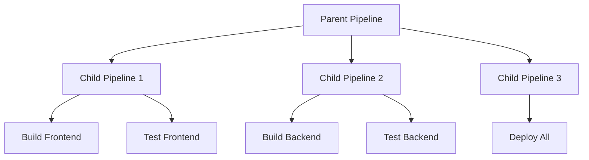

# How to Use Parent-Child Pipelines in GitLab CI

Author: [nawazdhandala](https://www.github.com/nawazdhandala)

Tags: GitLab, CI/CD, Pipelines, Parent-Child, Microservices, Monorepo

Description: Learn how to use parent-child pipelines in GitLab CI for modular, maintainable CI/CD configurations. This guide covers triggering child pipelines, passing variables, and managing complex workflows.

---

Parent-child pipelines in GitLab CI allow you to break down complex configurations into smaller, more manageable pieces. This pattern is especially useful for monorepos, microservices, and projects with conditional workflows. This guide shows you how to implement effective parent-child pipeline architectures.

## Understanding Parent-Child Pipelines



### Benefits

- **Modularity**: Separate concerns into different files
- **Reusability**: Share pipeline definitions across projects
- **Performance**: Run independent pipelines in parallel
- **Maintainability**: Smaller, focused configuration files
- **Conditional execution**: Trigger only relevant pipelines

## Basic Parent-Child Setup

### Parent Pipeline

```yaml
# .gitlab-ci.yml (parent)
stages:
  - triggers

trigger_frontend:
  stage: triggers
  trigger:
    include: ci/frontend.gitlab-ci.yml
    strategy: depend

trigger_backend:
  stage: triggers
  trigger:
    include: ci/backend.gitlab-ci.yml
    strategy: depend
```

### Child Pipeline

```yaml
# ci/frontend.gitlab-ci.yml
stages:
  - build
  - test

build_frontend:
  stage: build
  image: node:18-alpine
  script:
    - cd frontend
    - npm ci
    - npm run build
  artifacts:
    paths:
      - frontend/dist/

test_frontend:
  stage: test
  image: node:18-alpine
  script:
    - cd frontend
    - npm ci
    - npm test
```

## Trigger Strategies

### Strategy: depend

Wait for the child pipeline to complete:

```yaml
trigger_tests:
  trigger:
    include: ci/tests.yml
    strategy: depend  # Parent waits for child to finish
```

### Without Strategy

Fire and forget - parent continues immediately:

```yaml
trigger_notifications:
  trigger:
    include: ci/notifications.yml
    # No strategy - parent doesn't wait
```

## Passing Variables to Child Pipelines

### Explicit Variables

```yaml
# Parent
trigger_deploy:
  stage: deploy
  variables:
    ENVIRONMENT: production
    VERSION: $CI_COMMIT_SHA
  trigger:
    include: ci/deploy.yml
    strategy: depend

# Child (ci/deploy.yml)
deploy:
  script:
    - echo "Deploying version $VERSION to $ENVIRONMENT"
```

### Forward Variables

```yaml
# Parent
trigger_build:
  trigger:
    include: ci/build.yml
    forward:
      yaml_variables: true      # Forward variables defined in trigger job
      pipeline_variables: true  # Forward variables from parent pipeline trigger
```

## Dynamic Child Pipelines

Generate child pipeline configuration dynamically:

```yaml
# Parent
stages:
  - generate
  - trigger

generate_pipeline:
  stage: generate
  script:
    - |
      cat > child-pipeline.yml << EOF
      build:
        script:
          - echo "Building commit $CI_COMMIT_SHA"
          - npm run build

      test:
        script:
          - npm test
      EOF
  artifacts:
    paths:
      - child-pipeline.yml

run_dynamic:
  stage: trigger
  trigger:
    include:
      - artifact: child-pipeline.yml
        job: generate_pipeline
    strategy: depend
```

### Complex Dynamic Generation

```yaml
generate_matrix:
  stage: generate
  image: python:3.11-alpine
  script:
    - python scripts/generate-pipelines.py
  artifacts:
    paths:
      - generated-pipeline.yml

# scripts/generate-pipelines.py
# import os
# import yaml
#
# services = ['api', 'web', 'worker']
# config = {'stages': ['build', 'test']}
#
# for service in services:
#     config[f'build_{service}'] = {
#         'stage': 'build',
#         'script': [f'cd {service}', 'npm run build']
#     }
#
# with open('generated-pipeline.yml', 'w') as f:
#     yaml.dump(config, f)
```

## Monorepo Patterns

### Detect Changes and Trigger

```yaml
# Parent
stages:
  - detect
  - trigger

detect_changes:
  stage: detect
  script:
    - |
      echo "FRONTEND_CHANGED=false" > changes.env
      echo "BACKEND_CHANGED=false" >> changes.env
      echo "INFRA_CHANGED=false" >> changes.env

      git diff --name-only $CI_COMMIT_BEFORE_SHA..$CI_COMMIT_SHA > changed_files.txt

      if grep -q "^frontend/" changed_files.txt; then
        echo "FRONTEND_CHANGED=true" >> changes.env
      fi

      if grep -q "^backend/" changed_files.txt; then
        echo "BACKEND_CHANGED=true" >> changes.env
      fi

      if grep -q "^infrastructure/" changed_files.txt; then
        echo "INFRA_CHANGED=true" >> changes.env
      fi
  artifacts:
    reports:
      dotenv: changes.env

trigger_frontend:
  stage: trigger
  needs: [detect_changes]
  trigger:
    include: frontend/.gitlab-ci.yml
    strategy: depend
  rules:
    - if: $FRONTEND_CHANGED == "true"

trigger_backend:
  stage: trigger
  needs: [detect_changes]
  trigger:
    include: backend/.gitlab-ci.yml
    strategy: depend
  rules:
    - if: $BACKEND_CHANGED == "true"

trigger_infra:
  stage: trigger
  needs: [detect_changes]
  trigger:
    include: infrastructure/.gitlab-ci.yml
    strategy: depend
  rules:
    - if: $INFRA_CHANGED == "true"
```

### Using rules:changes

```yaml
trigger_frontend:
  trigger:
    include: frontend/.gitlab-ci.yml
  rules:
    - changes:
        - frontend/**/*
        - shared/**/*

trigger_backend:
  trigger:
    include: backend/.gitlab-ci.yml
  rules:
    - changes:
        - backend/**/*
        - shared/**/*
```

## Multiple Child Pipelines

```yaml
# Parent
stages:
  - build
  - deploy

.trigger_template:
  stage: build
  trigger:
    strategy: depend

trigger_service_a:
  extends: .trigger_template
  trigger:
    include: services/service-a/.gitlab-ci.yml
  rules:
    - changes:
        - services/service-a/**/*

trigger_service_b:
  extends: .trigger_template
  trigger:
    include: services/service-b/.gitlab-ci.yml
  rules:
    - changes:
        - services/service-b/**/*

trigger_service_c:
  extends: .trigger_template
  trigger:
    include: services/service-c/.gitlab-ci.yml
  rules:
    - changes:
        - services/service-c/**/*

deploy_all:
  stage: deploy
  trigger:
    include: ci/deploy-all.yml
    strategy: depend
  needs:
    - trigger_service_a
    - trigger_service_b
    - trigger_service_c
  when: on_success
```

## Including Remote Pipelines

### From Another Project

```yaml
trigger_shared:
  trigger:
    include:
      - project: 'mygroup/shared-pipelines'
        ref: main
        file: '/templates/nodejs.yml'
```

### Multiple Sources

```yaml
trigger_combined:
  trigger:
    include:
      - local: ci/base.yml
      - project: 'mygroup/templates'
        file: '/deploy.yml'
      - artifact: generated.yml
        job: generate
```

## Handling Child Pipeline Failures

### Allow Failure

```yaml
trigger_optional:
  trigger:
    include: ci/optional-tests.yml
    strategy: depend
  allow_failure: true
```

### Conditional on Parent Status

```yaml
# Child pipeline
cleanup:
  script:
    - ./cleanup.sh
  rules:
    - if: $CI_PIPELINE_SOURCE == "parent_pipeline"
```

## Complete Example: Microservices Monorepo

```yaml
# .gitlab-ci.yml
stages:
  - setup
  - build
  - test
  - deploy

variables:
  DOCKER_HOST: tcp://docker:2376

# Detect which services changed
detect:
  stage: setup
  image: alpine/git
  script:
    - |
      echo "Detecting changes..."

      # Get changed files
      if [ "$CI_COMMIT_BEFORE_SHA" = "0000000000000000000000000000000000000000" ]; then
        CHANGED=$(git diff-tree --no-commit-id --name-only -r $CI_COMMIT_SHA)
      else
        CHANGED=$(git diff --name-only $CI_COMMIT_BEFORE_SHA..$CI_COMMIT_SHA)
      fi

      echo "$CHANGED" > changed.txt

      # Set flags
      echo "API_CHANGED=false" > changes.env
      echo "WEB_CHANGED=false" >> changes.env
      echo "WORKER_CHANGED=false" >> changes.env

      grep -q "^api/" changed.txt && echo "API_CHANGED=true" >> changes.env || true
      grep -q "^web/" changed.txt && echo "WEB_CHANGED=true" >> changes.env || true
      grep -q "^worker/" changed.txt && echo "WORKER_CHANGED=true" >> changes.env || true

      cat changes.env
  artifacts:
    reports:
      dotenv: changes.env

# Service pipelines
build_api:
  stage: build
  needs: [detect]
  trigger:
    include: api/.gitlab-ci.yml
    strategy: depend
  rules:
    - if: $API_CHANGED == "true"
    - if: $CI_COMMIT_BRANCH == "main"

build_web:
  stage: build
  needs: [detect]
  trigger:
    include: web/.gitlab-ci.yml
    strategy: depend
  rules:
    - if: $WEB_CHANGED == "true"
    - if: $CI_COMMIT_BRANCH == "main"

build_worker:
  stage: build
  needs: [detect]
  trigger:
    include: worker/.gitlab-ci.yml
    strategy: depend
  rules:
    - if: $WORKER_CHANGED == "true"
    - if: $CI_COMMIT_BRANCH == "main"

# Integration tests
integration_tests:
  stage: test
  needs:
    - job: build_api
      optional: true
    - job: build_web
      optional: true
    - job: build_worker
      optional: true
  trigger:
    include: ci/integration-tests.yml
    strategy: depend
  rules:
    - if: $CI_COMMIT_BRANCH == "main"
    - if: $CI_PIPELINE_SOURCE == "merge_request_event"

# Deploy
deploy_staging:
  stage: deploy
  needs: [integration_tests]
  trigger:
    include: ci/deploy.yml
    strategy: depend
  variables:
    DEPLOY_ENV: staging
  rules:
    - if: $CI_COMMIT_BRANCH == "main"

deploy_production:
  stage: deploy
  needs: [deploy_staging]
  trigger:
    include: ci/deploy.yml
    strategy: depend
  variables:
    DEPLOY_ENV: production
  rules:
    - if: $CI_COMMIT_BRANCH == "main"
  when: manual
```

```yaml
# api/.gitlab-ci.yml
stages:
  - build
  - test

build:
  stage: build
  image: docker:24.0
  services:
    - docker:24.0-dind
  script:
    - cd api
    - docker build -t $CI_REGISTRY_IMAGE/api:$CI_COMMIT_SHA .
    - docker push $CI_REGISTRY_IMAGE/api:$CI_COMMIT_SHA

test:
  stage: test
  image: node:18-alpine
  script:
    - cd api
    - npm ci
    - npm test
```

## Best Practices

1. **Use strategy: depend** for pipelines that must complete before continuing
2. **Forward variables carefully** to avoid exposing secrets
3. **Use rules:changes** for efficient monorepo builds
4. **Keep child pipelines focused** on a single service or concern
5. **Use templates** for common patterns across child pipelines
6. **Handle optional jobs** with `optional: true` in needs

## Conclusion

Parent-child pipelines provide a powerful way to organize complex CI/CD configurations. They enable modular, maintainable pipelines that scale with your project's complexity. Whether you are managing a monorepo or orchestrating microservices, parent-child pipelines help keep your CI/CD manageable and efficient.
