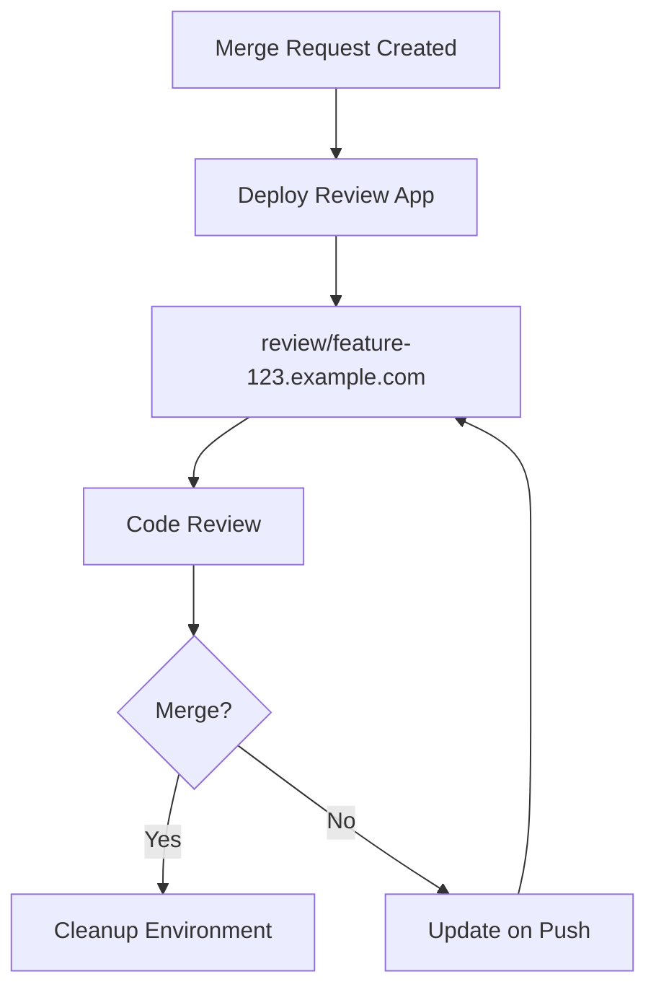

# How to Set Up Review Apps in GitLab CI

Author: [nawazdhandala](https://www.github.com/nawazdhandala)

Tags: GitLab, CI/CD, Review Apps, Environments, Preview, Merge Request

Description: Learn how to set up review apps in GitLab CI to automatically deploy preview environments for every merge request. This guide covers dynamic environments, cleanup, and best practices.

---

Review apps are temporary environments that automatically deploy your application for each merge request. They allow reviewers to see changes in a live environment before merging, significantly improving code review quality and catching issues early. This guide shows you how to implement review apps in GitLab CI.

## Understanding Review Apps



### Benefits

- Visual verification of changes
- Stakeholder feedback before merge
- Integration testing in realistic environment
- Reduced back-and-forth in reviews
- Catch UI/UX issues early

## Basic Review App Configuration

```yaml
stages:
  - build
  - deploy
  - cleanup

variables:
  REVIEW_APP_URL: ${CI_COMMIT_REF_SLUG}.review.example.com

build:
  stage: build
  script:
    - docker build -t $CI_REGISTRY_IMAGE:$CI_COMMIT_SHA .
    - docker push $CI_REGISTRY_IMAGE:$CI_COMMIT_SHA

deploy_review:
  stage: deploy
  script:
    - ./deploy.sh $REVIEW_APP_URL
  environment:
    name: review/$CI_COMMIT_REF_SLUG
    url: https://$REVIEW_APP_URL
    on_stop: stop_review
  rules:
    - if: $CI_PIPELINE_SOURCE == "merge_request_event"

stop_review:
  stage: cleanup
  script:
    - ./teardown.sh $REVIEW_APP_URL
  environment:
    name: review/$CI_COMMIT_REF_SLUG
    action: stop
  rules:
    - if: $CI_PIPELINE_SOURCE == "merge_request_event"
      when: manual
```

## Kubernetes Review Apps

### Using Helm

```yaml
variables:
  KUBE_NAMESPACE: review-apps
  RELEASE_NAME: review-${CI_COMMIT_REF_SLUG}
  REVIEW_URL: ${CI_COMMIT_REF_SLUG}.review.example.com

deploy_review:
  stage: deploy
  image: alpine/helm:3.13
  before_script:
    - mkdir -p /root/.kube
    - echo "$KUBECONFIG_CONTENT" > /root/.kube/config
  script:
    - |
      helm upgrade --install $RELEASE_NAME ./helm/app \
        --namespace $KUBE_NAMESPACE \
        --create-namespace \
        --set image.tag=$CI_COMMIT_SHA \
        --set ingress.host=$REVIEW_URL \
        --set env.DATABASE_URL=$REVIEW_DATABASE_URL \
        --wait --timeout 5m
  environment:
    name: review/$CI_COMMIT_REF_SLUG
    url: https://$REVIEW_URL
    on_stop: stop_review
    auto_stop_in: 1 week
  rules:
    - if: $CI_PIPELINE_SOURCE == "merge_request_event"

stop_review:
  stage: deploy
  image: alpine/helm:3.13
  before_script:
    - mkdir -p /root/.kube
    - echo "$KUBECONFIG_CONTENT" > /root/.kube/config
  script:
    - helm uninstall $RELEASE_NAME --namespace $KUBE_NAMESPACE
    - kubectl delete namespace $KUBE_NAMESPACE-$CI_COMMIT_REF_SLUG || true
  environment:
    name: review/$CI_COMMIT_REF_SLUG
    action: stop
  rules:
    - if: $CI_PIPELINE_SOURCE == "merge_request_event"
      when: manual
```

### Using kubectl

```yaml
deploy_review:
  stage: deploy
  image: bitnami/kubectl:latest
  script:
    - kubectl create namespace review-$CI_COMMIT_REF_SLUG || true
    - |
      cat <<EOF | kubectl apply -f -
      apiVersion: apps/v1
      kind: Deployment
      metadata:
        name: app
        namespace: review-$CI_COMMIT_REF_SLUG
      spec:
        replicas: 1
        selector:
          matchLabels:
            app: review-app
        template:
          metadata:
            labels:
              app: review-app
          spec:
            containers:
            - name: app
              image: $CI_REGISTRY_IMAGE:$CI_COMMIT_SHA
              ports:
              - containerPort: 3000
      ---
      apiVersion: v1
      kind: Service
      metadata:
        name: app
        namespace: review-$CI_COMMIT_REF_SLUG
      spec:
        ports:
        - port: 80
          targetPort: 3000
        selector:
          app: review-app
      ---
      apiVersion: networking.k8s.io/v1
      kind: Ingress
      metadata:
        name: app
        namespace: review-$CI_COMMIT_REF_SLUG
        annotations:
          cert-manager.io/cluster-issuer: letsencrypt-prod
      spec:
        tls:
        - hosts:
          - $CI_COMMIT_REF_SLUG.review.example.com
          secretName: review-tls
        rules:
        - host: $CI_COMMIT_REF_SLUG.review.example.com
          http:
            paths:
            - path: /
              pathType: Prefix
              backend:
                service:
                  name: app
                  port:
                    number: 80
      EOF
    - kubectl rollout status deployment/app -n review-$CI_COMMIT_REF_SLUG
  environment:
    name: review/$CI_COMMIT_REF_SLUG
    url: https://$CI_COMMIT_REF_SLUG.review.example.com
    on_stop: stop_review
  rules:
    - if: $CI_PIPELINE_SOURCE == "merge_request_event"
```

## Docker Compose Review Apps

For simpler setups using Docker:

```yaml
deploy_review:
  stage: deploy
  tags:
    - docker-host
  variables:
    COMPOSE_PROJECT_NAME: review-$CI_COMMIT_REF_SLUG
  script:
    - docker-compose -f docker-compose.review.yml up -d --build
    - echo "Review app available at https://$CI_COMMIT_REF_SLUG.review.example.com"
  environment:
    name: review/$CI_COMMIT_REF_SLUG
    url: https://$CI_COMMIT_REF_SLUG.review.example.com
    on_stop: stop_review
  rules:
    - if: $CI_PIPELINE_SOURCE == "merge_request_event"

stop_review:
  stage: deploy
  tags:
    - docker-host
  variables:
    COMPOSE_PROJECT_NAME: review-$CI_COMMIT_REF_SLUG
  script:
    - docker-compose -f docker-compose.review.yml down -v
  environment:
    name: review/$CI_COMMIT_REF_SLUG
    action: stop
  rules:
    - if: $CI_PIPELINE_SOURCE == "merge_request_event"
      when: manual
```

```yaml
# docker-compose.review.yml
version: '3.8'
services:
  app:
    build: .
    environment:
      - DATABASE_URL=postgres://postgres:password@db:5432/app
      - REDIS_URL=redis://redis:6379
    labels:
      - "traefik.enable=true"
      - "traefik.http.routers.${COMPOSE_PROJECT_NAME}.rule=Host(`${CI_COMMIT_REF_SLUG}.review.example.com`)"
      - "traefik.http.routers.${COMPOSE_PROJECT_NAME}.tls=true"

  db:
    image: postgres:15-alpine
    environment:
      POSTGRES_PASSWORD: password
      POSTGRES_DB: app
    volumes:
      - db_data:/var/lib/postgresql/data

  redis:
    image: redis:7-alpine

volumes:
  db_data:
```

## Database Handling

### Ephemeral Databases

```yaml
deploy_review:
  script:
    - |
      # Create isolated database
      kubectl exec -n databases postgres-0 -- \
        psql -c "CREATE DATABASE review_${CI_COMMIT_REF_SLUG//-/_};"

      # Run migrations
      DATABASE_URL="postgres://.../${CI_COMMIT_REF_SLUG}" npm run db:migrate

      # Seed with test data
      DATABASE_URL="postgres://.../${CI_COMMIT_REF_SLUG}" npm run db:seed

stop_review:
  script:
    - |
      # Drop database
      kubectl exec -n databases postgres-0 -- \
        psql -c "DROP DATABASE IF EXISTS review_${CI_COMMIT_REF_SLUG//-/_};"
```

### Shared Database with Schema Isolation

```yaml
variables:
  REVIEW_SCHEMA: review_${CI_COMMIT_REF_SLUG//-/_}

deploy_review:
  script:
    - |
      # Create schema
      psql $DATABASE_URL -c "CREATE SCHEMA IF NOT EXISTS $REVIEW_SCHEMA;"

      # Run migrations in schema
      DATABASE_SCHEMA=$REVIEW_SCHEMA npm run db:migrate
```

## Auto-Stop Configuration

Automatically stop review apps after a period:

```yaml
deploy_review:
  environment:
    name: review/$CI_COMMIT_REF_SLUG
    url: https://$CI_COMMIT_REF_SLUG.review.example.com
    on_stop: stop_review
    auto_stop_in: 3 days  # Stop after 3 days of inactivity
```

### Scheduled Cleanup

```yaml
# .gitlab-ci.yml
cleanup_old_reviews:
  stage: cleanup
  script:
    - |
      # Find and delete review apps older than 7 days
      kubectl get namespaces -l app=review-app -o json | \
        jq -r '.items[] | select(.metadata.creationTimestamp | fromdateiso8601 < (now - 604800)) | .metadata.name' | \
        xargs -I {} kubectl delete namespace {}
  rules:
    - if: $CI_PIPELINE_SOURCE == "schedule"
```

## Handling Secrets

### Using GitLab CI Variables

```yaml
deploy_review:
  script:
    - |
      kubectl create secret generic app-secrets \
        --namespace review-$CI_COMMIT_REF_SLUG \
        --from-literal=api-key=$REVIEW_API_KEY \
        --from-literal=db-password=$REVIEW_DB_PASSWORD \
        --dry-run=client -o yaml | kubectl apply -f -
```

### Masked Variables in Environments

```yaml
deploy_review:
  environment:
    name: review/$CI_COMMIT_REF_SLUG
  variables:
    API_KEY: $REVIEW_API_KEY  # Defined in project settings
```

## Complete Example

```yaml
variables:
  DOCKER_HOST: tcp://docker:2376
  DOCKER_TLS_CERTDIR: "/certs"
  REVIEW_DOMAIN: review.example.com
  KUBE_NAMESPACE: review-apps

stages:
  - build
  - deploy
  - test
  - cleanup

# Build image for review
build:
  stage: build
  image: docker:24.0
  services:
    - docker:24.0-dind
  script:
    - docker login -u $CI_REGISTRY_USER -p $CI_REGISTRY_PASSWORD $CI_REGISTRY
    - docker build -t $CI_REGISTRY_IMAGE:$CI_COMMIT_SHA .
    - docker push $CI_REGISTRY_IMAGE:$CI_COMMIT_SHA
  rules:
    - if: $CI_PIPELINE_SOURCE == "merge_request_event"

# Deploy review environment
deploy_review:
  stage: deploy
  image: alpine/helm:3.13
  before_script:
    - apk add --no-cache curl
    - mkdir -p /root/.kube
    - echo "$KUBECONFIG" > /root/.kube/config
  script:
    - |
      # Sanitize branch name for DNS
      REVIEW_SLUG=$(echo $CI_COMMIT_REF_SLUG | tr '[:upper:]' '[:lower:]' | sed 's/[^a-z0-9-]/-/g' | cut -c1-53)
      REVIEW_URL="${REVIEW_SLUG}.${REVIEW_DOMAIN}"

      # Deploy with Helm
      helm upgrade --install review-${REVIEW_SLUG} ./helm/app \
        --namespace $KUBE_NAMESPACE \
        --create-namespace \
        --set image.repository=$CI_REGISTRY_IMAGE \
        --set image.tag=$CI_COMMIT_SHA \
        --set ingress.enabled=true \
        --set ingress.host=$REVIEW_URL \
        --set env.ENVIRONMENT=review \
        --set resources.requests.memory=256Mi \
        --set resources.requests.cpu=100m \
        --set resources.limits.memory=512Mi \
        --set resources.limits.cpu=500m \
        --wait --timeout 5m

      # Output URL for merge request
      echo "REVIEW_URL=https://${REVIEW_URL}" >> deploy.env
  artifacts:
    reports:
      dotenv: deploy.env
  environment:
    name: review/$CI_COMMIT_REF_SLUG
    url: https://${CI_COMMIT_REF_SLUG}.${REVIEW_DOMAIN}
    on_stop: stop_review
    auto_stop_in: 1 week
  rules:
    - if: $CI_PIPELINE_SOURCE == "merge_request_event"

# Run E2E tests against review app
test_review:
  stage: test
  image: mcr.microsoft.com/playwright:v1.40.0
  needs:
    - deploy_review
  script:
    - npm ci
    - BASE_URL=$REVIEW_URL npx playwright test
  artifacts:
    when: always
    paths:
      - playwright-report/
    reports:
      junit: test-results/junit.xml
  rules:
    - if: $CI_PIPELINE_SOURCE == "merge_request_event"

# Stop review environment
stop_review:
  stage: cleanup
  image: alpine/helm:3.13
  before_script:
    - mkdir -p /root/.kube
    - echo "$KUBECONFIG" > /root/.kube/config
  script:
    - |
      REVIEW_SLUG=$(echo $CI_COMMIT_REF_SLUG | tr '[:upper:]' '[:lower:]' | sed 's/[^a-z0-9-]/-/g' | cut -c1-53)
      helm uninstall review-${REVIEW_SLUG} --namespace $KUBE_NAMESPACE || true
  environment:
    name: review/$CI_COMMIT_REF_SLUG
    action: stop
  rules:
    - if: $CI_PIPELINE_SOURCE == "merge_request_event"
      when: manual
```

## GitLab Features Integration

### Merge Request Widget

GitLab automatically shows the review app URL in the merge request:

```yaml
environment:
  name: review/$CI_COMMIT_REF_SLUG
  url: https://$CI_COMMIT_REF_SLUG.review.example.com
  # URL appears in MR widget
```

### Visual Reviews (GitLab Premium)

Enable visual diff reviews:

```yaml
deploy_review:
  script:
    - ./deploy.sh
  environment:
    name: review/$CI_COMMIT_REF_SLUG
    url: https://$CI_COMMIT_REF_SLUG.review.example.com
    deployment_tier: development
```

## Best Practices

1. **Use auto_stop_in**: Prevent resource waste from forgotten environments
2. **Sanitize branch names**: Ensure valid DNS names
3. **Limit resources**: Review apps should use minimal resources
4. **Seed test data**: Provide meaningful data for reviewers
5. **Include stop job**: Always clean up environments
6. **Test against review apps**: Run E2E tests on deployed environments
7. **Use ephemeral databases**: Avoid data leakage between environments

## Troubleshooting

### Environment Not Stopping

Ensure the stop job has matching environment name:

```yaml
deploy_review:
  environment:
    name: review/$CI_COMMIT_REF_SLUG  # Must match
    on_stop: stop_review

stop_review:
  environment:
    name: review/$CI_COMMIT_REF_SLUG  # Must match exactly
    action: stop
```

### URL Not Appearing in MR

Check that environment URL is valid:

```yaml
environment:
  url: https://${CI_COMMIT_REF_SLUG}.review.example.com  # Must be valid URL
```

## Conclusion

Review apps transform the code review process by providing live, testable environments for every merge request. They enable faster feedback, better collaboration, and higher quality releases. With GitLab CI, setting up review apps is straightforward and integrates seamlessly with the merge request workflow.
