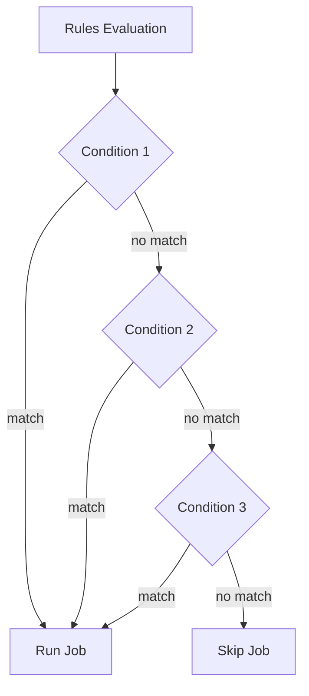

# How to Use Rules for Conditional Jobs in GitLab CI

Author: [nawazdhandala](https://www.github.com/nawazdhandala)

Tags: GitLab, CI/CD, Rules, Conditional, Workflow, Pipeline Control

Description: Master GitLab CI rules to control when jobs run based on branches, changes, variables, and more. This guide covers rules syntax, common patterns, and best practices for conditional pipelines.

---

Rules in GitLab CI provide fine-grained control over when jobs execute. They replace the older `only/except` keywords with more powerful, flexible conditions. This guide shows you how to use rules effectively to create intelligent, efficient pipelines.

## Understanding Rules

Rules evaluate conditions to determine if a job should run:



## Basic Rules Syntax

### Simple Condition

```yaml
deploy:
  script:
    - ./deploy.sh
  rules:
    - if: $CI_COMMIT_BRANCH == "main"
```

### Multiple Conditions

```yaml
test:
  script:
    - npm test
  rules:
    - if: $CI_COMMIT_BRANCH == "main"
    - if: $CI_COMMIT_BRANCH == "develop"
    - if: $CI_PIPELINE_SOURCE == "merge_request_event"
```

## Rules Keywords

### if - Variable Conditions

```yaml
deploy_staging:
  rules:
    - if: $CI_COMMIT_BRANCH == "develop"

deploy_production:
  rules:
    - if: $CI_COMMIT_TAG =~ /^v\d+\.\d+\.\d+$/  # Semver tags only

nightly_build:
  rules:
    - if: $CI_PIPELINE_SOURCE == "schedule"
```

### changes - File Changes

```yaml
build_frontend:
  rules:
    - changes:
        - frontend/**/*
        - package.json
        - package-lock.json

build_backend:
  rules:
    - changes:
        - backend/**/*
        - requirements.txt

build_docs:
  rules:
    - changes:
        - docs/**/*
        - "*.md"
```

### exists - File Existence

```yaml
build_docker:
  rules:
    - exists:
        - Dockerfile

build_gradle:
  rules:
    - exists:
        - build.gradle
        - build.gradle.kts

test_python:
  rules:
    - exists:
        - pytest.ini
        - setup.py
        - pyproject.toml
```

## Control Keywords

### when

Control job execution behavior:

```yaml
deploy:
  rules:
    - if: $CI_COMMIT_BRANCH == "main"
      when: manual  # Require manual trigger
    - if: $CI_COMMIT_BRANCH == "develop"
      when: on_success  # Auto-run when previous stages succeed
    - when: never  # Default: don't run
```

### allow_failure

```yaml
experimental_test:
  rules:
    - if: $CI_COMMIT_BRANCH == "main"
      allow_failure: false  # Strict on main
    - allow_failure: true  # Lenient elsewhere
  script:
    - npm run test:experimental
```

### variables

Override variables based on conditions:

```yaml
deploy:
  variables:
    REPLICAS: 1
  rules:
    - if: $CI_COMMIT_BRANCH == "main"
      variables:
        REPLICAS: 3
        ENVIRONMENT: production
    - if: $CI_COMMIT_BRANCH == "develop"
      variables:
        REPLICAS: 1
        ENVIRONMENT: staging
  script:
    - kubectl scale deployment app --replicas=$REPLICAS
```

## Common Patterns

### Branch-Based Pipelines

```yaml
.production_rules:
  rules:
    - if: $CI_COMMIT_BRANCH == "main"
    - if: $CI_COMMIT_TAG

.staging_rules:
  rules:
    - if: $CI_COMMIT_BRANCH == "develop"

.feature_rules:
  rules:
    - if: $CI_COMMIT_BRANCH =~ /^feature\//

deploy_production:
  extends: .production_rules
  script:
    - ./deploy.sh production

deploy_staging:
  extends: .staging_rules
  script:
    - ./deploy.sh staging
```

### Merge Request Pipelines

```yaml
test:
  rules:
    - if: $CI_PIPELINE_SOURCE == "merge_request_event"
    - if: $CI_COMMIT_BRANCH == "main"

lint:
  rules:
    - if: $CI_PIPELINE_SOURCE == "merge_request_event"

# Skip duplicate pipelines
build:
  rules:
    - if: $CI_PIPELINE_SOURCE == "merge_request_event"
    - if: $CI_COMMIT_BRANCH == "main" && $CI_PIPELINE_SOURCE != "merge_request_event"
```

### Scheduled Pipelines

```yaml
nightly_tests:
  rules:
    - if: $CI_PIPELINE_SOURCE == "schedule" && $SCHEDULE_TYPE == "nightly"
  script:
    - npm run test:e2e

weekly_security_scan:
  rules:
    - if: $CI_PIPELINE_SOURCE == "schedule" && $SCHEDULE_TYPE == "weekly"
  script:
    - npm audit
```

### Tag-Based Releases

```yaml
release:
  rules:
    - if: $CI_COMMIT_TAG =~ /^v\d+\.\d+\.\d+$/
  script:
    - npm publish

release_candidate:
  rules:
    - if: $CI_COMMIT_TAG =~ /^v\d+\.\d+\.\d+-rc\.\d+$/
  script:
    - npm publish --tag next
```

## Combining Conditions

### AND Logic (within a rule)

```yaml
deploy_production:
  rules:
    # Both conditions must be true
    - if: $CI_COMMIT_BRANCH == "main" && $DEPLOY_ENABLED == "true"
```

### OR Logic (multiple rules)

```yaml
test:
  rules:
    # Any of these conditions triggers the job
    - if: $CI_COMMIT_BRANCH == "main"
    - if: $CI_COMMIT_BRANCH == "develop"
    - if: $CI_PIPELINE_SOURCE == "merge_request_event"
```

### Complex Conditions

```yaml
deploy:
  rules:
    # Production deployment: main branch, manual trigger
    - if: $CI_COMMIT_BRANCH == "main" && $CI_PIPELINE_SOURCE == "web"
      when: manual

    # Auto-deploy tags to production
    - if: $CI_COMMIT_TAG =~ /^v\d+/
      when: on_success

    # Auto-deploy develop to staging
    - if: $CI_COMMIT_BRANCH == "develop"
      variables:
        ENVIRONMENT: staging

    # Never run otherwise
    - when: never
```

## Workflow Rules

Control entire pipeline behavior:

```yaml
workflow:
  rules:
    # Run for merge requests
    - if: $CI_PIPELINE_SOURCE == "merge_request_event"
    # Run for main and develop branches
    - if: $CI_COMMIT_BRANCH == "main"
    - if: $CI_COMMIT_BRANCH == "develop"
    # Run for tags
    - if: $CI_COMMIT_TAG
    # Skip everything else
    - when: never
```

### Preventing Duplicate Pipelines

```yaml
workflow:
  rules:
    - if: $CI_PIPELINE_SOURCE == "merge_request_event"
    - if: $CI_COMMIT_BRANCH && $CI_OPEN_MERGE_REQUESTS
      when: never  # Skip branch pipeline if MR exists
    - if: $CI_COMMIT_BRANCH
```

## Changes with Compare-To

Compare changes against a specific ref:

```yaml
build:
  rules:
    - if: $CI_PIPELINE_SOURCE == "merge_request_event"
      changes:
        compare_to: 'refs/heads/main'
        paths:
          - src/**/*
```

## Interruptible Jobs

Cancel running jobs when new commits arrive:

```yaml
test:
  interruptible: true
  rules:
    - if: $CI_PIPELINE_SOURCE == "merge_request_event"
  script:
    - npm test
```

## Complete Example

```yaml
variables:
  DEPLOY_ENABLED: "true"

workflow:
  rules:
    - if: $CI_PIPELINE_SOURCE == "merge_request_event"
    - if: $CI_COMMIT_BRANCH == "main"
    - if: $CI_COMMIT_BRANCH == "develop"
    - if: $CI_COMMIT_TAG
    - if: $CI_PIPELINE_SOURCE == "schedule"

stages:
  - build
  - test
  - security
  - deploy

# Build always runs
build:
  stage: build
  script:
    - npm ci
    - npm run build
  rules:
    - when: on_success

# Unit tests for all pipelines
unit_tests:
  stage: test
  script:
    - npm run test:unit
  rules:
    - when: on_success
  interruptible: true

# Integration tests - skip for docs-only changes
integration_tests:
  stage: test
  script:
    - npm run test:integration
  rules:
    - changes:
        - "**/*.md"
        - docs/**/*
      when: never
    - when: on_success
  interruptible: true

# E2E tests - only on MRs and main
e2e_tests:
  stage: test
  script:
    - npm run test:e2e
  rules:
    - if: $CI_PIPELINE_SOURCE == "merge_request_event"
    - if: $CI_COMMIT_BRANCH == "main"
  interruptible: true

# Security scan - weekly schedule and main branch
security_scan:
  stage: security
  script:
    - npm audit --audit-level=high
  rules:
    - if: $CI_PIPELINE_SOURCE == "schedule"
    - if: $CI_COMMIT_BRANCH == "main"
      allow_failure: true

# SAST on merge requests
sast:
  stage: security
  script:
    - ./run-sast.sh
  rules:
    - if: $CI_PIPELINE_SOURCE == "merge_request_event"

# Deploy staging - develop branch only
deploy_staging:
  stage: deploy
  script:
    - ./deploy.sh staging
  environment:
    name: staging
    url: https://staging.example.com
  rules:
    - if: $CI_COMMIT_BRANCH == "develop" && $DEPLOY_ENABLED == "true"

# Deploy production - main branch, manual
deploy_production:
  stage: deploy
  script:
    - ./deploy.sh production
  environment:
    name: production
    url: https://example.com
  rules:
    - if: $CI_COMMIT_BRANCH == "main" && $DEPLOY_ENABLED == "true"
      when: manual
    - if: $CI_COMMIT_TAG =~ /^v\d+\.\d+\.\d+$/
      when: manual

# Notify on failure - main only
notify_failure:
  stage: deploy
  script:
    - ./notify-slack.sh "Pipeline failed"
  rules:
    - if: $CI_COMMIT_BRANCH == "main"
      when: on_failure
```

## Debugging Rules

### Check Pipeline Configuration

Use the CI Lint tool:
1. Navigate to CI/CD > Pipelines > CI lint
2. Paste your configuration
3. Click "Validate"

### Log Variable Values

```yaml
debug:
  script:
    - echo "Branch: $CI_COMMIT_BRANCH"
    - echo "Source: $CI_PIPELINE_SOURCE"
    - echo "Tag: $CI_COMMIT_TAG"
    - echo "MRs: $CI_OPEN_MERGE_REQUESTS"
  rules:
    - when: always
```

## Best Practices

1. **Start with workflow rules**: Define when pipelines run at all
2. **Use rules instead of only/except**: More powerful and consistent
3. **End with a default**: Always have a final `when: never` or `when: on_success`
4. **Use extends for reuse**: Create rule templates
5. **Test your rules**: Use CI Lint before committing
6. **Document complex logic**: Add comments explaining non-obvious rules
7. **Consider pipeline efficiency**: Skip unnecessary jobs with changes

## Common Mistakes

### Missing Default

```yaml
# Bad - job might run unexpectedly
test:
  rules:
    - if: $CI_COMMIT_BRANCH == "main"

# Good - explicit default
test:
  rules:
    - if: $CI_COMMIT_BRANCH == "main"
    - when: never
```

### Forgetting MR Pipelines

```yaml
# Bad - only runs on branches
test:
  rules:
    - if: $CI_COMMIT_BRANCH

# Good - includes MR pipelines
test:
  rules:
    - if: $CI_PIPELINE_SOURCE == "merge_request_event"
    - if: $CI_COMMIT_BRANCH
```

## Conclusion

Rules are the foundation of intelligent GitLab CI pipelines. They enable you to run the right jobs at the right time, saving resources and providing faster feedback. Master rules to create pipelines that adapt to your workflow and scale with your project.
