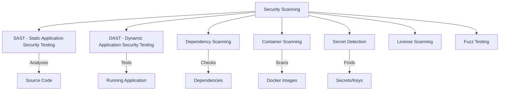

# How to Set Up Security Scanning in GitLab CI

Author: [nawazdhandala](https://www.github.com/nawazdhandala)

Tags: GitLab, CI/CD, Security, SAST, DAST, Dependency Scanning, Container Scanning

Description: Learn how to set up comprehensive security scanning in GitLab CI including SAST, DAST, dependency scanning, container scanning, and secret detection to secure your applications.

---

Security scanning in GitLab CI helps identify vulnerabilities before they reach production. GitLab provides built-in security scanners that integrate seamlessly with merge requests, providing developers with immediate feedback on security issues. This guide covers setting up comprehensive security scanning for your projects.

## Security Scanning Overview

GitLab offers multiple security scanning types:



## Quick Start with Auto DevOps

The simplest way to enable security scanning:

```yaml
include:
  - template: Security/SAST.gitlab-ci.yml
  - template: Security/Secret-Detection.gitlab-ci.yml
  - template: Security/Dependency-Scanning.gitlab-ci.yml
  - template: Security/Container-Scanning.gitlab-ci.yml
```

## SAST (Static Application Security Testing)

SAST analyzes source code for vulnerabilities without executing it.

### Basic SAST Configuration

```yaml
include:
  - template: Security/SAST.gitlab-ci.yml

variables:
  SAST_EXCLUDED_PATHS: "spec, test, tests, tmp"
```

### Custom SAST Configuration

```yaml
include:
  - template: Security/SAST.gitlab-ci.yml

variables:
  SAST_EXCLUDED_ANALYZERS: "bandit, brakeman"
  SAST_EXCLUDED_PATHS: "vendor, node_modules, test"
  SEARCH_MAX_DEPTH: 10

sast:
  stage: test
  variables:
    SAST_BANDIT_EXCLUDED_PATHS: "*/test/*"
```

### Manual SAST with Semgrep

```yaml
sast:
  stage: test
  image: returntocorp/semgrep:latest
  script:
    - semgrep scan --config auto --json --output semgrep-results.json . || true
    - |
      # Convert to GitLab format
      python3 << 'EOF'
      import json

      with open('semgrep-results.json') as f:
          results = json.load(f)

      gitlab_report = {
          "version": "15.0.0",
          "vulnerabilities": []
      }

      for result in results.get('results', []):
          vuln = {
              "id": result['check_id'],
              "severity": result['extra']['severity'].capitalize(),
              "name": result['check_id'],
              "description": result['extra']['message'],
              "location": {
                  "file": result['path'],
                  "start_line": result['start']['line']
              }
          }
          gitlab_report['vulnerabilities'].append(vuln)

      with open('gl-sast-report.json', 'w') as f:
          json.dump(gitlab_report, f)
      EOF
  artifacts:
    reports:
      sast: gl-sast-report.json
  rules:
    - if: $CI_PIPELINE_SOURCE == "merge_request_event"
    - if: $CI_COMMIT_BRANCH == "main"
```

## Dependency Scanning

Identify vulnerabilities in project dependencies.

### Basic Dependency Scanning

```yaml
include:
  - template: Security/Dependency-Scanning.gitlab-ci.yml
```

### Using npm audit

```yaml
dependency_scan:
  stage: test
  image: node:18-alpine
  script:
    - npm ci
    - npm audit --json > npm-audit.json || true
    - |
      # Convert npm audit to GitLab format
      node << 'EOF'
      const fs = require('fs');
      const audit = JSON.parse(fs.readFileSync('npm-audit.json'));

      const report = {
        version: "15.0.0",
        vulnerabilities: [],
        dependency_files: [{
          path: "package-lock.json",
          package_manager: "npm"
        }]
      };

      Object.values(audit.vulnerabilities || {}).forEach(vuln => {
        report.vulnerabilities.push({
          id: vuln.name + "-" + vuln.severity,
          name: vuln.name,
          severity: vuln.severity.charAt(0).toUpperCase() + vuln.severity.slice(1),
          description: vuln.title || vuln.overview,
          location: {
            dependency: {
              package: { name: vuln.name },
              version: vuln.range
            }
          }
        });
      });

      fs.writeFileSync('gl-dependency-scanning-report.json', JSON.stringify(report));
      EOF
  artifacts:
    reports:
      dependency_scanning: gl-dependency-scanning-report.json
```

### Using Trivy for Dependencies

```yaml
dependency_scan:
  stage: test
  image:
    name: aquasec/trivy:latest
    entrypoint: [""]
  script:
    - trivy fs --format json --output trivy-results.json .
    - trivy fs --format template --template "@/contrib/gitlab.tpl" --output gl-dependency-scanning-report.json .
  artifacts:
    reports:
      dependency_scanning: gl-dependency-scanning-report.json
```

## Container Scanning

Scan Docker images for vulnerabilities.

### Basic Container Scanning

```yaml
include:
  - template: Security/Container-Scanning.gitlab-ci.yml

container_scanning:
  variables:
    CS_IMAGE: $CI_REGISTRY_IMAGE:$CI_COMMIT_SHA
```

### Using Trivy for Containers

```yaml
container_scan:
  stage: test
  image:
    name: aquasec/trivy:latest
    entrypoint: [""]
  variables:
    IMAGE: $CI_REGISTRY_IMAGE:$CI_COMMIT_SHA
  before_script:
    - trivy image --download-db-only
  script:
    - trivy image --exit-code 0 --format json --output trivy-container.json $IMAGE
    - trivy image --exit-code 1 --severity HIGH,CRITICAL $IMAGE
  artifacts:
    reports:
      container_scanning: trivy-container.json
  allow_failure: true
```

### Comprehensive Container Scanning

```yaml
container_scan:
  stage: security
  image:
    name: aquasec/trivy:latest
    entrypoint: [""]
  variables:
    FULL_IMAGE_NAME: $CI_REGISTRY_IMAGE:$CI_COMMIT_SHA
    TRIVY_USERNAME: $CI_REGISTRY_USER
    TRIVY_PASSWORD: $CI_REGISTRY_PASSWORD
  script:
    - |
      trivy image \
        --exit-code 0 \
        --no-progress \
        --format template \
        --template "@/contrib/gitlab.tpl" \
        --output gl-container-scanning-report.json \
        $FULL_IMAGE_NAME

    - |
      # Fail on critical vulnerabilities
      CRITICAL=$(trivy image --exit-code 0 --severity CRITICAL --format json $FULL_IMAGE_NAME | jq '.Results[].Vulnerabilities | length')
      if [ "$CRITICAL" -gt 0 ]; then
        echo "Found $CRITICAL critical vulnerabilities!"
        trivy image --severity CRITICAL $FULL_IMAGE_NAME
        exit 1
      fi
  artifacts:
    reports:
      container_scanning: gl-container-scanning-report.json
  rules:
    - if: $CI_COMMIT_BRANCH == "main"
    - if: $CI_PIPELINE_SOURCE == "merge_request_event"
```

## Secret Detection

Find accidentally committed secrets and credentials.

### Basic Secret Detection

```yaml
include:
  - template: Security/Secret-Detection.gitlab-ci.yml
```

### Using Gitleaks

```yaml
secret_detection:
  stage: test
  image: zricethezav/gitleaks:latest
  script:
    - gitleaks detect --source . --report-format json --report-path gitleaks-report.json || true
    - |
      # Convert to GitLab format
      python3 << 'EOF'
      import json

      try:
          with open('gitleaks-report.json') as f:
              leaks = json.load(f)
      except:
          leaks = []

      report = {
          "version": "15.0.0",
          "vulnerabilities": []
      }

      for leak in leaks:
          report['vulnerabilities'].append({
              "id": leak.get('RuleID', 'unknown'),
              "severity": "Critical",
              "name": f"Secret detected: {leak.get('RuleID', 'unknown')}",
              "description": leak.get('Description', 'Potential secret detected'),
              "location": {
                  "file": leak.get('File', ''),
                  "start_line": leak.get('StartLine', 0)
              }
          })

      with open('gl-secret-detection-report.json', 'w') as f:
          json.dump(report, f)
      EOF
  artifacts:
    reports:
      secret_detection: gl-secret-detection-report.json
  rules:
    - if: $CI_PIPELINE_SOURCE == "merge_request_event"
    - if: $CI_COMMIT_BRANCH
```

## DAST (Dynamic Application Security Testing)

Test running applications for vulnerabilities.

### Basic DAST

```yaml
include:
  - template: Security/DAST.gitlab-ci.yml

dast:
  variables:
    DAST_WEBSITE: https://staging.example.com
```

### DAST with Review Apps

```yaml
dast:
  stage: dast
  image:
    name: owasp/zap2docker-stable:latest
    entrypoint: [""]
  variables:
    DAST_TARGET_URL: https://${CI_COMMIT_REF_SLUG}.review.example.com
  script:
    - mkdir -p /zap/wrk
    - |
      zap-baseline.py \
        -t $DAST_TARGET_URL \
        -g gen.conf \
        -r zap-report.html \
        -J zap-report.json \
        -I || true
    - |
      # Convert ZAP report to GitLab format
      python3 << 'EOF'
      import json

      with open('zap-report.json') as f:
          zap = json.load(f)

      report = {
          "version": "15.0.0",
          "vulnerabilities": []
      }

      for site in zap.get('site', []):
          for alert in site.get('alerts', []):
              report['vulnerabilities'].append({
                  "id": alert.get('pluginid', 'unknown'),
                  "severity": alert.get('riskdesc', 'Unknown').split()[0],
                  "name": alert.get('name', 'Unknown'),
                  "description": alert.get('desc', ''),
                  "solution": alert.get('solution', ''),
                  "location": {
                      "hostname": site.get('@host', ''),
                      "path": alert.get('instances', [{}])[0].get('uri', '')
                  }
              })

      with open('gl-dast-report.json', 'w') as f:
          json.dump(report, f)
      EOF
  artifacts:
    paths:
      - zap-report.html
    reports:
      dast: gl-dast-report.json
  needs:
    - deploy_review
  rules:
    - if: $CI_PIPELINE_SOURCE == "merge_request_event"
```

## Complete Security Pipeline

```yaml
stages:
  - build
  - test
  - security
  - deploy

variables:
  DOCKER_HOST: tcp://docker:2376
  DOCKER_TLS_CERTDIR: "/certs"

# Build stage
build:
  stage: build
  image: docker:24.0
  services:
    - docker:24.0-dind
  script:
    - docker login -u $CI_REGISTRY_USER -p $CI_REGISTRY_PASSWORD $CI_REGISTRY
    - docker build -t $CI_REGISTRY_IMAGE:$CI_COMMIT_SHA .
    - docker push $CI_REGISTRY_IMAGE:$CI_COMMIT_SHA
  rules:
    - if: $CI_PIPELINE_SOURCE == "merge_request_event"
    - if: $CI_COMMIT_BRANCH == "main"

# Unit tests
test:
  stage: test
  image: node:18-alpine
  script:
    - npm ci
    - npm test
  rules:
    - if: $CI_PIPELINE_SOURCE == "merge_request_event"
    - if: $CI_COMMIT_BRANCH == "main"

# SAST
sast:
  stage: security
  image: returntocorp/semgrep:latest
  script:
    - semgrep scan --config auto --json --output semgrep.json . || true
  artifacts:
    paths:
      - semgrep.json
    reports:
      sast: semgrep.json
  rules:
    - if: $CI_PIPELINE_SOURCE == "merge_request_event"
    - if: $CI_COMMIT_BRANCH == "main"
  allow_failure: true

# Dependency scanning
dependency_scan:
  stage: security
  image: node:18-alpine
  script:
    - npm ci
    - npm audit --json > npm-audit.json || true
  artifacts:
    paths:
      - npm-audit.json
  rules:
    - if: $CI_PIPELINE_SOURCE == "merge_request_event"
    - if: $CI_COMMIT_BRANCH == "main"
  allow_failure: true

# Secret detection
secret_detection:
  stage: security
  image: zricethezav/gitleaks:latest
  script:
    - gitleaks detect --source . --report-format json --report-path gitleaks.json --exit-code 0
  artifacts:
    paths:
      - gitleaks.json
  rules:
    - if: $CI_PIPELINE_SOURCE == "merge_request_event"
    - if: $CI_COMMIT_BRANCH == "main"

# Container scanning
container_scan:
  stage: security
  image:
    name: aquasec/trivy:latest
    entrypoint: [""]
  script:
    - trivy image --exit-code 0 --severity HIGH,CRITICAL --format json --output container-scan.json $CI_REGISTRY_IMAGE:$CI_COMMIT_SHA
    - trivy image --exit-code 1 --severity CRITICAL $CI_REGISTRY_IMAGE:$CI_COMMIT_SHA || true
  artifacts:
    paths:
      - container-scan.json
    reports:
      container_scanning: container-scan.json
  rules:
    - if: $CI_PIPELINE_SOURCE == "merge_request_event"
    - if: $CI_COMMIT_BRANCH == "main"
  allow_failure: true

# Security summary
security_report:
  stage: security
  image: alpine:latest
  needs:
    - job: sast
      optional: true
    - job: dependency_scan
      optional: true
    - job: secret_detection
      optional: true
    - job: container_scan
      optional: true
  script:
    - |
      echo "=== Security Scan Summary ==="
      echo ""

      if [ -f semgrep.json ]; then
        SAST_COUNT=$(cat semgrep.json | grep -c '"check_id"' || echo "0")
        echo "SAST findings: $SAST_COUNT"
      fi

      if [ -f npm-audit.json ]; then
        echo "Dependency scan: completed"
      fi

      if [ -f gitleaks.json ]; then
        SECRETS=$(cat gitleaks.json | grep -c '"RuleID"' || echo "0")
        echo "Secrets found: $SECRETS"
      fi

      if [ -f container-scan.json ]; then
        echo "Container scan: completed"
      fi
  rules:
    - if: $CI_PIPELINE_SOURCE == "merge_request_event"
    - if: $CI_COMMIT_BRANCH == "main"

# Deploy only if security checks pass
deploy:
  stage: deploy
  needs:
    - test
    - security_report
  script:
    - ./deploy.sh
  environment:
    name: production
  rules:
    - if: $CI_COMMIT_BRANCH == "main"
  when: manual
```

## Security Policies

### Fail Pipeline on Critical Issues

```yaml
security_gate:
  stage: security
  script:
    - |
      # Check for critical vulnerabilities
      CRITICAL=$(cat scan-results.json | jq '[.vulnerabilities[] | select(.severity == "Critical")] | length')
      if [ "$CRITICAL" -gt 0 ]; then
        echo "Found $CRITICAL critical vulnerabilities. Pipeline blocked."
        exit 1
      fi
  rules:
    - if: $CI_COMMIT_BRANCH == "main"
```

### Allow Failure for Non-Blocking Scans

```yaml
sast:
  allow_failure: true  # Don't block pipeline
  # or
  allow_failure:
    exit_codes:
      - 1  # Only allow specific exit codes
```

## Best Practices

1. **Scan early**: Run security scans on every merge request
2. **Start permissive**: Use `allow_failure: true` initially
3. **Gradually enforce**: Tighten policies as issues are fixed
4. **Review findings**: Not all findings are actionable
5. **Update scanners**: Keep security tools up to date
6. **Document exceptions**: Track accepted risks
7. **Integrate with workflow**: Make security part of code review

## Conclusion

Security scanning in GitLab CI provides comprehensive vulnerability detection across your application stack. By integrating SAST, dependency scanning, container scanning, secret detection, and DAST into your pipelines, you can identify and fix security issues before they reach production. Start with basic scanning and progressively add more checks as your security posture matures.
