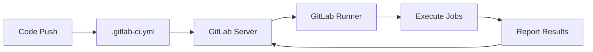
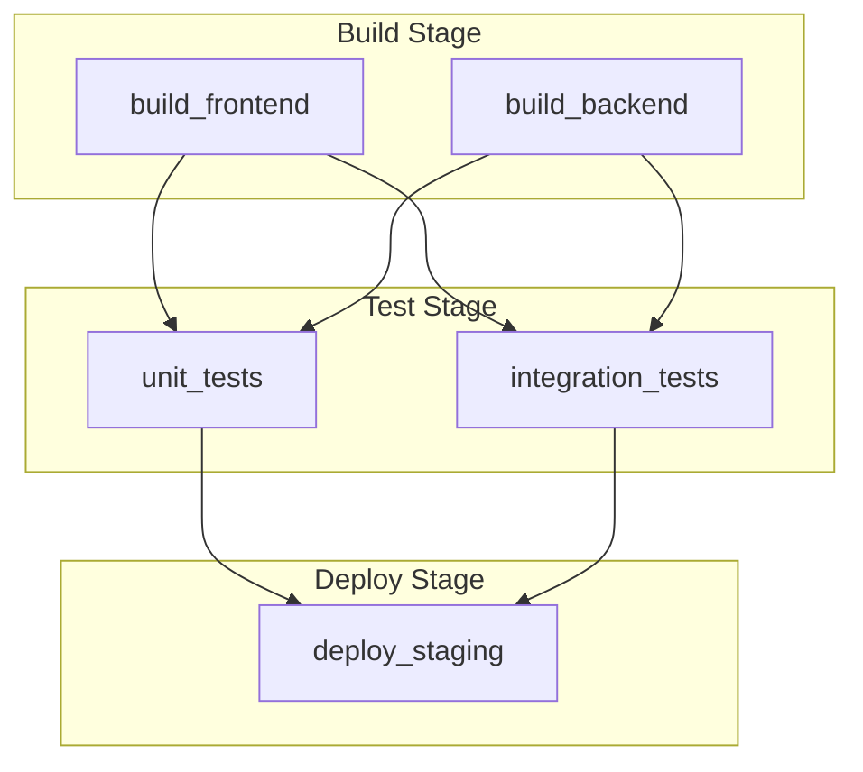

# How to Set Up Basic GitLab CI Pipeline

Author: [nawazdhandala](https://www.github.com/nawazdhandala)

Tags: GitLab, CI/CD, DevOps, Automation, Pipeline, Continuous Integration

Description: Learn how to set up a basic GitLab CI pipeline from scratch. This guide covers the essential configuration, stages, jobs, and best practices for getting started with GitLab CI/CD.

---

GitLab CI/CD is one of the most powerful continuous integration and deployment platforms available today. Built directly into GitLab, it eliminates the need for separate CI/CD tools and provides a seamless experience from code commit to deployment. This guide walks you through setting up your first GitLab CI pipeline.

## Understanding GitLab CI/CD Architecture

Before diving into configuration, it helps to understand how GitLab CI/CD works:



The pipeline process follows these steps:
1. Developer pushes code to the repository
2. GitLab detects the `.gitlab-ci.yml` file
3. GitLab server coordinates with available runners
4. Runners execute the defined jobs
5. Results are reported back to GitLab

## Creating Your First Pipeline

Every GitLab CI pipeline starts with a `.gitlab-ci.yml` file in your repository root. Here is a minimal example:

```yaml
# .gitlab-ci.yml
stages:
  - build
  - test
  - deploy

build_job:
  stage: build
  script:
    - echo "Building the application..."
    - npm install
    - npm run build
  artifacts:
    paths:
      - dist/

test_job:
  stage: test
  script:
    - echo "Running tests..."
    - npm test

deploy_job:
  stage: deploy
  script:
    - echo "Deploying application..."
  only:
    - main
```

## Understanding Pipeline Stages

Stages define the order of job execution. Jobs in the same stage run in parallel, while stages run sequentially:

```yaml
stages:
  - build      # Runs first
  - test       # Runs after build completes
  - deploy     # Runs after test completes
```



## Defining Jobs

Jobs are the fundamental building blocks. Each job must have a `script` section:

```yaml
my_job:
  stage: test
  image: node:18-alpine
  before_script:
    - npm ci
  script:
    - npm run lint
    - npm test
  after_script:
    - echo "Cleanup tasks here"
```

### Job Keywords Explained

- `stage`: Which stage this job belongs to
- `image`: Docker image to use for the job
- `before_script`: Commands to run before the main script
- `script`: The main commands to execute
- `after_script`: Commands that always run after script, even on failure

## A Complete Node.js Pipeline Example

Here is a production-ready pipeline for a Node.js application:

```yaml
# .gitlab-ci.yml
image: node:18-alpine

stages:
  - install
  - lint
  - test
  - build
  - deploy

variables:
  npm_config_cache: "$CI_PROJECT_DIR/.npm"

cache:
  key: ${CI_COMMIT_REF_SLUG}
  paths:
    - .npm/
    - node_modules/

install_dependencies:
  stage: install
  script:
    - npm ci
  artifacts:
    paths:
      - node_modules/
    expire_in: 1 hour

lint_code:
  stage: lint
  script:
    - npm run lint
  dependencies:
    - install_dependencies

run_tests:
  stage: test
  script:
    - npm test
  coverage: '/Lines\s*:\s*(\d+\.?\d*)%/'
  dependencies:
    - install_dependencies
  artifacts:
    reports:
      junit: junit.xml
    when: always

build_app:
  stage: build
  script:
    - npm run build
  dependencies:
    - install_dependencies
  artifacts:
    paths:
      - dist/
    expire_in: 1 week

deploy_staging:
  stage: deploy
  script:
    - echo "Deploying to staging..."
    - ./deploy.sh staging
  environment:
    name: staging
    url: https://staging.example.com
  only:
    - develop

deploy_production:
  stage: deploy
  script:
    - echo "Deploying to production..."
    - ./deploy.sh production
  environment:
    name: production
    url: https://example.com
  when: manual
  only:
    - main
```

## Using Default Settings

Reduce repetition with the `default` keyword:

```yaml
default:
  image: node:18-alpine
  before_script:
    - npm ci
  retry:
    max: 2
    when:
      - runner_system_failure
      - stuck_or_timeout_failure

stages:
  - test
  - build

test_job:
  stage: test
  script:
    - npm test

build_job:
  stage: build
  script:
    - npm run build
```

## Pipeline Triggers

Control when pipelines run:

```yaml
workflow:
  rules:
    - if: $CI_COMMIT_BRANCH == "main"
    - if: $CI_PIPELINE_SOURCE == "merge_request_event"
    - if: $CI_COMMIT_TAG

test_job:
  script:
    - npm test
  rules:
    - if: $CI_PIPELINE_SOURCE == "merge_request_event"
    - if: $CI_COMMIT_BRANCH == "main"
```

## Viewing Pipeline Results

Once your pipeline runs, GitLab provides several views:

1. **Pipeline Graph**: Visual representation of stages and jobs
2. **Job Logs**: Detailed output from each job
3. **Artifacts**: Downloadable files produced by jobs
4. **Test Reports**: JUnit test results integrated into merge requests

## Debugging Failed Pipelines

When jobs fail, use these techniques:

```yaml
debug_job:
  stage: test
  script:
    - echo "CI_COMMIT_REF_NAME is $CI_COMMIT_REF_NAME"
    - echo "CI_PROJECT_DIR is $CI_PROJECT_DIR"
    - ls -la
    - env | sort
    - npm test
  when: on_failure
```

You can also retry failed jobs from the GitLab UI or use SSH to debug runner issues.

## Best Practices

1. **Keep pipelines fast**: Use caching and parallel jobs
2. **Fail fast**: Put quick checks like linting early
3. **Use meaningful names**: Job names appear in the UI
4. **Limit artifacts**: Set expiration times to save storage
5. **Use templates**: Extract common configurations
6. **Protect secrets**: Use CI/CD variables for sensitive data

## Validating Your Configuration

Before committing, validate your `.gitlab-ci.yml`:

```bash
# Using the CI Lint tool in GitLab UI
# Navigate to: CI/CD > Pipelines > CI lint

# Or use the API
curl --header "PRIVATE-TOKEN: <your_token>" \
  "https://gitlab.com/api/v4/ci/lint" \
  --form "content=@.gitlab-ci.yml"
```

## Conclusion

Setting up a basic GitLab CI pipeline involves understanding stages, jobs, and the `.gitlab-ci.yml` syntax. Start simple, validate your configuration, and gradually add complexity as your needs grow. The investment in CI/CD pays dividends through faster feedback loops, consistent builds, and reliable deployments.

With your basic pipeline in place, you can explore advanced features like caching, artifacts, environments, and multi-project pipelines to build sophisticated automation workflows.
