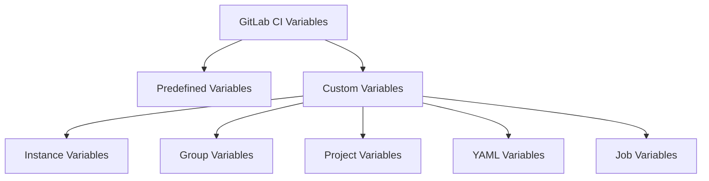
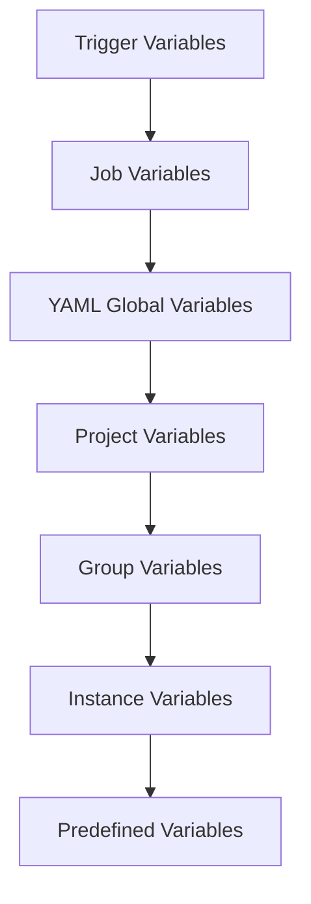

# How to Use Variables in GitLab CI

Author: [nawazdhandala](https://www.github.com/nawazdhandala)

Tags: GitLab, CI/CD, Variables, Environment Variables, DevOps, Secrets Management

Description: Master GitLab CI variables for managing configuration, secrets, and dynamic values in your pipelines. Learn about predefined variables, custom variables, and security best practices.

---

Variables are essential for creating flexible, reusable GitLab CI pipelines. They allow you to parameterize your configuration, manage secrets securely, and adapt pipeline behavior based on context. This guide covers everything you need to know about GitLab CI variables.

## Types of Variables in GitLab CI

GitLab CI supports several types of variables:



## Predefined Variables

GitLab provides many built-in variables automatically:

```yaml
show_variables:
  script:
    - echo "Project: $CI_PROJECT_NAME"
    - echo "Branch: $CI_COMMIT_BRANCH"
    - echo "Commit: $CI_COMMIT_SHA"
    - echo "Short SHA: $CI_COMMIT_SHORT_SHA"
    - echo "Pipeline ID: $CI_PIPELINE_ID"
    - echo "Job ID: $CI_JOB_ID"
    - echo "Runner: $CI_RUNNER_DESCRIPTION"
```

### Commonly Used Predefined Variables

| Variable | Description |
|----------|-------------|
| `CI_COMMIT_BRANCH` | Branch name |
| `CI_COMMIT_SHA` | Full commit hash |
| `CI_COMMIT_SHORT_SHA` | First 8 characters of commit |
| `CI_COMMIT_TAG` | Tag name if tagged |
| `CI_COMMIT_MESSAGE` | Full commit message |
| `CI_PROJECT_NAME` | Project name |
| `CI_PROJECT_PATH` | Project path with namespace |
| `CI_PIPELINE_SOURCE` | How pipeline was triggered |
| `CI_JOB_TOKEN` | Token for API authentication |
| `CI_REGISTRY_IMAGE` | Container registry image path |

## Defining Variables in .gitlab-ci.yml

### Global Variables

Variables defined at the top level are available to all jobs:

```yaml
variables:
  NODE_VERSION: "18"
  APP_NAME: "my-application"
  DEPLOY_PATH: "/var/www/$APP_NAME"

build:
  script:
    - echo "Building $APP_NAME with Node $NODE_VERSION"
    - echo "Will deploy to $DEPLOY_PATH"
```

### Job-Level Variables

Override or add variables for specific jobs:

```yaml
variables:
  DATABASE_HOST: "localhost"

test:
  variables:
    DATABASE_HOST: "test-db.example.com"
    DATABASE_PORT: "5432"
  script:
    - echo "Connecting to $DATABASE_HOST:$DATABASE_PORT"

production:
  variables:
    DATABASE_HOST: "prod-db.example.com"
  script:
    - echo "Connecting to $DATABASE_HOST"
```

## Project CI/CD Variables

Store sensitive values in GitLab settings rather than in code:

1. Navigate to Settings > CI/CD > Variables
2. Click "Add Variable"
3. Configure the variable properties

```yaml
deploy:
  script:
    # These come from project settings
    - docker login -u $DOCKER_USER -p $DOCKER_PASSWORD
    - kubectl --token=$KUBE_TOKEN apply -f deployment.yaml
```

### Variable Options

When creating project variables, you can configure:

- **Protected**: Only available in protected branches/tags
- **Masked**: Hidden in job logs
- **Expanded**: Allow variable references within the value

```yaml
# If API_URL is set to "https://$DOMAIN/api" with expansion enabled
# and DOMAIN is "example.com", API_URL becomes "https://example.com/api"

test:
  script:
    - curl $API_URL/health
```

## Variable Precedence

GitLab CI variables follow a specific precedence order (highest to lowest):



```yaml
variables:
  MY_VAR: "from yaml"

test:
  variables:
    MY_VAR: "from job"  # This wins
  script:
    - echo $MY_VAR  # Outputs: from job
```

## Dynamic Variables

Create variables dynamically during pipeline execution:

```yaml
stages:
  - prepare
  - build
  - deploy

generate_version:
  stage: prepare
  script:
    - VERSION=$(date +%Y%m%d)-$CI_COMMIT_SHORT_SHA
    - echo "VERSION=$VERSION" >> build.env
  artifacts:
    reports:
      dotenv: build.env

build:
  stage: build
  script:
    - echo "Building version $VERSION"
    - docker build -t myapp:$VERSION .
  needs:
    - generate_version

deploy:
  stage: deploy
  script:
    - echo "Deploying version $VERSION"
  needs:
    - generate_version
    - build
```

## Environment-Specific Variables

Use different values for different environments:

```yaml
.deploy_template:
  script:
    - echo "Deploying to $ENVIRONMENT"
    - echo "URL: $DEPLOY_URL"
    - echo "Replicas: $REPLICAS"

deploy_staging:
  extends: .deploy_template
  variables:
    ENVIRONMENT: "staging"
    DEPLOY_URL: "https://staging.example.com"
    REPLICAS: "2"
  environment:
    name: staging

deploy_production:
  extends: .deploy_template
  variables:
    ENVIRONMENT: "production"
    DEPLOY_URL: "https://example.com"
    REPLICAS: "5"
  environment:
    name: production
  when: manual
```

## File Variables

Store entire files as variables:

```yaml
deploy:
  script:
    # KUBECONFIG_FILE is a file-type variable containing kubeconfig content
    - export KUBECONFIG=$KUBECONFIG_FILE
    - kubectl get pods

    # SSH_PRIVATE_KEY is a file variable
    - chmod 600 $SSH_PRIVATE_KEY
    - ssh -i $SSH_PRIVATE_KEY user@server "deploy.sh"
```

## Variable Expansion

Use variables within other variables:

```yaml
variables:
  DOCKER_REGISTRY: "registry.example.com"
  IMAGE_NAME: "myapp"
  IMAGE_TAG: "$CI_COMMIT_SHORT_SHA"
  FULL_IMAGE: "$DOCKER_REGISTRY/$IMAGE_NAME:$IMAGE_TAG"

build:
  script:
    - docker build -t $FULL_IMAGE .
    - docker push $FULL_IMAGE
```

### Nested Variable Expansion

For complex expansion, use double dollar signs:

```yaml
variables:
  STAGING_URL: "staging.example.com"
  PRODUCTION_URL: "example.com"

deploy:
  script:
    - ENV_VAR_NAME="${CI_ENVIRONMENT_NAME}_URL"
    - DEPLOY_URL=$(eval echo \$$ENV_VAR_NAME)
    - echo "Deploying to $DEPLOY_URL"
```

## Securing Sensitive Variables

### Best Practices for Secrets

```yaml
# NEVER do this
variables:
  API_KEY: "sk-12345secret"  # Exposed in repository!

# Instead, use project variables marked as:
# - Protected (only available on protected branches)
# - Masked (hidden in logs)

deploy:
  script:
    # $API_KEY comes from protected project variable
    - curl -H "Authorization: Bearer $API_KEY" https://api.example.com
  only:
    - main  # Protected branch
```

### Preventing Variable Leakage

```yaml
secure_job:
  script:
    # Don't echo secrets
    - echo "Using API key..."  # Good
    # - echo $API_KEY  # Bad - exposes secret

    # Use file-based secrets when possible
    - echo "$DB_PASSWORD" > /tmp/db_pass
    - chmod 600 /tmp/db_pass
    - myapp --password-file=/tmp/db_pass
    - rm /tmp/db_pass
```

## Conditional Logic with Variables

Use variables in rules and conditions:

```yaml
variables:
  DEPLOY_ENABLED: "true"

deploy:
  script:
    - ./deploy.sh
  rules:
    - if: $DEPLOY_ENABLED == "true" && $CI_COMMIT_BRANCH == "main"
    - if: $CI_COMMIT_TAG

test:
  script:
    - npm test
  rules:
    - if: $CI_PIPELINE_SOURCE == "merge_request_event"
    - if: $SKIP_TESTS != "true"
```

## Trigger Variables

Pass variables when triggering pipelines:

```yaml
# Parent pipeline
trigger_child:
  trigger:
    include: child-pipeline.yml
    strategy: depend
  variables:
    PARENT_VERSION: $CI_COMMIT_SHORT_SHA
    ENVIRONMENT: "staging"

# Via API
# curl -X POST -F "token=$TRIGGER_TOKEN" \
#   -F "ref=main" \
#   -F "variables[DEPLOY_ENV]=production" \
#   https://gitlab.com/api/v4/projects/123/trigger/pipeline
```

## Debugging Variables

When troubleshooting variable issues:

```yaml
debug:
  script:
    # Print all environment variables (be careful with secrets!)
    - env | grep -v PASSWORD | grep -v TOKEN | sort

    # Check specific variables
    - echo "CI_COMMIT_BRANCH: ${CI_COMMIT_BRANCH:-not set}"
    - echo "CUSTOM_VAR: ${CUSTOM_VAR:-not set}"

    # Test variable expansion
    - |
      if [ -z "$REQUIRED_VAR" ]; then
        echo "ERROR: REQUIRED_VAR is not set"
        exit 1
      fi
```

## Conclusion

Mastering GitLab CI variables enables you to build flexible, secure, and maintainable pipelines. Key takeaways:

1. Use predefined variables to access pipeline context
2. Store secrets in protected, masked project variables
3. Use job-level variables to override defaults
4. Leverage dotenv artifacts for dynamic values
5. Understand variable precedence to avoid surprises
6. Never commit sensitive values to your repository

With proper variable management, your pipelines become more portable, secure, and easier to maintain across different environments and projects.
