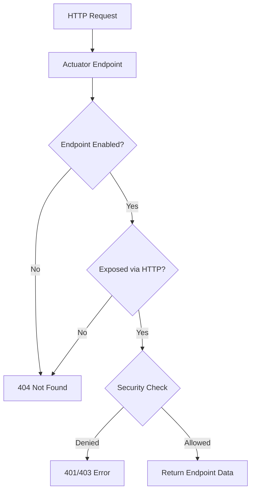

# How to Configure Actuator Endpoints in Spring Boot

Author: [nawazdhandala](https://www.github.com/nawazdhandala)

Tags: Java, Spring Boot, Actuator, Monitoring, Health Checks, Observability

Description: Learn how to configure Spring Boot Actuator endpoints for production monitoring. This guide covers enabling endpoints, securing them, customizing health checks, and exposing metrics.

---

> Spring Boot Actuator provides production-ready features for monitoring and managing your application. This guide shows you how to configure Actuator endpoints effectively for development and production environments.

Actuator exposes endpoints that let you monitor application health, view metrics, check environment properties, and more. Proper configuration is essential for security and observability.

---

## Adding Actuator Dependency

```xml
<!-- pom.xml -->
<dependency>
    <groupId>org.springframework.boot</groupId>
    <artifactId>spring-boot-starter-actuator</artifactId>
</dependency>
```

```groovy
// build.gradle
implementation 'org.springframework.boot:spring-boot-starter-actuator'
```

---

## Available Actuator Endpoints

| Endpoint | Description | Enabled by Default |
|----------|-------------|-------------------|
| `/actuator/health` | Application health status | Yes |
| `/actuator/info` | Application information | Yes |
| `/actuator/metrics` | Application metrics | Yes |
| `/actuator/env` | Environment properties | Yes |
| `/actuator/loggers` | View and modify logger levels | Yes |
| `/actuator/beans` | All Spring beans | Yes |
| `/actuator/mappings` | Request mappings | Yes |
| `/actuator/shutdown` | Graceful shutdown | No |

---

## Actuator Endpoint Architecture



---

## Basic Configuration

### Exposing Endpoints

```yaml
# application.yml
management:
  endpoints:
    web:
      exposure:
        include: health,info,metrics,env,loggers
        # Or expose all endpoints
        # include: "*"

        # Exclude specific endpoints
        exclude: shutdown
```

```properties
# application.properties
management.endpoints.web.exposure.include=health,info,metrics
management.endpoints.web.exposure.exclude=shutdown
```

### Using a Different Port

```yaml
# application.yml
management:
  server:
    port: 8081  # Actuator on separate port
    address: 127.0.0.1  # Only accessible from localhost
```

### Custom Base Path

```yaml
# application.yml
management:
  endpoints:
    web:
      base-path: /management  # /management/health instead of /actuator/health
```

---

## Configuring Health Endpoint

### Show Health Details

```yaml
# application.yml
management:
  endpoint:
    health:
      show-details: always  # never, when-authorized, always
      show-components: always
```

### Custom Health Indicators

```java
@Component
public class DatabaseHealthIndicator implements HealthIndicator {

    private final DataSource dataSource;

    public DatabaseHealthIndicator(DataSource dataSource) {
        this.dataSource = dataSource;
    }

    @Override
    public Health health() {
        try (Connection connection = dataSource.getConnection()) {
            if (connection.isValid(1)) {
                return Health.up()
                    .withDetail("database", "PostgreSQL")
                    .withDetail("connection", "valid")
                    .build();
            }
        } catch (SQLException e) {
            return Health.down()
                .withException(e)
                .build();
        }
        return Health.down().build();
    }
}
```

### Health Indicator for External Service

```java
@Component
public class ExternalApiHealthIndicator implements HealthIndicator {

    private final RestTemplate restTemplate;
    private final String apiUrl;

    public ExternalApiHealthIndicator(
            RestTemplate restTemplate,
            @Value("${external.api.url}") String apiUrl) {
        this.restTemplate = restTemplate;
        this.apiUrl = apiUrl;
    }

    @Override
    public Health health() {
        try {
            ResponseEntity<String> response = restTemplate.getForEntity(
                apiUrl + "/health", String.class);

            if (response.getStatusCode().is2xxSuccessful()) {
                return Health.up()
                    .withDetail("url", apiUrl)
                    .withDetail("status", response.getStatusCode().value())
                    .build();
            } else {
                return Health.down()
                    .withDetail("url", apiUrl)
                    .withDetail("status", response.getStatusCode().value())
                    .build();
            }
        } catch (Exception e) {
            return Health.down()
                .withDetail("url", apiUrl)
                .withException(e)
                .build();
        }
    }
}
```

### Health Groups

```yaml
# application.yml
management:
  endpoint:
    health:
      group:
        liveness:
          include: livenessState
        readiness:
          include: readinessState,db,redis
```

Access grouped health: `/actuator/health/liveness`, `/actuator/health/readiness`

---

## Configuring Info Endpoint

### Application Information

```yaml
# application.yml
info:
  app:
    name: My Spring Boot App
    description: A sample application
    version: 1.0.0
  java:
    version: ${java.version}
  build:
    artifact: "@project.artifactId@"
    version: "@project.version@"
```

### Custom Info Contributor

```java
@Component
public class CustomInfoContributor implements InfoContributor {

    @Override
    public void contribute(Info.Builder builder) {
        builder.withDetail("startup-time", Instant.now())
               .withDetail("environment", System.getenv("SPRING_PROFILES_ACTIVE"))
               .withDetail("features", Map.of(
                   "caching", true,
                   "async", true,
                   "security", true
               ));
    }
}
```

### Git Information

```xml
<!-- pom.xml -->
<plugin>
    <groupId>pl.project13.maven</groupId>
    <artifactId>git-commit-id-plugin</artifactId>
    <configuration>
        <generateGitPropertiesFile>true</generateGitPropertiesFile>
    </configuration>
</plugin>
```

```yaml
# application.yml
management:
  info:
    git:
      mode: full  # or 'simple'
```

---

## Configuring Metrics Endpoint

### Exposing Metrics

```yaml
# application.yml
management:
  metrics:
    export:
      prometheus:
        enabled: true
    tags:
      application: ${spring.application.name}
      environment: ${spring.profiles.active:default}
```

### Custom Metrics

```java
@Component
public class OrderMetrics {

    private final Counter ordersCounter;
    private final Timer orderProcessingTimer;
    private final AtomicInteger activeOrders;

    public OrderMetrics(MeterRegistry registry) {
        this.ordersCounter = Counter.builder("orders.total")
            .description("Total number of orders")
            .tag("type", "all")
            .register(registry);

        this.orderProcessingTimer = Timer.builder("orders.processing.time")
            .description("Time to process orders")
            .register(registry);

        this.activeOrders = registry.gauge("orders.active", new AtomicInteger(0));
    }

    public void orderCreated() {
        ordersCounter.increment();
        activeOrders.incrementAndGet();
    }

    public void orderCompleted() {
        activeOrders.decrementAndGet();
    }

    public <T> T timeOrderProcessing(Supplier<T> operation) {
        return orderProcessingTimer.record(operation);
    }
}
```

---

## Securing Actuator Endpoints

### Basic Security Configuration

```java
@Configuration
@EnableWebSecurity
public class ActuatorSecurityConfig {

    @Bean
    public SecurityFilterChain actuatorSecurityFilterChain(HttpSecurity http)
            throws Exception {
        http
            .securityMatcher("/actuator/**")
            .authorizeHttpRequests(auth -> auth
                .requestMatchers("/actuator/health").permitAll()
                .requestMatchers("/actuator/info").permitAll()
                .requestMatchers("/actuator/**").hasRole("ACTUATOR_ADMIN")
            )
            .httpBasic(Customizer.withDefaults());

        return http.build();
    }
}
```

### Separate Security for Management Port

```yaml
# application.yml
management:
  server:
    port: 8081
    ssl:
      enabled: true
      key-store: classpath:keystore.p12
      key-store-password: ${KEYSTORE_PASSWORD}
      key-store-type: PKCS12
```

### IP-Based Access Control

```java
@Configuration
public class ActuatorSecurityConfig {

    @Bean
    public SecurityFilterChain actuatorSecurityFilterChain(HttpSecurity http)
            throws Exception {
        http
            .securityMatcher("/actuator/**")
            .authorizeHttpRequests(auth -> auth
                .requestMatchers("/actuator/health").permitAll()
                .requestMatchers("/actuator/**").access(
                    new IpAddressAuthorizationManager("10.0.0.0/8", "192.168.0.0/16")
                )
            );

        return http.build();
    }
}

class IpAddressAuthorizationManager implements AuthorizationManager<RequestAuthorizationContext> {

    private final List<IpAddressMatcher> allowedNetworks;

    public IpAddressAuthorizationManager(String... networks) {
        this.allowedNetworks = Arrays.stream(networks)
            .map(IpAddressMatcher::new)
            .toList();
    }

    @Override
    public AuthorizationDecision check(Supplier<Authentication> authentication,
            RequestAuthorizationContext context) {
        String remoteAddress = context.getRequest().getRemoteAddr();
        boolean allowed = allowedNetworks.stream()
            .anyMatch(matcher -> matcher.matches(remoteAddress));
        return new AuthorizationDecision(allowed);
    }
}
```

---

## Production Configuration Example

```yaml
# application-prod.yml
management:
  server:
    port: 8081
    address: 127.0.0.1  # Only localhost

  endpoints:
    web:
      exposure:
        include: health,info,metrics,prometheus
      base-path: /actuator

  endpoint:
    health:
      show-details: when-authorized
      show-components: when-authorized
      probes:
        enabled: true
    shutdown:
      enabled: false

  health:
    livenessstate:
      enabled: true
    readinessstate:
      enabled: true

  metrics:
    export:
      prometheus:
        enabled: true
    tags:
      application: ${spring.application.name}
      environment: production
```

---

## Kubernetes Health Probes

```yaml
# application.yml
management:
  endpoint:
    health:
      probes:
        enabled: true
  health:
    livenessstate:
      enabled: true
    readinessstate:
      enabled: true
```

```yaml
# kubernetes deployment
apiVersion: apps/v1
kind: Deployment
spec:
  template:
    spec:
      containers:
      - name: app
        livenessProbe:
          httpGet:
            path: /actuator/health/liveness
            port: 8080
          initialDelaySeconds: 30
          periodSeconds: 10
        readinessProbe:
          httpGet:
            path: /actuator/health/readiness
            port: 8080
          initialDelaySeconds: 5
          periodSeconds: 5
```

---

## Conclusion

Spring Boot Actuator is essential for production monitoring. Key configuration points:

- **Expose only needed endpoints** - Don't expose everything in production
- **Secure sensitive endpoints** - Use authentication or IP restrictions
- **Use separate management port** - Keep actuator traffic separate
- **Configure health details** - Show details only when authorized
- **Enable Kubernetes probes** - Liveness and readiness for orchestration

Properly configured Actuator endpoints provide the visibility you need without compromising security.

---

*Need comprehensive monitoring for your Spring Boot applications? [OneUptime](https://oneuptime.com) integrates with Actuator endpoints to provide health monitoring, alerting, and incident management.*

**Related Reading:**
- [How to Configure Spring Boot with Redis](/blog/post/2025-12-22-configure-redis-spring-boot/view)
