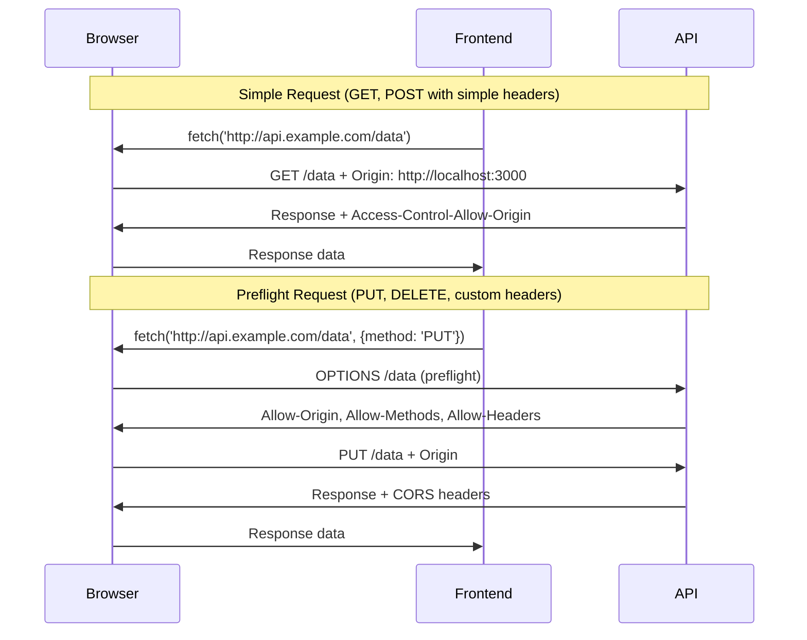

# How to Configure CORS in Spring Boot

Author: [nawazdhandala](https://www.github.com/nawazdhandala)

Tags: Java, Spring Boot, CORS, Security, REST API, Web Development

Description: Learn how to configure Cross-Origin Resource Sharing (CORS) in Spring Boot applications. This guide covers global configuration, controller-level settings, and security integration with practical examples.

---

> Cross-Origin Resource Sharing (CORS) is a security feature implemented by browsers that restricts web pages from making requests to a different domain. When building APIs consumed by frontend applications on different domains, proper CORS configuration is essential.

Without CORS configuration, browsers block requests from your frontend application to your Spring Boot API when they're on different origins.

---

## Understanding CORS

CORS errors typically appear in the browser console:

```
Access to XMLHttpRequest at 'http://api.example.com/users' from origin
'http://localhost:3000' has been blocked by CORS policy: No
'Access-Control-Allow-Origin' header is present on the requested resource.
```

---

## CORS Request Flow



---

## Method 1: Global CORS Configuration

### Using WebMvcConfigurer

```java
@Configuration
public class CorsConfig implements WebMvcConfigurer {

    @Override
    public void addCorsMappings(CorsRegistry registry) {
        registry.addMapping("/api/**")
            .allowedOrigins("http://localhost:3000", "https://myapp.com")
            .allowedMethods("GET", "POST", "PUT", "DELETE", "PATCH", "OPTIONS")
            .allowedHeaders("*")
            .exposedHeaders("Authorization", "X-Custom-Header")
            .allowCredentials(true)
            .maxAge(3600);
    }
}
```

### Configuration Properties

```yaml
# application.yml
cors:
  allowed-origins:
    - http://localhost:3000
    - https://myapp.com
    - https://admin.myapp.com
  allowed-methods:
    - GET
    - POST
    - PUT
    - DELETE
  max-age: 3600
```

```java
@Configuration
@ConfigurationProperties(prefix = "cors")
public class CorsProperties {

    private List<String> allowedOrigins = new ArrayList<>();
    private List<String> allowedMethods = new ArrayList<>();
    private long maxAge = 3600;

    // getters and setters
}

@Configuration
@EnableConfigurationProperties(CorsProperties.class)
public class CorsConfig implements WebMvcConfigurer {

    private final CorsProperties corsProperties;

    public CorsConfig(CorsProperties corsProperties) {
        this.corsProperties = corsProperties;
    }

    @Override
    public void addCorsMappings(CorsRegistry registry) {
        registry.addMapping("/api/**")
            .allowedOrigins(corsProperties.getAllowedOrigins().toArray(new String[0]))
            .allowedMethods(corsProperties.getAllowedMethods().toArray(new String[0]))
            .maxAge(corsProperties.getMaxAge());
    }
}
```

---

## Method 2: Controller-Level CORS

### Using @CrossOrigin Annotation

```java
@RestController
@RequestMapping("/api/users")
@CrossOrigin(origins = "http://localhost:3000")
public class UserController {

    @GetMapping
    public List<User> getAllUsers() {
        return userService.findAll();
    }

    // More specific CORS for single method
    @CrossOrigin(
        origins = {"http://localhost:3000", "https://admin.myapp.com"},
        methods = {RequestMethod.DELETE},
        maxAge = 3600
    )
    @DeleteMapping("/{id}")
    public ResponseEntity<Void> deleteUser(@PathVariable Long id) {
        userService.delete(id);
        return ResponseEntity.noContent().build();
    }
}
```

### Combining Global and Controller CORS

```java
// Global configuration
@Configuration
public class CorsConfig implements WebMvcConfigurer {

    @Override
    public void addCorsMappings(CorsRegistry registry) {
        registry.addMapping("/api/**")
            .allowedOrigins("http://localhost:3000")
            .allowedMethods("GET", "POST");
    }
}

// Controller overrides for specific endpoints
@RestController
@RequestMapping("/api/admin")
@CrossOrigin(
    origins = "https://admin.myapp.com",
    methods = {RequestMethod.GET, RequestMethod.POST, RequestMethod.DELETE}
)
public class AdminController {
    // Admin-only CORS settings
}
```

---

## Method 3: CORS Filter

### Custom CorsFilter Bean

```java
@Configuration
public class CorsFilterConfig {

    @Bean
    public CorsFilter corsFilter() {
        CorsConfiguration config = new CorsConfiguration();
        config.setAllowCredentials(true);
        config.addAllowedOrigin("http://localhost:3000");
        config.addAllowedOriginPattern("https://*.myapp.com");
        config.addAllowedHeader("*");
        config.addAllowedMethod("*");
        config.addExposedHeader("Authorization");
        config.setMaxAge(3600L);

        UrlBasedCorsConfigurationSource source = new UrlBasedCorsConfigurationSource();
        source.registerCorsConfiguration("/api/**", config);

        return new CorsFilter(source);
    }
}
```

### Filter with Priority

```java
@Component
@Order(Ordered.HIGHEST_PRECEDENCE)
public class CustomCorsFilter implements Filter {

    @Override
    public void doFilter(ServletRequest req, ServletResponse res, FilterChain chain)
            throws IOException, ServletException {

        HttpServletResponse response = (HttpServletResponse) res;
        HttpServletRequest request = (HttpServletRequest) req;

        String origin = request.getHeader("Origin");

        if (isAllowedOrigin(origin)) {
            response.setHeader("Access-Control-Allow-Origin", origin);
            response.setHeader("Access-Control-Allow-Methods",
                "GET, POST, PUT, DELETE, OPTIONS");
            response.setHeader("Access-Control-Allow-Headers",
                "Authorization, Content-Type, X-Requested-With");
            response.setHeader("Access-Control-Allow-Credentials", "true");
            response.setHeader("Access-Control-Max-Age", "3600");
        }

        if ("OPTIONS".equalsIgnoreCase(request.getMethod())) {
            response.setStatus(HttpServletResponse.SC_OK);
        } else {
            chain.doFilter(req, res);
        }
    }

    private boolean isAllowedOrigin(String origin) {
        if (origin == null) return false;
        List<String> allowedOrigins = List.of(
            "http://localhost:3000",
            "https://myapp.com"
        );
        return allowedOrigins.contains(origin);
    }
}
```

---

## CORS with Spring Security

When using Spring Security, CORS must be configured in the security filter chain.

### Basic Security CORS Configuration

```java
@Configuration
@EnableWebSecurity
public class SecurityConfig {

    @Bean
    public SecurityFilterChain filterChain(HttpSecurity http) throws Exception {
        http
            .cors(cors -> cors.configurationSource(corsConfigurationSource()))
            .csrf(csrf -> csrf.disable())
            .authorizeHttpRequests(auth -> auth
                .requestMatchers("/api/public/**").permitAll()
                .anyRequest().authenticated()
            );

        return http.build();
    }

    @Bean
    public CorsConfigurationSource corsConfigurationSource() {
        CorsConfiguration configuration = new CorsConfiguration();
        configuration.setAllowedOrigins(List.of(
            "http://localhost:3000",
            "https://myapp.com"
        ));
        configuration.setAllowedMethods(List.of(
            "GET", "POST", "PUT", "DELETE", "PATCH", "OPTIONS"
        ));
        configuration.setAllowedHeaders(List.of("*"));
        configuration.setExposedHeaders(List.of("Authorization"));
        configuration.setAllowCredentials(true);
        configuration.setMaxAge(3600L);

        UrlBasedCorsConfigurationSource source = new UrlBasedCorsConfigurationSource();
        source.registerCorsConfiguration("/**", configuration);
        return source;
    }
}
```

### Different CORS for Different Paths

```java
@Bean
public CorsConfigurationSource corsConfigurationSource() {
    // Public API CORS
    CorsConfiguration publicConfig = new CorsConfiguration();
    publicConfig.setAllowedOrigins(List.of("*"));
    publicConfig.setAllowedMethods(List.of("GET"));
    publicConfig.setMaxAge(3600L);

    // Private API CORS
    CorsConfiguration privateConfig = new CorsConfiguration();
    privateConfig.setAllowedOrigins(List.of("https://myapp.com"));
    privateConfig.setAllowedMethods(List.of("GET", "POST", "PUT", "DELETE"));
    privateConfig.setAllowCredentials(true);
    privateConfig.setAllowedHeaders(List.of("*"));

    // Admin API CORS
    CorsConfiguration adminConfig = new CorsConfiguration();
    adminConfig.setAllowedOrigins(List.of("https://admin.myapp.com"));
    adminConfig.setAllowedMethods(List.of("*"));
    adminConfig.setAllowCredentials(true);

    UrlBasedCorsConfigurationSource source = new UrlBasedCorsConfigurationSource();
    source.registerCorsConfiguration("/api/public/**", publicConfig);
    source.registerCorsConfiguration("/api/v1/**", privateConfig);
    source.registerCorsConfiguration("/api/admin/**", adminConfig);

    return source;
}
```

---

## Environment-Specific Configuration

```java
@Configuration
public class CorsConfig {

    @Bean
    @Profile("development")
    public CorsConfigurationSource developmentCorsConfig() {
        CorsConfiguration config = new CorsConfiguration();
        config.addAllowedOriginPattern("*");  // Allow all in development
        config.addAllowedMethod("*");
        config.addAllowedHeader("*");
        config.setAllowCredentials(true);

        UrlBasedCorsConfigurationSource source = new UrlBasedCorsConfigurationSource();
        source.registerCorsConfiguration("/**", config);
        return source;
    }

    @Bean
    @Profile("production")
    public CorsConfigurationSource productionCorsConfig() {
        CorsConfiguration config = new CorsConfiguration();
        config.setAllowedOrigins(List.of(
            "https://myapp.com",
            "https://www.myapp.com"
        ));
        config.setAllowedMethods(List.of("GET", "POST", "PUT", "DELETE"));
        config.setAllowedHeaders(List.of(
            "Authorization",
            "Content-Type",
            "X-Requested-With"
        ));
        config.setAllowCredentials(true);
        config.setMaxAge(3600L);

        UrlBasedCorsConfigurationSource source = new UrlBasedCorsConfigurationSource();
        source.registerCorsConfiguration("/api/**", config);
        return source;
    }
}
```

---

## Common CORS Configuration Options

| Option | Description | Example |
|--------|-------------|---------|
| `allowedOrigins` | Specific origins allowed | `["https://myapp.com"]` |
| `allowedOriginPatterns` | Wildcard patterns | `["https://*.myapp.com"]` |
| `allowedMethods` | HTTP methods allowed | `["GET", "POST"]` |
| `allowedHeaders` | Request headers allowed | `["Authorization", "Content-Type"]` |
| `exposedHeaders` | Response headers exposed to client | `["X-Custom-Header"]` |
| `allowCredentials` | Allow cookies/auth headers | `true` |
| `maxAge` | Preflight cache duration (seconds) | `3600` |

---

## Debugging CORS Issues

### Enable CORS Logging

```yaml
# application.yml
logging:
  level:
    org.springframework.web.cors: DEBUG
    org.springframework.web.filter: DEBUG
```

### Verify CORS Headers

```bash
# Test preflight request
curl -X OPTIONS http://localhost:8080/api/users \
  -H "Origin: http://localhost:3000" \
  -H "Access-Control-Request-Method: POST" \
  -H "Access-Control-Request-Headers: Content-Type" \
  -v

# Expected response headers:
# Access-Control-Allow-Origin: http://localhost:3000
# Access-Control-Allow-Methods: GET, POST, PUT, DELETE
# Access-Control-Allow-Headers: Content-Type
# Access-Control-Max-Age: 3600
```

---

## Common Mistakes

### 1. Duplicate CORS Configuration

```java
// Wrong - both WebMvcConfigurer and Security CORS
@Configuration
public class CorsConfig implements WebMvcConfigurer {
    @Override
    public void addCorsMappings(CorsRegistry registry) {
        // This might be ignored when Security is present
    }
}

// Solution - use only Security CORS when using Spring Security
@EnableWebSecurity
public class SecurityConfig {
    @Bean
    public SecurityFilterChain filterChain(HttpSecurity http) throws Exception {
        http.cors(cors -> cors.configurationSource(corsSource()));
        return http.build();
    }
}
```

### 2. allowCredentials with Wildcard Origin

```java
// Wrong - will throw error
config.addAllowedOrigin("*");
config.setAllowCredentials(true);

// Correct - use specific origins with credentials
config.setAllowedOrigins(List.of("http://localhost:3000"));
config.setAllowCredentials(true);

// Or use pattern
config.addAllowedOriginPattern("https://*.myapp.com");
config.setAllowCredentials(true);
```

---

## Conclusion

Proper CORS configuration is essential for modern web applications. Key takeaways:

- Use **global configuration** for consistent API-wide settings
- Use **@CrossOrigin** for endpoint-specific overrides
- Configure CORS in **Spring Security** when using authentication
- Use **environment-specific** settings for development vs production
- Never use wildcard origins with credentials in production

With correct CORS configuration, your frontend applications can securely communicate with your Spring Boot APIs.

---

*Need to monitor your API availability across different origins? [OneUptime](https://oneuptime.com) provides comprehensive API monitoring with multi-region checks and instant alerts.*

**Related Reading:**
- [How to Handle "Invalid CSRF token" Errors](/blog/post/2025-12-22-invalid-csrf-token-spring/view)
