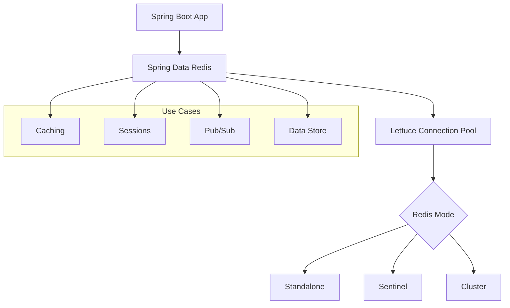

# How to Configure Spring Boot with Redis

Author: [nawazdhandala](https://www.github.com/nawazdhandala)

Tags: Java, Spring Boot, Redis, Caching, Session Management, Data Store

Description: Learn how to configure and use Redis in Spring Boot applications for caching, session management, and data storage. This guide covers connection setup, data operations, and production best practices.

---

> Redis is a powerful in-memory data store used for caching, session management, and real-time data operations. Spring Boot provides excellent Redis integration through Spring Data Redis. This guide shows you how to configure and use Redis effectively.

With Redis, you can dramatically improve application performance through caching, implement distributed sessions, and build real-time features.

---

## Redis Integration Architecture



---

## Basic Setup

### Add Dependencies

```xml
<!-- pom.xml -->
<dependencies>
    <dependency>
        <groupId>org.springframework.boot</groupId>
        <artifactId>spring-boot-starter-data-redis</artifactId>
    </dependency>
    <!-- Optional: for connection pooling -->
    <dependency>
        <groupId>org.apache.commons</groupId>
        <artifactId>commons-pool2</artifactId>
    </dependency>
</dependencies>
```

### Basic Configuration

```yaml
# application.yml
spring:
  data:
    redis:
      host: localhost
      port: 6379
      password: ${REDIS_PASSWORD:}
      database: 0
      timeout: 2000ms
      lettuce:
        pool:
          max-active: 8
          max-idle: 8
          min-idle: 0
          max-wait: -1ms
```

---

## Connection Configuration

### Standalone Redis

```java
@Configuration
public class RedisConfig {

    @Bean
    public RedisConnectionFactory redisConnectionFactory() {
        RedisStandaloneConfiguration config = new RedisStandaloneConfiguration();
        config.setHostName("localhost");
        config.setPort(6379);
        config.setPassword(RedisPassword.of("yourpassword"));
        config.setDatabase(0);

        LettucePoolingClientConfiguration poolConfig = LettucePoolingClientConfiguration.builder()
            .poolConfig(new GenericObjectPoolConfig<>())
            .commandTimeout(Duration.ofSeconds(2))
            .build();

        return new LettuceConnectionFactory(config, poolConfig);
    }
}
```

### Redis Sentinel (High Availability)

```yaml
# application.yml
spring:
  data:
    redis:
      sentinel:
        master: mymaster
        nodes:
          - sentinel1.example.com:26379
          - sentinel2.example.com:26379
          - sentinel3.example.com:26379
      password: ${REDIS_PASSWORD}
```

```java
@Configuration
public class RedisSentinelConfig {

    @Bean
    public RedisConnectionFactory redisConnectionFactory() {
        RedisSentinelConfiguration sentinelConfig = new RedisSentinelConfiguration()
            .master("mymaster")
            .sentinel("sentinel1.example.com", 26379)
            .sentinel("sentinel2.example.com", 26379)
            .sentinel("sentinel3.example.com", 26379);

        sentinelConfig.setPassword(RedisPassword.of("yourpassword"));

        return new LettuceConnectionFactory(sentinelConfig);
    }
}
```

### Redis Cluster

```yaml
# application.yml
spring:
  data:
    redis:
      cluster:
        nodes:
          - redis1.example.com:6379
          - redis2.example.com:6379
          - redis3.example.com:6379
        max-redirects: 3
      password: ${REDIS_PASSWORD}
```

```java
@Configuration
public class RedisClusterConfig {

    @Bean
    public RedisConnectionFactory redisConnectionFactory() {
        RedisClusterConfiguration clusterConfig = new RedisClusterConfiguration(
            List.of(
                "redis1.example.com:6379",
                "redis2.example.com:6379",
                "redis3.example.com:6379"
            )
        );
        clusterConfig.setMaxRedirects(3);
        clusterConfig.setPassword(RedisPassword.of("yourpassword"));

        return new LettuceConnectionFactory(clusterConfig);
    }
}
```

---

## RedisTemplate Configuration

### String Operations

```java
@Configuration
public class RedisConfig {

    @Bean
    public RedisTemplate<String, Object> redisTemplate(RedisConnectionFactory factory) {
        RedisTemplate<String, Object> template = new RedisTemplate<>();
        template.setConnectionFactory(factory);

        // Key serializer
        template.setKeySerializer(new StringRedisSerializer());
        template.setHashKeySerializer(new StringRedisSerializer());

        // Value serializer (JSON)
        Jackson2JsonRedisSerializer<Object> jsonSerializer =
            new Jackson2JsonRedisSerializer<>(Object.class);

        ObjectMapper mapper = new ObjectMapper();
        mapper.registerModule(new JavaTimeModule());
        mapper.activateDefaultTyping(
            mapper.getPolymorphicTypeValidator(),
            ObjectMapper.DefaultTyping.NON_FINAL
        );
        jsonSerializer.setObjectMapper(mapper);

        template.setValueSerializer(jsonSerializer);
        template.setHashValueSerializer(jsonSerializer);

        template.afterPropertiesSet();
        return template;
    }

    @Bean
    public StringRedisTemplate stringRedisTemplate(RedisConnectionFactory factory) {
        return new StringRedisTemplate(factory);
    }
}
```

---

## Data Operations

### Basic CRUD Operations

```java
@Service
public class UserCacheService {

    private final RedisTemplate<String, Object> redisTemplate;
    private static final String USER_KEY_PREFIX = "user:";

    public UserCacheService(RedisTemplate<String, Object> redisTemplate) {
        this.redisTemplate = redisTemplate;
    }

    public void saveUser(User user) {
        String key = USER_KEY_PREFIX + user.getId();
        redisTemplate.opsForValue().set(key, user, Duration.ofHours(1));
    }

    public User getUser(Long userId) {
        String key = USER_KEY_PREFIX + userId;
        return (User) redisTemplate.opsForValue().get(key);
    }

    public void deleteUser(Long userId) {
        String key = USER_KEY_PREFIX + userId;
        redisTemplate.delete(key);
    }

    public boolean userExists(Long userId) {
        String key = USER_KEY_PREFIX + userId;
        return Boolean.TRUE.equals(redisTemplate.hasKey(key));
    }

    public void setUserWithExpiry(User user, long seconds) {
        String key = USER_KEY_PREFIX + user.getId();
        redisTemplate.opsForValue().set(key, user, Duration.ofSeconds(seconds));
    }
}
```

### Hash Operations

```java
@Service
public class UserHashService {

    private final RedisTemplate<String, Object> redisTemplate;
    private static final String USER_HASH_KEY = "users";

    public UserHashService(RedisTemplate<String, Object> redisTemplate) {
        this.redisTemplate = redisTemplate;
    }

    public void saveUserToHash(User user) {
        redisTemplate.opsForHash().put(USER_HASH_KEY, user.getId().toString(), user);
    }

    public User getUserFromHash(Long userId) {
        return (User) redisTemplate.opsForHash().get(USER_HASH_KEY, userId.toString());
    }

    public Map<Object, Object> getAllUsers() {
        return redisTemplate.opsForHash().entries(USER_HASH_KEY);
    }

    public void deleteUserFromHash(Long userId) {
        redisTemplate.opsForHash().delete(USER_HASH_KEY, userId.toString());
    }

    public long getUserCount() {
        return redisTemplate.opsForHash().size(USER_HASH_KEY);
    }
}
```

### List Operations

```java
@Service
public class MessageQueueService {

    private final RedisTemplate<String, Object> redisTemplate;
    private static final String QUEUE_KEY = "message:queue";

    public MessageQueueService(RedisTemplate<String, Object> redisTemplate) {
        this.redisTemplate = redisTemplate;
    }

    public void pushMessage(Message message) {
        redisTemplate.opsForList().rightPush(QUEUE_KEY, message);
    }

    public Message popMessage() {
        return (Message) redisTemplate.opsForList().leftPop(QUEUE_KEY);
    }

    public Message blockingPop(long timeout, TimeUnit unit) {
        return (Message) redisTemplate.opsForList().leftPop(QUEUE_KEY, timeout, unit);
    }

    public List<Object> getRecentMessages(int count) {
        return redisTemplate.opsForList().range(QUEUE_KEY, 0, count - 1);
    }

    public long getQueueSize() {
        Long size = redisTemplate.opsForList().size(QUEUE_KEY);
        return size != null ? size : 0;
    }
}
```

### Set Operations

```java
@Service
public class TagService {

    private final RedisTemplate<String, Object> redisTemplate;

    public void addTags(String articleId, String... tags) {
        String key = "article:" + articleId + ":tags";
        redisTemplate.opsForSet().add(key, (Object[]) tags);
    }

    public Set<Object> getTags(String articleId) {
        String key = "article:" + articleId + ":tags";
        return redisTemplate.opsForSet().members(key);
    }

    public Set<Object> getCommonTags(String articleId1, String articleId2) {
        String key1 = "article:" + articleId1 + ":tags";
        String key2 = "article:" + articleId2 + ":tags";
        return redisTemplate.opsForSet().intersect(key1, key2);
    }
}
```

### Sorted Set Operations (Leaderboard)

```java
@Service
public class LeaderboardService {

    private final RedisTemplate<String, Object> redisTemplate;
    private static final String LEADERBOARD_KEY = "game:leaderboard";

    public void addScore(String playerId, double score) {
        redisTemplate.opsForZSet().add(LEADERBOARD_KEY, playerId, score);
    }

    public void incrementScore(String playerId, double delta) {
        redisTemplate.opsForZSet().incrementScore(LEADERBOARD_KEY, playerId, delta);
    }

    public Long getRank(String playerId) {
        // Ranks are 0-based, so add 1 for human-readable rank
        Long rank = redisTemplate.opsForZSet().reverseRank(LEADERBOARD_KEY, playerId);
        return rank != null ? rank + 1 : null;
    }

    public Set<ZSetOperations.TypedTuple<Object>> getTopPlayers(int count) {
        return redisTemplate.opsForZSet()
            .reverseRangeWithScores(LEADERBOARD_KEY, 0, count - 1);
    }

    public Double getScore(String playerId) {
        return redisTemplate.opsForZSet().score(LEADERBOARD_KEY, playerId);
    }
}
```

---

## Redis Repositories

```java
@RedisHash(value = "users", timeToLive = 3600)
public class UserEntity {

    @Id
    private String id;

    @Indexed
    private String email;

    private String name;
    private LocalDateTime createdAt;

    // getters and setters
}

public interface UserRedisRepository extends CrudRepository<UserEntity, String> {
    Optional<UserEntity> findByEmail(String email);
    List<UserEntity> findByName(String name);
}

@Service
public class UserService {

    private final UserRedisRepository repository;

    public UserEntity save(UserEntity user) {
        return repository.save(user);
    }

    public Optional<UserEntity> findById(String id) {
        return repository.findById(id);
    }

    public Optional<UserEntity> findByEmail(String email) {
        return repository.findByEmail(email);
    }
}
```

---

## Session Management

```xml
<!-- pom.xml -->
<dependency>
    <groupId>org.springframework.session</groupId>
    <artifactId>spring-session-data-redis</artifactId>
</dependency>
```

```java
@Configuration
@EnableRedisHttpSession(maxInactiveIntervalInSeconds = 1800) // 30 minutes
public class SessionConfig {

    @Bean
    public RedisSerializer<Object> springSessionDefaultRedisSerializer() {
        return new GenericJackson2JsonRedisSerializer();
    }
}
```

```yaml
# application.yml
spring:
  session:
    store-type: redis
    redis:
      namespace: myapp:session
```

---

## Pub/Sub Messaging

```java
@Configuration
public class RedisPubSubConfig {

    @Bean
    public MessageListenerAdapter messageListener(MessageSubscriber subscriber) {
        return new MessageListenerAdapter(subscriber, "onMessage");
    }

    @Bean
    public RedisMessageListenerContainer container(
            RedisConnectionFactory factory,
            MessageListenerAdapter listenerAdapter) {

        RedisMessageListenerContainer container = new RedisMessageListenerContainer();
        container.setConnectionFactory(factory);
        container.addMessageListener(listenerAdapter, new ChannelTopic("notifications"));
        return container;
    }
}

@Component
public class MessageSubscriber {

    private static final Logger log = LoggerFactory.getLogger(MessageSubscriber.class);

    public void onMessage(String message, String channel) {
        log.info("Received message: {} from channel: {}", message, channel);
        // Process message
    }
}

@Service
public class MessagePublisher {

    private final RedisTemplate<String, Object> redisTemplate;

    public void publish(String channel, Object message) {
        redisTemplate.convertAndSend(channel, message);
    }
}
```

---

## Health Monitoring

```yaml
# application.yml
management:
  health:
    redis:
      enabled: true
  endpoints:
    web:
      exposure:
        include: health
```

```java
@Component
public class RedisHealthCheck {

    private final RedisTemplate<String, Object> redisTemplate;

    public boolean isHealthy() {
        try {
            redisTemplate.getConnectionFactory().getConnection().ping();
            return true;
        } catch (Exception e) {
            return false;
        }
    }
}
```

---

## Production Best Practices

```java
@Configuration
public class RedisProductionConfig {

    @Bean
    public LettuceConnectionFactory redisConnectionFactory(
            @Value("${spring.data.redis.host}") String host,
            @Value("${spring.data.redis.port}") int port,
            @Value("${spring.data.redis.password}") String password) {

        RedisStandaloneConfiguration config = new RedisStandaloneConfiguration(host, port);
        config.setPassword(RedisPassword.of(password));

        // Connection pool configuration
        GenericObjectPoolConfig<Object> poolConfig = new GenericObjectPoolConfig<>();
        poolConfig.setMaxTotal(20);
        poolConfig.setMaxIdle(10);
        poolConfig.setMinIdle(5);
        poolConfig.setMaxWait(Duration.ofSeconds(2));
        poolConfig.setTestOnBorrow(true);
        poolConfig.setTestWhileIdle(true);

        // Lettuce client configuration
        LettucePoolingClientConfiguration clientConfig = LettucePoolingClientConfiguration.builder()
            .poolConfig(poolConfig)
            .commandTimeout(Duration.ofSeconds(2))
            .shutdownTimeout(Duration.ofMillis(100))
            .build();

        return new LettuceConnectionFactory(config, clientConfig);
    }
}
```

---

## Conclusion

Redis integration in Spring Boot provides powerful capabilities for caching, sessions, and data operations. Key points:

- Use **Lettuce** (default) with connection pooling for production
- Configure **proper serializers** for your data types
- Use **Redis Repositories** for simple CRUD operations
- Implement **Pub/Sub** for real-time messaging
- Configure **sessions** for distributed session management
- Monitor **health** and connection pool metrics

With proper Redis configuration, you can significantly improve application performance and scalability.

---

*Need to monitor your Redis instances? [OneUptime](https://oneuptime.com) provides Redis monitoring with connection pool metrics, latency tracking, and instant alerts.*

**Related Reading:**
- [How to Set Up Caching in Spring Boot](/blog/post/2025-12-22-setup-caching-spring-boot/view)
