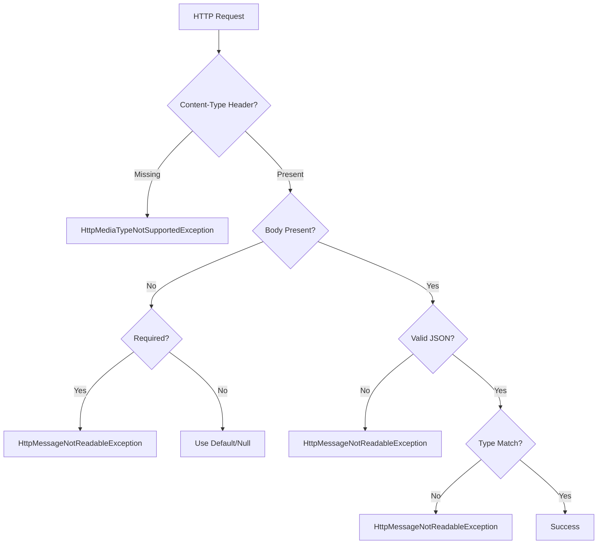

# How to Fix 'HttpMessageNotReadableException' Errors

Author: [nawazdhandala](https://www.github.com/nawazdhandala)

Tags: Java, Spring Boot, JSON, REST API, Error Handling, Jackson

Description: Learn how to diagnose and fix HttpMessageNotReadableException errors in Spring Boot. This guide covers common causes including malformed JSON, type mismatches, and missing fields with practical solutions.

---

> The HttpMessageNotReadableException occurs when Spring cannot parse the request body into your Java object. This typically happens with JSON parsing issues, type mismatches, or malformed request data. This guide helps you identify and fix these errors quickly.

This error means the incoming HTTP request body cannot be converted to the expected Java type, usually due to JSON parsing failures.

---

## Understanding the Error

Common error messages include:

```
HttpMessageNotReadableException: JSON parse error: Cannot deserialize value
of type `java.time.LocalDate` from String "2024-01-15T10:30:00"

HttpMessageNotReadableException: JSON parse error: Unexpected character
('}' (code 125)): was expecting double-quote to start field name

HttpMessageNotReadableException: Required request body is missing
```

---

## Request Parsing Flow



---

## Common Causes and Solutions

### 1. Malformed JSON

```json
// Wrong - missing quotes around field name
{name: "John", email: "john@example.com"}

// Wrong - trailing comma
{"name": "John", "email": "john@example.com",}

// Wrong - single quotes
{'name': 'John', 'email': 'john@example.com'}

// Correct
{"name": "John", "email": "john@example.com"}
```

**Solution**: Validate JSON before sending or use JSON validators.

### 2. Type Mismatch

```java
// DTO expects
public class UserRequest {
    private Long id;        // Expects number
    private String name;
    private int age;        // Expects number
    private boolean active; // Expects boolean
}
```

```json
// Wrong - type mismatches
{
    "id": "abc",       // String instead of Long
    "name": "John",
    "age": "25",       // String instead of int
    "active": "yes"    // String instead of boolean
}

// Correct
{
    "id": 123,
    "name": "John",
    "age": 25,
    "active": true
}
```

### 3. Date/Time Format Issues

```java
public class EventRequest {
    private LocalDate date;
    private LocalDateTime dateTime;
    private Instant timestamp;
}
```

```json
// Wrong - format mismatch
{
    "date": "01/15/2024",           // Wrong format
    "dateTime": "2024-01-15",       // Missing time
    "timestamp": "2024-01-15"       // Wrong format
}

// Correct
{
    "date": "2024-01-15",
    "dateTime": "2024-01-15T10:30:00",
    "timestamp": "2024-01-15T10:30:00Z"
}
```

**Solution**: Configure date formats:

```java
@Configuration
public class JacksonConfig {

    @Bean
    public ObjectMapper objectMapper() {
        ObjectMapper mapper = new ObjectMapper();
        mapper.registerModule(new JavaTimeModule());
        mapper.disable(SerializationFeature.WRITE_DATES_AS_TIMESTAMPS);
        return mapper;
    }
}
```

Or use annotations:

```java
public class EventRequest {

    @JsonFormat(pattern = "yyyy-MM-dd")
    private LocalDate date;

    @JsonFormat(pattern = "yyyy-MM-dd'T'HH:mm:ss")
    private LocalDateTime dateTime;

    private Instant timestamp;
}
```

### 4. Enum Parsing Errors

```java
public enum Status {
    ACTIVE, INACTIVE, PENDING
}

public class UserRequest {
    private Status status;
}
```

```json
// Wrong - case mismatch
{"status": "active"}

// Correct
{"status": "ACTIVE"}
```

**Solution**: Configure case-insensitive enums:

```yaml
# application.yml
spring:
  jackson:
    mapper:
      accept-case-insensitive-enums: true
```

Or in code:

```java
@Bean
public ObjectMapper objectMapper() {
    ObjectMapper mapper = new ObjectMapper();
    mapper.enable(MapperFeature.ACCEPT_CASE_INSENSITIVE_ENUMS);
    return mapper;
}
```

### 5. Missing Required Body

```java
@PostMapping("/users")
public User createUser(@RequestBody UserRequest request) {
    // Empty body throws HttpMessageNotReadableException
}
```

**Solution**: Make body optional or provide default:

```java
@PostMapping("/users")
public User createUser(@RequestBody(required = false) UserRequest request) {
    if (request == null) {
        request = new UserRequest();
    }
    return userService.create(request);
}
```

---

## Comprehensive Exception Handler

```java
@RestControllerAdvice
public class GlobalExceptionHandler {

    private static final Logger log = LoggerFactory.getLogger(GlobalExceptionHandler.class);

    @ExceptionHandler(HttpMessageNotReadableException.class)
    public ResponseEntity<ErrorResponse> handleHttpMessageNotReadable(
            HttpMessageNotReadableException ex,
            HttpServletRequest request) {

        String message = "Unable to parse request body";
        String detail = null;

        Throwable cause = ex.getCause();

        if (cause instanceof JsonParseException parseEx) {
            message = "Invalid JSON format";
            detail = String.format("Error at line %d, column %d: %s",
                parseEx.getLocation().getLineNr(),
                parseEx.getLocation().getColumnNr(),
                parseEx.getOriginalMessage());

        } else if (cause instanceof JsonMappingException mappingEx) {
            message = "JSON mapping error";

            String fieldPath = mappingEx.getPath().stream()
                .map(ref -> ref.getFieldName() != null ?
                    ref.getFieldName() : "[" + ref.getIndex() + "]")
                .collect(Collectors.joining("."));

            if (!fieldPath.isEmpty()) {
                detail = String.format("Error at field '%s': %s",
                    fieldPath, getRootCauseMessage(mappingEx));
            } else {
                detail = getRootCauseMessage(mappingEx);
            }

        } else if (cause instanceof InvalidFormatException formatEx) {
            message = "Invalid value format";
            detail = String.format("Cannot convert '%s' to type %s for field '%s'",
                formatEx.getValue(),
                formatEx.getTargetType().getSimpleName(),
                getFieldName(formatEx));

        } else if (cause instanceof MismatchedInputException mismatchEx) {
            message = "Type mismatch";
            detail = String.format("Expected %s but got different type for field '%s'",
                mismatchEx.getTargetType().getSimpleName(),
                getFieldName(mismatchEx));
        }

        log.warn("Request parsing error for {}: {}", request.getRequestURI(), message);

        ErrorResponse error = new ErrorResponse(
            HttpStatus.BAD_REQUEST.value(),
            "Bad Request",
            message,
            detail,
            request.getRequestURI()
        );

        return ResponseEntity.badRequest().body(error);
    }

    private String getFieldName(JsonMappingException ex) {
        return ex.getPath().stream()
            .map(ref -> ref.getFieldName() != null ?
                ref.getFieldName() : "[" + ref.getIndex() + "]")
            .collect(Collectors.joining("."));
    }

    private String getRootCauseMessage(Throwable ex) {
        Throwable root = ex;
        while (root.getCause() != null && root.getCause() != root) {
            root = root.getCause();
        }
        return root.getMessage();
    }
}

record ErrorResponse(
    int status,
    String error,
    String message,
    String detail,
    String path
) {}
```

---

## Jackson Configuration Best Practices

```java
@Configuration
public class JacksonConfig {

    @Bean
    public ObjectMapper objectMapper() {
        ObjectMapper mapper = new ObjectMapper();

        // Register Java 8 date/time module
        mapper.registerModule(new JavaTimeModule());

        // Don't write dates as timestamps
        mapper.disable(SerializationFeature.WRITE_DATES_AS_TIMESTAMPS);

        // Accept case-insensitive enums
        mapper.enable(MapperFeature.ACCEPT_CASE_INSENSITIVE_ENUMS);

        // Fail on unknown properties (strict mode)
        // mapper.enable(DeserializationFeature.FAIL_ON_UNKNOWN_PROPERTIES);

        // Or ignore unknown properties (lenient mode)
        mapper.disable(DeserializationFeature.FAIL_ON_UNKNOWN_PROPERTIES);

        // Accept empty strings as null for objects
        mapper.enable(DeserializationFeature.ACCEPT_EMPTY_STRING_AS_NULL_OBJECT);

        // Don't fail on empty beans
        mapper.disable(SerializationFeature.FAIL_ON_EMPTY_BEANS);

        return mapper;
    }
}
```

### Via Properties

```yaml
# application.yml
spring:
  jackson:
    serialization:
      write-dates-as-timestamps: false
      fail-on-empty-beans: false
    deserialization:
      fail-on-unknown-properties: false
      accept-empty-string-as-null-object: true
    mapper:
      accept-case-insensitive-enums: true
    default-property-inclusion: non_null
    date-format: yyyy-MM-dd'T'HH:mm:ss.SSSZ
```

---

## Custom Deserializers

### For Complex Types

```java
public class MoneyDeserializer extends JsonDeserializer<BigDecimal> {

    @Override
    public BigDecimal deserialize(JsonParser p, DeserializationContext ctxt)
            throws IOException {
        String value = p.getText();

        if (value == null || value.isEmpty()) {
            return BigDecimal.ZERO;
        }

        // Remove currency symbols and format
        value = value.replaceAll("[^0-9.-]", "");

        try {
            return new BigDecimal(value);
        } catch (NumberFormatException e) {
            throw new JsonParseException(p, "Invalid money format: " + p.getText());
        }
    }
}

// Usage
public class ProductRequest {

    @JsonDeserialize(using = MoneyDeserializer.class)
    private BigDecimal price;
}
```

### For Flexible Date Parsing

```java
public class FlexibleDateDeserializer extends JsonDeserializer<LocalDate> {

    private static final DateTimeFormatter[] FORMATTERS = {
        DateTimeFormatter.ISO_LOCAL_DATE,                    // 2024-01-15
        DateTimeFormatter.ofPattern("MM/dd/yyyy"),           // 01/15/2024
        DateTimeFormatter.ofPattern("dd-MM-yyyy"),           // 15-01-2024
        DateTimeFormatter.ofPattern("yyyy/MM/dd")            // 2024/01/15
    };

    @Override
    public LocalDate deserialize(JsonParser p, DeserializationContext ctxt)
            throws IOException {
        String value = p.getText();

        for (DateTimeFormatter formatter : FORMATTERS) {
            try {
                return LocalDate.parse(value, formatter);
            } catch (DateTimeParseException ignored) {
                // Try next format
            }
        }

        throw new JsonParseException(p,
            "Unable to parse date: " + value + ". Expected formats: " +
            "yyyy-MM-dd, MM/dd/yyyy, dd-MM-yyyy, yyyy/MM/dd");
    }
}
```

---

## Debugging Request Parsing

### Log Request Body

```java
@Component
public class RequestLoggingFilter extends OncePerRequestFilter {

    private static final Logger log = LoggerFactory.getLogger(RequestLoggingFilter.class);

    @Override
    protected void doFilterInternal(HttpServletRequest request,
                                    HttpServletResponse response,
                                    FilterChain filterChain)
            throws ServletException, IOException {

        if (isJsonRequest(request) && log.isDebugEnabled()) {
            ContentCachingRequestWrapper wrappedRequest =
                new ContentCachingRequestWrapper(request);

            filterChain.doFilter(wrappedRequest, response);

            String body = new String(wrappedRequest.getContentAsByteArray(),
                wrappedRequest.getCharacterEncoding());
            log.debug("Request body: {}", body);
        } else {
            filterChain.doFilter(request, response);
        }
    }

    private boolean isJsonRequest(HttpServletRequest request) {
        String contentType = request.getContentType();
        return contentType != null && contentType.contains("application/json");
    }
}
```

### Enable Jackson Logging

```yaml
# application.yml
logging:
  level:
    com.fasterxml.jackson: DEBUG
    org.springframework.http.converter.json: DEBUG
```

---

## Quick Reference

| Error | Cause | Solution |
|-------|-------|----------|
| Unexpected character | Malformed JSON | Validate JSON syntax |
| Cannot deserialize | Type mismatch | Check data types |
| InvalidFormatException | Wrong format | Configure formatters |
| UnrecognizedPropertyException | Unknown field | Configure to ignore or add field |
| Required body missing | No request body | Make body optional |

---

## Conclusion

HttpMessageNotReadableException usually indicates client-side data issues. Key solutions:

- **Validate JSON** before sending requests
- **Configure Jackson** for flexible parsing
- **Use proper formats** for dates, enums, and numbers
- **Implement error handlers** with helpful messages
- **Log request bodies** for debugging

With proper configuration and error handling, you can provide meaningful feedback to API consumers and reduce debugging time.

---

*Need to monitor your API for parsing errors? [OneUptime](https://oneuptime.com) provides comprehensive error tracking and logging for Spring Boot applications with instant alerts.*

**Related Reading:**
- [How to Handle "Request method not supported" Errors](/blog/post/2025-12-22-request-method-not-supported-spring/view)
