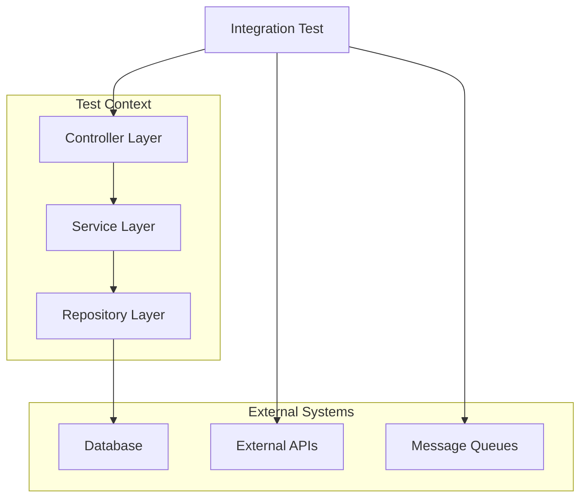

# How to Set Up Integration Testing in Spring Boot

Author: [nawazdhandala](https://www.github.com/nawazdhandala)

Tags: Java, Spring Boot, Integration Testing, Testcontainers, JUnit, Testing

Description: Learn how to set up comprehensive integration tests in Spring Boot using @SpringBootTest, Testcontainers, and MockMvc. This guide covers database testing, API testing, and best practices for reliable tests.

---

> Integration tests verify that multiple components work together correctly. Unlike unit tests that isolate a single class, integration tests check the interaction between layers - controllers, services, repositories, and external systems.

Integration testing in Spring Boot ensures your application behaves correctly when all pieces are assembled together, catching issues that unit tests might miss.

---

## Integration Testing Layers



---

## Dependencies Setup

```xml
<!-- pom.xml -->
<dependencies>
    <!-- Spring Boot Test -->
    <dependency>
        <groupId>org.springframework.boot</groupId>
        <artifactId>spring-boot-starter-test</artifactId>
        <scope>test</scope>
    </dependency>

    <!-- Testcontainers -->
    <dependency>
        <groupId>org.testcontainers</groupId>
        <artifactId>testcontainers</artifactId>
        <scope>test</scope>
    </dependency>
    <dependency>
        <groupId>org.testcontainers</groupId>
        <artifactId>junit-jupiter</artifactId>
        <scope>test</scope>
    </dependency>
    <dependency>
        <groupId>org.testcontainers</groupId>
        <artifactId>postgresql</artifactId>
        <scope>test</scope>
    </dependency>
</dependencies>
```

---

## Basic Integration Test Setup

### Using @SpringBootTest

```java
@SpringBootTest
class UserServiceIntegrationTest {

    @Autowired
    private UserService userService;

    @Autowired
    private UserRepository userRepository;

    @BeforeEach
    void setUp() {
        userRepository.deleteAll();
    }

    @Test
    void createUser_ShouldPersistUser_WhenValidData() {
        // Arrange
        UserRequest request = new UserRequest("test@example.com", "Test User");

        // Act
        User created = userService.createUser(request);

        // Assert
        assertNotNull(created.getId());
        assertEquals("test@example.com", created.getEmail());

        // Verify persistence
        Optional<User> found = userRepository.findById(created.getId());
        assertTrue(found.isPresent());
        assertEquals("Test User", found.get().getName());
    }
}
```

### Testing Web Layer with MockMvc

```java
@SpringBootTest
@AutoConfigureMockMvc
class UserControllerIntegrationTest {

    @Autowired
    private MockMvc mockMvc;

    @Autowired
    private UserRepository userRepository;

    @Autowired
    private ObjectMapper objectMapper;

    @BeforeEach
    void setUp() {
        userRepository.deleteAll();
    }

    @Test
    void createUser_ShouldReturn201_WhenValidRequest() throws Exception {
        UserRequest request = new UserRequest("test@example.com", "Test User");

        mockMvc.perform(post("/api/users")
                .contentType(MediaType.APPLICATION_JSON)
                .content(objectMapper.writeValueAsString(request)))
            .andExpect(status().isCreated())
            .andExpect(jsonPath("$.id").exists())
            .andExpect(jsonPath("$.email").value("test@example.com"))
            .andExpect(jsonPath("$.name").value("Test User"));
    }

    @Test
    void getUser_ShouldReturn404_WhenUserNotFound() throws Exception {
        mockMvc.perform(get("/api/users/999"))
            .andExpect(status().isNotFound());
    }

    @Test
    void getAllUsers_ShouldReturnList_WhenUsersExist() throws Exception {
        // Arrange
        User user1 = userRepository.save(new User(null, "user1@example.com", "User 1"));
        User user2 = userRepository.save(new User(null, "user2@example.com", "User 2"));

        // Act & Assert
        mockMvc.perform(get("/api/users"))
            .andExpect(status().isOk())
            .andExpect(jsonPath("$", hasSize(2)))
            .andExpect(jsonPath("$[0].email").value("user1@example.com"))
            .andExpect(jsonPath("$[1].email").value("user2@example.com"));
    }
}
```

---

## Testing with Testcontainers

### PostgreSQL Container

```java
@SpringBootTest
@Testcontainers
class UserRepositoryIntegrationTest {

    @Container
    static PostgreSQLContainer<?> postgres = new PostgreSQLContainer<>("postgres:15-alpine")
        .withDatabaseName("testdb")
        .withUsername("test")
        .withPassword("test");

    @DynamicPropertySource
    static void configureProperties(DynamicPropertyRegistry registry) {
        registry.add("spring.datasource.url", postgres::getJdbcUrl);
        registry.add("spring.datasource.username", postgres::getUsername);
        registry.add("spring.datasource.password", postgres::getPassword);
    }

    @Autowired
    private UserRepository userRepository;

    @Test
    void shouldSaveAndRetrieveUser() {
        User user = new User();
        user.setEmail("test@example.com");
        user.setName("Test User");

        User saved = userRepository.save(user);

        assertNotNull(saved.getId());

        Optional<User> found = userRepository.findById(saved.getId());
        assertTrue(found.isPresent());
        assertEquals("test@example.com", found.get().getEmail());
    }
}
```

### Reusable Container Configuration

```java
// Abstract base class for database tests
@SpringBootTest
@Testcontainers
abstract class AbstractIntegrationTest {

    @Container
    static PostgreSQLContainer<?> postgres = new PostgreSQLContainer<>("postgres:15-alpine")
        .withDatabaseName("testdb")
        .withUsername("test")
        .withPassword("test")
        .withReuse(true);  // Reuse container across tests

    @DynamicPropertySource
    static void configureProperties(DynamicPropertyRegistry registry) {
        registry.add("spring.datasource.url", postgres::getJdbcUrl);
        registry.add("spring.datasource.username", postgres::getUsername);
        registry.add("spring.datasource.password", postgres::getPassword);
    }
}

// Concrete test class
class OrderServiceIntegrationTest extends AbstractIntegrationTest {

    @Autowired
    private OrderService orderService;

    @Test
    void shouldCreateOrder() {
        // Test implementation
    }
}
```

### Multiple Containers

```java
@SpringBootTest
@Testcontainers
class FullStackIntegrationTest {

    @Container
    static PostgreSQLContainer<?> postgres = new PostgreSQLContainer<>("postgres:15-alpine");

    @Container
    static GenericContainer<?> redis = new GenericContainer<>("redis:7-alpine")
        .withExposedPorts(6379);

    @Container
    static KafkaContainer kafka = new KafkaContainer(
        DockerImageName.parse("confluentinc/cp-kafka:7.4.0"));

    @DynamicPropertySource
    static void configureProperties(DynamicPropertyRegistry registry) {
        // PostgreSQL
        registry.add("spring.datasource.url", postgres::getJdbcUrl);
        registry.add("spring.datasource.username", postgres::getUsername);
        registry.add("spring.datasource.password", postgres::getPassword);

        // Redis
        registry.add("spring.data.redis.host", redis::getHost);
        registry.add("spring.data.redis.port", redis::getFirstMappedPort);

        // Kafka
        registry.add("spring.kafka.bootstrap-servers", kafka::getBootstrapServers);
    }

    @Test
    void fullIntegrationScenario() {
        // Test with all services
    }
}
```

---

## Testing with @DataJpaTest

For repository-specific tests with a sliced context:

```java
@DataJpaTest
@AutoConfigureTestDatabase(replace = AutoConfigureTestDatabase.Replace.NONE)
@Testcontainers
class UserRepositoryTest {

    @Container
    static PostgreSQLContainer<?> postgres = new PostgreSQLContainer<>("postgres:15-alpine");

    @DynamicPropertySource
    static void configureProperties(DynamicPropertyRegistry registry) {
        registry.add("spring.datasource.url", postgres::getJdbcUrl);
        registry.add("spring.datasource.username", postgres::getUsername);
        registry.add("spring.datasource.password", postgres::getPassword);
    }

    @Autowired
    private TestEntityManager entityManager;

    @Autowired
    private UserRepository userRepository;

    @Test
    void findByEmail_ShouldReturnUser_WhenExists() {
        // Arrange
        User user = new User();
        user.setEmail("test@example.com");
        user.setName("Test User");
        entityManager.persistAndFlush(user);

        // Act
        Optional<User> found = userRepository.findByEmail("test@example.com");

        // Assert
        assertTrue(found.isPresent());
        assertEquals("Test User", found.get().getName());
    }

    @Test
    void findByEmail_ShouldReturnEmpty_WhenNotExists() {
        Optional<User> found = userRepository.findByEmail("nonexistent@example.com");
        assertTrue(found.isEmpty());
    }
}
```

---

## Testing REST Clients with WireMock

```java
@SpringBootTest
@AutoConfigureMockMvc
class ExternalApiIntegrationTest {

    @RegisterExtension
    static WireMockExtension wireMock = WireMockExtension.newInstance()
        .options(wireMockConfig().dynamicPort())
        .build();

    @DynamicPropertySource
    static void configureProperties(DynamicPropertyRegistry registry) {
        registry.add("external.api.url", wireMock::baseUrl);
    }

    @Autowired
    private MockMvc mockMvc;

    @Test
    void shouldFetchExternalData() throws Exception {
        // Stub external API
        wireMock.stubFor(get(urlEqualTo("/external/data"))
            .willReturn(aResponse()
                .withHeader("Content-Type", "application/json")
                .withBody("{\"status\":\"ok\",\"value\":42}")));

        // Test our endpoint that calls the external API
        mockMvc.perform(get("/api/aggregated-data"))
            .andExpect(status().isOk())
            .andExpect(jsonPath("$.externalValue").value(42));

        // Verify external API was called
        wireMock.verify(getRequestedFor(urlEqualTo("/external/data")));
    }

    @Test
    void shouldHandleExternalApiError() throws Exception {
        wireMock.stubFor(get(urlEqualTo("/external/data"))
            .willReturn(aResponse()
                .withStatus(500)
                .withBody("{\"error\":\"Internal Server Error\"}")));

        mockMvc.perform(get("/api/aggregated-data"))
            .andExpect(status().isServiceUnavailable());
    }
}
```

---

## Testing Security

```java
@SpringBootTest
@AutoConfigureMockMvc
class SecurityIntegrationTest {

    @Autowired
    private MockMvc mockMvc;

    @Test
    void publicEndpoint_ShouldBeAccessible_WithoutAuth() throws Exception {
        mockMvc.perform(get("/api/public/health"))
            .andExpect(status().isOk());
    }

    @Test
    void protectedEndpoint_ShouldReturn401_WithoutAuth() throws Exception {
        mockMvc.perform(get("/api/users/me"))
            .andExpect(status().isUnauthorized());
    }

    @Test
    @WithMockUser(username = "user@example.com", roles = "USER")
    void protectedEndpoint_ShouldReturn200_WithAuth() throws Exception {
        mockMvc.perform(get("/api/users/me"))
            .andExpect(status().isOk())
            .andExpect(jsonPath("$.username").value("user@example.com"));
    }

    @Test
    @WithMockUser(username = "admin@example.com", roles = "ADMIN")
    void adminEndpoint_ShouldReturn200_ForAdmin() throws Exception {
        mockMvc.perform(get("/api/admin/users"))
            .andExpect(status().isOk());
    }

    @Test
    @WithMockUser(username = "user@example.com", roles = "USER")
    void adminEndpoint_ShouldReturn403_ForRegularUser() throws Exception {
        mockMvc.perform(get("/api/admin/users"))
            .andExpect(status().isForbidden());
    }
}
```

---

## Test Configuration

### Test Profile Properties

```yaml
# src/test/resources/application-test.yml
spring:
  datasource:
    url: jdbc:tc:postgresql:15-alpine:///testdb
    driver-class-name: org.testcontainers.jdbc.ContainerDatabaseDriver
  jpa:
    hibernate:
      ddl-auto: create-drop
    show-sql: true

logging:
  level:
    org.springframework.web: DEBUG
    org.hibernate.SQL: DEBUG
```

### Using Test Profile

```java
@SpringBootTest
@ActiveProfiles("test")
class MyIntegrationTest {
    // Test with test profile configuration
}
```

---

## Best Practices

### 1. Clean Database Between Tests

```java
@SpringBootTest
class MyIntegrationTest {

    @Autowired
    private JdbcTemplate jdbcTemplate;

    @BeforeEach
    void cleanDatabase() {
        jdbcTemplate.execute("TRUNCATE TABLE users CASCADE");
        jdbcTemplate.execute("TRUNCATE TABLE orders CASCADE");
    }
}
```

### 2. Use Transactions for Rollback

```java
@SpringBootTest
@Transactional  // Rolls back after each test
class TransactionalIntegrationTest {

    @Autowired
    private UserRepository userRepository;

    @Test
    void testWithRollback() {
        userRepository.save(new User(null, "test@example.com", "Test"));
        // Changes rolled back after test
    }
}
```

### 3. Test Data Builders

```java
public class UserTestBuilder {
    private String email = "default@example.com";
    private String name = "Default User";

    public static UserTestBuilder aUser() {
        return new UserTestBuilder();
    }

    public UserTestBuilder withEmail(String email) {
        this.email = email;
        return this;
    }

    public UserTestBuilder withName(String name) {
        this.name = name;
        return this;
    }

    public User build() {
        return new User(null, email, name);
    }
}

// Usage in tests
User user = aUser()
    .withEmail("test@example.com")
    .withName("Test User")
    .build();
```

---

## Conclusion

Integration testing in Spring Boot ensures your components work together correctly. Key practices:

- Use `@SpringBootTest` for full application context
- Use Testcontainers for real database testing
- Use MockMvc for API testing
- Use WireMock for external service mocking
- Clean database state between tests
- Use test profiles for configuration

Comprehensive integration tests give you confidence that your application will work correctly in production.

---

*Need to monitor your Spring Boot application's integration points? [OneUptime](https://oneuptime.com) provides end-to-end monitoring for APIs, databases, and external services with instant alerting.*

**Related Reading:**
- [How to Set Up Unit Testing with Mockito in Spring Boot](/blog/post/2025-12-22-unit-testing-mockito-spring-boot/view)
