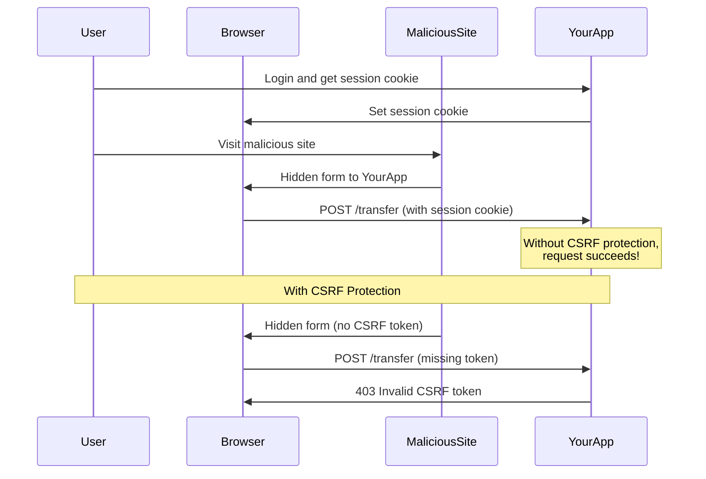

# How to Handle 'Invalid CSRF token' Errors

Author: [nawazdhandala](https://www.github.com/nawazdhandala)

Tags: Java, Spring Boot, CSRF, Security, Spring Security, Web Security

Description: Learn how to diagnose and fix 'Invalid CSRF token' errors in Spring Boot applications. This guide covers CSRF protection concepts, proper token handling, and when to disable CSRF for REST APIs.

---

> Cross-Site Request Forgery (CSRF) protection is a security feature that prevents malicious websites from making unauthorized requests on behalf of authenticated users. When you see "Invalid CSRF token" errors, it means the token is missing, expired, or incorrect.

Understanding when and how to use CSRF protection is crucial for building secure Spring Boot applications.

---

## Understanding CSRF Protection

CSRF attacks exploit the trust a web application has in a user's browser. The attacker tricks the user into performing unwanted actions.



---

## Common Error Messages

```
HTTP Status 403 - Invalid CSRF token 'null' was found on the request parameter '_csrf' or header 'X-CSRF-TOKEN'.

Could not verify the provided CSRF token because your session was not found.

CSRF token verification failed. Request aborted.
```

---

## When CSRF Protection is Needed

| Scenario | CSRF Needed | Reason |
|----------|-------------|--------|
| Server-rendered forms | Yes | Browser submits forms with cookies |
| Single Page App with cookies | Yes | Cookies sent automatically |
| REST API with JWT in header | No | Token not sent automatically |
| Mobile API with bearer tokens | No | No cookie-based auth |
| Public read-only endpoints | No | No state-changing operations |

---

## Solution 1: Proper CSRF Token Handling (Server-Side Rendering)

### Thymeleaf Forms

```html
<!-- CSRF token automatically included with Thymeleaf -->
<form th:action="@{/users}" method="post">
    <!-- Thymeleaf automatically adds hidden CSRF input -->
    <input type="text" name="name" />
    <button type="submit">Submit</button>
</form>

<!-- Manual CSRF token if needed -->
<form action="/users" method="post">
    <input type="hidden"
           th:name="${_csrf.parameterName}"
           th:value="${_csrf.token}"/>
    <input type="text" name="name" />
    <button type="submit">Submit</button>
</form>
```

### JSP Forms

```jsp
<%@ taglib prefix="c" uri="http://java.sun.com/jsp/jstl/core" %>
<form action="/users" method="post">
    <input type="hidden" name="${_csrf.parameterName}" value="${_csrf.token}"/>
    <input type="text" name="name" />
    <button type="submit">Submit</button>
</form>
```

---

## Solution 2: CSRF with JavaScript/AJAX

### Include Token in Meta Tags

```html
<!-- In your HTML head -->
<meta name="_csrf" th:content="${_csrf.token}"/>
<meta name="_csrf_header" th:content="${_csrf.headerName}"/>
```

### JavaScript AJAX Requests

```javascript
// Get CSRF token from meta tags
const csrfToken = document.querySelector('meta[name="_csrf"]').content;
const csrfHeader = document.querySelector('meta[name="_csrf_header"]').content;

// Include in fetch requests
fetch('/api/users', {
    method: 'POST',
    headers: {
        'Content-Type': 'application/json',
        [csrfHeader]: csrfToken
    },
    body: JSON.stringify({ name: 'John' })
});

// With Axios - set globally
axios.defaults.headers.common['X-CSRF-TOKEN'] = csrfToken;
```

### jQuery AJAX Setup

```javascript
// Set CSRF token for all jQuery AJAX requests
$(document).ready(function() {
    var token = $("meta[name='_csrf']").attr("content");
    var header = $("meta[name='_csrf_header']").attr("content");

    $(document).ajaxSend(function(e, xhr, options) {
        xhr.setRequestHeader(header, token);
    });
});
```

---

## Solution 3: CSRF Cookie Repository (SPA Applications)

For single-page applications, use cookie-based CSRF tokens:

```java
@Configuration
@EnableWebSecurity
public class SecurityConfig {

    @Bean
    public SecurityFilterChain filterChain(HttpSecurity http) throws Exception {
        http
            .csrf(csrf -> csrf
                .csrfTokenRepository(CookieCsrfTokenRepository.withHttpOnlyFalse())
                .csrfTokenRequestHandler(new CsrfTokenRequestAttributeHandler())
            )
            .authorizeHttpRequests(auth -> auth
                .anyRequest().authenticated()
            );

        return http.build();
    }
}
```

JavaScript reads the cookie:

```javascript
// Read CSRF token from cookie
function getCsrfToken() {
    const name = 'XSRF-TOKEN=';
    const cookies = document.cookie.split(';');
    for (let cookie of cookies) {
        cookie = cookie.trim();
        if (cookie.indexOf(name) === 0) {
            return cookie.substring(name.length);
        }
    }
    return null;
}

// Include in requests
fetch('/api/data', {
    method: 'POST',
    headers: {
        'Content-Type': 'application/json',
        'X-XSRF-TOKEN': getCsrfToken()
    },
    body: JSON.stringify(data)
});
```

---

## Solution 4: Disable CSRF for REST APIs

For stateless REST APIs using JWT or API keys, CSRF protection is typically disabled:

```java
@Configuration
@EnableWebSecurity
public class SecurityConfig {

    @Bean
    public SecurityFilterChain filterChain(HttpSecurity http) throws Exception {
        http
            // Disable CSRF for stateless REST API
            .csrf(csrf -> csrf.disable())
            // Use stateless session management
            .sessionManagement(session ->
                session.sessionCreationPolicy(SessionCreationPolicy.STATELESS)
            )
            // JWT or API key authentication
            .addFilterBefore(jwtAuthFilter, UsernamePasswordAuthenticationFilter.class)
            .authorizeHttpRequests(auth -> auth
                .requestMatchers("/api/public/**").permitAll()
                .anyRequest().authenticated()
            );

        return http.build();
    }
}
```

### Selective CSRF Disable

```java
@Configuration
@EnableWebSecurity
public class SecurityConfig {

    @Bean
    public SecurityFilterChain filterChain(HttpSecurity http) throws Exception {
        http
            .csrf(csrf -> csrf
                // Disable CSRF only for specific paths
                .ignoringRequestMatchers("/api/**", "/webhook/**")
            )
            .authorizeHttpRequests(auth -> auth
                .anyRequest().authenticated()
            );

        return http.build();
    }
}
```

---

## Solution 5: Handle Session Expiration

CSRF tokens are tied to sessions. When sessions expire, tokens become invalid.

```java
@Configuration
@EnableWebSecurity
public class SecurityConfig {

    @Bean
    public SecurityFilterChain filterChain(HttpSecurity http) throws Exception {
        http
            .csrf(csrf -> csrf
                .csrfTokenRepository(CookieCsrfTokenRepository.withHttpOnlyFalse())
            )
            .sessionManagement(session -> session
                .invalidSessionUrl("/session-expired")
                .maximumSessions(1)
                .expiredUrl("/session-expired")
            )
            .exceptionHandling(ex -> ex
                .accessDeniedHandler(accessDeniedHandler())
            );

        return http.build();
    }

    @Bean
    public AccessDeniedHandler accessDeniedHandler() {
        return (request, response, accessDeniedException) -> {
            if (accessDeniedException instanceof MissingCsrfTokenException ||
                accessDeniedException instanceof InvalidCsrfTokenException) {

                // Return JSON for API requests
                if (isApiRequest(request)) {
                    response.setStatus(HttpServletResponse.SC_FORBIDDEN);
                    response.setContentType("application/json");
                    response.getWriter().write(
                        "{\"error\":\"CSRF token invalid or expired. Please refresh the page.\"}"
                    );
                } else {
                    // Redirect for web requests
                    response.sendRedirect("/login?csrf-expired");
                }
            } else {
                response.sendRedirect("/access-denied");
            }
        };
    }

    private boolean isApiRequest(HttpServletRequest request) {
        return request.getRequestURI().startsWith("/api/") ||
               "application/json".equals(request.getHeader("Accept"));
    }
}
```

---

## Custom CSRF Token Handler

```java
@Component
public class CustomCsrfTokenRequestHandler implements CsrfTokenRequestHandler {

    private final CsrfTokenRequestAttributeHandler delegate =
        new CsrfTokenRequestAttributeHandler();

    @Override
    public void handle(HttpServletRequest request, HttpServletResponse response,
                      Supplier<CsrfToken> csrfToken) {
        delegate.handle(request, response, csrfToken);
    }

    @Override
    public String resolveCsrfTokenValue(HttpServletRequest request, CsrfToken csrfToken) {
        // Check header first
        String headerValue = request.getHeader(csrfToken.getHeaderName());
        if (StringUtils.hasText(headerValue)) {
            return headerValue;
        }

        // Then check parameter
        String paramValue = request.getParameter(csrfToken.getParameterName());
        if (StringUtils.hasText(paramValue)) {
            return paramValue;
        }

        // Finally check custom header
        return request.getHeader("X-Custom-CSRF-Token");
    }
}
```

---

## Testing CSRF Protection

### With MockMvc

```java
@SpringBootTest
@AutoConfigureMockMvc
class CsrfTest {

    @Autowired
    private MockMvc mockMvc;

    @Test
    void postWithoutCsrf_ShouldReturn403() throws Exception {
        mockMvc.perform(post("/users")
                .contentType(MediaType.APPLICATION_FORM_URLENCODED)
                .param("name", "Test"))
            .andExpect(status().isForbidden());
    }

    @Test
    void postWithCsrf_ShouldSucceed() throws Exception {
        mockMvc.perform(post("/users")
                .with(csrf())  // Include CSRF token
                .contentType(MediaType.APPLICATION_FORM_URLENCODED)
                .param("name", "Test"))
            .andExpect(status().isOk());
    }

    @Test
    void postWithInvalidCsrf_ShouldReturn403() throws Exception {
        mockMvc.perform(post("/users")
                .with(csrf().useInvalidToken())
                .contentType(MediaType.APPLICATION_FORM_URLENCODED)
                .param("name", "Test"))
            .andExpect(status().isForbidden());
    }
}
```

---

## Debugging CSRF Issues

### Enable Security Debug Logging

```yaml
# application.yml
logging:
  level:
    org.springframework.security: DEBUG
    org.springframework.security.web.csrf: TRACE
```

### CSRF Debug Filter

```java
@Component
@Order(Ordered.HIGHEST_PRECEDENCE)
public class CsrfDebugFilter extends OncePerRequestFilter {

    private static final Logger log = LoggerFactory.getLogger(CsrfDebugFilter.class);

    @Override
    protected void doFilterInternal(HttpServletRequest request,
                                    HttpServletResponse response,
                                    FilterChain filterChain)
            throws ServletException, IOException {

        log.debug("Request: {} {}", request.getMethod(), request.getRequestURI());
        log.debug("Session ID: {}", request.getSession(false) != null ?
            request.getSession().getId() : "No session");
        log.debug("CSRF Header: {}", request.getHeader("X-CSRF-TOKEN"));
        log.debug("CSRF Param: {}", request.getParameter("_csrf"));

        filterChain.doFilter(request, response);
    }
}
```

---

## Quick Reference

| Problem | Solution |
|---------|----------|
| Token missing in form | Add `${_csrf.token}` hidden field |
| Token missing in AJAX | Include token in header |
| Token expired | Handle session expiration gracefully |
| REST API 403 errors | Disable CSRF for stateless APIs |
| SPA token issues | Use CookieCsrfTokenRepository |

---

## Conclusion

CSRF protection is important for session-based web applications. Key takeaways:

- **Include tokens** in forms and AJAX requests for server-rendered apps
- **Use cookie repository** for single-page applications
- **Disable CSRF** for stateless REST APIs using JWT
- **Handle expiration** gracefully with proper error messages
- **Test thoroughly** with both valid and invalid tokens

Understanding when CSRF protection applies helps you configure it correctly for your application type.

---

*Need to monitor your Spring Boot application security? [OneUptime](https://oneuptime.com) provides security monitoring and alerting for your applications with comprehensive logging and incident management.*

**Related Reading:**
- [How to Configure CORS in Spring Boot](/blog/post/2025-12-22-configure-cors-spring-boot/view)
