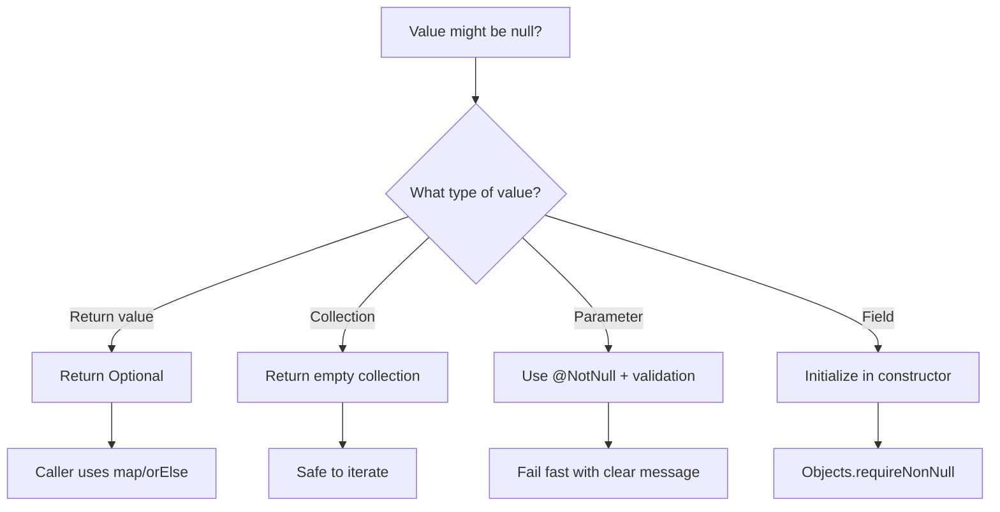

# How to Handle "Cannot invoke method on null" Errors

Author: [nawazdhandala](https://github.com/nawazdhandala)

Tags: Java, Spring Boot, NullPointerException, Debugging, Best Practices, Backend

Description: Learn how to prevent, diagnose, and handle NullPointerException errors in Java and Spring Boot applications with practical defensive coding strategies.

---

`NullPointerException` (NPE) with the message "Cannot invoke method on null" is one of the most common runtime errors in Java. It occurs when you try to call a method or access a property on a null reference. This guide covers how to prevent, find, and fix these errors.

## Understanding the Error

```
java.lang.NullPointerException: Cannot invoke "String.length()" because "str" is null
    at com.example.MyService.process(MyService.java:25)
```

Java 14+ provides helpful NPE messages that tell you exactly which variable was null.

## Common Causes

### 1. Uninitialized Fields

```java
// Problem
public class UserService {
    private UserRepository userRepository;  // Never initialized!

    public User findUser(Long id) {
        return userRepository.findById(id).orElseThrow();  // NPE!
    }
}

// Solution: Use constructor injection
@Service
public class UserService {
    private final UserRepository userRepository;

    public UserService(UserRepository userRepository) {
        this.userRepository = userRepository;  // Always initialized
    }
}
```

### 2. Method Returns Null

```java
// Problem
User user = userRepository.findByEmail(email);  // Returns null if not found
String name = user.getName();  // NPE if user is null!

// Solution 1: Null check
User user = userRepository.findByEmail(email);
if (user != null) {
    String name = user.getName();
}

// Solution 2: Use Optional (recommended)
Optional<User> userOpt = userRepository.findByEmail(email);
String name = userOpt.map(User::getName).orElse("Unknown");

// Solution 3: Return Optional from repository
public interface UserRepository extends JpaRepository<User, Long> {
    Optional<User> findByEmail(String email);
}
```

### 3. Null in Collections

```java
// Problem
List<User> users = userService.findUsers(criteria);
for (User user : users) {  // NPE if users is null!
    process(user);
}

// Solution 1: Null check
List<User> users = userService.findUsers(criteria);
if (users != null) {
    for (User user : users) {
        process(user);
    }
}

// Solution 2: Return empty collections instead of null (better)
public List<User> findUsers(SearchCriteria criteria) {
    List<User> results = repository.search(criteria);
    return results != null ? results : Collections.emptyList();
}
```

### 4. Chained Method Calls

```java
// Problem: Any step can be null
String city = user.getAddress().getCity().toUpperCase();  // Multiple NPE risks!

// Solution 1: Null checks
String city = null;
if (user != null && user.getAddress() != null && user.getAddress().getCity() != null) {
    city = user.getAddress().getCity().toUpperCase();
}

// Solution 2: Optional chain
String city = Optional.ofNullable(user)
    .map(User::getAddress)
    .map(Address::getCity)
    .map(String::toUpperCase)
    .orElse("Unknown");
```

### 5. External API/Database Results

```java
// Problem: External data might be null
@GetMapping("/users/{id}")
public ResponseEntity<UserDTO> getUser(@PathVariable Long id) {
    User user = userRepository.findById(id).orElse(null);
    return ResponseEntity.ok(new UserDTO(user.getName()));  // NPE if not found!
}

// Solution: Handle the null case explicitly
@GetMapping("/users/{id}")
public ResponseEntity<UserDTO> getUser(@PathVariable Long id) {
    return userRepository.findById(id)
        .map(user -> ResponseEntity.ok(new UserDTO(user.getName())))
        .orElse(ResponseEntity.notFound().build());
}
```

## Defensive Coding Strategies

### Use Objects.requireNonNull()

```java
public class OrderService {

    private final OrderRepository orderRepository;
    private final PaymentService paymentService;

    public OrderService(OrderRepository orderRepository, PaymentService paymentService) {
        this.orderRepository = Objects.requireNonNull(orderRepository, "orderRepository must not be null");
        this.paymentService = Objects.requireNonNull(paymentService, "paymentService must not be null");
    }

    public Order createOrder(CreateOrderRequest request) {
        Objects.requireNonNull(request, "request must not be null");
        Objects.requireNonNull(request.getCustomerId(), "customerId must not be null");

        // Now safe to use
        return processOrder(request);
    }
}
```

### Use Optional Properly

```java
public class UserService {

    // Return Optional when value might not exist
    public Optional<User> findByEmail(String email) {
        return userRepository.findByEmail(email);
    }

    // Don't use Optional for parameters
    // Bad
    public void updateUser(Optional<User> userOpt) { }

    // Good
    public void updateUser(User user) {
        Objects.requireNonNull(user);
    }

    // Don't use Optional for fields
    // Bad
    public class User {
        private Optional<String> middleName;  // Don't do this
    }

    // Good
    public class User {
        private String middleName;  // null is fine for optional fields

        public Optional<String> getMiddleName() {
            return Optional.ofNullable(middleName);
        }
    }
}
```

### Bean Validation

```java
public class CreateUserRequest {

    @NotNull(message = "Name is required")
    @Size(min = 2, max = 100)
    private String name;

    @NotNull(message = "Email is required")
    @Email
    private String email;

    @NotNull(message = "Role is required")
    private Role role;
}

@RestController
public class UserController {

    @PostMapping("/users")
    public ResponseEntity<UserDTO> createUser(@Valid @RequestBody CreateUserRequest request) {
        // request fields are guaranteed non-null if validation passes
        User user = userService.createUser(request);
        return ResponseEntity.ok(new UserDTO(user));
    }
}
```

### Null Object Pattern

```java
// Instead of returning null, return a "null object"
public interface NotificationService {
    void send(String message);
}

public class EmailNotificationService implements NotificationService {
    @Override
    public void send(String message) {
        // Send email
    }
}

// Null object - does nothing but is safe to call
public class NoOpNotificationService implements NotificationService {
    @Override
    public void send(String message) {
        // Do nothing
    }
}

@Service
public class OrderService {

    private final NotificationService notificationService;

    public OrderService(@Autowired(required = false) NotificationService notificationService) {
        // Use null object if no implementation provided
        this.notificationService = notificationService != null
            ? notificationService
            : new NoOpNotificationService();
    }

    public void processOrder(Order order) {
        // Safe to call - never null
        notificationService.send("Order processed: " + order.getId());
    }
}
```

### Default Values

```java
public class UserPreferences {

    private String theme;
    private String language;
    private Integer pageSize;

    public String getTheme() {
        return theme != null ? theme : "light";
    }

    public String getLanguage() {
        return language != null ? language : "en";
    }

    public int getPageSize() {
        return pageSize != null ? pageSize : 20;
    }
}

// Or use Lombok
@Data
public class UserPreferences {

    @Builder.Default
    private String theme = "light";

    @Builder.Default
    private String language = "en";

    @Builder.Default
    private Integer pageSize = 20;
}
```

## Spring-Specific Solutions

### @NonNull Annotations

```java
import org.springframework.lang.NonNull;
import org.springframework.lang.Nullable;

@Service
public class UserService {

    @NonNull
    public User getUser(@NonNull Long id) {
        return userRepository.findById(id)
            .orElseThrow(() -> new EntityNotFoundException("User not found: " + id));
    }

    @Nullable
    public User findByEmail(@NonNull String email) {
        return userRepository.findByEmail(email).orElse(null);
    }
}
```

### ResponseEntity Builders

```java
@GetMapping("/users/{id}")
public ResponseEntity<UserDTO> getUser(@PathVariable Long id) {
    return userRepository.findById(id)
        .map(UserDTO::new)
        .map(ResponseEntity::ok)
        .orElseGet(() -> ResponseEntity.notFound().build());
}
```

### @ControllerAdvice for Global Handling

```java
@RestControllerAdvice
public class GlobalExceptionHandler {

    @ExceptionHandler(NullPointerException.class)
    public ResponseEntity<ErrorResponse> handleNPE(NullPointerException ex) {
        log.error("NullPointerException caught", ex);

        return ResponseEntity
            .status(HttpStatus.INTERNAL_SERVER_ERROR)
            .body(new ErrorResponse(
                "INTERNAL_ERROR",
                "An unexpected error occurred",
                LocalDateTime.now()
            ));
    }
}
```

## Debugging NPEs

### Enable Helpful NPE Messages (Java 14+)

```bash
# Already enabled by default in Java 15+
java -XX:+ShowCodeDetailsInExceptionMessages -jar app.jar
```

### Stack Trace Analysis

```java
// The stack trace tells you exactly where it happened
java.lang.NullPointerException: Cannot invoke "User.getName()" because "user" is null
    at com.example.service.UserService.processUser(UserService.java:45)
    at com.example.controller.UserController.getUser(UserController.java:23)
```

Look at line 45 in UserService.java - that's where `user` was null.

### Add Logging Before Critical Operations

```java
public User processUser(Long id) {
    log.debug("Processing user with id: {}", id);

    User user = userRepository.findById(id).orElse(null);
    log.debug("Found user: {}", user);  // Will show "null" if not found

    if (user == null) {
        log.warn("User not found for id: {}", id);
        throw new EntityNotFoundException("User not found: " + id);
    }

    return user;
}
```

## Testing for Null Safety

```java
@Test
void shouldThrowWhenUserNotFound() {
    when(userRepository.findById(999L)).thenReturn(Optional.empty());

    assertThrows(EntityNotFoundException.class, () -> {
        userService.getUser(999L);
    });
}

@Test
void shouldHandleNullInput() {
    assertThrows(NullPointerException.class, () -> {
        userService.createUser(null);
    });
}

@Test
void shouldReturnEmptyListWhenNoResults() {
    when(userRepository.findByStatus(any())).thenReturn(Collections.emptyList());

    List<User> users = userService.findActiveUsers();

    assertNotNull(users);  // Never null
    assertTrue(users.isEmpty());  // But can be empty
}
```

## Common Patterns Summary



## Checklist for Null Safety

| Situation | Solution |
|-----------|----------|
| Method might return nothing | Return `Optional<T>` |
| Method should never return null | Use `@NonNull` annotation |
| Collection result | Return empty collection, never null |
| Constructor parameters | Use `Objects.requireNonNull()` |
| Request body fields | Use `@NotNull` with `@Valid` |
| Chained calls | Use Optional chain or explicit checks |
| External API results | Always check for null |
| Database results | Use Optional from repository |

## Summary

NullPointerException is preventable with defensive coding practices. Use Optional for values that might not exist, validate inputs at boundaries, use constructor injection with required dependencies, and return empty collections instead of null. Modern Java's helpful NPE messages make debugging easier, but prevention is better than cure. Design your APIs to make null impossible where it shouldn't occur, and handle it explicitly where it's expected.
