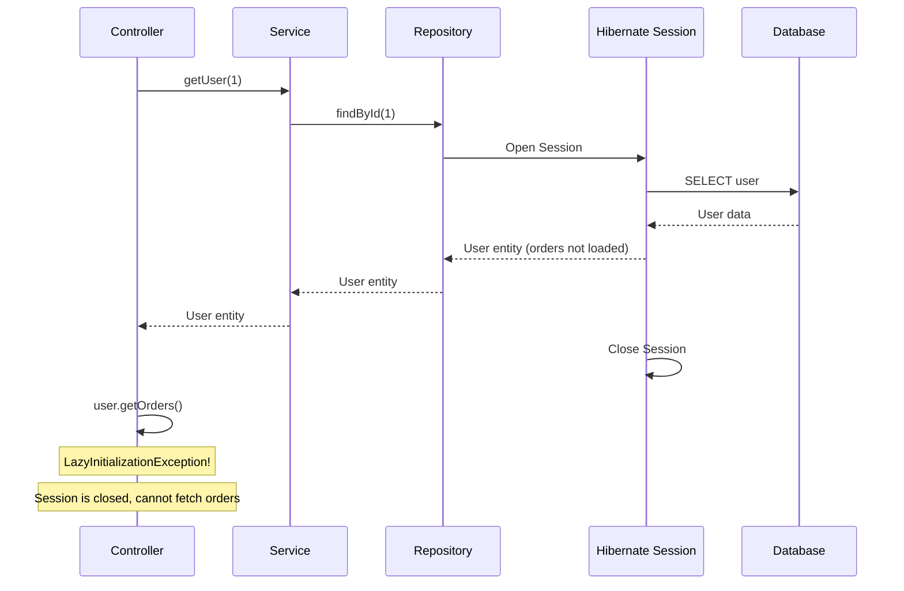
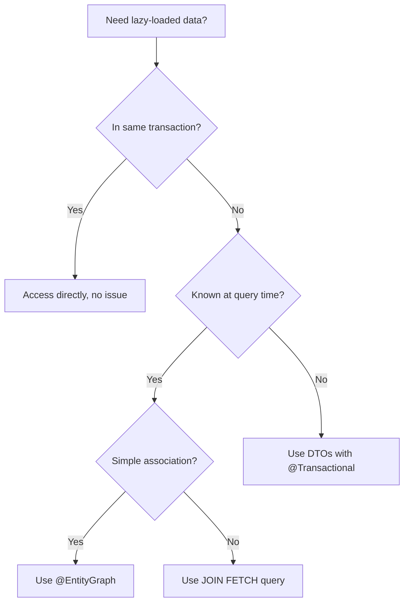

# How to Handle "LazyInitializationException" in JPA

Author: [nawazdhandala](https://github.com/nawazdhandala)

Tags: Java, Spring Boot, JPA, Hibernate, Database, Backend

Description: Learn how to diagnose and fix LazyInitializationException in Spring Boot JPA applications with practical solutions including fetch strategies, DTOs, and entity graphs.

---

The `LazyInitializationException` is one of the most common errors when working with JPA and Hibernate. It occurs when you try to access a lazily-loaded association after the persistence context (Hibernate session) has been closed. This guide explains why it happens and provides multiple solutions.

## Understanding the Problem



## The Error

```
org.hibernate.LazyInitializationException: failed to lazily initialize a collection
of role: com.example.User.orders, could not initialize proxy - no Session
```

## Why It Happens

JPA defaults to lazy loading for `@OneToMany` and `@ManyToMany` relationships. This means the associated entities aren't loaded from the database until you access them. However, this can only happen while the Hibernate session is open.

```java
@Entity
public class User {

    @Id
    @GeneratedValue(strategy = GenerationType.IDENTITY)
    private Long id;

    private String name;

    @OneToMany(mappedBy = "user", fetch = FetchType.LAZY)  // Default is LAZY
    private List<Order> orders;
}

// Problem scenario
@Service
public class UserService {

    @Autowired
    private UserRepository userRepository;

    public User getUser(Long id) {
        return userRepository.findById(id).orElseThrow();
        // Session closes when method returns
    }
}

@RestController
public class UserController {

    @Autowired
    private UserService userService;

    @GetMapping("/users/{id}")
    public UserResponse getUser(@PathVariable Long id) {
        User user = userService.getUser(id);
        // Session already closed!
        List<Order> orders = user.getOrders();  // LazyInitializationException!
        return new UserResponse(user, orders);
    }
}
```

## Solutions

### Solution 1: Use DTOs and Fetch in Service Layer

The recommended approach - fetch what you need within the transaction and map to DTOs.

```java
@Service
public class UserService {

    @Autowired
    private UserRepository userRepository;

    @Transactional(readOnly = true)
    public UserDTO getUserWithOrders(Long id) {
        User user = userRepository.findById(id).orElseThrow();

        // Access collection while session is open
        List<OrderDTO> orders = user.getOrders().stream()
            .map(order -> new OrderDTO(order.getId(), order.getTotal()))
            .toList();

        return new UserDTO(user.getId(), user.getName(), orders);
    }
}

// DTOs
public record UserDTO(Long id, String name, List<OrderDTO> orders) {}
public record OrderDTO(Long id, BigDecimal total) {}
```

### Solution 2: Use JOIN FETCH in Repository

Fetch the association eagerly with a custom query.

```java
public interface UserRepository extends JpaRepository<User, Long> {

    @Query("SELECT u FROM User u LEFT JOIN FETCH u.orders WHERE u.id = :id")
    Optional<User> findByIdWithOrders(@Param("id") Long id);

    // For collections, use DISTINCT to avoid duplicates
    @Query("SELECT DISTINCT u FROM User u LEFT JOIN FETCH u.orders")
    List<User> findAllWithOrders();
}

@Service
public class UserService {

    public User getUserWithOrders(Long id) {
        return userRepository.findByIdWithOrders(id).orElseThrow();
        // Orders are already loaded
    }
}
```

### Solution 3: Use @EntityGraph

EntityGraph provides a declarative way to specify which associations to fetch.

```java
public interface UserRepository extends JpaRepository<User, Long> {

    @EntityGraph(attributePaths = {"orders"})
    Optional<User> findById(Long id);

    @EntityGraph(attributePaths = {"orders", "orders.items"})
    Optional<User> findWithOrdersAndItemsById(Long id);
}

// Or define a named entity graph on the entity
@Entity
@NamedEntityGraph(
    name = "User.withOrders",
    attributeNodes = @NamedAttributeNode("orders")
)
public class User {
    // ...
}

public interface UserRepository extends JpaRepository<User, Long> {

    @EntityGraph(value = "User.withOrders")
    Optional<User> findById(Long id);
}
```

### Solution 4: Initialize in Service with Hibernate.initialize()

Explicitly initialize the collection within the transaction.

```java
@Service
public class UserService {

    @Transactional(readOnly = true)
    public User getUserWithOrders(Long id) {
        User user = userRepository.findById(id).orElseThrow();

        // Force initialization while session is open
        Hibernate.initialize(user.getOrders());

        // For nested collections
        user.getOrders().forEach(order -> Hibernate.initialize(order.getItems()));

        return user;
    }
}
```

### Solution 5: Use @Transactional on Controller (Not Recommended)

Extending the transaction to the controller layer - not ideal but sometimes necessary.

```java
@RestController
public class UserController {

    @Autowired
    private UserRepository userRepository;

    @GetMapping("/users/{id}")
    @Transactional(readOnly = true)
    public UserResponse getUser(@PathVariable Long id) {
        User user = userRepository.findById(id).orElseThrow();
        // Session still open because of @Transactional
        List<Order> orders = user.getOrders();  // Works now
        return new UserResponse(user, orders);
    }
}
```

**Why this is not recommended:**
- Mixes concerns (transaction management in controller)
- Longer transactions mean longer database locks
- Can lead to N+1 query problems

### Solution 6: Open Session in View (Avoid)

Spring Boot has `spring.jpa.open-in-view=true` by default, which keeps the session open until the view is rendered. This is an anti-pattern.

```properties
# Disable Open Session in View (recommended)
spring.jpa.open-in-view=false
```

**Why avoid Open Session in View:**
- Hides performance problems (N+1 queries)
- Longer database connections held
- Makes transaction boundaries unclear
- Can cause issues in production under load

## Choosing the Right Solution



## Handling N+1 Query Problem

LazyInitializationException fixes can introduce N+1 problems.

```java
// N+1 Problem: 1 query for users + N queries for orders
@Transactional(readOnly = true)
public List<UserDTO> getAllUsersWithOrders() {
    List<User> users = userRepository.findAll();  // 1 query

    return users.stream()
        .map(user -> new UserDTO(
            user.getId(),
            user.getName(),
            user.getOrders()  // N queries!
        ))
        .toList();
}

// Solution: Fetch all in one query
@Transactional(readOnly = true)
public List<UserDTO> getAllUsersWithOrders() {
    List<User> users = userRepository.findAllWithOrders();  // 1 query with JOIN FETCH

    return users.stream()
        .map(user -> new UserDTO(user.getId(), user.getName(), user.getOrders()))
        .toList();
}
```

## Batch Fetching

For cases where JOIN FETCH isn't practical, use batch fetching.

```java
@Entity
public class User {

    @OneToMany(mappedBy = "user")
    @BatchSize(size = 25)  // Load orders in batches of 25
    private List<Order> orders;
}
```

Or configure globally:

```properties
spring.jpa.properties.hibernate.default_batch_fetch_size=25
```

## Complete Example: Proper Data Access Pattern

```java
// Entity
@Entity
@Table(name = "users")
public class User {

    @Id
    @GeneratedValue(strategy = GenerationType.IDENTITY)
    private Long id;

    private String name;

    private String email;

    @OneToMany(mappedBy = "user", fetch = FetchType.LAZY)
    private List<Order> orders = new ArrayList<>();

    // getters and setters
}

// Repository with multiple fetch strategies
public interface UserRepository extends JpaRepository<User, Long> {

    // Basic query - no orders loaded
    Optional<User> findById(Long id);

    // With orders via EntityGraph
    @EntityGraph(attributePaths = {"orders"})
    @Query("SELECT u FROM User u WHERE u.id = :id")
    Optional<User> findByIdWithOrders(@Param("id") Long id);

    // With orders and items via JOIN FETCH
    @Query("SELECT DISTINCT u FROM User u " +
           "LEFT JOIN FETCH u.orders o " +
           "LEFT JOIN FETCH o.items " +
           "WHERE u.id = :id")
    Optional<User> findByIdWithOrdersAndItems(@Param("id") Long id);
}

// Service layer with appropriate methods
@Service
public class UserService {

    private final UserRepository userRepository;

    public UserService(UserRepository userRepository) {
        this.userRepository = userRepository;
    }

    // Simple case - no orders needed
    @Transactional(readOnly = true)
    public UserBasicDTO getUser(Long id) {
        User user = userRepository.findById(id)
            .orElseThrow(() -> new EntityNotFoundException("User not found"));
        return new UserBasicDTO(user.getId(), user.getName(), user.getEmail());
    }

    // With orders
    @Transactional(readOnly = true)
    public UserWithOrdersDTO getUserWithOrders(Long id) {
        User user = userRepository.findByIdWithOrders(id)
            .orElseThrow(() -> new EntityNotFoundException("User not found"));

        List<OrderSummaryDTO> orders = user.getOrders().stream()
            .map(o -> new OrderSummaryDTO(o.getId(), o.getTotal(), o.getCreatedAt()))
            .toList();

        return new UserWithOrdersDTO(user.getId(), user.getName(), orders);
    }
}

// DTOs
public record UserBasicDTO(Long id, String name, String email) {}
public record UserWithOrdersDTO(Long id, String name, List<OrderSummaryDTO> orders) {}
public record OrderSummaryDTO(Long id, BigDecimal total, LocalDateTime createdAt) {}
```

## Summary

| Solution | When to Use | Pros | Cons |
|----------|-------------|------|------|
| DTOs with @Transactional | Most cases | Clean, performant | More code |
| JOIN FETCH | Known associations | Single query | Query complexity |
| @EntityGraph | Simple eager loading | Declarative | Limited flexibility |
| Hibernate.initialize() | Dynamic needs | Flexible | Can cause N+1 |
| Batch fetching | Large collections | Reduces queries | Still multiple queries |
| Open Session in View | Never | - | Anti-pattern |

The LazyInitializationException is a signal that you're accessing data outside its intended scope. The solution is not to extend the session longer, but to think carefully about what data you need and fetch it explicitly within your service layer. Use DTOs to transfer exactly what the caller needs, and use appropriate fetch strategies based on your access patterns.
